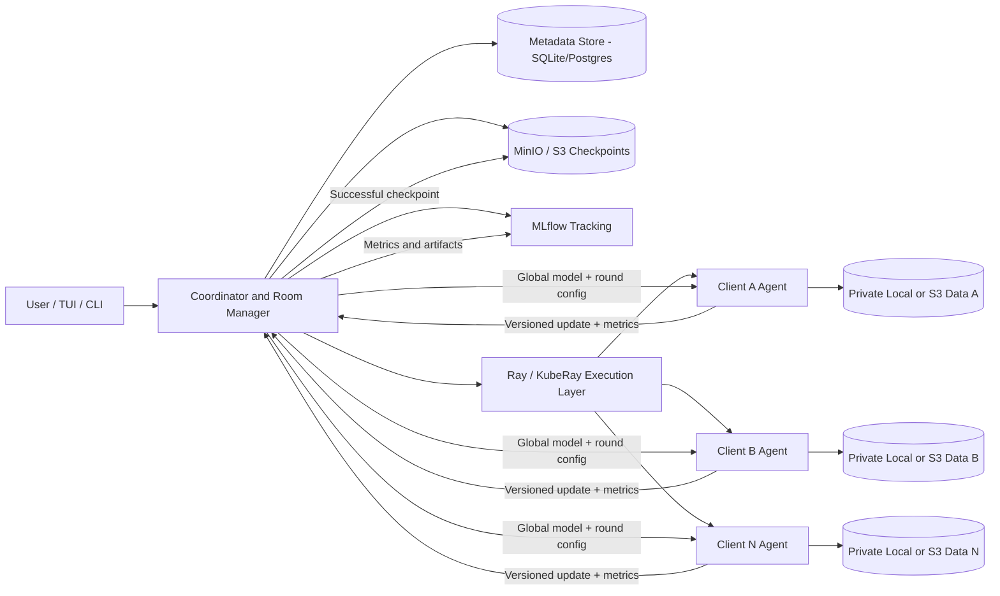
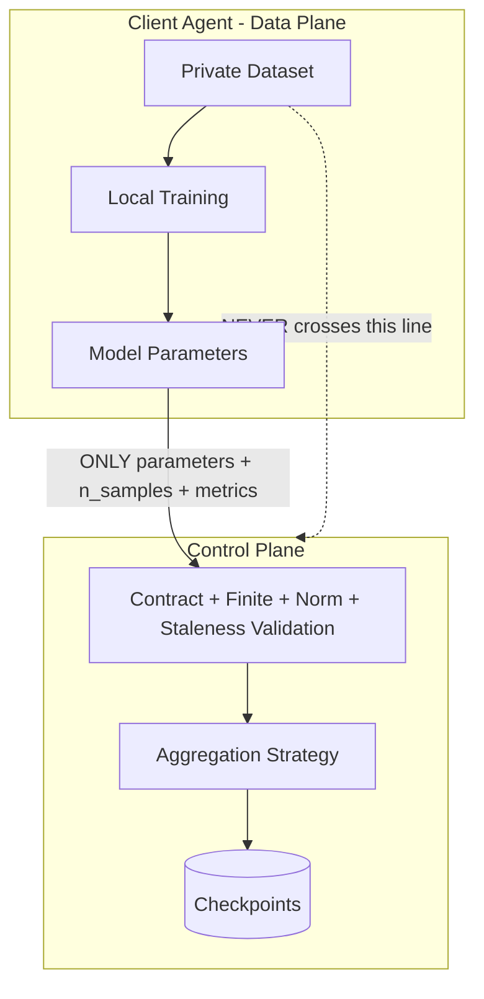

# Fedroom Architecture

## 1. Overview

Fedroom separates a **control plane** (the coordinator: room lifecycle,
membership, validation, aggregation, versioning, checkpoint/metadata
persistence) from a **data plane** (client agents: local data access, local
training, local inference). Raw client training records never cross the
trust boundary into the control plane -- only model parameters, sample
counts, and metrics do.

## 2. Component responsibilities

| Component | Responsibility | Code |
|---|---|---|
| `coordinator.roommanager.RoomManager` | The control-plane state machine: room/round/membership lifecycle, quorum, timeouts, staleness, contract validation dispatch. Framework-agnostic and unit-tested in isolation. | `coordinator/roommanager.py` |
| `coordinator.aggregation` | Pure math + validation: weighted FedAvg formula, shape/finite/norm checks. | `coordinator/aggregation.py` |
| `strategies.*` | Pluggable aggregation rules (FedAvg, Trimmed-mean, Median, Krum/Multi-Krum). Selected per-room via `aggregation.strategy`. | `strategies/` |
| `coordinator.app` (FastAPI) | HTTP surface wiring RoomManager to storage/tracking backends and the SQL audit log. | `coordinator/app.py` |
| `coordinator.storage` | S3/MinIO-compatible (or local-filesystem) checkpoint persistence. | `coordinator/storage.py` |
| `coordinator.tracking` | MLflow wrapper (with a local-JSONL fallback so a missing tracking server never blocks a training round). | `coordinator/tracking.py` |
| `coordinator.db` / `coordinator.models` | SQLAlchemy metadata store: rooms, membership events, round outcomes, checkpoint records -- the durable audit trail. | `coordinator/db.py`, `coordinator/models.py` |
| `client.agent.ClientAgent` | Data-plane logic: join, poll for selection, download model, train locally, submit update, run local inference. | `client/agent.py` |
| `client.data` | Local-filesystem and S3-backed private data access + IID/non-IID partitioning. Never returns data to the coordinator. | `client/data.py` |
| `tui.cli` | Operator-facing CLI (Typer) for the full room/client/training/inference lifecycle. | `tui/cli.py` |
| `dashboard/index.html` | Bonus: zero-build web dashboard, served by the coordinator at `/dashboard`, polling the same REST API the CLI uses. | `dashboard/index.html` |
| Ray / KubeRay | Distributed execution engine: launches many simulated client actors for large-scale experiments (`experiments/run_scalability.py`) and, via KubeRay, schedules the Ray cluster workers used for the 20-100 "logical client" simulation on Kubernetes. | `deployments/kubernetes/05-raycluster-and-driver.yaml` |

## 3. Control-plane vs data-plane split

* **Control plane** (coordinator): owns room/round state, contracts, quorum,
  timeouts, and the published model version. It receives only: model
  updates (numpy tensors, base64-over-HTTP), sample counts, client status,
  and metrics.
* **Data plane** (client agents): own their private partition of the
  dataset (local disk or a private S3 prefix). Training happens entirely
  inside the client process; only the resulting parameter delta and a
  sample count are ever sent out.

## 4. Trust boundary

What the coordinator can see: model parameter tensors (post-training),
declared sample counts, client IDs/capabilities, round timing, and
whatever scalar metrics a client chooses to report (loss/accuracy). It
never sees raw images/labels, file paths, or any other content of the
private dataset.

## 5. Model & data contracts

A room's **model contract** pins:
`model_id`, `framework`, exact `param_shapes` per tensor, and an optional
`max_update_norm`. Every incoming update is checked against this contract
before it is allowed anywhere near aggregation
(`coordinator/aggregation.py::ModelContract.validate_shapes`,
`validate_finite`, `validate_norm`). A **data/preprocessing contract**
(`preprocessing_contract`, a version string) is recorded per room; clients
are expected to apply matching normalization before training, and the room
config's `partition_scheme` documents the expected IID/non-IID partitioning
convention.

## 6. Deployment topology

* **Docker Compose** (`deployments/compose/docker-compose.yaml`): MinIO +
  MLflow + coordinator + N client containers on one host -- the
  reproducible local/CI baseline.
* **Kubernetes** (`deployments/kubernetes/`): namespaced Deployments for
  MinIO, MLflow, and the coordinator (each with a Service + PVC), an
  **Indexed Job** for deploying N real client pods (used for the deployed
  1/2/4/8-client scalability points, with an optional
  `topologySpreadConstraint` for the >= 3-node requirement), and a
  **KubeRay RayCluster** + driver Job for the large (20-100)
  simulated-client scale test.

## 7. Which functions come from a framework vs. are implemented by us

Fedroom does **not** wrap Flower/FedML/TFF/OpenFL. Everything in
`coordinator/`, `client/`, `strategies/`, and `tui/` is implemented directly
against FastAPI, SQLAlchemy, boto3, MLflow's Python client, PyTorch, and
Ray -- i.e. we built the FL protocol layer (round lifecycle, quorum,
staleness, contracts, aggregation strategies) ourselves, and only reuse
general-purpose infrastructure libraries (web framework, ORM, object
storage SDK, tracking SDK, distributed execution engine, ML framework).
