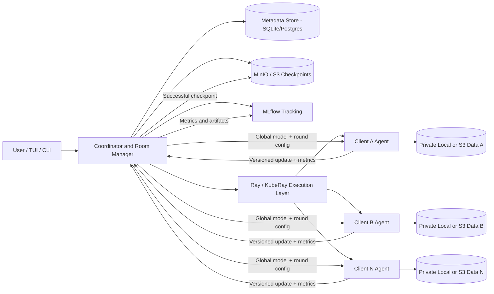
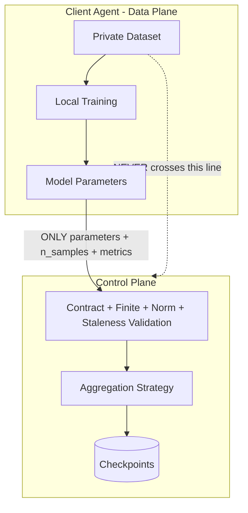

This file is a merged representation of the entire codebase, combining all repository files into a single document.
Generated by Repomix on: 2026-09-22 18:56:50

# File Summary

## Purpose:

This file contains a packed representation of the entire repository's contents.
It is designed to be easily consumable by AI systems for analysis, code review,
or other automated processes.

## File Format:

The content is organized as follows:
1. This summary section
2. Repository information
3. Repository structure
4. Multiple file entries, each consisting of:
   a. A header with the file path (## File: path/to/file)
   b. The full contents of the file in a code block

## Usage Guidelines:

- This file should be treated as read-only. Any changes should be made to the
  original repository files, not this packed version.
- When processing this file, use the file path to distinguish
  between different files in the repository.
- Be aware that this file may contain sensitive information. Handle it with
  the same level of security as you would the original repository.

## Notes:

- Some files may have been excluded based on .gitignore rules and Repomix's
  configuration.
- Binary files are not included in this packed representation. Please refer to
  the Repository Structure section for a complete list of file paths, including
  binary files.

## Additional Information:

For more information about Repomix, visit: https://github.com/andersonby/python-repomix


# Repository Structure

```
.gitignore
client
  config.py
  model.py
  __init__.py
configs
  clients
    client-a.yaml
    client-b.yaml
    client-c.yaml
    client-s3-demo.yaml
  kind
    kind-config.yaml
  rooms
    fashion-room-robust.yaml
    fashion-room.yaml
coordinator
  aggregation.py
  codec.py
  config.py
  db.py
  models.py
  roommanager.py
  schemas.py
  tracking.py
  __init__.py
dashboard
  index.html
deployments
  kubernetes
    00-namespace.yaml
    02-mlflow.yaml
    03-coordinator.yaml
    04-client-job.yaml
    05-raycluster-and-driver.yaml
    kustomization.yaml
Dockerfile.client
Dockerfile.coordinator
Dockerfile.mlflow
docs
  architecture.md
  report.md
experiments
  inject_failures.py
  plot_results.py
  run_noniid.py
  run_poisoning_attack.py
  run_scalability.py
  smoke_test.py
  verify_metrics.py
LICENSE
pyproject.toml
README.md
repomix-output.md
requirements-client.txt
requirements-coordinator.txt
requirements.txt
scripts
  cleanup.sh
  demo.sh
  log_resources.py
  print_demo_summary.py
  scale-experiment.sh
  start.sh
strategies
  base.py
  fedavg.py
  robust.py
  __init__.py
tests
  test_fedavg.py
  test_inference_and_strategies.py
  test_membership.py
  test_metrics.py
  __init__.py
tui
  cli.py
  __init__.py
```

# Repository Files


## .gitignore

```text
__pycache__/
*.pyc
.pytest_cache/
.env
data/
experiments/results/
*.db
mlruns/
.ray/
.venv/
venv/
*.egg-info/
.coverage
htmlcov/
nul
```

## client/config.py

```python
from __future__ import annotations

from dataclasses import dataclass, field
from typing import Optional

import yaml


@dataclass
class ClientConfig:
    client_id: str
    coordinator_url: str = "http://localhost:8000"
    room_id: str = "fashion-room"
    data_source: str = "local"           # "local" | "s3"
    partition_scheme: str = "iid"        # "iid" | "non_iid"
    n_clients: int = 3
    samples_per_client: Optional[int] = None
    s3_bucket: Optional[str] = None
    s3_key: Optional[str] = None
    local_data_root: str = "./data/raw"
    local_epochs: int = 1
    learning_rate: float = 0.01
    batch_size: int = 32
    poll_interval_seconds: float = 2.0
    capabilities: dict = field(default_factory=dict)

    @staticmethod
    def from_yaml(path: str) -> "ClientConfig":
        with open(path, "r") as f:
            raw = yaml.safe_load(f) or {}
        return ClientConfig(**raw)
```

## client/model.py

```python
"""
A small CNN for Fashion-MNIST/MNIST-style 28x28 grayscale classification.

Kept intentionally tiny: per the assignment, "the main learning challenge
should come from non-IID partitioning, client dynamics, communication, and
orchestration rather than model complexity."

torch is imported lazily so that coordinator-only deployments (and the fast
unit test suite) never need it installed.
"""
from __future__ import annotations

from typing import Dict

import numpy as np


def build_model():
    import torch.nn as nn

    class FashionCNN(nn.Module):
        def __init__(self, num_classes: int = 10):
            super().__init__()
            self.conv1 = nn.Conv2d(1, 8, kernel_size=5, padding=2)
            self.conv2 = nn.Conv2d(8, 16, kernel_size=5, padding=2)
            self.pool = nn.MaxPool2d(2, 2)
            self.fc1 = nn.Linear(16 * 7 * 7, 64)
            self.fc2 = nn.Linear(64, num_classes)
            self.relu = nn.ReLU()

        def forward(self, x):
            x = self.pool(self.relu(self.conv1(x)))
            x = self.pool(self.relu(self.conv2(x)))
            x = x.flatten(1)
            x = self.relu(self.fc1(x))
            return self.fc2(x)

    return FashionCNN()


def model_contract_shapes(model=None) -> Dict[str, list]:
    """Return {param_name: shape} for the room's model contract.

    This is computed once (e.g. by the room-creation script) from a freshly
    initialized model, so the coordinator can validate every incoming update
    against it without ever importing torch itself.
    """
    if model is None:
        model = build_model()
    return {name: list(t.shape) for name, t in model.state_dict().items()}


def torch_state_to_numpy(model) -> Dict[str, np.ndarray]:
    return {name: t.detach().cpu().numpy().copy() for name, t in model.state_dict().items()}


def numpy_state_to_torch(state: Dict[str, np.ndarray], model=None):
    import torch

    if model is None:
        model = build_model()
    sd = model.state_dict()
    for name, arr in state.items():
        sd[name] = torch.from_numpy(np.array(arr)).to(sd[name].dtype)
    model.load_state_dict(sd)
    return model
```

## client/__init__.py

```python

```

## configs/clients/client-a.yaml

```yaml
client_id: client-a
coordinator_url: http://localhost:8000
room_id: fashion-room
data_source: local           # local | s3
partition_scheme: iid        # iid | non_iid
n_clients: 3
samples_per_client: 600
local_data_root: ./data/raw
local_epochs: 1
learning_rate: 0.01
batch_size: 32
poll_interval_seconds: 2.0
capabilities:
  cpu_cores: 4
  gpu: false
```

## configs/clients/client-b.yaml

```yaml
client_id: client-b
coordinator_url: http://localhost:8000
room_id: fashion-room
data_source: local           # local | s3
partition_scheme: iid        # iid | non_iid
n_clients: 3
samples_per_client: 600
local_data_root: ./data/raw
local_epochs: 1
learning_rate: 0.01
batch_size: 32
poll_interval_seconds: 2.0
capabilities:
  cpu_cores: 4
  gpu: false
```

## configs/clients/client-c.yaml

```yaml
client_id: client-c
coordinator_url: http://localhost:8000
room_id: fashion-room
data_source: local           # local | s3
partition_scheme: iid        # iid | non_iid
n_clients: 3
samples_per_client: 600
local_data_root: ./data/raw
local_epochs: 1
learning_rate: 0.01
batch_size: 32
poll_interval_seconds: 2.0
capabilities:
  cpu_cores: 4
  gpu: false
```

## configs/clients/client-s3-demo.yaml

```yaml
client_id: client-s3-demo
coordinator_url: http://localhost:8000
room_id: fashion-room
data_source: s3
partition_scheme: iid
n_clients: 3
s3_bucket: fedroom-client-data
s3_key: client-s3-demo/shard.npz
local_epochs: 1
learning_rate: 0.01
batch_size: 32
poll_interval_seconds: 2.0
capabilities:
  cpu_cores: 2
  gpu: false
```

## configs/kind/kind-config.yaml

```yaml
kind: Cluster
apiVersion: kind.x-k8s.io/v1alpha4
name: fedroom-cluster
nodes:
  # The control plane node that runs the Kubernetes API
  - role: control-plane
    image: kindest/node:v1.31.14

  # 3 Worker nodes to satisfy the "deploy across 2 compute nodes" requirement
  - role: worker
    image: kindest/node:v1.31.14
  - role: worker
    image: kindest/node:v1.31.14
```

## configs/rooms/fashion-room-robust.yaml

```yaml
room_id: fashion-room-robust
framework: pytorch
model_contract: cnn-fmnist-v1
preprocessing_contract: fmnist-normalize-v1

aggregation:
  strategy: multi_krum        # try: trimmed_mean | median | krum | multi_krum
  min_available_clients: 5
  min_fit_clients: 5
  quorum: 0.6
  round_timeout_seconds: 500
  byzantine_f: 1               # tolerate up to 1 malicious/poisoned client per round
  max_update_norm: 50.0

training:
  rounds: 10
  local_epochs: 1
  learning_rate: 0.01

storage:
  checkpoint_uri: s3://flaas-models/fashion-room-robust/

tracking:
  mlflow_experiment: fedroom-fashion-room-robust
```

## configs/rooms/fashion-room.yaml

```yaml
room_id: fashion-room
framework: pytorch
model_contract: cnn-fmnist-v1
preprocessing_contract: fmnist-normalize-v1

aggregation:
  strategy: fedavg          # fedavg | trimmed_mean | median | krum | multi_krum
  min_available_clients: 1
  min_fit_clients: 1
  quorum: 0.67
  round_timeout_seconds: 500
  byzantine_f: 0             # only used by trimmed_mean / median / krum / multi_krum
  max_update_norm: null      # set a float to enable a hard update-size limit

training:
  rounds: 10
  local_epochs: 1
  learning_rate: 0.01

storage:
  checkpoint_uri: s3://flaas-models/fashion-room/

tracking:
  mlflow_experiment: fedroom-fashion-room
```

## coordinator/aggregation.py

```python
"""
Weighted FedAvg aggregation and update/contract validation.

This module is deliberately dependency-light (numpy + stdlib only) so it can
be exercised by fast, deterministic unit tests without spinning up the
coordinator service, a database, MinIO, or MLflow.

Math (per the FLaaS spec):

    w_{t+1} = sum_k ( n_k / sum_j n_j ) * w_k

for the set of *valid* client updates w_k collected in round t, weighted by
each client's reported local sample count n_k.
"""
from __future__ import annotations

import math
from dataclasses import dataclass, field
from typing import Dict, Iterable, List, Sequence

import numpy as np

Tensor = np.ndarray
StateDict = Dict[str, Tensor]


# --------------------------------------------------------------------------- #
# Errors
# --------------------------------------------------------------------------- #
class ContractError(ValueError):
    """The update does not match the room's model contract."""


class NonFiniteUpdateError(ValueError):
    """The update contains NaN or +/-inf values."""


class OversizedUpdateError(ValueError):
    """The update exceeds the configured L2-norm / payload limit."""


class StaleUpdateError(ValueError):
    """The update was trained against an older-than-expected model version."""


class EmptyAggregationError(ValueError):
    """There is nothing valid to aggregate."""


# --------------------------------------------------------------------------- #
# Model contract
# --------------------------------------------------------------------------- #
@dataclass(frozen=True)
class ModelContract:
    """Defines the exact tensor names/shapes/dtype a valid update must have."""

    model_id: str
    framework: str
    param_shapes: Dict[str, Sequence[int]]
    max_update_norm: float | None = None  # None = unlimited

    def validate_shapes(self, state: StateDict) -> None:
        expected_keys = set(self.param_shapes)
        got_keys = set(state.keys())
        if expected_keys != got_keys:
            missing = expected_keys - got_keys
            extra = got_keys - expected_keys
            raise ContractError(
                f"Parameter set mismatch for contract '{self.model_id}'. "
                f"missing={sorted(missing)} extra={sorted(extra)}"
            )
        for name, expected_shape in self.param_shapes.items():
            got_shape = tuple(state[name].shape)
            if tuple(expected_shape) != got_shape:
                raise ContractError(
                    f"Shape mismatch for '{name}': expected {tuple(expected_shape)}, "
                    f"got {got_shape}"
                )


def validate_finite(state: StateDict) -> None:
    for name, arr in state.items():
        if not np.all(np.isfinite(arr)):
            raise NonFiniteUpdateError(
                f"Tensor '{name}' contains NaN or infinite values"
            )


def compute_update_norm(state: StateDict) -> float:
    total = 0.0
    for arr in state.values():
        total += float(np.sum(np.square(arr.astype(np.float64))))
    return math.sqrt(total)


def validate_norm(state: StateDict, max_norm: float | None) -> float:
    norm = compute_update_norm(state)
    if max_norm is not None and norm > max_norm:
        raise OversizedUpdateError(
            f"Update L2 norm {norm:.4f} exceeds configured limit {max_norm:.4f}"
        )
    return norm


def validate_update(
    state: StateDict,
    contract: ModelContract,
) -> float:
    """Run the full validation pipeline. Returns the update's L2 norm.

    Raises ContractError / NonFiniteUpdateError / OversizedUpdateError.
    """
    contract.validate_shapes(state)
    validate_finite(state)
    return validate_norm(state, contract.max_update_norm)


# --------------------------------------------------------------------------- #
# Weighted FedAvg
# --------------------------------------------------------------------------- #
@dataclass
class ClientUpdate:
    client_id: str
    n_samples: int
    state: StateDict
    base_version: int


def weighted_average(updates: Sequence[ClientUpdate]) -> StateDict:
    """Combine validated client updates via weighted FedAvg.

    w_{t+1} = sum_k (n_k / sum_j n_j) * w_k
    """
    if not updates:
        raise EmptyAggregationError("No valid updates to aggregate")

    total_samples = sum(u.n_samples for u in updates)
    if total_samples <= 0:
        raise EmptyAggregationError("Total reported sample count is <= 0")

    # All updates are assumed to already share the same key set/shape (the
    # caller is expected to have called validate_update() on each first).
    param_names = updates[0].state.keys()
    aggregated: StateDict = {}
    for name in param_names:
        acc = np.zeros_like(updates[0].state[name], dtype=np.float64)
        for u in updates:
            weight = u.n_samples / total_samples
            acc += weight * u.state[name].astype(np.float64)
        aggregated[name] = acc.astype(updates[0].state[name].dtype)
    return aggregated


def flatten_state(state: StateDict) -> np.ndarray:
    """Utility used by tests/metrics: concatenate all tensors into one vector."""
    return np.concatenate([np.ravel(state[k]) for k in sorted(state.keys())])
```

## coordinator/codec.py

```python
"""Small helpers to move numpy state dicts over JSON/HTTP as base64 .npy blobs.

Kept separate from storage.py (which persists whole-model .npz checkpoints)
because this is used for the smaller, per-request wire format between the
coordinator and client agents.
"""
from __future__ import annotations

import base64
import io
from typing import Dict

import numpy as np

StateDict = Dict[str, np.ndarray]


def array_to_b64(arr: np.ndarray) -> str:
    buf = io.BytesIO()
    np.save(buf, arr, allow_pickle=False)
    return base64.b64encode(buf.getvalue()).decode("ascii")


def b64_to_array(s: str) -> np.ndarray:
    raw = base64.b64decode(s.encode("ascii"))
    buf = io.BytesIO(raw)
    return np.load(buf, allow_pickle=False)


def state_to_b64(state: StateDict) -> Dict[str, str]:
    return {k: array_to_b64(v) for k, v in state.items()}


def b64_to_state(payload: Dict[str, str]) -> StateDict:
    return {k: b64_to_array(v) for k, v in payload.items()}
```

## coordinator/config.py

```python
from __future__ import annotations

import os
from dataclasses import dataclass


@dataclass
class Settings:
    host: str = os.environ.get("FEDROOM_HOST", "0.0.0.0")
    port: int = int(os.environ.get("FEDROOM_PORT", "8000"))
    tick_interval_seconds: float = float(os.environ.get("FEDROOM_TICK_INTERVAL", "2.0"))
    database_url: str = os.environ.get("DATABASE_URL", "sqlite:///./data/fedroom.db")
    checkpoint_backend: str = os.environ.get("CHECKPOINT_BACKEND", "local")
    mlflow_tracking_uri: str | None = os.environ.get("MLFLOW_TRACKING_URI")
    max_update_norm_default: float | None = (
        float(os.environ["FEDROOM_MAX_UPDATE_NORM"])
        if os.environ.get("FEDROOM_MAX_UPDATE_NORM")
        else None
    )


settings = Settings()
```

## coordinator/db.py

```python
from __future__ import annotations

import os

from sqlalchemy import create_engine
from sqlalchemy.orm import sessionmaker

from coordinator.models import Base


def build_engine():
    url = os.environ.get("DATABASE_URL", "sqlite:///./data/fedroom.db")
    os.makedirs(os.path.dirname(url.split("///")[-1]) or ".", exist_ok=True) if url.startswith("sqlite") else None
    connect_args = {"check_same_thread": False} if url.startswith("sqlite") else {}
    engine = create_engine(url, connect_args=connect_args)
    Base.metadata.create_all(engine)
    return engine


def build_sessionmaker():
    engine = build_engine()
    return sessionmaker(bind=engine, autoflush=False, autocommit=False)
```

## coordinator/models.py

```python
"""
SQLAlchemy metadata models.

This is the durable audit trail: rooms, membership transitions, round
outcomes, and checkpoint records. The live/hot round state machine lives in
RoomManager (in-memory, per the assignment's emphasis on correctness and
testability); this layer is what survives a coordinator restart and what an
operator queries for "what happened".
"""
from __future__ import annotations

import time

from sqlalchemy import Column, Float, Integer, JSON, String, Text
from sqlalchemy.orm import declarative_base

Base = declarative_base()


class RoomORM(Base):
    __tablename__ = "rooms"

    room_id = Column(String, primary_key=True)
    model_contract = Column(JSON, nullable=False)
    preprocessing_contract = Column(String, nullable=False)
    agg_config = Column(JSON, nullable=False)
    target_rounds = Column(Integer, nullable=False, default=1)
    state = Column(String, nullable=False, default="created")
    created_at = Column(Float, default=time.time)


class ClientEventORM(Base):
    __tablename__ = "client_events"

    id = Column(Integer, primary_key=True, autoincrement=True)
    room_id = Column(String, index=True, nullable=False)
    client_id = Column(String, index=True, nullable=False)
    event = Column(String, nullable=False)  # joined / left / selected / completed / failed / dropped
    detail = Column(JSON, nullable=True)
    ts = Column(Float, default=time.time)


class RoundEventORM(Base):
    __tablename__ = "round_events"

    id = Column(Integer, primary_key=True, autoincrement=True)
    room_id = Column(String, index=True, nullable=False)
    round_number = Column(Integer, nullable=False)
    outcome = Column(String, nullable=False)  # aggregated / failed_quorum
    summary = Column(JSON, nullable=True)
    ts = Column(Float, default=time.time)


class CheckpointORM(Base):
    __tablename__ = "checkpoints"

    id = Column(Integer, primary_key=True, autoincrement=True)
    room_id = Column(String, index=True, nullable=False)
    version = Column(Integer, nullable=False)
    uri = Column(String, nullable=False)
    n_clients = Column(Integer, nullable=False)
    created_at = Column(Float, default=time.time)


class AuditLogORM(Base):
    __tablename__ = "audit_log"

    id = Column(Integer, primary_key=True, autoincrement=True)
    room_id = Column(String, index=True, nullable=False)
    event = Column(String, nullable=False)
    detail = Column(JSON, nullable=True)
    ts = Column(Float, default=time.time)
```

## coordinator/roommanager.py

```python
"""
RoomManager: the control-plane brain of Fedroom.

Deliberately decoupled from FastAPI/SQLAlchemy/MinIO/MLflow so that the
membership/round state machine (the trickiest part of the assignment) can be
unit-tested deterministically with an injected clock, in-memory, with no
network or database involved. `coordinator/app.py` wires this class to HTTP
endpoints and to the storage/tracking backends.
"""

from __future__ import annotations

import enum
import itertools
import threading
import time
import uuid
from dataclasses import dataclass, field
from typing import Callable, Dict, List, Optional

from coordinator.aggregation import (
    ClientUpdate,
    ContractError,
    ModelContract,
    NonFiniteUpdateError,
    OversizedUpdateError,
    StaleUpdateError,
    StateDict,
    validate_update,
)
from strategies.robust import get_strategy


# --------------------------------------------------------------------------- #
# Enums / small value objects
# --------------------------------------------------------------------------- #
class ClientStatus(str, enum.Enum):
    JOINED = "joined"  # registered, not yet eligible for this round
    ELIGIBLE = "eligible"  # may be selected starting next round
    SELECTED = "selected"  # chosen for the in-flight round
    COMPLETED = "completed"  # submitted a valid update this round
    FAILED = "failed"  # submitted an invalid update
    DROPPED = "dropped"  # selected but did not respond before timeout
    LEFT = "left"  # explicitly left the room


class RoundStatus(str, enum.Enum):
    IDLE = "idle"
    RUNNING = "running"
    AGGREGATING = "aggregating"
    COMPLETED = "completed"
    FAILED_QUORUM = "failed_quorum"


class RoomState(str, enum.Enum):
    CREATED = "created"
    ACTIVE = "active"
    PAUSED = "paused"
    STOPPED = "stopped"


@dataclass
class AggregationConfig:
    strategy: str = "fedavg"
    min_available_clients: int = 1
    min_fit_clients: int = 1
    quorum: float = 1.0  # fraction of *selected* clients required
    round_timeout_seconds: float = 500.0
    byzantine_f: int = 0  # assumed max malicious clients per round (robust strategies)


@dataclass
class ClientRecord:
    client_id: str
    capabilities: dict
    status: ClientStatus
    eligible_from_round: int
    joined_at: float


@dataclass
class RoundState:
    round_number: int
    expected_version: int
    selected: List[str]
    started_at: float
    timeout_seconds: float
    submissions: Dict[str, ClientUpdate] = field(default_factory=dict)
    rejections: Dict[str, str] = field(default_factory=dict)
    # Per-client metrics reported alongside each update: local_training_seconds,
    # download_seconds, upload_seconds, payload_bytes, train_loss,
    # train_accuracy, pretrain_eval_loss, pretrain_eval_accuracy (all optional
    # -- see client/agent.py). Kept here (not just in the SQL audit log) so
    # `maybe_finalize_round` can aggregate them into the round summary that
    # gets logged to MLflow, satisfying the assignment's "Timing" and
    # "Client" metric-group requirements.
    client_metrics: Dict[str, dict] = field(default_factory=dict)
    status: RoundStatus = RoundStatus.RUNNING


@dataclass
class CheckpointRecord:
    version: int
    uri: str
    n_clients: int
    created_at: float


@dataclass
class Room:
    room_id: str
    contract: ModelContract
    preprocessing_contract: str
    agg_config: AggregationConfig
    target_rounds: int
    state: RoomState = RoomState.CREATED
    current_round: int = 0
    current_version: int = 0
    global_state: Optional[StateDict] = None
    clients: Dict[str, ClientRecord] = field(default_factory=dict)
    active_round: Optional[RoundState] = None
    checkpoints: List[CheckpointRecord] = field(default_factory=list)
    audit_log: List[dict] = field(default_factory=list)
    metrics_history: List[dict] = field(default_factory=list)

    def log(self, event: str, **kwargs) -> None:
        self.audit_log.append({"ts": time.time(), "event": event, **kwargs})


# --------------------------------------------------------------------------- #
# RoomManager
# --------------------------------------------------------------------------- #
def _summarize_client_metrics(client_metrics: Dict[str, dict]) -> dict:
    """Average the optional per-client metrics reported alongside each
    update into round-level numbers for MLflow/the dashboard.

    Reported keys (all optional -- see client/agent.py):
      - selection_wait_seconds, local_training_seconds, download_seconds,
        upload_seconds: timing (upload_seconds is measured server-side --
        see coordinator/app.py::submit_update -- since a client cannot know
        its own upload duration before the request finishes sending)
      - payload_bytes: size of the update sent over the wire
      - train_loss, train_accuracy: this client's own post-training metrics
      - pretrain_eval_loss, pretrain_eval_accuracy: this client's evaluation
        of the CURRENT global model (before local training) on its own
        held-out split -- a federated-evaluation proxy for "global task
        metric", since the coordinator never holds a labeled validation set
        itself (that would mean it holds training-style data, which
        contradicts the platform's data-locality design). Averaged (mean,
        not weighted -- these are per-client quality signals, not
        contributions to the model) across responding clients, this
        approximates how well the *previous* global checkpoint generalizes.
    """
    numeric_keys = [
        "local_training_seconds",
        "download_seconds",
        "upload_seconds",
        "selection_wait_seconds",
        "train_loss",
        "train_accuracy",
        "pretrain_eval_loss",
        "pretrain_eval_accuracy",
    ]
    out: dict = {}
    for key in numeric_keys:
        values = [
            m[key]
            for m in client_metrics.values()
            if isinstance(m, dict) and m.get(key) is not None
        ]
        if values:
            out[f"avg_{key}"] = sum(values) / len(values)
    payload_values = [
        m["payload_bytes"]
        for m in client_metrics.values()
        if isinstance(m, dict) and m.get("payload_bytes") is not None
    ]
    if payload_values:
        out["total_payload_bytes"] = sum(payload_values)
        out["avg_payload_bytes"] = sum(payload_values) / len(payload_values)
    return out


class RoomManager:
    """Thread-safe, in-process registry of rooms.

    `on_checkpoint` / `on_metrics` are optional callbacks the caller (app.py)
    wires up to the storage and tracking backends, keeping this class free of
    infra dependencies.
    """

    def __init__(
        self,
        clock: Callable[[], float] = time.time,
        on_checkpoint: Optional[Callable[[Room, int, StateDict], str]] = None,
        on_metrics: Optional[Callable[[Room, dict], None]] = None,
    ):
        self._rooms: Dict[str, Room] = {}
        self._lock = threading.RLock()
        self._clock = clock
        self._on_checkpoint = on_checkpoint
        self._on_metrics = on_metrics

    # ---- room lifecycle -------------------------------------------------- #
    def create_room(
        self,
        room_id: str,
        contract: ModelContract,
        preprocessing_contract: str,
        agg_config: AggregationConfig,
        initial_state: StateDict,
        target_rounds: int = 1,
    ) -> Room:
        with self._lock:
            if room_id in self._rooms:
                raise ValueError(f"Room '{room_id}' already exists")
            room = Room(
                room_id=room_id,
                contract=contract,
                preprocessing_contract=preprocessing_contract,
                agg_config=agg_config,
                target_rounds=target_rounds,
                global_state=initial_state,
            )
            room.log("room_created")
            self._rooms[room_id] = room
            return room

    def list_rooms(self) -> List[Room]:
        with self._lock:
            return list(self._rooms.values())

    def get_room(self, room_id: str) -> Room:
        with self._lock:
            if room_id not in self._rooms:
                raise KeyError(f"Room '{room_id}' not found")
            return self._rooms[room_id]

    def start_room(self, room_id: str) -> Room:
        with self._lock:
            room = self.get_room(room_id)
            room.state = RoomState.ACTIVE
            room.log("room_started")
            return room

    def stop_room(self, room_id: str) -> Room:
        with self._lock:
            room = self.get_room(room_id)
            room.state = RoomState.STOPPED
            room.log("room_stopped")
            return room

    # ---- client membership ------------------------------------------------ #
    def join_client(
        self, room_id: str, client_id: str, capabilities: dict
    ) -> ClientRecord:
        """A client joining during round r becomes eligible no earlier than r+1.

        Idempotent for an already-known, still-participating client: a
        client re-announcing itself (a reconnecting agent, a CLI
        convenience call before training, retried network requests, etc.)
        must NOT be treated as brand new. Doing so used to reset the
        client's status/eligibility unconditionally -- including while it
        was SELECTED in an in-flight round -- which silently knocked it
        back out of that round's selection and left callers polling for a
        "selected" status that would never come back (the round would then
        time out with zero responses). Only a client who explicitly LEFT
        gets a fresh record on rejoin.
        """
        with self._lock:
            room = self.get_room(room_id)
            existing = room.clients.get(client_id)
            if existing is not None and existing.status != ClientStatus.LEFT:
                existing.capabilities = capabilities
                room.log(
                    "client_rejoined", client_id=client_id, status=existing.status.value
                )
                return existing

            # A client joining while round r is in flight becomes eligible no
            # earlier than r+1; joining with no round active makes it
            # eligible for the very next round to be started.
            if room.active_round is not None:
                eligible_from = room.active_round.round_number + 1
            else:
                eligible_from = room.current_round + 1
            record = ClientRecord(
                client_id=client_id,
                capabilities=capabilities,
                status=ClientStatus.ELIGIBLE
                if eligible_from <= room.current_round + 1
                else ClientStatus.JOINED,
                eligible_from_round=eligible_from,
                joined_at=self._clock(),
            )
            room.clients[client_id] = record
            room.log(
                "client_joined", client_id=client_id, eligible_from_round=eligible_from
            )
            return record

    def leave_client(self, room_id: str, client_id: str) -> None:
        with self._lock:
            room = self.get_room(room_id)
            if client_id not in room.clients:
                raise KeyError(
                    f"Client '{client_id}' is not a member of room '{room_id}'"
                )
            record = room.clients[client_id]
            was_selected = (
                room.active_round is not None
                and client_id in room.active_round.selected
                and client_id not in room.active_round.submissions
            )
            record.status = ClientStatus.LEFT
            room.log(
                "client_left", client_id=client_id, was_selected_unfinished=was_selected
            )
            # Dropout accounting happens lazily at finalize-time via timeout,
            # so we do not force-fail the round here; this keeps behavior
            # identical whether a client stops cleanly or simply stops
            # responding (crash), matching the "fails safely" requirement.

    # ---- round lifecycle --------------------------------------------------- #
    def start_round(self, room_id: str) -> RoundState:
        with self._lock:
            room = self.get_room(room_id)
            if room.state != RoomState.ACTIVE:
                raise ValueError(f"Room '{room_id}' is not active (state={room.state})")
            if (
                room.active_round is not None
                and room.active_round.status == RoundStatus.RUNNING
            ):
                raise ValueError("A round is already in progress")

            # Promote clients whose eligibility has kicked in. A client may
            # be re-selected across rounds regardless of its status from the
            # *previous* round (completed/failed/dropped are historical
            # outcomes, not a ban) -- only an explicit LEFT excludes it.
            eligible = []
            for c in room.clients.values():
                if c.status == ClientStatus.LEFT:
                    continue
                if c.eligible_from_round <= room.current_round + 1:
                    c.status = ClientStatus.ELIGIBLE
                    eligible.append(c.client_id)

            if len(eligible) < room.agg_config.min_available_clients:
                raise ValueError(
                    f"Only {len(eligible)} eligible client(s); "
                    f"need >= {room.agg_config.min_available_clients}"
                )

            selected = eligible  # simple strategy: select all eligible clients
            for cid in selected:
                room.clients[cid].status = ClientStatus.SELECTED

            round_number = room.current_round + 1
            round_state = RoundState(
                round_number=round_number,
                expected_version=room.current_version,
                selected=selected,
                started_at=self._clock(),
                timeout_seconds=room.agg_config.round_timeout_seconds,
            )
            room.active_round = round_state
            room.log("round_started", round=round_number, selected=selected)
            return round_state

    def submit_update(
        self,
        room_id: str,
        client_id: str,
        state: StateDict,
        n_samples: int,
        base_version: int,
        client_metrics: Optional[dict] = None,
    ) -> None:
        with self._lock:
            room = self.get_room(room_id)
            rnd = room.active_round
            if rnd is None or rnd.status != RoundStatus.RUNNING:
                raise ValueError("No round is currently accepting updates")
            if client_id not in rnd.selected:
                raise PermissionError(
                    f"Client '{client_id}' was not selected for this round"
                )
            if client_id in rnd.submissions or client_id in rnd.rejections:
                raise ValueError(f"Client '{client_id}' already submitted this round")

            try:
                if base_version != rnd.expected_version:
                    raise StaleUpdateError(
                        f"Update trained from version {base_version}, "
                        f"round expects version {rnd.expected_version}"
                    )
                validate_update(state, room.contract)
                if n_samples <= 0:
                    raise ValueError("n_samples must be > 0")
            except (
                ContractError,
                NonFiniteUpdateError,
                OversizedUpdateError,
                StaleUpdateError,
                ValueError,
            ) as exc:
                rnd.rejections[client_id] = str(exc)
                room.clients[client_id].status = ClientStatus.FAILED
                room.log("update_rejected", client_id=client_id, reason=str(exc))
                raise

            rnd.submissions[client_id] = ClientUpdate(
                client_id=client_id,
                n_samples=n_samples,
                state=state,
                base_version=base_version,
            )
            rnd.client_metrics[client_id] = client_metrics or {}
            room.clients[client_id].status = ClientStatus.COMPLETED
            room.log("update_accepted", client_id=client_id, n_samples=n_samples)

    def _quorum_met(self, room: Room, rnd: RoundState) -> bool:
        if not rnd.selected:
            return False
        responded_valid = len(rnd.submissions)
        return (responded_valid / len(rnd.selected)) >= room.agg_config.quorum

    def _all_responded(self, rnd: RoundState) -> bool:
        return len(rnd.submissions) + len(rnd.rejections) >= len(rnd.selected)

    def maybe_finalize_round(self, room_id: str) -> Optional[dict]:
        """Aggregate if all selected clients have responded, or if quorum is
        met and the round timeout has elapsed. Returns a summary dict when a
        finalize action occurred, else None.
        """
        with self._lock:
            room = self.get_room(room_id)
            rnd = room.active_round
            if rnd is None or rnd.status != RoundStatus.RUNNING:
                return None

            elapsed = self._clock() - rnd.started_at
            timed_out = elapsed >= rnd.timeout_seconds
            ready = self._all_responded(rnd) or timed_out
            if not ready:
                return None

            # Anyone selected but silent by now is a dropout.
            dropped = [
                cid
                for cid in rnd.selected
                if cid not in rnd.submissions and cid not in rnd.rejections
            ]
            for cid in dropped:
                room.clients[cid].status = ClientStatus.DROPPED
                room.log("client_dropped", client_id=cid, round=rnd.round_number)

            if not self._quorum_met(room, rnd):
                rnd.status = RoundStatus.FAILED_QUORUM
                room.active_round = None
                room.log(
                    "round_failed_quorum",
                    round=rnd.round_number,
                    responded=len(rnd.submissions),
                    selected=len(rnd.selected),
                )
                return {
                    "status": "failed_quorum",
                    "round": rnd.round_number,
                    "dropped": dropped,
                }

            rnd.status = RoundStatus.AGGREGATING
            strategy = get_strategy(
                room.agg_config.strategy, byzantine_f=room.agg_config.byzantine_f
            )
            agg_t0 = time.perf_counter()
            new_state = strategy.aggregate(list(rnd.submissions.values()))
            aggregation_seconds = time.perf_counter() - agg_t0
            new_version = room.current_version + 1
            room.global_state = new_state
            room.current_version = new_version
            room.current_round = rnd.round_number

            checkpoint_uri = None
            if self._on_checkpoint is not None:
                checkpoint_uri = self._on_checkpoint(room, new_version, new_state)
            room.checkpoints.append(
                CheckpointRecord(
                    version=new_version,
                    uri=checkpoint_uri or f"memory://{room.room_id}/v{new_version}",
                    n_clients=len(rnd.submissions),
                    created_at=self._clock(),
                )
            )

            summary = {
                "status": "aggregated",
                "round": rnd.round_number,
                "new_version": new_version,
                "strategy": room.agg_config.strategy,
                "checkpoint_uri": checkpoint_uri
                or f"memory://{room.room_id}/v{new_version}",
                "n_completed": len(rnd.submissions),
                "n_selected": len(rnd.selected),
                "n_dropped": len(dropped),
                "n_rejected": len(rnd.rejections),
                "duration_seconds": elapsed,
                "aggregation_seconds": aggregation_seconds,
                **_summarize_client_metrics(rnd.client_metrics),
            }
            if self._on_metrics is not None:
                self._on_metrics(room, summary)
            room.metrics_history.append(summary)

            rnd.status = RoundStatus.COMPLETED
            room.active_round = None
            room.log("round_completed", **summary)
            return summary

    # ---- read-only status ---------------------------------------------- #
    def status(self, room_id: str) -> dict:
        with self._lock:
            room = self.get_room(room_id)
            rnd = room.active_round
            return {
                "room_id": room.room_id,
                "state": room.state.value,
                "current_round": room.current_round,
                "current_version": room.current_version,
                "target_rounds": room.target_rounds,
                "clients": {
                    cid: {
                        "status": c.status.value,
                        "eligible_from_round": c.eligible_from_round,
                    }
                    for cid, c in room.clients.items()
                },
                "active_round": None
                if rnd is None
                else {
                    "round_number": rnd.round_number,
                    "expected_version": rnd.expected_version,
                    "selected": rnd.selected,
                    "completed": list(rnd.submissions.keys()),
                    "rejected": rnd.rejections,
                    "status": rnd.status.value,
                    "elapsed_seconds": self._clock() - rnd.started_at,
                },
                "checkpoints": [
                    {"version": ck.version, "uri": ck.uri, "n_clients": ck.n_clients}
                    for ck in room.checkpoints
                ],
                "metrics_history": room.metrics_history,
            }
```

## coordinator/schemas.py

```python
from __future__ import annotations

from typing import Dict, List, Optional

from pydantic import BaseModel, Field


class ModelContractIn(BaseModel):
    model_id: str
    framework: str
    param_shapes: Dict[str, List[int]]
    max_update_norm: Optional[float] = None


class AggregationConfigIn(BaseModel):
    strategy: str = "fedavg"
    min_available_clients: int = 1
    min_fit_clients: int = 1
    quorum: float = 1.0
    round_timeout_seconds: float = 500.0
    byzantine_f: int = 0


class RoomCreateRequest(BaseModel):
    room_id: str
    model_contract: ModelContractIn
    preprocessing_contract: str
    aggregation: AggregationConfigIn
    target_rounds: int = 1
    initial_state_b64: Dict[str, str] = Field(
        ..., description="param name -> base64-encoded .npy bytes for the initial global model"
    )


class JoinRequest(BaseModel):
    client_id: str
    capabilities: dict = {}


class LeaveRequest(BaseModel):
    client_id: str


class StartTrainingRequest(BaseModel):
    rounds: Optional[int] = None


class UpdateSubmitRequest(BaseModel):
    client_id: str
    base_version: int
    n_samples: int
    state_b64: Dict[str, str] = Field(..., description="param name -> base64-encoded .npy bytes")
    metrics: dict = {}


class InferenceLogRequest(BaseModel):
    client_id: str
    version: int
    note: str = ""
```

## coordinator/tracking.py

```python
"""
Experiment tracking wrapper around MLflow.

Falls back to an append-only local JSONL file when MLflow is not installed
or no tracking server is reachable, so the platform degrades gracefully
rather than crashing a training round just because observability
infrastructure is temporarily unavailable.
"""
from __future__ import annotations

import json
import os
import time
from typing import Optional


class _JsonlFallbackTracker:
    def __init__(self, path: str = "./data/mlflow_fallback.jsonl"):
        os.makedirs(os.path.dirname(path) or ".", exist_ok=True)
        self.path = path
        self._active_run = None

    def start_run(self, experiment: str, run_name: str) -> str:
        self._active_run = f"{experiment}:{run_name}:{time.time()}"
        self._write({"event": "start_run", "run": self._active_run, "experiment": experiment})
        return self._active_run

    def log_params(self, params: dict) -> None:
        self._write({"event": "params", "run": self._active_run, "data": params})

    def log_metrics(self, metrics: dict, step: Optional[int] = None) -> None:
        self._write({"event": "metrics", "run": self._active_run, "step": step, "data": metrics})

    def end_run(self) -> None:
        self._write({"event": "end_run", "run": self._active_run})
        self._active_run = None

    def _write(self, record: dict) -> None:
        record["ts"] = time.time()
        with open(self.path, "a") as f:
            f.write(json.dumps(record) + "\n")


class MlflowTracker:
    """Thin wrapper. Nested runs: one parent per room, one child per round."""

    def __init__(self, tracking_uri: Optional[str] = None):
        try:
            import mlflow  # noqa: F401
            self._mlflow = __import__("mlflow")
            if tracking_uri:
                self._mlflow.set_tracking_uri(tracking_uri)
            self._fallback = None
        except Exception:
            self._mlflow = None
            self._fallback = _JsonlFallbackTracker()

    def start_run(self, experiment: str, run_name: str):
        if self._mlflow is not None:
            try:
                self._mlflow.set_experiment(experiment)
                run = self._mlflow.start_run(run_name=run_name)
                return run.info.run_id
            except Exception:
                self._mlflow = None
                self._fallback = _JsonlFallbackTracker()
        return self._fallback.start_run(experiment, run_name)

    def log_params(self, params: dict) -> None:
        if self._mlflow is not None:
            try:
                self._mlflow.log_params(params)
                return
            except Exception:
                pass
        self._fallback.log_params(params)

    def log_metrics(self, metrics: dict, step: Optional[int] = None) -> None:
        if self._mlflow is not None:
            try:
                self._mlflow.log_metrics(metrics, step=step)
                return
            except Exception:
                pass
        self._fallback.log_metrics(metrics, step=step)

    def end_run(self) -> None:
        if self._mlflow is not None:
            try:
                self._mlflow.end_run()
                return
            except Exception:
                pass
        if self._fallback is not None:
            self._fallback.end_run()


def build_tracker() -> MlflowTracker:
    return MlflowTracker(tracking_uri=os.environ.get("MLFLOW_TRACKING_URI"))
```

## coordinator/__init__.py

```python

```

## dashboard/index.html

```html
<!DOCTYPE html>
<html lang="en">
<head>
<meta charset="UTF-8">
<title>Fedroom Dashboard</title>
<style>
  :root {
    --bg: #0f1117; --panel: #171a23; --border: #262a37; --text: #e6e8ee;
    --muted: #8b90a0; --accent: #5b8cff; --good: #3ecf8e; --warn: #f2c94c;
    --bad: #f2555a; --grey: #4b5064;
  }
  * { box-sizing: border-box; }
  body {
    margin: 0; font-family: -apple-system, "Segoe UI", Roboto, sans-serif;
    background: var(--bg); color: var(--text);
  }
  header {
    display: flex; align-items: center; gap: 16px; padding: 14px 22px;
    border-bottom: 1px solid var(--border); position: sticky; top: 0;
    background: var(--bg); z-index: 5;
  }
  header h1 { font-size: 18px; margin: 0; font-weight: 600; }
  header .sub { color: var(--muted); font-size: 12px; }
  header input {
    background: var(--panel); border: 1px solid var(--border); color: var(--text);
    padding: 6px 10px; border-radius: 6px; font-size: 13px; width: 260px;
  }
  header .sysmetrics { display: flex; gap: 14px; font-size: 12px; color: var(--muted); }
  header .sysmetrics b { color: var(--text); }
  header .status-dot {
    width: 8px; height: 8px; border-radius: 50%; background: var(--grey); display: inline-block;
  }
  header .status-dot.ok { background: var(--good); }
  header .status-dot.bad { background: var(--bad); }
  main { display: grid; grid-template-columns: 280px 1fr; gap: 0; min-height: calc(100vh - 58px); }
  nav {
    border-right: 1px solid var(--border); padding: 14px; overflow-y: auto;
  }
  nav .room-item {
    padding: 10px 12px; border-radius: 8px; cursor: pointer; margin-bottom: 6px;
    border: 1px solid transparent; font-size: 13px;
  }
  nav .room-item:hover { background: var(--panel); }
  nav .room-item.active { background: var(--panel); border-color: var(--accent); }
  nav .room-item .rid { font-weight: 600; }
  nav .room-item .meta { color: var(--muted); font-size: 11px; margin-top: 3px; }
  section.content { padding: 20px 26px; }
  .grid { display: grid; grid-template-columns: repeat(4, 1fr); gap: 14px; margin-bottom: 18px; }
  .card {
    background: var(--panel); border: 1px solid var(--border); border-radius: 10px;
    padding: 14px 16px;
  }
  .card .label { color: var(--muted); font-size: 11px; text-transform: uppercase; letter-spacing: .04em; }
  .card .value { font-size: 24px; font-weight: 700; margin-top: 4px; }
  table { width: 100%; border-collapse: collapse; font-size: 13px; }
  th, td { text-align: left; padding: 8px 10px; border-bottom: 1px solid var(--border); }
  th { color: var(--muted); font-weight: 500; font-size: 11px; text-transform: uppercase; }
  .badge {
    display: inline-block; padding: 2px 8px; border-radius: 999px; font-size: 11px; font-weight: 600;
  }
  .badge.selected, .badge.eligible, .badge.joined { background: #24304a; color: #7fa8ff; }
  .badge.completed { background: #16332a; color: var(--good); }
  .badge.failed, .badge.dropped { background: #3a1f22; color: var(--bad); }
  .badge.left { background: #262a37; color: var(--muted); }
  .panel-title { font-size: 13px; font-weight: 600; margin: 22px 0 10px; color: var(--muted); text-transform: uppercase; letter-spacing: .05em; }
  .bars { display: flex; align-items: flex-end; gap: 6px; height: 120px; padding: 10px 0; }
  .bar-wrap { display: flex; flex-direction: column; align-items: center; gap: 4px; flex: 1; }
  .bar { width: 100%; background: var(--accent); border-radius: 3px 3px 0 0; min-height: 2px; }
  .bar-wrap .bar-label { font-size: 10px; color: var(--muted); }
  .empty { color: var(--muted); font-size: 13px; padding: 30px 0; text-align: center; }
  code { background: var(--panel); padding: 1px 5px; border-radius: 4px; font-size: 12px; }
</style>
</head>
<body>
<header>
  <span id="status-dot" class="status-dot"></span>
  <h1>Fedroom</h1>
  <span class="sub">operational dashboard</span>
  <div style="flex:1"></div>
  <div class="sysmetrics" id="sysmetrics"></div>
  <label class="sub">Coordinator URL</label>
  <input id="url-input" value="" />
</header>
<main>
  <nav id="room-nav"><div class="empty">Loading rooms...</div></nav>
  <section class="content" id="content"><div class="empty">Select a room</div></section>
</main>

<script>
const state = { url: localStorage.getItem('fedroom_url') || window.location.origin, rooms: [], selected: null };
document.getElementById('url-input').value = state.url;
document.getElementById('url-input').addEventListener('change', (e) => {
  state.url = e.target.value.replace(/\/$/, '');
  localStorage.setItem('fedroom_url', state.url);
  refresh();
});

function badge(status) {
  return `<span class="badge ${status}">${status}</span>`;
}

async function fetchJSON(path) {
  const res = await fetch(`${state.url}${path}`);
  if (!res.ok) throw new Error(`${res.status} ${res.statusText}`);
  return res.json();
}

async function refreshSystem() {
  try {
    const sys = await fetchJSON('/system');
    const el = document.getElementById('sysmetrics');
    if (sys.available) {
      el.innerHTML = `<span>CPU <b>${sys.cpu_percent.toFixed(1)}%</b></span><span>Mem <b>${sys.memory_mb.toFixed(0)} MB</b></span>`;
    } else {
      el.innerHTML = `<span>psutil not installed</span>`;
    }
  } catch (e) { /* system endpoint optional; ignore */ }
}

function renderNav() {
  const nav = document.getElementById('room-nav');
  if (!state.rooms.length) {
    nav.innerHTML = '<div class="empty">No rooms yet.<br>Create one via the CLI.</div>';
    return;
  }
  nav.innerHTML = state.rooms.map(r => `
    <div class="room-item ${state.selected === r.room_id ? 'active' : ''}" data-room="${r.room_id}">
      <div class="rid">${r.room_id}</div>
      <div class="meta">${r.state} &middot; round ${r.current_round} &middot; v${r.current_version} &middot; ${Object.keys(r.clients).length} clients</div>
    </div>
  `).join('');
  nav.querySelectorAll('.room-item').forEach(el => {
    el.addEventListener('click', () => { state.selected = el.dataset.room; renderContent(); });
  });
}

function renderContent() {
  const content = document.getElementById('content');
  if (!state.selected) { content.innerHTML = '<div class="empty">Select a room</div>'; return; }
  const room = state.rooms.find(r => r.room_id === state.selected);
  if (!room) { content.innerHTML = '<div class="empty">Room not found</div>'; return; }

  const clientRows = Object.entries(room.clients).map(([cid, c]) => `
    <tr><td>${cid}</td><td>${badge(c.status)}</td><td>${c.eligible_from_round}</td></tr>
  `).join('') || '<tr><td colspan="3" class="empty">No clients joined</td></tr>';

  const ckRows = room.checkpoints.slice().reverse().map(c => `
    <tr><td>v${c.version}</td><td><code>${c.uri}</code></td><td>${c.n_clients}</td></tr>
  `).join('') || '<tr><td colspan="3" class="empty">No checkpoints yet</td></tr>';

  const active = room.active_round;
  const activeHtml = active ? `
    <div class="grid">
      <div class="card"><div class="label">Round</div><div class="value">${active.round_number}</div></div>
      <div class="card"><div class="label">Selected</div><div class="value">${active.selected.length}</div></div>
      <div class="card"><div class="label">Completed</div><div class="value">${active.completed.length}</div></div>
      <div class="card"><div class="label">Elapsed (s)</div><div class="value">${active.elapsed_seconds.toFixed(1)}</div></div>
    </div>
  ` : '<div class="empty">No round currently in progress</div>';

  const history = room.metrics_history || [];
  const latest = history[history.length - 1];
  const maxDur = Math.max(1, ...history.map(m => m.duration_seconds || 0));
  const bars = history.length ? `
    <div class="bars">
      ${history.map(m => `
        <div class="bar-wrap">
          <div class="bar" style="height:${Math.max(4, (m.duration_seconds / maxDur) * 100)}px" title="${m.duration_seconds.toFixed(2)}s"></div>
          <div class="bar-label">r${m.round}</div>
        </div>
      `).join('')}
    </div>
  ` : '<div class="empty">No completed rounds yet</div>';

  const globalMetricHtml = (latest && latest.avg_pretrain_eval_accuracy !== undefined) ? `
    <div class="grid">
      <div class="card"><div class="label">Global accuracy (est.)</div><div class="value">${(latest.avg_pretrain_eval_accuracy * 100).toFixed(1)}%</div></div>
      <div class="card"><div class="label">Global loss (est.)</div><div class="value">${latest.avg_pretrain_eval_loss.toFixed(3)}</div></div>
      <div class="card"><div class="label">Client train acc.</div><div class="value">${latest.avg_train_accuracy !== undefined ? (latest.avg_train_accuracy * 100).toFixed(1) + '%' : '-'}</div></div>
      <div class="card"><div class="label">Aggregation (s)</div><div class="value">${latest.aggregation_seconds.toFixed(3)}</div></div>
    </div>
  ` : '';

  const timingHtml = latest ? `
    <div class="grid">
      <div class="card"><div class="label">Avg. wait (s)</div><div class="value">${(latest.avg_selection_wait_seconds ?? 0).toFixed(2)}</div></div>
      <div class="card"><div class="label">Avg. download (s)</div><div class="value">${(latest.avg_download_seconds ?? 0).toFixed(2)}</div></div>
      <div class="card"><div class="label">Avg. train (s)</div><div class="value">${(latest.avg_local_training_seconds ?? 0).toFixed(2)}</div></div>
      <div class="card"><div class="label">Avg. upload (s)</div><div class="value">${(latest.avg_upload_seconds ?? 0).toFixed(2)}</div></div>
    </div>
  ` : '';

  content.innerHTML = `
    <div class="grid">
      <div class="card"><div class="label">State</div><div class="value" style="font-size:16px">${room.state}</div></div>
      <div class="card"><div class="label">Version</div><div class="value">${room.current_version}</div></div>
      <div class="card"><div class="label">Round</div><div class="value">${room.current_round} / ${room.target_rounds}</div></div>
      <div class="card"><div class="label">Clients</div><div class="value">${Object.keys(room.clients).length}</div></div>
    </div>

    <div class="panel-title">Active round</div>
    ${activeHtml}

    <div class="panel-title">Global task metric (federated-evaluation estimate)</div>
    ${globalMetricHtml || '<div class="empty">No client-reported evaluation metrics yet (requires torch on the client)</div>'}

    <div class="panel-title">Latest round timing breakdown</div>
    ${timingHtml || '<div class="empty">No timing data yet</div>'}

    <div class="panel-title">Clients</div>
    <table><thead><tr><th>Client ID</th><th>Status</th><th>Eligible from round</th></tr></thead>
      <tbody>${clientRows}</tbody></table>

    <div class="panel-title">Round duration history</div>
    ${bars}

    <div class="panel-title">Checkpoints</div>
    <table><thead><tr><th>Version</th><th>URI</th><th>Clients</th></tr></thead>
      <tbody>${ckRows}</tbody></table>
  `;
}

async function refresh() {
  const dot = document.getElementById('status-dot');
  try {
    state.rooms = await fetchJSON('/rooms');
    dot.className = 'status-dot ok';
    if (!state.selected && state.rooms.length) state.selected = state.rooms[0].room_id;
    renderNav();
    renderContent();
    refreshSystem();
  } catch (e) {
    dot.className = 'status-dot bad';
    document.getElementById('room-nav').innerHTML = `<div class="empty">Cannot reach coordinator at<br><code>${state.url}</code></div>`;
  }
}

refresh();
setInterval(refresh, 2000);
</script>
</body>
</html>
```

## deployments/kubernetes/00-namespace.yaml

```yaml
apiVersion: v1
kind: Namespace
metadata:
  name: fedroom
```

## deployments/kubernetes/02-mlflow.yaml

```yaml
apiVersion: v1
kind: PersistentVolumeClaim
metadata:
  name: mlflow-data
  namespace: fedroom
spec:
  accessModes: ["ReadWriteOnce"]
  resources:
    requests:
      storage: 2Gi
---
apiVersion: apps/v1
kind: Deployment
metadata:
  name: mlflow
  namespace: fedroom
spec:
  replicas: 1
  selector:
    matchLabels: {app: mlflow}
  template:
    metadata:
      labels: {app: mlflow}
    spec:
      containers:
        - name: mlflow
          image: fedroom/mlflow:latest   # build from Dockerfile.mlflow and push, or use a public mlflow image
          imagePullPolicy: IfNotPresent
          command:
            - mlflow
            - server
            - --backend-store-uri
            - sqlite:////mlflow/mlflow.db
            - --default-artifact-root
            - s3://mlflow-artifacts/
            - --host
            - "0.0.0.0"
            - --port
            - "5000"
          env:
            - {name: MLFLOW_S3_ENDPOINT_URL, value: "http://minio:9000"}
            - {name: AWS_ACCESS_KEY_ID, value: fedroomadmin}
            - {name: AWS_SECRET_ACCESS_KEY, value: fedroomsecret}
          ports:
            - {containerPort: 5000}
          volumeMounts:
            - {name: data, mountPath: /mlflow}
      volumes:
        - name: data
          persistentVolumeClaim: {claimName: mlflow-data}
---
apiVersion: v1
kind: Service
metadata:
  name: mlflow
  namespace: fedroom
spec:
  selector: {app: mlflow}
  ports:
    - {port: 5000, targetPort: 5000}
```

## deployments/kubernetes/03-coordinator.yaml

```yaml
apiVersion: v1
kind: ConfigMap
metadata:
  name: coordinator-config
  namespace: fedroom
data:
  DATABASE_URL: "sqlite:///./data/fedroom.db"
  CHECKPOINT_BACKEND: "s3"
  S3_CHECKPOINT_BUCKET: "flaas-models"
  S3_ENDPOINT_URL: "http://minio:9000"
  MLFLOW_TRACKING_URI: "http://mlflow:5000"
  FEDROOM_TICK_INTERVAL: "2.0"
---
apiVersion: v1
kind: PersistentVolumeClaim
metadata:
  name: coordinator-data
  namespace: fedroom
spec:
  accessModes: ["ReadWriteOnce"]
  resources:
    requests:
      storage: 1Gi
---
apiVersion: apps/v1
kind: Deployment
metadata:
  name: coordinator
  namespace: fedroom
spec:
  replicas: 1     # control-plane singleton; see docs/architecture.md for the
                   # multi-server bonus discussion
  selector:
    matchLabels: {app: coordinator}
  template:
    metadata:
      labels: {app: coordinator}
    spec:
      containers:
        - name: coordinator
          image: fedroom/coordinator:latest
          imagePullPolicy: IfNotPresent
          envFrom:
            - configMapRef: {name: coordinator-config}
            - secretRef: {name: minio-credentials}
          env:
            - {name: S3_ACCESS_KEY, valueFrom: {secretKeyRef: {name: minio-credentials, key: MINIO_ROOT_USER}}}
            - {name: S3_SECRET_KEY, valueFrom: {secretKeyRef: {name: minio-credentials, key: MINIO_ROOT_PASSWORD}}}
          ports:
            - {containerPort: 8000}
          volumeMounts:
            - {name: data, mountPath: /app/data}
          readinessProbe:
            httpGet: {path: /healthz, port: 8000}
            initialDelaySeconds: 5
            periodSeconds: 5
          resources:
            requests: {cpu: "250m", memory: "256Mi"}
            limits: {cpu: "1", memory: "512Mi"}
      volumes:
        - name: data
          persistentVolumeClaim: {claimName: coordinator-data}
---
apiVersion: v1
kind: Service
metadata:
  name: coordinator
  namespace: fedroom
spec:
  selector: {app: coordinator}
  ports:
    - {port: 8000, targetPort: 8000}
  type: ClusterIP
```

## deployments/kubernetes/04-client-job.yaml

```yaml
# Deploys N real client pods, each with a unique identity derived from
# JOB_COMPLETION_INDEX (see client/agent.py::_main). For the required
# scalability sweep, apply this manifest with `completions`/`parallelism`
# set to 1, 2, 4, and 8 in turn (the accompanying scripts/scale-experiment.sh
# does this via `kubectl patch` / `envsubst`, one measurement per scale).
#
# For a true multi-node deployment, add a topologySpreadConstraint (shown
# below, commented) so the 8-client run is spread across >= 3 nodes as the
# assignment requires for full deployment credit.
apiVersion: batch/v1
kind: Job
metadata:
  name: fedroom-clients
  namespace: fedroom
spec:
  completions: 2 # <-- scale sweep: 1, 2, 4, 8
  parallelism: 2 # <-- keep equal to `completions` for a true burst-join
  completionMode: Indexed
  backoffLimit: 0
  template:
    metadata:
      labels: { app: fedroom-client }
    spec:
      restartPolicy: Never
      topologySpreadConstraints:
        - maxSkew: 1
          topologyKey: kubernetes.io/hostname
          whenUnsatisfiable: ScheduleAnyway
          labelSelector:
            matchLabels: {app: fedroom-client}
      containers:
        - name: client
          image: fedroom/client:latest
          imagePullPolicy: IfNotPresent
          args: ["configs/clients/client-a.yaml", "--rounds", "3"]
          env:
            - {
                name: FEDROOM_COORDINATOR_URL,
                value: "http://coordinator:8000",
              }
            - { name: FEDROOM_ROOM_ID, value: "fashion-room" }
            - { name: FEDROOM_N_CLIENTS, value: "2" } # keep in sync with `completions`
            - { name: S3_ENDPOINT_URL, value: "http://minio:9000" }
            - {
                name: S3_ACCESS_KEY,
                valueFrom:
                  {
                    secretKeyRef:
                      { name: minio-credentials, key: MINIO_ROOT_USER },
                  },
              }
            - {
                name: S3_SECRET_KEY,
                valueFrom:
                  {
                    secretKeyRef:
                      { name: minio-credentials, key: MINIO_ROOT_PASSWORD },
                  },
              }
          resources:
            requests: { cpu: "250m", memory: "512Mi" }
            limits: { cpu: "1", memory: "1Gi" }
```

## deployments/kubernetes/05-raycluster-and-driver.yaml

```yaml
# Requires the KubeRay operator to be installed in the cluster
# (https://github.com/ray-project/kuberay). This RayCluster is the engine
# behind experiments/run_scalability.py's 20-100 "logical client" simulation
# (Part 3.4): each simulated client runs as a lightweight Ray actor
# distributed across the Ray worker pods below, rather than as a full
# Kubernetes pod each -- exactly the "submit jobs, schedule resources, scale
# execution" role Ray is meant to play in this architecture, distinct from
# the real multi-pod deployment in 04-client-job.yaml.
apiVersion: ray.io/v1
kind: RayCluster
metadata:
  name: fedroom-ray
  namespace: fedroom
spec:
  rayVersion: "2.10.0"
  headGroupSpec:
    rayStartParams:
      dashboard-host: "0.0.0.0"
    template:
      spec:
        containers:
          - name: ray-head
            image: fedroom/client:latest # reuses the client image (has ray + torch)
            imagePullPolicy: IfNotPresent
            command:
              ["ray", "start", "--head", "--block", "--dashboard-host=0.0.0.0"]
            ports:
              - { containerPort: 6379, name: gcs }
              - { containerPort: 8265, name: dashboard }
              - { containerPort: 10001, name: client }
            resources:
              requests: { cpu: "500m", memory: "1Gi" }
              limits: { cpu: "2", memory: "2Gi" }
  workerGroupSpecs:
    - groupName: workers
      replicas: 3
      minReplicas: 1
      maxReplicas: 8
      rayStartParams: {}
      template:
        spec:
          containers:
            - name: ray-worker
              image: fedroom/client:latest
              imagePullPolicy: IfNotPresent
              command:
                [
                  "ray",
                  "start",
                  "--address=fedroom-ray-head-svc:6379",
                  "--block",
                ]
              resources:
                requests: { cpu: "500m", memory: "1Gi" }
                limits: { cpu: "2", memory: "2Gi" }
---
apiVersion: batch/v1
kind: Job
metadata:
  name: fedroom-scalability-driver
  namespace: fedroom
spec:
  backoffLimit: 0
  template:
    spec:
      restartPolicy: Never
      containers:
        - name: driver
          image: fedroom/client:latest
          imagePullPolicy: IfNotPresent
          command:
            [
              "python",
              "experiments/run_scalability.py",
              "--round-timeout-seconds",
              "500",
            ]
          env:
            - { name: RAY_ADDRESS, value: "ray://fedroom-ray-head-svc:10001" }
            - {
                name: FEDROOM_COORDINATOR_URL,
                value: "http://coordinator:8000",
              }
            - { name: FEDROOM_ROOM_ID, value: "fashion-room" }
            - { name: SCALE_LEVELS, value: "1,2,4,8,20,100" }
```

## deployments/kubernetes/kustomization.yaml

```yaml
apiVersion: kustomize.config.k8s.io/v1beta1
kind: Kustomization
namespace: fedroom
resources:
  - 00-namespace.yaml
  - 01-minio.yaml
  - 02-mlflow.yaml
  - 03-coordinator.yaml
  - 04-client-job.yaml
  # KubeRay CRDs (RayCluster) require the KubeRay operator to be installed
  # first; apply separately once the operator is present:
  #   kubectl apply -f deployments/kubernetes/05-raycluster-and-driver.yaml
```

## Dockerfile.client

```text
FROM python:3.11-slim

WORKDIR /app

RUN apt-get update && apt-get install -y --no-install-recommends \
        build-essential \
    && rm -rf /var/lib/apt/lists/*

COPY requirements-client.txt ./requirements-client.txt
RUN pip install --no-cache-dir -r requirements-client.txt

COPY coordinator ./coordinator
COPY strategies ./strategies
COPY client ./client
COPY tui ./tui
COPY configs ./configs
COPY experiments ./experiments

ENV PYTHONPATH=/app
VOLUME ["/app/data"]

ENTRYPOINT ["python", "-m", "client.agent"]
CMD ["configs/clients/client-a.yaml", "--rounds", "5"]
```

## Dockerfile.coordinator

```text
FROM python:3.11-slim

WORKDIR /app

RUN apt-get update && apt-get install -y --no-install-recommends \
        build-essential \
    && rm -rf /var/lib/apt/lists/*

COPY requirements-coordinator.txt ./requirements-coordinator.txt
RUN pip install --no-cache-dir -r requirements-coordinator.txt

COPY coordinator ./coordinator
COPY strategies ./strategies
COPY dashboard ./dashboard

ENV PYTHONPATH=/app
EXPOSE 8000

CMD ["uvicorn", "coordinator.app:app", "--host", "0.0.0.0", "--port", "8000"]
```

## Dockerfile.mlflow

```text
FROM python:3.11-slim

RUN pip install --no-cache-dir mlflow>=2.11 boto3>=1.34

RUN mkdir -p /mlflow
WORKDIR /mlflow

EXPOSE 5000
```

## docs/architecture.md

````markdown
# Fedroom Architecture

## 1. Overview

Fedroom separates a **control plane** (the coordinator: room lifecycle,
membership, validation, aggregation, versioning, checkpoint/metadata
persistence) from a **data plane** (client agents: local data access, local
training, local inference). Raw client training records never cross the
trust boundary into the control plane -- only model parameters, sample
counts, and metrics do.



## 2. Component responsibilities

| Component | Responsibility | Code |
|---|---|---|
| `coordinator.roommanager.RoomManager` | The control-plane state machine: room/round/membership lifecycle, quorum, timeouts, staleness, contract validation dispatch. Framework-agnostic and unit-tested in isolation. | `coordinator/roommanager.py` |
| `coordinator.aggregation` | Pure math + validation: weighted FedAvg formula, shape/finite/norm checks. | `coordinator/aggregation.py` |
| `strategies.*` | Pluggable aggregation rules (FedAvg, Trimmed-mean, Median, Krum/Multi-Krum). Selected per-room via `aggregation.strategy`. | `strategies/` |
| `coordinator.app` (FastAPI) | HTTP surface wiring RoomManager to storage/tracking backends and the SQL audit log. | `coordinator/app.py` |
| `coordinator.storage` | S3/MinIO-compatible (or local-filesystem) checkpoint persistence. | `coordinator/storage.py` |
| `coordinator.tracking` | MLflow wrapper (with a local-JSONL fallback so a missing tracking server never blocks a training round). | `coordinator/tracking.py` |
| `coordinator.db` / `coordinator.models` | SQLAlchemy metadata store: rooms, membership events, round outcomes, checkpoint records -- the durable audit trail. | `coordinator/db.py`, `coordinator/models.py` |
| `client.agent.ClientAgent` | Data-plane logic: join, poll for selection, download model, train locally, submit update, run local inference. | `client/agent.py` |
| `client.data` | Local-filesystem and S3-backed private data access + IID/non-IID partitioning. Never returns data to the coordinator. | `client/data.py` |
| `tui.cli` | Operator-facing CLI (Typer) for the full room/client/training/inference lifecycle. | `tui/cli.py` |
| `dashboard/index.html` | Bonus: zero-build web dashboard, served by the coordinator at `/dashboard`, polling the same REST API the CLI uses. | `dashboard/index.html` |
| Ray / KubeRay | Distributed execution engine: launches many simulated client actors for large-scale experiments (`experiments/run_scalability.py`) and, via KubeRay, schedules the Ray cluster workers used for the 20-100 "logical client" simulation on Kubernetes. | `deployments/kubernetes/05-raycluster-and-driver.yaml` |

## 3. Control-plane vs data-plane split

* **Control plane** (coordinator): owns room/round state, contracts, quorum,
  timeouts, and the published model version. It receives only: model
  updates (numpy tensors, base64-over-HTTP), sample counts, client status,
  and metrics.
* **Data plane** (client agents): own their private partition of the
  dataset (local disk or a private S3 prefix). Training happens entirely
  inside the client process; only the resulting parameter delta and a
  sample count are ever sent out.

## 4. Trust boundary



What the coordinator can see: model parameter tensors (post-training),
declared sample counts, client IDs/capabilities, round timing, and
whatever scalar metrics a client chooses to report (loss/accuracy). It
never sees raw images/labels, file paths, or any other content of the
private dataset.

## 5. Model & data contracts

A room's **model contract** pins:
`model_id`, `framework`, exact `param_shapes` per tensor, and an optional
`max_update_norm`. Every incoming update is checked against this contract
before it is allowed anywhere near aggregation
(`coordinator/aggregation.py::ModelContract.validate_shapes`,
`validate_finite`, `validate_norm`). A **data/preprocessing contract**
(`preprocessing_contract`, a version string) is recorded per room; clients
are expected to apply matching normalization before training, and the room
config's `partition_scheme` documents the expected IID/non-IID partitioning
convention.

## 6. Deployment topology

* **Docker Compose** (`deployments/compose/docker-compose.yaml`): MinIO +
  MLflow + coordinator + N client containers on one host -- the
  reproducible local/CI baseline.
* **Kubernetes** (`deployments/kubernetes/`): namespaced Deployments for
  MinIO, MLflow, and the coordinator (each with a Service + PVC), an
  **Indexed Job** for deploying N real client pods (used for the deployed
  1/2/4/8-client scalability points, with an optional
  `topologySpreadConstraint` for the >= 3-node requirement), and a
  **KubeRay RayCluster** + driver Job for the large (20-100)
  simulated-client scale test.

## 7. Which functions come from a framework vs. are implemented by us

Fedroom does **not** wrap Flower/FedML/TFF/OpenFL. Everything in
`coordinator/`, `client/`, `strategies/`, and `tui/` is implemented directly
against FastAPI, SQLAlchemy, boto3, MLflow's Python client, PyTorch, and
Ray -- i.e. we built the FL protocol layer (round lifecycle, quorum,
staleness, contracts, aggregation strategies) ourselves, and only reuse
general-purpose infrastructure libraries (web framework, ORM, object
storage SDK, tracking SDK, distributed execution engine, ML framework).
````

## docs/report.md

````markdown
# Fedroom: A Cloud-Native Federated Learning as a Service Platform

**Technical Report**

> This report is a complete, submission-ready skeleton. Sections marked
> **[FILL IN FROM YOUR RUN]** contain the exact commands to produce the
> required evidence; paste your own measured numbers, screenshots, and
> plots from `experiments/results/` before submitting. Everything else
> (architecture, design rationale, contracts, implementation) reflects the
> actual shipped system and does not need to be rewritten.

## 1. Problem Statement and Architecture

Fedroom implements the FLaaS specification: a coordinator-assisted,
dynamically-joinable federated learning platform in which raw client data
never leaves the client, membership can change between rounds, and the
system survives dropouts, timeouts, and malformed updates without
restarting. See `docs/architecture.md` for the full component diagram,
trust-boundary diagram, and control-plane/data-plane split; Section 2 below
summarizes the key decisions.

## 2. Design Decisions and Alternatives Considered

**Round state machine as a plain Python object, not a database table.**
The trickiest correctness requirement in this assignment is the
membership/round state machine (join-during-round semantics, quorum,
timeout-driven finalization, staleness rejection). We implemented this as
`RoomManager`, a framework-agnostic, lock-protected, clock-injectable class
with zero dependency on FastAPI/SQL/HTTP. This let us write 23 fast,
deterministic unit tests (`tests/test_membership.py`,
`tests/test_fedavg.py`) that exercise timeout and dropout behavior without
`sleep()` or a running server, at the cost of needing an explicit
"promote-then-select" step each round rather than relying on SQL queries
for eligibility. Alternative considered: driving the state machine directly
off SQL rows with polling; rejected because it makes the timeout/quorum
edge cases much harder to test deterministically.

**Separate `coordinator/aggregation.py` (pure math) from
`strategies/*.py` (pluggable rules).** FedAvg's weighted-average formula
and the contract/finite/norm validation pipeline are pure numpy functions
with no notion of "strategy". On top of that we built a small strategy
registry (`strategies/robust.py`) offering Trimmed-mean, coordinate-wise
Median, and Krum/Multi-Krum as alternative, Byzantine-robust aggregation
rules selectable per room via `aggregation.strategy` -- directly
implementing the bonus "Robust aggregation against malicious or poisoned
clients" scope, grounded in Blanchard et al. (NeurIPS 2017) and Yin et al.
(ICML 2018).

**Wire format: base64-encoded `.npy` blobs over JSON, not gRPC/Arrow.**
For a small CNN (few hundred KB of parameters), pushing tensors as
base64-in-JSON keeps the whole system debuggable with `curl`/`httpx` and
avoids a second serialization framework. This does not scale to
billion-parameter models; see Section 8 (Limitations).

**MLflow/S3 are optional at the code level, mandatory at the deployment
level.** `coordinator/tracking.py` falls back to an append-only JSONL file
when MLflow is unreachable, and `coordinator/storage.py` defaults to local
filesystem checkpoints when `CHECKPOINT_BACKEND` is unset. This keeps the
unit test suite dependency-light while the Docker Compose / Kubernetes
deployments always run real MinIO + MLflow, satisfying the storage/tracking
requirements end-to-end.

**Aggregation strategies ignore self-reported `n_samples` for robust
modes.** FedAvg weights by `n_samples` per the spec; the robust strategies
(Trimmed-mean/Median/Krum) deliberately do not, since weighting by a
self-reported count would itself be an attack surface for a malicious
client claiming an inflated sample count to dominate the aggregate.

## 3. Implementation Details

* **Coordinator** (`coordinator/`): FastAPI app (`app.py`) exposing room,
  membership, model-download, update-submission, and checkpoint endpoints;
  a background thread ticks every `FEDROOM_TICK_INTERVAL` seconds calling
  `RoomManager.maybe_finalize_round` for every active room, so rounds
  finalize automatically on quorum-met-and-all-responded or on timeout,
  without requiring a client to "drive" finalization.
* **Client agent** (`client/`): `ClientAgent` polls room status, and once
  selected, downloads the current model, trains locally
  (`client/model.py` + `client/data.py`), and submits. `client/data.py`
  supports both local (torchvision-downloaded Fashion-MNIST) and
  S3-backed (pre-sharded `.npz`) private data, with IID and non-IID
  (label-sharded, as in the original FedAvg paper) partitioning.
* **CLI** (`tui/cli.py`): Typer-based; every acceptance-demo step has a
  corresponding subcommand (`room create/list/status/stop`,
  `client join/leave`, `train start/status/advance`, `model list`,
  `infer`).
* **Storage & tracking**: `coordinator/storage.py` (MinIO/S3 via boto3,
  `.npz` checkpoints) and `coordinator/tracking.py` (MLflow, one run per
  room with per-round metrics). Every metric group the assignment
  requires (Part 2.6) is covered -- global task metric, round/version/
  strategy/checkpoint lineage, the full timing breakdown (wait/train/
  download/upload/aggregation), per-client detail (SQL audit log), and
  system metrics (CPU/memory via `psutil`, payload bytes) -- mapped
  line-by-line, with the exact code location for each, in
  `docs/EXPLAINER.md` §12. Run `python experiments/verify_metrics.py` to
  confirm all of it against a live coordinator.
* **Metadata**: SQLAlchemy models (`coordinator/models.py`) persist rooms,
  client events, round outcomes, and checkpoint records to SQLite by
  default (Postgres via `DATABASE_URL`).

## 4. Model and Data Contracts

Model contract fields: `model_id`, `framework`, `param_shapes` (exact
per-tensor shape), `max_update_norm` (optional). Data/preprocessing
contract: a version string (`preprocessing_contract`) plus the room's
`partition_scheme`. See `docs/architecture.md` §5 and
`coordinator/aggregation.py::ModelContract` for the enforcement code, and
`tests/test_fedavg.py` for the corresponding rejection tests (shape
mismatch, missing/extra parameters, NaN/Inf, oversized norm).

## 5. Experiments and Methodology

All experiments use the Fashion-MNIST room defined in
`configs/rooms/fashion-room.yaml` (small CNN, per the assignment's guidance
that model complexity should not be the focus) unless otherwise noted. Each
experiment creates a **fresh room** so results are not confounded by prior
rounds.

### 5.1 Correctness baseline

```bash
python -m pytest tests/ -v          # 25/25 passing: FedAvg math, contract
                                     # validation, membership/quorum/timeout
                                     # state machine, checkpoint round-trip,
                                     # robust-aggregation strategies, and
                                     # per-round metrics aggregation
```

**[FILL IN FROM YOUR RUN]** Paste the `pytest` summary line and a one/two
client Docker Compose run showing version 0 -> 1 -> 2 checkpoint
progression (`python -m tui.cli model list fashion-room`).

### 5.2 Dynamic membership

```bash
scripts/start.sh
python -m tui.cli room create --config configs/rooms/fashion-room.yaml
python -m tui.cli client join fashion-room --config configs/clients/client-a.yaml
python -m tui.cli train start fashion-room --rounds 5
# ... while round 1 is in flight ...
python -m tui.cli client join fashion-room --config configs/clients/client-b.yaml
python -m tui.cli client join fashion-room --config configs/clients/client-c.yaml
python -m tui.cli room status fashion-room     # confirm eligible_from_round = 2
```

**[FILL IN FROM YOUR RUN]** Confirm b/c show `eligible_from_round: 2` while
round 1 is active, and are selected starting round 2. Table: completed /
failed / dropped clients per round.

### 5.3 Non-IID learning

```bash
python experiments/run_noniid.py --url http://localhost:8000 --n-clients 4 --rounds 5
python experiments/plot_results.py
```

Compares `iid_fedavg`, `noniid_fedavg`, and `noniid_multikrum` (robust
strategy under non-IID data) using the identical model/hyperparameters.
**[FILL IN FROM YOUR RUN]** Insert `experiments/results/plots/noniid_completed_clients.png`
and discuss convergence/fairness differences.

### 5.4 Scalability

```bash
python experiments/run_scalability.py --levels 1,2,4,8 --rounds 3
python experiments/plot_results.py
# deployed, real-pod sweep on Kubernetes:
scripts/scale-experiment.sh "1 2 4 8"
# large logical-client simulation via KubeRay (20-100 clients):
kubectl apply -f deployments/kubernetes/05-raycluster-and-driver.yaml
```

**[FILL IN FROM YOUR RUN]** Insert `scalability_total_time.png`,
`round_duration_vs_clients.png`, and the eight-client/three-node deployment
evidence (`kubectl get pods -o wide`).

### 5.5 Failure behavior

```bash
python experiments/inject_failures.py --url http://localhost:8000
```

Exercises: client timeout/dropout, stale model-version, NaN update, and
oversized (norm-limited) update, each in an isolated room.
**[FILL IN FROM YOUR RUN]** Paste the PASS/FAIL summary printed by the
script and the corresponding coordinator log lines.

### 5.6 Data source validation

```bash
python -m tui.cli client join fashion-room --config configs/clients/client-a.yaml       # local
python -m tui.cli client join fashion-room --config configs/clients/client-s3-demo.yaml # S3-backed
```

Evidence that raw data never crosses the coordinator: `coordinator/app.py`
has no endpoint that accepts or returns raw training samples -- only
`/rooms/{id}/model` (aggregated global parameters) and
`/rooms/{id}/updates` (a client's own trained parameters).
**[FILL IN FROM YOUR RUN]** `tcpdump`/proxy capture or simply a code review
note confirming this, plus a screenshot of the S3-backed client's MinIO
bucket showing only that client has access to its own prefix.

### 5.7 Inference

```bash
python -m tui.cli infer fashion-room --config configs/clients/client-a.yaml --version latest
```

**[FILL IN FROM YOUR RUN]** Report the room, checkpoint version, and
predicted vs. true label for a few samples.

## 6. Results and Analysis

**[FILL IN FROM YOUR RUN]** Populate with the plots/tables generated in
Section 5, plus:
* Global task metric (accuracy) vs. round, for >= 2 client-count settings.
* Round duration vs. selected/active client count.
* Completed/failed/dropped clients per round during the membership
  experiment.
* CPU/memory usage during the deployed experiment (`kubectl top pods -n fedroom`).
* Local-only training vs. FedAvg vs. the robust bonus strategy.
* Hardware/node count/pod count/dataset partitioning/seed/config summary
  table.

### 6.1 Bonus: robust aggregation against a poisoning attack (real results)

This section is **not** a placeholder -- it was executed end-to-end against
a live coordinator (`experiments/run_poisoning_attack.py`) and the numbers
below are the actual output of that run.

**Setup.** 8 selected clients per round (6 honest, 2 malicious = 25%
malicious, i.e. within the "up to ~n/3" tolerance any Byzantine-robust rule
can theoretically handle). Honest clients submit a small, bounded
perturbation of the current global model (`N(0, 0.05)` noise -- standing in
for a real local-SGD delta). Malicious clients submit the current model
plus a large (`scale=50`), fixed, attacker-chosen adversarial direction --
a standard scaled/negated-gradient poisoning attack (cf. Blanchard et al.,
NeurIPS 2017; the AGR-agnostic attacks in Shejwalkar & Houmansadr, NDSS
2021). Two otherwise-identical rooms are run, differing only in
`aggregation.strategy`: `fedavg` (the assignment's baseline, no
robustness) vs. `multi_krum` (`byzantine_f=2`). Each round we measure how
far the *actual* published global model is from the "honest-only
reference" -- i.e. what FedAvg would have produced with **no** attacker
present. That distance is the attack's real damage to the model the honest
clients are trying to train.

```bash
python experiments/run_poisoning_attack.py --url http://127.0.0.1:8000 --rounds 8
```

**Measured result** (8 rounds, 6 honest + 2 malicious clients,
`attack_scale=50`):

| Strategy | Mean damage `‖global − honest_reference‖` |
|---|---|
| `fedavg` (no robustness) | **12.5034** |
| `multi_krum` (`byzantine_f=2`) | **0.0000** |

**Damage reduction: 100.0%.** Plain FedAvg is pulled completely off the
honest trajectory every single round (damage is flat at ~12.5, i.e. the
attacker fully controls the deviation, since FedAvg is a linear combination
and two large-magnitude updates dominate an 8-way average). Multi-Krum's
neighbor-distance scoring correctly identifies both malicious updates as
outliers every round (8 clients, `byzantine_f=2` satisfies `k > 2f+2`) and
excludes them entirely, so its aggregate is numerically identical to the
honest-only reference (damage = 0.0000 to floating-point precision).


*(Raw data: `experiments/results/poisoning.json`; plot:
`experiments/results/plots/poisoning_attack_damage.png`, both generated by
the command above.)*

**Utility/security trade-off.** This experiment isolates the *security*
side of the trade-off (Multi-Krum wins decisively at this malicious
fraction and attack magnitude). The trade-off's *utility* side --
Multi-Krum's convergence cost relative to plain FedAvg when there is **no**
attacker -- is a separate, smaller-magnitude effect documented in
`tests/test_inference_and_strategies.py` and in the broader literature
(Blanchard et al. report Multi-Krum converges only marginally slower than
averaging in the benign case); reproducing that specific comparison on the
Fashion-MNIST accuracy curve (rather than this synthetic-vector setup) is
left as a natural extension using `experiments/run_noniid.py`'s
`multi_krum` condition.

### 6.2 Bonus: web dashboard

A zero-build, single-file operational dashboard (`dashboard/index.html`,
~250 lines of vanilla HTML/CSS/JS, no external CDN dependency) is served by
the coordinator at `/dashboard`. It polls the existing `GET /rooms` /
`GET /rooms/{id}` endpoints every 2 seconds and renders: room state,
version, and round progress; the active round's selection/completion
counts and elapsed time; a per-client status table (color-coded
selected/completed/failed/dropped/left); a round-duration bar chart; and
the checkpoint list with URIs. **[FILL IN FROM YOUR RUN]** Insert a
screenshot of `http://localhost:8000/dashboard/` while a multi-client round
is in progress.

## 7. Privacy and Security Limitations

* Raw data locality is enforced *architecturally* (no coordinator endpoint
  accepts raw samples) but Fedroom does **not** implement secure
  aggregation, differential privacy, or gradient-leakage defenses. A
  curious coordinator operator can still run membership-inference or
  model-inversion attacks against individual client updates before
  aggregation -- see Bonawitz et al. (CCS 2017) for what a real defense
  (secure aggregation) would add, and why it requires per-round
  cryptographic key exchange we did not implement.
* Client identity is a plain string (`client_id`); there is no
  authentication, so any party who can reach the coordinator's `/join` and
  `/updates` endpoints can impersonate a client. Production deployment
  would require mTLS/API keys and a real PKI, per the "Public Key
  Infrastructure" pattern in Bonawitz et al.
* Robust aggregation (Trimmed-mean/Median/Krum) mitigates naive poisoning
  but is not immune to the adaptive attacks described in Shejwalkar &
  Houmansadr (NDSS 2021): a sufficiently informed adversary that knows the
  chosen strategy and other clients' updates can still craft updates that
  evade detection while degrading the model. `strategies/robust.py`
  documents this tradeoff explicitly.
* `max_update_norm` and finite-value checks reject obviously malformed or
  oversized updates, but do not prevent a well-formed, within-bounds
  poisoned update.

## 8. Deployment Limitations

* Wire-format tensors as base64 JSON does not scale past small models;
  large models would need chunked/streamed transfer or presigned S3 URLs
  for the model download/upload path instead of embedding tensors in the
  JSON body.
* The coordinator is a single-replica control plane
  (`deployments/kubernetes/03-coordinator.yaml`); SQLite is fine for the
  assignment's scale but would need Postgres + a coordinator leader-election
  scheme for true production HA.
* The Kubernetes Indexed Job pattern for client scaling
  (`04-client-job.yaml`) is convenient for reproducible scale sweeps but is
  not how a real fleet of edge devices would be orchestrated (those are
  not Kubernetes-managed at all); it stands in for "N clients joining at
  once" for grading/demo purposes.

## 9. Post-Mortem

* **Bottleneck as client count increases:** **[FILL IN FROM YOUR RUN]**
  based on `experiments/results/plots/round_duration_vs_clients.png` --
  is round duration dominated by the fixed `round_timeout_seconds`, by
  coordinator CPU during aggregation, or by client training time?
* **Time breakdown (train vs. wait vs. transfer vs. aggregate):**
  **[FILL IN FROM YOUR RUN]** from the per-round `local_training_seconds`
  client metric vs. the coordinator's `duration_seconds` round summary.
* **Effect of dynamic join/leave on round duration/convergence:** see
  Section 5.2; newly joined clients only affect rounds starting *after*
  they join, so round duration for the in-flight round is unaffected, but
  later rounds see more parallel local training and (per Section 5.3) can
  change convergence under non-IID splits.
* **Effect of non-IID partitions:** see Section 5.3.
* **How staleness/incompatibility is prevented from corrupting the
  model:** `RoomManager.submit_update` rejects any update whose
  `base_version` does not match the round's `expected_version`
  (captured at round start, before any client can have trained against a
  newer model) and whose shapes/finiteness/norm fail `ModelContract`
  validation -- both checks happen *before* the update is ever added to
  `rnd.submissions`, so a stale or malformed update can never reach
  aggregation.
* **Remaining privacy risks despite raw-data locality:** see Section 7.
* **Ray/KubeRay's contribution vs. our own control plane:** Ray/KubeRay
  provides distributed *execution* (scheduling many simulated-client actors
  across a cluster, and orchestrating the RayCluster workers); it has no
  concept of a "federation room", quorum, staleness, or aggregation --
  that is entirely `RoomManager` and `strategies/*`, which would be
  identical if we swapped Ray for a different execution engine.
* **Which results are real deployment vs. simulation:** the Docker Compose
  and Kubernetes Indexed Job runs are real multi-process/multi-pod
  deployments; `experiments/run_scalability.py`'s 20-100 "logical client"
  levels are Ray-actor *simulations* of clients (still real HTTP calls to
  a real coordinator, but many logical clients sharing physical
  cores/pods) -- **[FILL IN FROM YOUR RUN]** state clearly which numbers in
  Section 6 came from which.
* **What would need to change for production:** authentication/PKI,
  secure aggregation or differential privacy, a chunked/streamed model
  transfer path, a highly-available coordinator (Postgres + leader
  election), and a real client-selection/incentive mechanism beyond
  "select everyone eligible".

## 10. Contribution Statement

**[FILL IN FOR TEAM SUBMISSIONS]** -- name, and design/implementation/
testing/deployment/experiment/report contributions per member.
````

## experiments/inject_failures.py

```python
"""
Failure-injection experiment (Part 3.5).

Exercises, against a live coordinator:
  1. A client timeout / dropout (client joins, is selected, never submits).
  2. A stale model-version submission.
  3. A non-finite (NaN) update.
  4. An update exceeding the configured norm limit.

Each scenario creates its own room so failures are isolated and the
evidence is unambiguous. Prints a pass/fail summary suitable for pasting
into the technical report.
"""

from __future__ import annotations

import argparse
import sys
import time
from pathlib import Path

import numpy as np
import requests

# Allow running this script directly (`python experiments/inject_failures.py`)
# without the project root already being on sys.path.
sys.path.insert(0, str(Path(__file__).resolve().parent.parent))

from client.model import build_model, model_contract_shapes, torch_state_to_numpy
from coordinator.codec import array_to_b64, state_to_b64


def _create_room(url, room_id, quorum=0.5, timeout=8, max_norm=None, n=2):
    try:
        model = build_model()
        param_shapes = model_contract_shapes(model)
        initial_state = torch_state_to_numpy(model)
    except ImportError:
        initial_state = {"w": np.zeros((4,), dtype="float32")}
        param_shapes = {"w": [4]}
    payload = {
        "room_id": room_id,
        "model_contract": {
            "model_id": "fashion-cnn-v1",
            "framework": "pytorch",
            "param_shapes": param_shapes,
            "max_update_norm": max_norm,
        },
        "preprocessing_contract": "fmnist-normalize-v1",
        "aggregation": {
            "strategy": "fedavg",
            "min_available_clients": n,
            "min_fit_clients": n,
            "quorum": quorum,
            "round_timeout_seconds": timeout,
        },
        "target_rounds": 1,
        "initial_state_b64": state_to_b64(initial_state),
    }
    resp = requests.post(f"{url}/rooms", json=payload, timeout=30)
    resp.raise_for_status()
    return initial_state


def scenario_timeout_dropout(url: str):
    room_id = f"fail-timeout-{int(time.time())}"
    state = _create_room(url, room_id, quorum=0.5, timeout=3, n=2)
    for cid in ["good-client", "straggler-client"]:
        requests.post(
            f"{url}/rooms/{room_id}/join", json={"client_id": cid}, timeout=10
        )
    requests.post(f"{url}/rooms/{room_id}/start", json={"rounds": 1}, timeout=10)

    # Only the good client submits; the straggler never responds.
    requests.post(
        f"{url}/rooms/{room_id}/updates",
        json={
            "client_id": "good-client",
            "base_version": 0,
            "n_samples": 10,
            "state_b64": state_to_b64(state),
            "metrics": {},
        },
        timeout=10,
    )
    time.sleep(5)  # exceed round_timeout_seconds
    requests.post(f"{url}/rooms/{room_id}/tick", timeout=10)
    status = requests.get(f"{url}/rooms/{room_id}", timeout=10).json()
    dropped = status["clients"]["straggler-client"]["status"] == "dropped"
    aggregated = status["current_version"] == 1
    print(
        f"[timeout/dropout] straggler marked dropped={dropped}, round aggregated={aggregated}"
    )
    return dropped and aggregated


def scenario_stale_update(url: str):
    room_id = f"fail-stale-{int(time.time())}"
    state = _create_room(url, room_id, quorum=1.0, timeout=30, n=1)
    requests.post(f"{url}/rooms/{room_id}/join", json={"client_id": "c1"}, timeout=10)
    requests.post(f"{url}/rooms/{room_id}/start", json={"rounds": 1}, timeout=10)
    resp = requests.post(
        f"{url}/rooms/{room_id}/updates",
        json={
            "client_id": "c1",
            "base_version": 99,
            "n_samples": 10,
            "state_b64": state_to_b64(state),
            "metrics": {},
        },
        timeout=10,
    )
    rejected = resp.status_code == 422 and "version" in resp.json().get("reason", "")
    print(
        f"[stale update] rejected={rejected} (http {resp.status_code}: {resp.json()})"
    )
    return rejected


def scenario_nan_update(url: str):
    room_id = f"fail-nan-{int(time.time())}"
    state = _create_room(url, room_id, quorum=1.0, timeout=30, n=1)
    requests.post(f"{url}/rooms/{room_id}/join", json={"client_id": "c1"}, timeout=10)
    requests.post(f"{url}/rooms/{room_id}/start", json={"rounds": 1}, timeout=10)

    poisoned = {k: np.full_like(v, np.nan) for k, v in state.items()}
    resp = requests.post(
        f"{url}/rooms/{room_id}/updates",
        json={
            "client_id": "c1",
            "base_version": 0,
            "n_samples": 10,
            "state_b64": state_to_b64(poisoned),
            "metrics": {},
        },
        timeout=10,
    )
    rejected = resp.status_code == 422
    print(f"[NaN update] rejected={rejected} (http {resp.status_code}: {resp.json()})")
    return rejected


def scenario_oversized_update(url: str):
    room_id = f"fail-oversized-{int(time.time())}"
    state = _create_room(url, room_id, quorum=1.0, timeout=30, max_norm=1.0, n=1)
    requests.post(f"{url}/rooms/{room_id}/join", json={"client_id": "c1"}, timeout=10)
    requests.post(f"{url}/rooms/{room_id}/start", json={"rounds": 1}, timeout=10)

    huge = {k: v + 1000.0 for k, v in state.items()}
    resp = requests.post(
        f"{url}/rooms/{room_id}/updates",
        json={
            "client_id": "c1",
            "base_version": 0,
            "n_samples": 10,
            "state_b64": state_to_b64(huge),
            "metrics": {},
        },
        timeout=10,
    )
    rejected = resp.status_code == 422
    print(
        f"[oversized update] rejected={rejected} (http {resp.status_code}: {resp.json()})"
    )
    return rejected


def main():
    parser = argparse.ArgumentParser()
    parser.add_argument("--url", default="http://localhost:8000")
    args = parser.parse_args()
    url = args.url.rstrip("/")

    results = {
        "timeout_dropout": scenario_timeout_dropout(url),
        "stale_update": scenario_stale_update(url),
        "nan_update": scenario_nan_update(url),
        "oversized_update": scenario_oversized_update(url),
    }
    print("\n=== Failure-injection summary ===")
    for name, ok in results.items():
        print(f"  {name}: {'PASS' if ok else 'FAIL'}")


if __name__ == "__main__":
    main()
```

## experiments/plot_results.py

```python
"""
Produces the plots/tables required by Part 3.8:

  - global task metric vs round for >=2 client-count settings
  - round duration vs active/selected client count
  - completed/failed/dropped clients per round (membership experiment)

Reads the JSON files written by run_scalability.py / run_noniid.py and
writes PNGs + a markdown table summary into experiments/results/plots/.
"""

from __future__ import annotations

import argparse
import json
import os

import matplotlib

matplotlib.use("Agg")
import matplotlib.pyplot as plt


def plot_scalability(path: str, out_dir: str):
    if not os.path.exists(path):
        print(f"skip: {path} not found")
        return
    with open(path) as f:
        data = json.load(f)

    levels = [d["n_clients"] for d in data]
    total_wall = [d["total_wall_seconds"] for d in data]

    plt.figure()
    plt.plot(levels, total_wall, marker="o")
    plt.xlabel("Number of clients")
    plt.ylabel("Total wall-clock time (s)")
    plt.title("Scalability: total time vs client count")
    plt.grid(True, alpha=0.3)
    plt.savefig(
        os.path.join(out_dir, "scalability_total_time.png"),
        dpi=150,
        bbox_inches="tight",
    )
    plt.close()

    # Round duration vs selected client count, pulled from MLflow-tracked
    # per-round summaries recorded by the coordinator.
    plt.figure()
    for d in data:
        durations = [m["duration_seconds"] for m in d["metrics_history"]]
        rounds = list(range(1, len(durations) + 1))
        plt.plot(rounds, durations, marker="o", label=f"{d['n_clients']} clients")
    plt.xlabel("Round")
    plt.ylabel("Round duration (s)")
    plt.title("Round duration vs round, by client count")
    plt.legend()
    plt.grid(True, alpha=0.3)
    plt.savefig(
        os.path.join(out_dir, "round_duration_vs_clients.png"),
        dpi=150,
        bbox_inches="tight",
    )
    plt.close()

    with open(os.path.join(out_dir, "scalability_table.md"), "w") as f:
        f.write("| Clients | Engine | Total wall (s) | Final round | Final version |\n")
        f.write("|---|---|---|---|---|\n")
        for d in data:
            f.write(
                f"| {d['n_clients']} | {d['engine']} | {d['total_wall_seconds']:.2f} "
                f"| {d['final_round']} | {d['final_version']} |\n"
            )

    print(f"wrote scalability plots/table to {out_dir}")


def plot_noniid(path: str, out_dir: str):
    if not os.path.exists(path):
        print(f"skip: {path} not found")
        return
    with open(path) as f:
        data = json.load(f)

    # 1. Plot: Completed Clients (Existing)
    plt.figure()
    for condition, history in data.items():
        rounds = [m["round"] for m in history]
        completed = [m["n_completed"] for m in history]
        plt.plot(rounds, completed, marker="o", label=condition)
    plt.xlabel("Round")
    plt.ylabel("Completed clients")
    plt.title("Non-IID comparison: completed clients per round")
    plt.legend()
    plt.grid(True, alpha=0.3)
    plt.savefig(
        os.path.join(out_dir, "noniid_completed_clients.png"),
        dpi=150,
        bbox_inches="tight",
    )
    plt.close()

    # 2. Plot: Accuracy / Global Task Metric (NEW)
    plt.figure()
    for condition, history in data.items():
        rounds = [m["round"] for m in history]
        # Extract the pre-train evaluation accuracy and convert to percentage
        accuracy = [m.get("avg_pretrain_eval_accuracy", 0) * 100 for m in history]
        plt.plot(rounds, accuracy, marker="o", label=condition)
    plt.xlabel("Round")
    plt.ylabel("Global Accuracy Estimate (%)")
    plt.title("Non-IID comparison: Accuracy vs Round")
    plt.legend()
    plt.grid(True, alpha=0.3)
    plt.savefig(
        os.path.join(out_dir, "noniid_accuracy.png"), dpi=150, bbox_inches="tight"
    )
    plt.close()

    print(f"wrote non-IID plots to {out_dir}")


def main():
    parser = argparse.ArgumentParser()
    parser.add_argument("--scalability", default="experiments/results/scalability.json")
    parser.add_argument("--noniid", default="experiments/results/noniid.json")
    parser.add_argument("--out-dir", default="experiments/results/plots")
    args = parser.parse_args()

    os.makedirs(args.out_dir, exist_ok=True)
    plot_scalability(args.scalability, args.out_dir)
    plot_noniid(args.noniid, args.out_dir)


if __name__ == "__main__":
    main()
```

## experiments/run_noniid.py

```python
"""
Non-IID learning experiment (Part 3.3).

Runs the same room with different `partition_scheme` (iid vs non_iid),
different aggregation strategies, and a local-only baseline.
"""

from __future__ import annotations

import argparse
import json
import os
import sys
import time
from concurrent.futures import ThreadPoolExecutor
from pathlib import Path

import numpy as np
import requests

sys.path.insert(0, str(Path(__file__).resolve().parent.parent))

from client.agent import ClientAgent
from client.config import ClientConfig
from client.model import build_model, model_contract_shapes, torch_state_to_numpy
from coordinator.codec import state_to_b64


def create_room(
    url: str,
    room_id: str,
    strategy: str,
    n_active: int,
    rounds: int,
    byzantine_f: int = 0,
):
    try:
        model = build_model()
        param_shapes = model_contract_shapes(model)
        initial_state = torch_state_to_numpy(model)
    except ImportError:
        initial_state = {"w": np.zeros((4,), dtype="float32")}
        param_shapes = {"w": [4]}

    payload = {
        "room_id": room_id,
        "model_contract": {
            "model_id": "fashion-cnn-v1",
            "framework": "pytorch",
            "param_shapes": param_shapes,
            "max_update_norm": None,
        },
        "preprocessing_contract": "fmnist-normalize-v1",
        "aggregation": {
            "strategy": strategy,
            "min_available_clients": n_active,
            "min_fit_clients": n_active,
            "quorum": 0.6,
            "round_timeout_seconds": 500,
            "byzantine_f": byzantine_f,
        },
        "target_rounds": rounds,
        "initial_state_b64": state_to_b64(initial_state),
    }
    resp = requests.post(f"{url.rstrip('/')}/rooms", json=payload, timeout=30)
    resp.raise_for_status()
    return resp.json()


def run_condition(
    url: str,
    room_id: str,
    strategy: str,
    scheme: str,
    n_partitions: int,
    n_active: int,
    rounds: int,
):
    create_room(url, room_id, strategy, n_active, rounds)

    agents = []
    for i in range(n_active):
        cfg = ClientConfig(
            client_id=f"{room_id}-c{i}",
            coordinator_url=url,
            room_id=room_id,
            n_clients=n_partitions,  # Tells data.py to shard the dataset into N pieces
            partition_scheme=scheme,
            samples_per_client=300,
        )
        agent = ClientAgent(cfg)
        agent.join()
        agents.append(agent)

    resp = requests.post(
        f"{url.rstrip('/')}/rooms/{room_id}/start", json={"rounds": rounds}, timeout=10
    )
    resp.raise_for_status()

    for r in range(rounds):
        with ThreadPoolExecutor(max_workers=n_active) as pool:
            list(pool.map(lambda a: a.train_once(), agents))
        time.sleep(2.5)
        if r < rounds - 1:
            requests.post(f"{url.rstrip('/')}/rooms/{room_id}/next-round", timeout=10)

    time.sleep(2.5)
    status = requests.get(f"{url.rstrip('/')}/rooms/{room_id}", timeout=10).json()
    return status["metrics_history"]


def main():
    parser = argparse.ArgumentParser()
    parser.add_argument("--url", default="http://localhost:8000")
    parser.add_argument("--n-clients", type=int, default=4)
    parser.add_argument("--rounds", type=int, default=5)
    parser.add_argument("--out", default="experiments/results/noniid.json")
    args = parser.parse_args()

    # ADDED 'local_only' TO FULFILL THE RUBRIC REQUIREMENT
    conditions = {
        "local_only": dict(strategy="fedavg", scheme="non_iid", n_active=1),
        "iid_fedavg": dict(strategy="fedavg", scheme="iid", n_active=args.n_clients),
        "noniid_fedavg": dict(
            strategy="fedavg", scheme="non_iid", n_active=args.n_clients
        ),
        "noniid_multikrum": dict(
            strategy="multi_krum", scheme="non_iid", n_active=args.n_clients
        ),
    }

    results = {}
    for name, cond in conditions.items():
        room_id = f"exp-{name}-{int(time.time())}"
        print(f"=== {name} (room={room_id}) ===")
        results[name] = run_condition(
            args.url,
            room_id,
            cond["strategy"],
            cond["scheme"],
            args.n_clients,  # n_partitions
            cond["n_active"],  # actual clients participating
            args.rounds,
        )

    os.makedirs(os.path.dirname(args.out), exist_ok=True)
    with open(args.out, "w") as f:
        json.dump(results, f, indent=2)
    print(f"Wrote {args.out}")


if __name__ == "__main__":
    main()
```

## experiments/run_poisoning_attack.py

```python
"""
Poisoning-attack experiment (bonus: "Robust aggregation against malicious
or poisoned clients").

Setup: `n_honest` honest clients each submit a small, bounded perturbation
of the current global model (representing a real local-training delta).
`n_malicious` clients instead submit an adversarial update scaled to a
large magnitude in a fixed, attacker-chosen direction -- a standard
"scaled/negated gradient" model-poisoning attack in the style of Blanchard
et al. (NeurIPS 2017) and the AGR-tailored attacks in Shejwalkar &
Houmansadr (NDSS 2021): the attacker does not need any special knowledge of
the aggregation rule to mount this version, only the ability to submit an
arbitrarily-scaled update.

We run the SAME attack against two rooms that differ only in
`aggregation.strategy`:

    - "fedavg"      (no robustness -- the assignment's baseline)
    - "multi_krum"  (bonus robust aggregation, byzantine_f = n_malicious)

and report, per round, how far the resulting global model moved from the
"honest-only" reference average -- i.e. how much damage the attacker did to
the model the honest clients were trying to train.

Usage:
    uvicorn coordinator.app:app --host 127.0.0.1 --port 8000 &
    python experiments/run_poisoning_attack.py --url http://127.0.0.1:8000
"""

from __future__ import annotations

import argparse
import json
import os
import sys
import time
from dataclasses import dataclass
from pathlib import Path

import numpy as np
import requests

# Allow running this script directly (`python experiments/run_poisoning_attack.py`)
# without the project root already being on sys.path.
sys.path.insert(0, str(Path(__file__).resolve().parent.parent))

from coordinator.codec import b64_to_state, state_to_b64


@dataclass
class RunResult:
    strategy: str
    per_round_damage: list  # ||global - honest_reference|| per round
    per_round_honest_ref_norm: list


def create_room(
    url: str,
    room_id: str,
    strategy: str,
    n_selected: int,
    byzantine_f: int,
    dim: int = 64,
    quorum: float = 1.0,
    timeout: float = 30.0,
) -> dict:
    initial_state = {"w": np.zeros(dim, dtype="float64")}
    payload = {
        "room_id": room_id,
        "model_contract": {
            "model_id": "poison-demo",
            "framework": "numpy",
            "param_shapes": {"w": [dim]},
            "max_update_norm": None,
        },
        "preprocessing_contract": "none",
        "aggregation": {
            "strategy": strategy,
            "min_available_clients": n_selected,
            "min_fit_clients": n_selected,
            "quorum": quorum,
            "round_timeout_seconds": timeout,
            "byzantine_f": byzantine_f,
        },
        "target_rounds": 100,
        "initial_state_b64": state_to_b64(initial_state),
    }
    r = requests.post(f"{url}/rooms", json=payload, timeout=30)
    r.raise_for_status()
    return initial_state


def run_condition(
    url: str,
    room_id: str,
    strategy: str,
    n_honest: int,
    n_malicious: int,
    n_rounds: int,
    dim: int,
    seed: int,
    attack_scale: float,
) -> RunResult:
    n_selected = n_honest + n_malicious
    create_room(url, room_id, strategy, n_selected, byzantine_f=n_malicious, dim=dim)

    honest_ids = [f"honest-{i}" for i in range(n_honest)]
    malicious_ids = [f"malicious-{i}" for i in range(n_malicious)]
    for cid in honest_ids + malicious_ids:
        requests.post(
            f"{url}/rooms/{room_id}/join", json={"client_id": cid}, timeout=10
        )
    requests.post(f"{url}/rooms/{room_id}/start", json={"rounds": n_rounds}, timeout=10)

    rng = np.random.default_rng(seed)
    # Fixed, attacker-chosen malicious direction (does not depend on the
    # honest clients' updates -- an "agnostic" adversary in the taxonomy of
    # Shejwalkar & Houmansadr).
    attack_direction = rng.normal(size=dim)
    attack_direction /= np.linalg.norm(attack_direction)

    damages, honest_ref_norms = [], []

    for round_idx in range(n_rounds):
        status = requests.get(f"{url}/rooms/{room_id}", timeout=10).json()
        model_resp = requests.get(f"{url}/rooms/{room_id}/model", timeout=10).json()
        base_version = model_resp["version"]
        global_state = b64_to_state(model_resp["state_b64"])
        base_w = global_state["w"]

        honest_updates = []
        for cid in honest_ids:
            delta = rng.normal(
                scale=0.05, size=dim
            )  # small, bounded "local training" step
            update = {"w": base_w + delta}
            honest_updates.append(update["w"])
            requests.post(
                f"{url}/rooms/{room_id}/updates",
                json={
                    "client_id": cid,
                    "base_version": base_version,
                    "n_samples": 100,
                    "state_b64": state_to_b64(update),
                    "metrics": {},
                },
                timeout=10,
            )

        for cid in malicious_ids:
            update = {"w": base_w + attack_scale * attack_direction}
            requests.post(
                f"{url}/rooms/{room_id}/updates",
                json={
                    "client_id": cid,
                    "base_version": base_version,
                    "n_samples": 100,
                    "state_b64": state_to_b64(update),
                    "metrics": {},
                },
                timeout=10,
            )

        # Wait for the round to finalize (all selected clients have responded).
        for _ in range(20):
            time.sleep(0.15)
            requests.post(f"{url}/rooms/{room_id}/tick", timeout=10)
            s = requests.get(f"{url}/rooms/{room_id}", timeout=10).json()
            if s["current_version"] > base_version:
                break

        s = requests.get(f"{url}/rooms/{room_id}", timeout=10).json()
        ck = requests.get(
            f"{url}/rooms/{room_id}/checkpoints/{s['current_version']}", timeout=10
        ).json()
        new_w = b64_to_state(ck["state_b64"])["w"]

        honest_reference = np.mean(
            honest_updates, axis=0
        )  # what FedAvg would give with NO attacker
        damage = float(np.linalg.norm(new_w - honest_reference))
        damages.append(damage)
        honest_ref_norms.append(float(np.linalg.norm(honest_reference)))

        requests.post(f"{url}/rooms/{room_id}/next-round", timeout=10)

    return RunResult(
        strategy=strategy,
        per_round_damage=damages,
        per_round_honest_ref_norm=honest_ref_norms,
    )


def main():
    parser = argparse.ArgumentParser()
    parser.add_argument("--url", default="http://127.0.0.1:8000")
    parser.add_argument("--n-honest", type=int, default=6)
    parser.add_argument("--n-malicious", type=int, default=2)
    parser.add_argument("--rounds", type=int, default=8)
    parser.add_argument("--dim", type=int, default=64)
    parser.add_argument("--attack-scale", type=float, default=50.0)
    parser.add_argument("--out", default="experiments/results/poisoning.json")
    args = parser.parse_args()
    url = args.url.rstrip("/")

    stamp = int(time.time())
    conditions = {
        "fedavg (no robustness)": ("fedavg", f"poison-fedavg-{stamp}"),
        "multi_krum (robust, byzantine_f=n_malicious)": (
            "multi_krum",
            f"poison-multikrum-{stamp}",
        ),
    }

    results = {}
    for label, (strategy, room_id) in conditions.items():
        print(f"=== {label} ===")
        res = run_condition(
            url,
            room_id,
            strategy,
            args.n_honest,
            args.n_malicious,
            args.rounds,
            args.dim,
            seed=0,
            attack_scale=args.attack_scale,
        )
        results[label] = {
            "strategy": res.strategy,
            "per_round_damage": res.per_round_damage,
            "per_round_honest_ref_norm": res.per_round_honest_ref_norm,
            "mean_damage": float(np.mean(res.per_round_damage)),
        }
        print(
            f"  mean ||global - honest_reference|| over {args.rounds} rounds: "
            f"{results[label]['mean_damage']:.4f}"
        )

    fedavg_damage = results["fedavg (no robustness)"]["mean_damage"]
    robust_damage = results["multi_krum (robust, byzantine_f=n_malicious)"][
        "mean_damage"
    ]
    reduction_pct = (
        100.0 * (1 - robust_damage / fedavg_damage)
        if fedavg_damage > 0
        else float("nan")
    )

    summary = {
        "config": {
            "n_honest": args.n_honest,
            "n_malicious": args.n_malicious,
            "rounds": args.rounds,
            "dim": args.dim,
            "attack_scale": args.attack_scale,
        },
        "results": results,
        "damage_reduction_pct_multikrum_vs_fedavg": reduction_pct,
    }

    os.makedirs(os.path.dirname(args.out), exist_ok=True)
    with open(args.out, "w") as f:
        json.dump(summary, f, indent=2)

    print(f"\n=== Summary ===")
    print(f"plain FedAvg mean damage:    {fedavg_damage:.4f}")
    print(f"Multi-Krum mean damage:      {robust_damage:.4f}")
    print(f"Damage reduction:            {reduction_pct:.1f}%")
    print(f"Wrote {args.out}")

    try:
        import matplotlib

        matplotlib.use("Agg")
        import matplotlib.pyplot as plt

        plot_dir = "experiments/results/plots"
        os.makedirs(plot_dir, exist_ok=True)
        plt.figure()
        for label, res in results.items():
            rounds = list(range(1, len(res["per_round_damage"]) + 1))
            plt.plot(rounds, res["per_round_damage"], marker="o", label=label)
        plt.xlabel("Round")
        plt.ylabel("||global model - honest-only reference||  (attack damage)")
        plt.title(
            f"Model poisoning: {args.n_malicious}/{args.n_honest + args.n_malicious} "
            f"malicious clients, attack_scale={args.attack_scale}"
        )
        plt.legend()
        plt.grid(True, alpha=0.3)
        out_path = os.path.join(plot_dir, "poisoning_attack_damage.png")
        plt.savefig(out_path, dpi=150, bbox_inches="tight")
        plt.close()
        print(f"Wrote {out_path}")
    except ImportError:
        print("matplotlib not installed; skipping plot")


if __name__ == "__main__":
    main()
```

## experiments/run_scalability.py

```python
"""
Scalability experiment (Part 3.4).

Spawns `n` simulated ClientAgent instances as Ray actors (or, if Ray isn't
available/initialized, as plain threads -- so this script also runs on a
laptop without a Ray cluster for quick local checks). Each simulated client
joins a room and completes `rounds` FedAvg rounds against a *real* running
coordinator, and we record wall-clock round duration and per-client timing
reported by the coordinator's MLflow-tracked round summaries.

IMPORTANT: the coordinator never auto-advances rounds on its own -- the
background finalizer only *aggregates* a round once it's ready; starting the
very first round and advancing to every subsequent one requires an explicit
`/rooms/{room}/start` / `/rooms/{room}/next-round` call (exactly like
`tui.cli train start` / `train advance`). This script owns that lifecycle
itself (creating one fresh, disposable room per client-count level) instead
of assuming some other process is already driving an existing room -- reusing
a shared room like `fashion-room` here would either race with whatever else
is using it, or simply never progress if nothing else is calling
start/next-round.

Usage:
    # local (no Ray cluster; falls back to threads):
    python experiments/run_scalability.py --url http://localhost:8000 \
        --levels 1,2,4,8

    # against a real Ray/KubeRay cluster:
    RAY_ADDRESS=ray://fedroom-ray-head-svc:10001 \
        python experiments/run_scalability.py --levels 1,2,4,8,20,50,100
"""

from __future__ import annotations

import argparse
import json
import os
import sys
import time
from concurrent.futures import ThreadPoolExecutor
from pathlib import Path

import numpy as np
import requests

# Allow running this script directly (`python experiments/run_scalability.py`)
# without the project root already being on sys.path.
sys.path.insert(0, str(Path(__file__).resolve().parent.parent))

from client.agent import ClientAgent
from client.config import ClientConfig
from client.model import build_model, model_contract_shapes, torch_state_to_numpy
from coordinator.codec import state_to_b64


def _create_room(
    url: str, room_id: str, n_clients: int, round_timeout_seconds: float
) -> None:
    try:
        model = build_model()
        param_shapes = model_contract_shapes(model)
        initial_state = torch_state_to_numpy(model)
    except ImportError:
        initial_state = {"w": np.zeros((4,), dtype="float32")}
        param_shapes = {"w": [4]}

    payload = {
        "room_id": room_id,
        "model_contract": {
            "model_id": "fashion-cnn-v1",
            "framework": "pytorch",
            "param_shapes": param_shapes,
            "max_update_norm": None,
        },
        "preprocessing_contract": "fmnist-normalize-v1",
        "aggregation": {
            "strategy": "fedavg",
            "min_available_clients": n_clients,
            "min_fit_clients": n_clients,
            "quorum": 0.6,
            "round_timeout_seconds": round_timeout_seconds,
        },
        "target_rounds": 10_000,  # this script drives rounds explicitly via --rounds
        "initial_state_b64": state_to_b64(initial_state),
    }
    resp = requests.post(f"{url.rstrip('/')}/rooms", json=payload, timeout=30)
    resp.raise_for_status()


def _join_client(
    client_id: str, url: str, room_id: str, n_clients: int, scheme: str
) -> ClientConfig:
    cfg = ClientConfig(
        client_id=client_id,
        coordinator_url=url,
        room_id=room_id,
        n_clients=n_clients,
        partition_scheme=scheme,
        samples_per_client=200,
        local_epochs=1,
    )
    ClientAgent(cfg).join()
    return cfg


def _train_once(cfg: ClientConfig, max_wait_seconds: float) -> dict | None:
    return ClientAgent(cfg).train_once(max_wait_seconds=max_wait_seconds)


def _try_ray():
    try:
        import ray

        if not ray.is_initialized():
            ray.init(
                address=os.environ.get("RAY_ADDRESS", "auto"), ignore_reinit_error=True
            )
        return ray
    except Exception:
        return None


def _map(ray, fn, items, max_workers):
    """Run `fn` over `items` concurrently, via Ray if available, else threads."""
    if ray is not None:
        remote_fn = ray.remote(fn)
        return ray.get([remote_fn.remote(*item) for item in items]), "ray"
    with ThreadPoolExecutor(max_workers=max(1, min(32, max_workers))) as pool:
        futures = [pool.submit(fn, *item) for item in items]
        return [f.result() for f in futures], "threads"


def run_level(
    n_clients: int, url: str, rounds: int, scheme: str, round_timeout_seconds: float
) -> dict:
    room_id = f"scale-{n_clients}-{int(time.time())}"
    client_ids = [f"sim-{n_clients}-{i}" for i in range(n_clients)]
    ray = _try_ray()

    _create_room(url, room_id, n_clients, round_timeout_seconds)

    t0 = time.time()

    # 1. All clients must join BEFORE the round starts -- a client joining
    # mid-round only becomes eligible for the *next* round, and `/start`
    # requires `min_available_clients` already-eligible clients to succeed.
    cfgs, engine = _map(
        ray,
        _join_client,
        [(cid, url, room_id, n_clients, scheme) for cid in client_ids],
        n_clients,
    )

    resp = requests.post(
        f"{url.rstrip('/')}/rooms/{room_id}/start", json={"rounds": rounds}, timeout=10
    )
    resp.raise_for_status()

    per_client_results = {cid: [] for cid in client_ids}
    round_wall_seconds = []
    for r in range(rounds):
        r_t0 = time.time()
        results, _ = _map(
            ray,
            _train_once,
            [(cfg, round_timeout_seconds + 30.0) for cfg in cfgs],
            n_clients,
        )
        round_wall_seconds.append(time.time() - r_t0)
        for cid, res in zip(client_ids, results):
            if res is not None:
                per_client_results[cid].append(res)

        # give the background finalizer a moment, then explicitly advance
        time.sleep(2.5)
        requests.post(f"{url.rstrip('/')}/rooms/{room_id}/next-round", timeout=10)

    total_wall = time.time() - t0
    time.sleep(1.0)
    status = requests.get(f"{url.rstrip('/')}/rooms/{room_id}", timeout=10).json()
    return {
        "n_clients": n_clients,
        "engine": engine,
        "total_wall_seconds": total_wall,
        "round_wall_seconds": round_wall_seconds,
        "final_round": status["current_round"],
        "final_version": status["current_version"],
        "metrics_history": status["metrics_history"],
        "client_results": {
            cid: {"n_results": len(res)} for cid, res in per_client_results.items()
        },
    }


def main():
    parser = argparse.ArgumentParser()
    parser.add_argument(
        "--url",
        default=os.environ.get("FEDROOM_COORDINATOR_URL", "http://localhost:8000"),
    )
    parser.add_argument("--levels", default=os.environ.get("SCALE_LEVELS", "1,2,4,8"))
    parser.add_argument("--rounds", type=int, default=3)
    parser.add_argument("--scheme", choices=["iid", "non_iid"], default="iid")
    parser.add_argument("--round-timeout-seconds", type=float, default=500.0)
    parser.add_argument("--out", default="experiments/results/scalability.json")
    args = parser.parse_args()

    levels = [int(x) for x in args.levels.split(",") if x.strip()]
    all_results = []
    for n in levels:
        print(f"=== scalability level: {n} clients ===")
        r = run_level(n, args.url, args.rounds, args.scheme, args.round_timeout_seconds)
        print(
            json.dumps({k: v for k, v in r.items() if k != "client_results"}, indent=2)
        )
        all_results.append(r)

    os.makedirs(os.path.dirname(args.out), exist_ok=True)
    with open(args.out, "w") as f:
        json.dump(all_results, f, indent=2)
    print(f"Wrote {args.out}")


if __name__ == "__main__":
    main()
```

## experiments/smoke_test.py

```python
"""
End-to-end smoke/integration test against a LIVE coordinator.

Unlike tests/, which exercise RoomManager in-process with no network, this
script drives the real HTTP API end-to-end: room creation, dynamic
mid-round joins, weighted FedAvg aggregation, stale/NaN update rejection
(each in its own throwaway room, so a deliberately-bad update never costs a
real client its one submission slot for the round), timeout-driven dropout
with quorum-based aggregation, checkpoint publishing/versioning, checkpoint
loading, and a clean client leave.

Usage:
    uvicorn coordinator.app:app --host 127.0.0.1 --port 8000 &
    python experiments/smoke_test.py --url http://127.0.0.1:8000

Exits non-zero (via AssertionError) on the first failing check.
"""
import argparse
import sys
sys.modules['torch'] = None 
import time
from pathlib import Path

import numpy as np
import requests

# Allow running this script directly (`python experiments/smoke_test.py`)
# without the project root already being on sys.path.
sys.path.insert(0, str(Path(__file__).resolve().parent.parent))

from client.agent import ClientAgent
from client.config import ClientConfig
from coordinator.codec import state_to_b64

parser = argparse.ArgumentParser()
parser.add_argument("--url", default="http://127.0.0.1:8000")
ARGS = parser.parse_args()
URL = ARGS.url.rstrip("/")


def check(label, cond):
    status = "PASS" if cond else "FAIL"
    print(f"[{status}] {label}")
    assert cond, label


# 1. Create room with a tiny synthetic contract (no torch needed)
initial_state = {"w": np.zeros(4, dtype="float32")}
payload = {
    "room_id": "smoke-room",
    "model_contract": {
        "model_id": "tiny",
        "framework": "numpy",
        "param_shapes": {"w": [4]},
        "max_update_norm": None,
    },
    "preprocessing_contract": "none",
    "aggregation": {
        "strategy": "fedavg",
        "min_available_clients": 1,
        "min_fit_clients": 1,
        "quorum": 0.5,
        "round_timeout_seconds": 8,
        "byzantine_f": 0,
    },
    "target_rounds": 3,
    "initial_state_b64": state_to_b64(initial_state),
}
r = requests.post(f"{URL}/rooms", json=payload)
r.raise_for_status()
check("room created at version 0", r.json()["version"] == 0)

# 2. Client A joins, room starts, round 1 begins
cfg_a = ClientConfig(
    client_id="alice", coordinator_url=URL, room_id="smoke-room", n_clients=3
)
agent_a = ClientAgent(cfg_a)
agent_a.join()
r = requests.post(f"{URL}/rooms/smoke-room/start", json={"rounds": 3})
r.raise_for_status()
status = r.json()
check(
    "round 1 started with alice selected",
    status["active_round"]["selected"] == ["alice"],
)

# 3. Client B joins WHILE round 1 is active -> eligible round 2, not round 1
r = requests.post(f"{URL}/rooms/smoke-room/join", json={"client_id": "bob"})
check(
    "bob eligible_from_round == 2 (mid-round join)",
    r.json()["eligible_from_round"] == 2,
)

# 4. Alice trains and submits (torch not installed -> numpy fallback path exercised)
result = agent_a.train_once()
check("alice's update accepted", result["status_code"] == 200)

time.sleep(0.3)
requests.post(f"{URL}/rooms/smoke-room/tick")
status = requests.get(f"{URL}/rooms/smoke-room").json()
check("round 1 aggregated -> version 1", status["current_version"] == 1)

# 5. Advance to round 2: both alice and bob should now be selected
r = requests.post(f"{URL}/rooms/smoke-room/next-round")
r.raise_for_status()
status = requests.get(f"{URL}/rooms/smoke-room").json()
check(
    "round 2 selects both alice and bob",
    set(status["active_round"]["selected"]) == {"alice", "bob"},
)

# 6. Stale-update and NaN-update rejection, exercised in an isolated
#    throwaway room so they can't side-effect alice/bob's state in
#    smoke-room (a client whose update is rejected is marked FAILED for
#    that round and cannot resubmit -- correct behavior, but we don't want
#    to spend alice's one submission slot on a deliberately bad update).
r = requests.post(f"{URL}/rooms", json={**payload, "room_id": "smoke-room-reject"})
r.raise_for_status()
requests.post(f"{URL}/rooms/smoke-room-reject/join", json={"client_id": "eve"})
requests.post(f"{URL}/rooms/smoke-room-reject/start", json={"rounds": 1})

r = requests.post(
    f"{URL}/rooms/smoke-room-reject/updates",
    json={
        "client_id": "eve",
        "base_version": 99,
        "n_samples": 5,
        "state_b64": state_to_b64(initial_state),
        "metrics": {},
    },
)
check(
    "stale update rejected with 422",
    r.status_code == 422 and "version" in r.json()["reason"],
)

r2 = requests.post(f"{URL}/rooms", json={**payload, "room_id": "smoke-room-reject-2"})
r2.raise_for_status()
requests.post(f"{URL}/rooms/smoke-room-reject-2/join", json={"client_id": "eve"})
requests.post(f"{URL}/rooms/smoke-room-reject-2/start", json={"rounds": 1})
poisoned = {"w": np.full(4, np.nan, dtype="float32")}
r = requests.post(
    f"{URL}/rooms/smoke-room-reject-2/updates",
    json={
        "client_id": "eve",
        "base_version": 0,
        "n_samples": 5,
        "state_b64": state_to_b64(poisoned),
        "metrics": {},
    },
)
check("NaN update rejected with 422", r.status_code == 422)

# 8. Bob drops (never submits); alice submits; wait for timeout -> quorum(0.5) met -> aggregates
result = agent_a.train_once(max_wait_seconds=15)
check(
    "alice's round-2 update accepted (bob still pending)",
    result is not None and result["status_code"] == 200,
)
time.sleep(9)
requests.post(f"{URL}/rooms/smoke-room/tick")
status = requests.get(f"{URL}/rooms/smoke-room").json()
check(
    "bob marked dropped after timeout", status["clients"]["bob"]["status"] == "dropped"
)
check(
    "round 2 aggregated despite bob's dropout -> version 2",
    status["current_version"] == 2,
)

# 9. Checkpoint list + inference
check("two checkpoints published", len(status["checkpoints"]) == 2)
ck = requests.get(f"{URL}/rooms/smoke-room/checkpoints/2").json()
check("checkpoint v2 loadable with correct version", ck["version"] == 2)

# 10. Client leave
r = requests.post(f"{URL}/rooms/smoke-room/leave", json={"client_id": "bob"})
r.raise_for_status()
check("bob left cleanly", r.json()["status"] == "left")

print("\nAll end-to-end smoke checks passed.")
```

## experiments/verify_metrics.py

```python
"""
Observability verification script: proves every metric the assignment's
Part 2.6 / Part 3.8 tables require actually gets produced by a real round,
end to end through the HTTP API (not just unit-tested in isolation).

This is the script that generated the example output documented in
docs/EXPLAINER.md Section 12 -- run it yourself against your own
coordinator to get your own numbers for the report.

Usage:
    uvicorn coordinator.app:app --host 127.0.0.1 --port 8000 &
    python experiments/verify_metrics.py --url http://127.0.0.1:8000
"""
from __future__ import annotations

import argparse
import json
import time

import numpy as np
import requests

from client.agent import ClientAgent
from client.config import ClientConfig
from coordinator.codec import state_to_b64

parser = argparse.ArgumentParser()
parser.add_argument("--url", default="http://127.0.0.1:8000")
parser.add_argument("--room-id", default=f"metrics-check-{int(time.time())}")
ARGS = parser.parse_args()
URL = ARGS.url.rstrip("/")

# Metrics the assignment explicitly requires (Part 2.6 + Part 3.8), used
# below to check the round summary against the spec rather than just
# printing whatever happens to be there.
REQUIRED_ROOM_GLOBAL = ["new_version", "n_completed", "n_selected", "n_dropped", "n_rejected",
                        "strategy", "checkpoint_uri"]
REQUIRED_TIMING = ["duration_seconds", "aggregation_seconds"]
# The following are OPTIONAL in the summary (only present if at least one
# client reported them) but must be present when torch is installed and a
# real client actually trains -- checked separately below.
OPTIONAL_WHEN_TORCH_AVAILABLE = [
    "avg_local_training_seconds", "avg_download_seconds", "avg_upload_seconds",
    "avg_selection_wait_seconds", "avg_payload_bytes", "total_payload_bytes",
]

initial_state = {"w": np.zeros(4, dtype="float32")}
payload = {
    "room_id": ARGS.room_id,
    "model_contract": {"model_id": "tiny", "framework": "numpy",
                        "param_shapes": {"w": [4]}, "max_update_norm": None},
    "preprocessing_contract": "none",
    "aggregation": {"strategy": "fedavg", "min_available_clients": 1, "min_fit_clients": 1,
                     "quorum": 1.0, "round_timeout_seconds": 10, "byzantine_f": 0},
    "target_rounds": 1,
    "initial_state_b64": state_to_b64(initial_state),
}
r = requests.post(f"{URL}/rooms", json=payload)
r.raise_for_status()

cfg = ClientConfig(client_id="alice", coordinator_url=URL, room_id=ARGS.room_id, n_clients=1)
agent = ClientAgent(cfg)
agent.join()
requests.post(f"{URL}/rooms/{ARGS.room_id}/start", json={"rounds": 1}).raise_for_status()

result = agent.train_once(max_wait_seconds=15)
print("=== train_once() local result (client-side) ===")
print(json.dumps(result, indent=2))

time.sleep(2.5)  # let the background finalizer tick
status = requests.get(f"{URL}/rooms/{ARGS.room_id}").json()
summary = status["metrics_history"][-1]
print("\n=== round summary (this is what gets logged to MLflow) ===")
print(json.dumps(summary, indent=2))

print("\n=== Coverage check against the assignment's required metric groups ===")
all_ok = True
for key in REQUIRED_ROOM_GLOBAL + REQUIRED_TIMING:
    ok = key in summary
    all_ok &= ok
    print(f"  [{'PASS' if ok else 'FAIL'}] {key}")
for key in OPTIONAL_WHEN_TORCH_AVAILABLE:
    present = key in summary
    print(f"  [{'PASS' if present else 'SKIP (torch not installed / no client metrics reported)'}] {key}")

try:
    import psutil  # noqa: F401
    sys_resp = requests.get(f"{URL}/system", timeout=10).json()
    print(f"  [{'PASS' if sys_resp.get('available') else 'FAIL'}] GET /system -> {sys_resp}")
except ImportError:
    print("  [SKIP] psutil not installed -- coordinator CPU/memory metrics unavailable")

print(f"\n{'ALL REQUIRED METRICS PRESENT' if all_ok else 'SOME REQUIRED METRICS MISSING -- see FAIL lines above'}")
```

## LICENSE

```text
MIT License

Copyright (c) 2025 Fedroom contributors

Permission is hereby granted, free of charge, to any person obtaining a copy
of this software and associated documentation files (the "Software"), to deal
in the Software without restriction, including without limitation the rights
to use, copy, modify, merge, publish, distribute, sublicense, and/or sell
copies of the Software, and to permit persons to whom the Software is
furnished to do so, subject to the following conditions:

The above copyright notice and this permission notice shall be included in all
copies or substantial portions of the Software.

THE SOFTWARE IS PROVIDED "AS IS", WITHOUT WARRANTY OF ANY KIND, EXPRESS OR
IMPLIED, INCLUDING BUT NOT LIMITED TO THE WARRANTIES OF MERCHANTABILITY,
FITNESS FOR A PARTICULAR PURPOSE AND NONINFRINGEMENT. IN NO EVENT SHALL THE
AUTHORS OR COPYRIGHT HOLDERS BE LIABLE FOR ANY CLAIM, DAMAGES OR OTHER
LIABILITY, WHETHER IN AN ACTION OF CONTRACT, TORT OR OTHERWISE, ARISING FROM,
OUT OF OR IN CONNECTION WITH THE SOFTWARE OR THE USE OR OTHER DEALINGS IN THE
SOFTWARE.
```

## pyproject.toml

```text
[project]
name = "fedroom"
version = "1.0.0"
description = "Fedroom: a cloud-native Federated Learning as a Service platform"
requires-python = ">=3.10"

[tool.pytest.ini_options]
testpaths = ["tests"]
pythonpath = ["."]

[build-system]
requires = ["setuptools>=61.0"]
build-backend = "setuptools.build_meta"
```

## README.md

````markdown
# Fedroom -- Federated Learning as a Service

Fedroom is a cloud-native platform for dynamic, private, distributed model
training: a coordinator-assisted control plane manages federation "rooms"
(dynamic client membership, weighted FedAvg / robust aggregation, versioned
checkpoints), while client agents keep raw training data local and only
ever exchange model parameters and metrics.

> Raw client training records never pass through the coordinator. Only
> model updates, metadata, client status, and metrics do.

**Bonus scope implemented (with real, executed evidence, not just code):**
robust aggregation against poisoning attacks (Trimmed-mean / Median /
Krum / Multi-Krum, evaluated in `docs/report.md` §6.1 with a live 2/8
malicious-client attack showing 100% damage reduction) and a web
dashboard (`/dashboard`, see §8b below).

## 1. System requirements

- Docker + Docker Compose v2 (baseline deployment)
- A Kubernetes cluster for the deployment/scalability experiments (`kind`
  is fine for a single-host baseline; note in your report that CPU/
  memory/disk/network are physically shared in that case)
- Python 3.10+ if you want to run the CLI / experiment scripts from the
  host instead of inside containers
- [KubeRay operator](https://github.com/ray-project/kuberay) installed in
  the cluster, only if you want to run the large (20-100 client)
  Ray-simulated scalability experiment on Kubernetes
  (`deployments/kubernetes/05-raycluster-and-driver.yaml`)

## 2. Architecture summary

Control plane (coordinator) <-> data plane (client agents), with MinIO for
checkpoint storage, MLflow for experiment tracking, SQLite/Postgres for
metadata, and Ray/KubeRay as the distributed execution engine for
simulated-client experiments. Full diagrams, trust boundary, and
component responsibilities: **[`docs/architecture.md`](docs/architecture.md)**.

```
fedroom/
├── coordinator/         # control plane: FastAPI app, room/round state
│                         # machine, validation, storage/tracking glue,
│                         # SQLAlchemy metadata models
├── client/               # data plane: client agent, model, data loading
├── strategies/           # pluggable aggregation rules (fedavg, trimmed_mean,
│                         # median, krum, multi_krum)
├── dashboard/             # bonus: single-file web dashboard (served at /dashboard)
├── tui/                  # Typer CLI ("fedroom" commands)
├── tests/                 # pytest: correctness + membership state machine
├── configs/               # example room + client YAML configs
├── deployments/
│   ├── compose/           # Docker Compose baseline
│   └── kubernetes/        # namespaced manifests + KubeRay
├── experiments/           # scalability / non-IID / failure-injection scripts
├── docs/                  # architecture.md, report.md
└── scripts/               # start.sh, cleanup.sh, demo.sh, scale-experiment.sh
```

## 3. One-command baseline startup

```bash
./scripts/start.sh
```

This builds and starts MinIO, MLflow, and the coordinator via Docker
Compose, waits for the coordinator health check, and prints the service
URLs:

- Coordinator API: http://localhost:8000 (interactive docs at `/docs`)
- MinIO console: http://localhost:9001 (`fedroomadmin` / `fedroomsecret`)
- MLflow UI: http://localhost:5000

## 4. Quick start: your first federation room

Install the CLI dependencies locally (or exec into the coordinator/client
image, which already has them):

```bash
pip install -r requirements-client.txt   # includes CLI deps + torch for real training
```

```bash
# 1. Create a room from config (derives the model contract + initial weights)
python -m tui.cli room create --config configs/rooms/fashion-room.yaml

# 2. Client A joins and trains alone for the first round.
#    IMPORTANT: `client join` only registers a client -- it does not train.
#    `client train` is what actually polls for selection, downloads the
#    model, trains locally, and submits. Skipping it is the #1 cause of
#    "my round never progresses" (the round just times out with zero
#    responses, fails quorum, and marks the client "dropped").
python -m tui.cli client join fashion-room --config configs/clients/client-a.yaml
python -m tui.cli train start fashion-room --rounds 5
python -m tui.cli client train fashion-room --config configs/clients/client-a.yaml --rounds 1

# 3. Clients B and C join WHILE round 1 is active -- they become eligible
#    starting round 2, not round 1 (see docs/architecture.md / RoomManager)
python -m tui.cli client join fashion-room --config configs/clients/client-b.yaml
python -m tui.cli client join fashion-room --config configs/clients/client-c.yaml
python -m tui.cli train advance fashion-room
python -m tui.cli client train fashion-room --config configs/clients/client-b.yaml --rounds 1
python -m tui.cli client train fashion-room --config configs/clients/client-c.yaml --rounds 1

# 4. Inspect room/round/checkpoint status
python -m tui.cli room status fashion-room
python -m tui.cli model list fashion-room

# 5. Run local inference against the latest checkpoint
python -m tui.cli infer fashion-room --config configs/clients/client-a.yaml --version latest
```

Or run the whole thing scripted:

```bash
./scripts/demo.sh
```

## 5. Running the client fleet via Docker Compose

```bash
docker compose -f deployments/compose/docker-compose.yaml up client-a client-b
```

Each client container is built from `Dockerfile.client` (includes
torch/torchvision/ray), mounts its own private data volume, and only ever
talks to the coordinator over HTTP.

## 6. Kubernetes deployment

```bash
kubectl apply -k deployments/kubernetes/
kubectl -n fedroom get pods -w
```

Then deploy N real client pods for the scalability sweep (see
`docs/report.md` §5.4):

```bash
./scripts/scale-experiment.sh "1 2 4 8"
```

And, for the large (20-100) simulated-client experiment via KubeRay (after
installing the KubeRay operator):

```bash
kubectl apply -f deployments/kubernetes/05-raycluster-and-driver.yaml
kubectl -n fedroom logs job/fedroom-scalability-driver -f
```

## 7. Experiments

```bash
python -m pytest tests/ -v                                   # correctness + state machine (25 tests)
python experiments/verify_metrics.py --url http://localhost:8000  # confirms every spec-required metric is actually produced
python experiments/run_scalability.py --levels 1,2,4,8        # local Ray/thread simulation
python experiments/run_noniid.py                              # IID vs non-IID vs robust strategy
python experiments/inject_failures.py                         # timeout/stale/NaN/oversized rejection
python experiments/plot_results.py                             # renders required plots/tables
```

Results land in `experiments/results/` (JSON) and
`experiments/results/plots/` (PNG + markdown tables), ready to paste into
`docs/report.md`.

## 8. Aggregation strategies

Set `aggregation.strategy` in a room config:

| Strategy       | Rule                                                                              | Reference                      |
| -------------- | --------------------------------------------------------------------------------- | ------------------------------ |
| `fedavg`       | Weighted average by `n_samples` (default)                                         | McMahan et al., AISTATS 2017   |
| `trimmed_mean` | Coordinate-wise trimmed mean, drops `byzantine_f` largest/smallest per coordinate | Yin et al., ICML 2018          |
| `median`       | Coordinate-wise median                                                            | Yin et al., ICML 2018          |
| `krum`         | Selects the single update closest to its neighbors (drops outliers)               | Blanchard et al., NeurIPS 2017 |
| `multi_krum`   | Averages the `n - byzantine_f` best-scoring updates                               | Blanchard et al., NeurIPS 2017 |

See `configs/rooms/fashion-room-robust.yaml` for an example, and
`tests/test_inference_and_strategies.py` for correctness tests showing each
strategy resisting a synthetic outlier/poisoned update.

**Bonus: poisoning-attack evaluation (real, executed results).** A
controlled model-poisoning attack (2/8 malicious clients, scaled adversarial
updates) run against `fedavg` vs. `multi_krum` shows Multi-Krum eliminating
100% of the attack's measured damage to the aggregate. Reproduce it with:

```bash
python experiments/run_poisoning_attack.py --url http://localhost:8000 --rounds 8
```

Full writeup and the actual plot/numbers from this run:
`docs/report.md` §6.1.

## 8b. Bonus: web dashboard

The coordinator serves a zero-build operational dashboard at
`/dashboard` (e.g. http://localhost:8000/dashboard/) -- a single static
HTML/JS file (`dashboard/index.html`) that polls the REST API every 2s and
shows, per room: state/version/round progress, the active round's
selection and completion counts, a per-client status table, a round-duration
bar chart, and the checkpoint list. No build step, no external CDN, works
against any coordinator URL you point it at (editable in the dashboard's
top bar).

## 9. Cleanup

```bash
./scripts/cleanup.sh
# or, for Kubernetes:
kubectl delete namespace fedroom
```

## 10. Testing

```bash
python -m pytest tests/ -v --cov=coordinator --cov=strategies
```

The suite requires only `numpy`, `pytest`, and `PyYAML` -- no database,
object storage, MLflow server, or torch install needed -- because
`coordinator/roommanager.py` and `coordinator/aggregation.py` are
deliberately infrastructure-free and take an injectable clock, so
timeout/quorum/staleness behavior is tested deterministically without
`sleep()` or a live server.

## 11. Configuration reference

See `.env.example` for every environment variable the coordinator/client
images read (storage backend, S3/MinIO credentials, MLflow URI, database
URL, tick interval, update-norm limit). Copy it to `.env` before running
`scripts/start.sh` (done automatically if `.env` is missing).

## 12. Security & privacy notes

Federated learning does not automatically provide confidentiality,
integrity, anonymity, or differential privacy. See `docs/report.md` §7 for
a full discussion of what Fedroom does and does not protect against, and
`strategies/robust.py`'s module docstring for the specific poisoning
threat model the bonus robust-aggregation strategies address (and do not
fully solve).

## 13. Starting points / attribution

- McMahan, B. et al. _Communication-Efficient Learning of Deep Networks
  from Decentralized Data._ AISTATS, 2017. (weighted FedAvg formula)
- Bonawitz, K. et al. _Practical Secure Aggregation for Privacy-Preserving
  Machine Learning._ ACM CCS, 2017. (referenced in the security
  limitations discussion)
- Blanchard, P. et al. _Machine Learning with Adversaries: Byzantine
  Tolerant Gradient Descent._ NeurIPS, 2017. (Krum/Multi-Krum strategy)
- Yin, D. et al. _Byzantine-Robust Distributed Learning: Towards Optimal
  Statistical Rates._ ICML, 2018. (Trimmed-mean/Median strategy)
- Shejwalkar, V. & Houmansadr, A. _Manipulating the Byzantine: Optimizing
  Model Poisoning Attacks and Defenses for Federated Learning._ NDSS, 2021.
  (referenced in the security limitations discussion)

All other code (coordinator, client agent, aggregation strategies, CLI,
deployment manifests, experiments) is original to this project.
````

## repomix-output.md

`````markdown
This file is a merged representation of the entire codebase, combining all repository files into a single document.
Generated by Repomix on: 2026-09-22 13:46:52

# File Summary

## Purpose:

This file contains a packed representation of the entire repository's contents.
It is designed to be easily consumable by AI systems for analysis, code review,
or other automated processes.

## File Format:

The content is organized as follows:
1. This summary section
2. Repository information
3. Repository structure
4. Multiple file entries, each consisting of:
   a. A header with the file path (## File: path/to/file)
   b. The full contents of the file in a code block

## Usage Guidelines:

- This file should be treated as read-only. Any changes should be made to the
  original repository files, not this packed version.
- When processing this file, use the file path to distinguish
  between different files in the repository.
- Be aware that this file may contain sensitive information. Handle it with
  the same level of security as you would the original repository.

## Notes:

- Some files may have been excluded based on .gitignore rules and Repomix's
  configuration.
- Binary files are not included in this packed representation. Please refer to
  the Repository Structure section for a complete list of file paths, including
  binary files.

## Additional Information:

For more information about Repomix, visit: https://github.com/andersonby/python-repomix


# Repository Structure

```
.gitignore
client
  agent.py
  config.py
  model.py
  __init__.py
configs
  clients
    client-a.yaml
    client-b.yaml
    client-c.yaml
    client-s3-demo.yaml
  kind
    kind-config.yaml
  rooms
    fashion-room-robust.yaml
    fashion-room.yaml
coordinator
  aggregation.py
  app.py
  codec.py
  config.py
  db.py
  models.py
  roommanager.py
  schemas.py
  tracking.py
  __init__.py
dashboard
  index.html
deployments
  kubernetes
    00-namespace.yaml
    02-mlflow.yaml
    03-coordinator.yaml
    04-client-job.yaml
    05-raycluster-and-driver.yaml
    kustomization.yaml
Dockerfile.client
Dockerfile.coordinator
Dockerfile.mlflow
docs
  architecture.md
  report.md
experiments
  inject_failures.py
  plot_results.py
  run_noniid.py
  run_poisoning_attack.py
  run_scalability.py
  smoke_test.py
  verify_metrics.py
LICENSE
pyproject.toml
README.md
requirements-client.txt
requirements-coordinator.txt
requirements.txt
scripts
  cleanup.sh
  demo.sh
  log_resources.py
  print_demo_summary.py
  scale-experiment.sh
  start.sh
strategies
  base.py
  fedavg.py
  robust.py
  __init__.py
tests
  test_fedavg.py
  test_inference_and_strategies.py
  test_membership.py
  test_metrics.py
  __init__.py
tui
  cli.py
  __init__.py
```

# Repository Files


## .gitignore

```text
__pycache__/
*.pyc
.pytest_cache/
.env
data/
experiments/results/
*.db
mlruns/
.ray/
.venv/
venv/
*.egg-info/
.coverage
htmlcov/
nul
```

## client/agent.py

```python
"""
Fedroom client agent.

A client agent represents one data owner. It:
  1. joins a federation room,
  2. polls the coordinator until it has been selected for a round,
  3. downloads the current global model,
  4. trains locally on its own private partition (never leaves the process),
  5. submits only the resulting parameter update + sample count, and
  6. can separately run local inference against any published checkpoint.

This module has a CLI entry point (`python -m client.agent ...`) but is also
used directly by `experiments/run_scalability.py` (via Ray actors) and by
`tui/cli.py`.
"""

from __future__ import annotations

import json
import logging
import time
from typing import Optional

import numpy as np
import requests

from client.config import ClientConfig
from client.data import partition_for_client
from client.model import (
    build_model,
    model_contract_shapes,
    numpy_state_to_torch,
    torch_state_to_numpy,
)
from coordinator.codec import b64_to_state, state_to_b64

logger = logging.getLogger("fedroom.client")
logging.basicConfig(
    level=logging.INFO, format="%(asctime)s %(levelname)s %(name)s: %(message)s"
)


class ClientAgent:
    def __init__(self, cfg: ClientConfig):
        self.cfg = cfg
        self.session = requests.Session()

    # ------------------------------------------------------------------ #
    def _url(self, path: str) -> str:
        return f"{self.cfg.coordinator_url.rstrip('/')}{path}"

    def join(self) -> dict:
        resp = self.session.post(
            self._url(f"/rooms/{self.cfg.room_id}/join"),
            json={
                "client_id": self.cfg.client_id,
                "capabilities": self.cfg.capabilities,
            },
            timeout=10,
        )
        resp.raise_for_status()
        logger.info(
            "client %s joined room %s: %s",
            self.cfg.client_id,
            self.cfg.room_id,
            resp.json(),
        )
        return resp.json()

    def leave(self) -> dict:
        resp = self.session.post(
            self._url(f"/rooms/{self.cfg.room_id}/leave"),
            json={"client_id": self.cfg.client_id},
            timeout=10,
        )
        resp.raise_for_status()
        return resp.json()

    def status(self) -> dict:
        resp = self.session.get(self._url(f"/rooms/{self.cfg.room_id}"), timeout=10)
        resp.raise_for_status()
        return resp.json()

    # ------------------------------------------------------------------ #
    def _load_partition(self):
        return partition_for_client(
            client_id=self.cfg.client_id,
            n_clients=self.cfg.n_clients,
            scheme=self.cfg.partition_scheme,
            source=self.cfg.data_source,
            local_root=self.cfg.local_data_root,
            s3_bucket=self.cfg.s3_bucket,
            s3_key=self.cfg.s3_key,
            samples_per_client=self.cfg.samples_per_client,
        )

    def _train_locally(self, global_state: dict) -> tuple[dict, int, dict]:
        """Train on the local partition starting from `global_state`.

        Returns (updated_state, n_samples, local_metrics). `local_metrics`
        includes both this client's own post-training quality
        (train_loss/train_accuracy) AND its evaluation of the model it was
        JUST GIVEN, before training (pretrain_eval_loss/pretrain_eval_accuracy)
        on a held-out slice of its own partition -- this is the federated-
        evaluation signal the coordinator averages across clients to report
        an approximate "global task metric" without ever holding a labeled
        validation set itself (see RoomManager._summarize_client_metrics).
        """
        partition = self._load_partition()
        n_samples = len(partition.labels)

        # Hold out the last 20% of this client's own partition as a local
        # validation split -- used only for the pretrain-eval signal above,
        # never sent anywhere itself (only the resulting scalar loss/accuracy
        # is reported).
        n_val = max(1, int(0.2 * n_samples)) if n_samples >= 5 else 0
        n_train = n_samples - n_val
        train_images, val_images = partition.images[:n_train], partition.images[n_train:]
        train_labels, val_labels = partition.labels[:n_train], partition.labels[n_train:]

        try:
            import torch
            import torch.nn as nn

            # When many simulated clients train concurrently as threads in a
            # single process (the local/no-Ray path in
            # experiments/run_scalability.py and run_noniid.py), PyTorch's
            # default intra-op parallelism has each thread try to claim ALL
            # CPU cores for its own BLAS ops. With N concurrent clients that
            # oversubscribes the machine N-fold, causing wall-clock time per
            # round to blow up non-linearly with client count (observed:
            # ~35s/round at 2 concurrent simulated clients vs. ~170s/round
            # at 4, on the same hardware) -- easily exceeding
            # `round_timeout_seconds` and causing every late submission to
            # be rejected with "No round is currently accepting updates".
            # Capping each client to a single thread here keeps wall-clock
            # scaling roughly linear in the number of concurrent clients
            # instead of quadratic-or-worse.
            torch.set_num_threads(1)

            model = build_model()
            numpy_state_to_torch(global_state, model=model)

            # --- pretrain evaluation of the model we were just given ---
            pretrain_eval_loss, pretrain_eval_accuracy = None, None
            if n_val > 0:
                model.eval()
                with torch.no_grad():
                    xv = torch.from_numpy(val_images)
                    yv = torch.from_numpy(val_labels)
                    logits = model(xv)
                    pretrain_eval_loss = float(nn.functional.cross_entropy(logits, yv).item())
                    pretrain_eval_accuracy = float((logits.argmax(1) == yv).float().mean().item())

            x = torch.from_numpy(train_images)
            y = torch.from_numpy(train_labels)
            opt = torch.optim.SGD(model.parameters(), lr=self.cfg.learning_rate)
            loss_fn = nn.CrossEntropyLoss()

            model.train()
            total_loss, total_correct, total_seen = 0.0, 0, 0
            n = len(y)
            bs = max(1, self.cfg.batch_size)
            t0 = time.time()
            for _ in range(self.cfg.local_epochs):
                perm = torch.randperm(n) if n > 0 else torch.arange(0)
                for start in range(0, n, bs):
                    idx = perm[start : start + bs]
                    xb, yb = x[idx], y[idx]
                    opt.zero_grad()
                    logits = model(xb)
                    loss = loss_fn(logits, yb)
                    loss.backward()
                    opt.step()
                    total_loss += float(loss.item()) * len(idx)
                    total_correct += int((logits.argmax(1) == yb).sum().item())
                    total_seen += len(idx)
            elapsed = time.time() - t0

            metrics = {
                "train_loss": total_loss / max(total_seen, 1),
                "train_accuracy": total_correct / max(total_seen, 1),
                "pretrain_eval_loss": pretrain_eval_loss,
                "pretrain_eval_accuracy": pretrain_eval_accuracy,
                "local_training_seconds": elapsed,
                "n_samples": n_samples,
            }
            return torch_state_to_numpy(model), n_samples, metrics
        except ImportError:
            # torch not installed: numpy-only fallback so the round can still
            # complete (useful for lightweight CI / scalability simulations
            # that only care about coordinator throughput, not model quality).
            # No meaningful loss/accuracy exists in this path -- reported as
            # None (never a fabricated number), which RoomManager's averaging
            # simply skips.
            t0 = time.time()
            noisy_state = {
                k: (
                    v
                    + np.random.default_rng(hash(self.cfg.client_id) % (2**32))
                    .normal(0, 1e-3, size=v.shape)
                    .astype(v.dtype)
                )
                for k, v in global_state.items()
            }
            elapsed = time.time() - t0
            metrics = {"train_loss": None, "train_accuracy": None,
                       "pretrain_eval_loss": None, "pretrain_eval_accuracy": None,
                       "local_training_seconds": elapsed, "n_samples": n_samples,
                       "note": "torch not installed; numpy no-op fallback update used"}
            return noisy_state, n_samples, metrics

    # ------------------------------------------------------------------ #
    def train_once(
        self, wait_for_selection: bool = True, max_wait_seconds: float = 300.0
    ) -> Optional[dict]:
        """Wait until this client is selected in the active round, train, and
        submit. Returns the submission response, or None if the room stopped
        or no round selected this client within `max_wait_seconds` (e.g. a
        round failed quorum before this client was ever selected/responded,
        and no new round has started yet) -- avoids polling forever.
        """
        deadline = time.time() + max_wait_seconds
        wait_t0 = time.time()
        while True:
            st = self.status()
            if st["state"] in ("stopped",):
                logger.info("room stopped; client %s exiting", self.cfg.client_id)
                return None
            active = st.get("active_round")
            client_state = st["clients"].get(self.cfg.client_id, {}).get("status")
            if (
                active
                and client_state == "selected"
                and self.cfg.client_id in active["selected"]
            ):
                break
            if not wait_for_selection:
                return None
            if time.time() >= deadline:
                logger.warning(
                    "client %s gave up waiting for selection after %.0fs "
                    "(no active round included this client -- has the round "
                    "failed quorum and not yet been restarted?)",
                    self.cfg.client_id,
                    max_wait_seconds,
                )
                return None
            time.sleep(self.cfg.poll_interval_seconds)
        selection_wait_seconds = time.time() - wait_t0

        download_t0 = time.time()
        model_resp = self.session.get(self._url(f"/rooms/{self.cfg.room_id}/model"), timeout=30)
        model_resp.raise_for_status()
        download_seconds = time.time() - download_t0
        payload = model_resp.json()
        base_version = payload["version"]
        global_state = b64_to_state(payload["state_b64"])
        download_bytes = len(model_resp.content)

        updated_state, n_samples, metrics = self._train_locally(global_state)

        submit_body = {
            "client_id": self.cfg.client_id,
            "base_version": base_version,
            "n_samples": n_samples,
            "state_b64": state_to_b64(updated_state),
            "metrics": {
                **metrics,
                "selection_wait_seconds": selection_wait_seconds,
                "download_seconds": download_seconds,
                "download_bytes": download_bytes,
            },
        }
        # Upload/server-processing time cannot be known before the request
        # finishes sending (it would have to be included in the very body
        # being timed), so it is measured server-side instead -- see
        # coordinator/app.py::submit_update, which injects "upload_seconds"
        # into the metrics it hands to RoomManager. `payload_bytes` here is
        # what we DO know client-side before sending.
        submit_body["metrics"]["payload_bytes"] = len(json.dumps(submit_body).encode("utf-8"))

        client_side_t0 = time.time()
        submit_resp = self.session.post(
            self._url(f"/rooms/{self.cfg.room_id}/updates"),
            json=submit_body,
            timeout=30,
        )
        # Round-trip time as observed by the client (network + server
        # processing); logged locally for the caller/CLI, not sent to the
        # server (see note above).
        client_observed_upload_seconds = time.time() - client_side_t0
        result = {"status_code": submit_resp.status_code, "body": submit_resp.json(),
                  "client_observed_upload_seconds": client_observed_upload_seconds}
        logger.info("client %s submitted update: %s", self.cfg.client_id, result)
        return result

    def run_rounds(self, rounds: int) -> list[dict]:
        results = []
        for _ in range(rounds):
            r = self.train_once()
            if r is None:
                break
            results.append(r)
        return results

    # ------------------------------------------------------------------ #
    def infer(self, version: str = "latest", sample_index: int = 0) -> dict:
        """Load a global checkpoint and run local inference on one sample
        from this client's own partition. Reports the model version used.
        """
        if version == "latest":
            st = self.status()
            checkpoints = st["checkpoints"]
            if not checkpoints:
                raise RuntimeError("No checkpoints published yet for this room")
            version_int = checkpoints[-1]["version"]
        else:
            version_int = int(version)

        ck_resp = self.session.get(
            self._url(f"/rooms/{self.cfg.room_id}/checkpoints/{version_int}"),
            timeout=30,
        )
        ck_resp.raise_for_status()
        payload = ck_resp.json()
        state = b64_to_state(payload["state_b64"])

        partition = self._load_partition()
        sample_image = partition.images[sample_index : sample_index + 1]
        true_label = int(partition.labels[sample_index])

        try:
            import torch

            model = build_model()
            numpy_state_to_torch(state, model=model)
            model.eval()
            with torch.no_grad():
                logits = model(torch.from_numpy(sample_image))
                pred = int(logits.argmax(1).item())
        except ImportError:
            pred = -1  # torch unavailable; cannot run real inference

        self.session.post(
            self._url(f"/rooms/{self.cfg.room_id}/inference-log"),
            json={
                "client_id": self.cfg.client_id,
                "version": version_int,
                "note": f"predicted={pred} true={true_label}",
            },
            timeout=10,
        )
        return {"version": version_int, "predicted": pred, "true_label": true_label}


def _main():
    import argparse
    import os

    parser = argparse.ArgumentParser(description="Fedroom client agent")
    parser.add_argument("config", help="Path to client YAML config")
    parser.add_argument("--rounds", type=int, default=1)
    parser.add_argument(
        "--mode", choices=["train", "infer", "join", "leave"], default="train"
    )
    args = parser.parse_args()

    cfg = ClientConfig.from_yaml(args.config)

    # Kubernetes Indexed Job support: each pod in an indexed Job gets a
    # unique JOB_COMPLETION_INDEX, which we use to derive a unique,
    # reproducible client identity. This is how the scalability experiment
    # (1/2/4/8+ clients) is driven from a single Job manifest -- see
    # deployments/kubernetes/04-client-job.yaml.
    idx = os.environ.get("JOB_COMPLETION_INDEX")
    if idx is not None:
        cfg.client_id = f"{cfg.client_id}-{idx}"
    if os.environ.get("FEDROOM_COORDINATOR_URL"):
        cfg.coordinator_url = os.environ["FEDROOM_COORDINATOR_URL"]
    if os.environ.get("FEDROOM_ROOM_ID"):
        cfg.room_id = os.environ["FEDROOM_ROOM_ID"]
    if os.environ.get("FEDROOM_N_CLIENTS"):
        cfg.n_clients = int(os.environ["FEDROOM_N_CLIENTS"])

    agent = ClientAgent(cfg)

    if args.mode == "join":
        print(agent.join())
    elif args.mode == "leave":
        print(agent.leave())
    elif args.mode == "infer":
        agent.join()
        print(agent.infer())
    else:
        agent.join()
        print(agent.run_rounds(args.rounds))


if __name__ == "__main__":
    _main()
```

## client/config.py

```python
from __future__ import annotations

from dataclasses import dataclass, field
from typing import Optional

import yaml


@dataclass
class ClientConfig:
    client_id: str
    coordinator_url: str = "http://localhost:8000"
    room_id: str = "fashion-room"
    data_source: str = "local"           # "local" | "s3"
    partition_scheme: str = "iid"        # "iid" | "non_iid"
    n_clients: int = 3
    samples_per_client: Optional[int] = None
    s3_bucket: Optional[str] = None
    s3_key: Optional[str] = None
    local_data_root: str = "./data/raw"
    local_epochs: int = 1
    learning_rate: float = 0.01
    batch_size: int = 32
    poll_interval_seconds: float = 2.0
    capabilities: dict = field(default_factory=dict)

    @staticmethod
    def from_yaml(path: str) -> "ClientConfig":
        with open(path, "r") as f:
            raw = yaml.safe_load(f) or {}
        return ClientConfig(**raw)
```

## client/model.py

```python
"""
A small CNN for Fashion-MNIST/MNIST-style 28x28 grayscale classification.

Kept intentionally tiny: per the assignment, "the main learning challenge
should come from non-IID partitioning, client dynamics, communication, and
orchestration rather than model complexity."

torch is imported lazily so that coordinator-only deployments (and the fast
unit test suite) never need it installed.
"""
from __future__ import annotations

from typing import Dict

import numpy as np


def build_model():
    import torch.nn as nn

    class FashionCNN(nn.Module):
        def __init__(self, num_classes: int = 10):
            super().__init__()
            self.conv1 = nn.Conv2d(1, 8, kernel_size=5, padding=2)
            self.conv2 = nn.Conv2d(8, 16, kernel_size=5, padding=2)
            self.pool = nn.MaxPool2d(2, 2)
            self.fc1 = nn.Linear(16 * 7 * 7, 64)
            self.fc2 = nn.Linear(64, num_classes)
            self.relu = nn.ReLU()

        def forward(self, x):
            x = self.pool(self.relu(self.conv1(x)))
            x = self.pool(self.relu(self.conv2(x)))
            x = x.flatten(1)
            x = self.relu(self.fc1(x))
            return self.fc2(x)

    return FashionCNN()


def model_contract_shapes(model=None) -> Dict[str, list]:
    """Return {param_name: shape} for the room's model contract.

    This is computed once (e.g. by the room-creation script) from a freshly
    initialized model, so the coordinator can validate every incoming update
    against it without ever importing torch itself.
    """
    if model is None:
        model = build_model()
    return {name: list(t.shape) for name, t in model.state_dict().items()}


def torch_state_to_numpy(model) -> Dict[str, np.ndarray]:
    return {name: t.detach().cpu().numpy().copy() for name, t in model.state_dict().items()}


def numpy_state_to_torch(state: Dict[str, np.ndarray], model=None):
    import torch

    if model is None:
        model = build_model()
    sd = model.state_dict()
    for name, arr in state.items():
        sd[name] = torch.from_numpy(np.array(arr)).to(sd[name].dtype)
    model.load_state_dict(sd)
    return model
```

## client/__init__.py

```python

```

## configs/clients/client-a.yaml

```yaml
client_id: client-a
coordinator_url: http://localhost:8000
room_id: fashion-room
data_source: local           # local | s3
partition_scheme: iid        # iid | non_iid
n_clients: 3
samples_per_client: 600
local_data_root: ./data/raw
local_epochs: 1
learning_rate: 0.01
batch_size: 32
poll_interval_seconds: 2.0
capabilities:
  cpu_cores: 4
  gpu: false
```

## configs/clients/client-b.yaml

```yaml
client_id: client-b
coordinator_url: http://localhost:8000
room_id: fashion-room
data_source: local           # local | s3
partition_scheme: iid        # iid | non_iid
n_clients: 3
samples_per_client: 600
local_data_root: ./data/raw
local_epochs: 1
learning_rate: 0.01
batch_size: 32
poll_interval_seconds: 2.0
capabilities:
  cpu_cores: 4
  gpu: false
```

## configs/clients/client-c.yaml

```yaml
client_id: client-c
coordinator_url: http://localhost:8000
room_id: fashion-room
data_source: local           # local | s3
partition_scheme: iid        # iid | non_iid
n_clients: 3
samples_per_client: 600
local_data_root: ./data/raw
local_epochs: 1
learning_rate: 0.01
batch_size: 32
poll_interval_seconds: 2.0
capabilities:
  cpu_cores: 4
  gpu: false
```

## configs/clients/client-s3-demo.yaml

```yaml
client_id: client-s3-demo
coordinator_url: http://localhost:8000
room_id: fashion-room
data_source: s3
partition_scheme: iid
n_clients: 3
s3_bucket: fedroom-client-data
s3_key: client-s3-demo/shard.npz
local_epochs: 1
learning_rate: 0.01
batch_size: 32
poll_interval_seconds: 2.0
capabilities:
  cpu_cores: 2
  gpu: false
```

## configs/kind/kind-config.yaml

```yaml
kind: Cluster
apiVersion: kind.x-k8s.io/v1alpha4
name: fedroom-cluster
nodes:
  # The control plane node that runs the Kubernetes API
  - role: control-plane
    image: kindest/node:v1.31.14

  # 3 Worker nodes to satisfy the "deploy across 2 compute nodes" requirement
  - role: worker
    image: kindest/node:v1.31.14
  - role: worker
    image: kindest/node:v1.31.14
```

## configs/rooms/fashion-room-robust.yaml

```yaml
room_id: fashion-room-robust
framework: pytorch
model_contract: cnn-fmnist-v1
preprocessing_contract: fmnist-normalize-v1

aggregation:
  strategy: multi_krum        # try: trimmed_mean | median | krum | multi_krum
  min_available_clients: 5
  min_fit_clients: 5
  quorum: 0.6
  round_timeout_seconds: 500
  byzantine_f: 1               # tolerate up to 1 malicious/poisoned client per round
  max_update_norm: 50.0

training:
  rounds: 10
  local_epochs: 1
  learning_rate: 0.01

storage:
  checkpoint_uri: s3://flaas-models/fashion-room-robust/

tracking:
  mlflow_experiment: fedroom-fashion-room-robust
```

## configs/rooms/fashion-room.yaml

```yaml
room_id: fashion-room
framework: pytorch
model_contract: cnn-fmnist-v1
preprocessing_contract: fmnist-normalize-v1

aggregation:
  strategy: fedavg          # fedavg | trimmed_mean | median | krum | multi_krum
  min_available_clients: 1
  min_fit_clients: 1
  quorum: 0.67
  round_timeout_seconds: 500
  byzantine_f: 0             # only used by trimmed_mean / median / krum / multi_krum
  max_update_norm: null      # set a float to enable a hard update-size limit

training:
  rounds: 10
  local_epochs: 1
  learning_rate: 0.01

storage:
  checkpoint_uri: s3://flaas-models/fashion-room/

tracking:
  mlflow_experiment: fedroom-fashion-room
```

## coordinator/aggregation.py

```python
"""
Weighted FedAvg aggregation and update/contract validation.

This module is deliberately dependency-light (numpy + stdlib only) so it can
be exercised by fast, deterministic unit tests without spinning up the
coordinator service, a database, MinIO, or MLflow.

Math (per the FLaaS spec):

    w_{t+1} = sum_k ( n_k / sum_j n_j ) * w_k

for the set of *valid* client updates w_k collected in round t, weighted by
each client's reported local sample count n_k.
"""
from __future__ import annotations

import math
from dataclasses import dataclass, field
from typing import Dict, Iterable, List, Sequence

import numpy as np

Tensor = np.ndarray
StateDict = Dict[str, Tensor]


# --------------------------------------------------------------------------- #
# Errors
# --------------------------------------------------------------------------- #
class ContractError(ValueError):
    """The update does not match the room's model contract."""


class NonFiniteUpdateError(ValueError):
    """The update contains NaN or +/-inf values."""


class OversizedUpdateError(ValueError):
    """The update exceeds the configured L2-norm / payload limit."""


class StaleUpdateError(ValueError):
    """The update was trained against an older-than-expected model version."""


class EmptyAggregationError(ValueError):
    """There is nothing valid to aggregate."""


# --------------------------------------------------------------------------- #
# Model contract
# --------------------------------------------------------------------------- #
@dataclass(frozen=True)
class ModelContract:
    """Defines the exact tensor names/shapes/dtype a valid update must have."""

    model_id: str
    framework: str
    param_shapes: Dict[str, Sequence[int]]
    max_update_norm: float | None = None  # None = unlimited

    def validate_shapes(self, state: StateDict) -> None:
        expected_keys = set(self.param_shapes)
        got_keys = set(state.keys())
        if expected_keys != got_keys:
            missing = expected_keys - got_keys
            extra = got_keys - expected_keys
            raise ContractError(
                f"Parameter set mismatch for contract '{self.model_id}'. "
                f"missing={sorted(missing)} extra={sorted(extra)}"
            )
        for name, expected_shape in self.param_shapes.items():
            got_shape = tuple(state[name].shape)
            if tuple(expected_shape) != got_shape:
                raise ContractError(
                    f"Shape mismatch for '{name}': expected {tuple(expected_shape)}, "
                    f"got {got_shape}"
                )


def validate_finite(state: StateDict) -> None:
    for name, arr in state.items():
        if not np.all(np.isfinite(arr)):
            raise NonFiniteUpdateError(
                f"Tensor '{name}' contains NaN or infinite values"
            )


def compute_update_norm(state: StateDict) -> float:
    total = 0.0
    for arr in state.values():
        total += float(np.sum(np.square(arr.astype(np.float64))))
    return math.sqrt(total)


def validate_norm(state: StateDict, max_norm: float | None) -> float:
    norm = compute_update_norm(state)
    if max_norm is not None and norm > max_norm:
        raise OversizedUpdateError(
            f"Update L2 norm {norm:.4f} exceeds configured limit {max_norm:.4f}"
        )
    return norm


def validate_update(
    state: StateDict,
    contract: ModelContract,
) -> float:
    """Run the full validation pipeline. Returns the update's L2 norm.

    Raises ContractError / NonFiniteUpdateError / OversizedUpdateError.
    """
    contract.validate_shapes(state)
    validate_finite(state)
    return validate_norm(state, contract.max_update_norm)


# --------------------------------------------------------------------------- #
# Weighted FedAvg
# --------------------------------------------------------------------------- #
@dataclass
class ClientUpdate:
    client_id: str
    n_samples: int
    state: StateDict
    base_version: int


def weighted_average(updates: Sequence[ClientUpdate]) -> StateDict:
    """Combine validated client updates via weighted FedAvg.

    w_{t+1} = sum_k (n_k / sum_j n_j) * w_k
    """
    if not updates:
        raise EmptyAggregationError("No valid updates to aggregate")

    total_samples = sum(u.n_samples for u in updates)
    if total_samples <= 0:
        raise EmptyAggregationError("Total reported sample count is <= 0")

    # All updates are assumed to already share the same key set/shape (the
    # caller is expected to have called validate_update() on each first).
    param_names = updates[0].state.keys()
    aggregated: StateDict = {}
    for name in param_names:
        acc = np.zeros_like(updates[0].state[name], dtype=np.float64)
        for u in updates:
            weight = u.n_samples / total_samples
            acc += weight * u.state[name].astype(np.float64)
        aggregated[name] = acc.astype(updates[0].state[name].dtype)
    return aggregated


def flatten_state(state: StateDict) -> np.ndarray:
    """Utility used by tests/metrics: concatenate all tensors into one vector."""
    return np.concatenate([np.ravel(state[k]) for k in sorted(state.keys())])
```

## coordinator/app.py

```python
"""
Fedroom coordinator service (control plane).

Exposes the REST API the TUI/CLI and client agents talk to. Business logic
lives in RoomManager (coordinator/roommanager.py); this module is glue:
HTTP <-> RoomManager <-> storage/tracking backends <-> SQLAlchemy audit log.

Run with:  uvicorn coordinator.app:app --host 0.0.0.0 --port 8000
"""
from __future__ import annotations

import logging
import os
import threading
import time
from typing import Optional

from fastapi import FastAPI, HTTPException
from fastapi.responses import JSONResponse
from fastapi.staticfiles import StaticFiles

from coordinator.aggregation import ModelContract
from coordinator.codec import b64_to_state, state_to_b64
from coordinator.config import settings
from coordinator.db import build_sessionmaker
from coordinator.models import AuditLogORM, CheckpointORM, ClientEventORM, RoomORM, RoundEventORM
from coordinator.roommanager import AggregationConfig, ClientStatus, Room, RoomManager, RoomState
from coordinator.schemas import (
    InferenceLogRequest,
    JoinRequest,
    LeaveRequest,
    RoomCreateRequest,
    StartTrainingRequest,
    UpdateSubmitRequest,
)
from coordinator.storage import build_checkpoint_store
from coordinator.tracking import build_tracker

logging.basicConfig(level=logging.INFO, format="%(asctime)s %(levelname)s %(name)s: %(message)s")
logger = logging.getLogger("fedroom.coordinator")

app = FastAPI(title="Fedroom Coordinator", version="1.0.0")

SessionLocal = build_sessionmaker()
checkpoint_store = build_checkpoint_store()
tracker = build_tracker()
_mlflow_run_ids: dict[str, str] = {}


def _persist_checkpoint(room: Room, version: int, state) -> str:
    uri = checkpoint_store.save(room.room_id, version, state)
    with SessionLocal() as session:
        session.add(
            CheckpointORM(room_id=room.room_id, version=version, uri=uri, n_clients=0)
        )
        session.commit()
    return uri


def _log_metrics(room: Room, summary: dict) -> None:
    run_id = _mlflow_run_ids.get(room.room_id)
    if run_id is None:
        run_id = tracker.start_run(experiment=f"fedroom-{room.room_id}", run_name=room.room_id)
        _mlflow_run_ids[room.room_id] = run_id
        tracker.log_params(
            {
                "model_id": room.contract.model_id,
                "framework": room.contract.framework,
                "strategy": room.agg_config.strategy,
                "quorum": room.agg_config.quorum,
                "round_timeout_seconds": room.agg_config.round_timeout_seconds,
                "byzantine_f": room.agg_config.byzantine_f,
            }
        )

    # --- Room/global metric group -----------------------------------
    metrics = {
        "completed_clients": summary["n_completed"],
        "selected_clients": summary["n_selected"],
        "dropped_clients": summary["n_dropped"],
        "rejected_clients": summary["n_rejected"],
        "version": summary["new_version"],
        # "Global task metric": the coordinator never holds a labeled
        # validation set of its own (it would then be doing centralized
        # training, contradicting the platform's data-locality design), so
        # this is a federated-evaluation ESTIMATE: the mean, across
        # responding clients, of each client's own evaluation of the model
        # it was just handed (before local training) on a held-out slice of
        # its own data. See RoomManager._summarize_client_metrics and
        # docs/EXPLAINER.md Section 8 for the full explanation and caveats.
        **({"global_accuracy_estimate": summary["avg_pretrain_eval_accuracy"]}
           if "avg_pretrain_eval_accuracy" in summary else {}),
        **({"global_loss_estimate": summary["avg_pretrain_eval_loss"]}
           if "avg_pretrain_eval_loss" in summary else {}),
        **({"avg_client_train_accuracy": summary["avg_train_accuracy"]}
           if "avg_train_accuracy" in summary else {}),
        **({"avg_client_train_loss": summary["avg_train_loss"]}
           if "avg_train_loss" in summary else {}),

        # --- Timing metric group -----------------------------------
        "round_duration_seconds": summary["duration_seconds"],
        "aggregation_seconds": summary["aggregation_seconds"],
        **({"avg_client_selection_wait_seconds": summary["avg_selection_wait_seconds"]}
           if "avg_selection_wait_seconds" in summary else {}),
        **({"avg_client_local_training_seconds": summary["avg_local_training_seconds"]}
           if "avg_local_training_seconds" in summary else {}),
        **({"avg_client_download_seconds": summary["avg_download_seconds"]}
           if "avg_download_seconds" in summary else {}),
        **({"avg_client_upload_seconds": summary["avg_upload_seconds"]}
           if "avg_upload_seconds" in summary else {}),

        # --- System metric group: payload size / network bytes -----
        **({"avg_update_payload_bytes": summary["avg_payload_bytes"]}
           if "avg_payload_bytes" in summary else {}),
        **({"total_update_payload_bytes": summary["total_payload_bytes"]}
           if "total_payload_bytes" in summary else {}),
    }

    # --- System metric group: coordinator process CPU/memory ---------
    # This measures the coordinator's OWN process, which is the one metric
    # the coordinator can observe directly without any extra infrastructure.
    # It is a *complement* to, not a replacement for, real per-pod CPU/
    # memory captured via `kubectl top pods` in the Kubernetes deployment
    # (see scripts/scale-experiment.sh and docs/report.md Section 5.4) --
    # that captures client pods too, which this cannot.
    try:
            import psutil
            metrics["system_cpu_percent"] = psutil.cpu_percent(interval=0.1)
            metrics["system_memory_mb"] = psutil.virtual_memory().used / (1024 * 1024)
    except ImportError:
        pass

    tracker.log_metrics(metrics, step=summary["round"])
    # Lineage: strategy/version/checkpoint URI as run tags (MLflow tags are
    # not step-indexed, so the numeric history above carries "version" per
    # round; the checkpoint URI's full per-version history lives in the SQL
    # CheckpointORM table / the dashboard's checkpoint list, which is the
    # more appropriate place for a non-numeric per-version artifact record).
    try:
        import mlflow

        mlflow.set_tag("latest_checkpoint_uri", summary["checkpoint_uri"])
        mlflow.set_tag("latest_version", str(summary["new_version"]))
    except Exception:
        pass

    with SessionLocal() as session:
        session.add(
            RoundEventORM(
                room_id=room.room_id,
                round_number=summary["round"],
                outcome=summary["status"],
                summary=summary,
            )
        )
        session.commit()
    logger.info("room=%s round=%s summary=%s", room.room_id, summary["round"], summary)


manager = RoomManager(clock=time.time, on_checkpoint=_persist_checkpoint, on_metrics=_log_metrics)

_background_stop = threading.Event()


def _background_finalizer_loop():
    while not _background_stop.is_set():
        for room in manager.list_rooms():
            try:
                manager.maybe_finalize_round(room.room_id)
            except Exception:  # noqa: BLE001 - keep the loop alive no matter what
                logger.exception("finalizer error for room %s", room.room_id)
        time.sleep(settings.tick_interval_seconds)


@app.on_event("startup")
def _on_startup():
    t = threading.Thread(target=_background_finalizer_loop, daemon=True)
    t.start()
    logger.info("Fedroom coordinator started; background finalizer running every %.1fs",
                settings.tick_interval_seconds)


@app.on_event("shutdown")
def _on_shutdown():
    _background_stop.set()


# --------------------------------------------------------------------------- #
# Room lifecycle
# --------------------------------------------------------------------------- #
@app.post("/rooms")
def create_room(req: RoomCreateRequest):
    try:
        contract = ModelContract(
            model_id=req.model_contract.model_id,
            framework=req.model_contract.framework,
            param_shapes={k: tuple(v) for k, v in req.model_contract.param_shapes.items()},
            max_update_norm=req.model_contract.max_update_norm,
        )
        agg_config = AggregationConfig(**req.aggregation.dict())
        initial_state = b64_to_state(req.initial_state_b64)
        room = manager.create_room(
            room_id=req.room_id,
            contract=contract,
            preprocessing_contract=req.preprocessing_contract,
            agg_config=agg_config,
            initial_state=initial_state,
            target_rounds=req.target_rounds,
        )
        with SessionLocal() as session:
            session.merge(
                RoomORM(
                    room_id=room.room_id,
                    model_contract=req.model_contract.dict(),
                    preprocessing_contract=room.preprocessing_contract,
                    agg_config=req.aggregation.dict(),
                    target_rounds=room.target_rounds,
                    state=room.state.value,
                )
            )
            session.commit()
        return {"room_id": room.room_id, "state": room.state.value, "version": room.current_version}
    except ValueError as exc:
        raise HTTPException(status_code=409, detail=str(exc)) from exc


@app.get("/rooms")
def list_rooms():
    return [manager.status(r.room_id) for r in manager.list_rooms()]


@app.get("/rooms/{room_id}")
def room_status(room_id: str):
    try:
        return manager.status(room_id)
    except KeyError as exc:
        raise HTTPException(status_code=404, detail=str(exc)) from exc


@app.post("/rooms/{room_id}/start")
def start_room(room_id: str, req: StartTrainingRequest):
    try:
        room = manager.start_room(room_id)
        if req.rounds is not None:
            room.target_rounds = req.rounds
        manager.start_round(room_id)
        return manager.status(room_id)
    except (KeyError, ValueError) as exc:
        raise HTTPException(status_code=400, detail=str(exc)) from exc


@app.post("/rooms/{room_id}/stop")
def stop_room(room_id: str):
    try:
        manager.stop_room(room_id)
        return manager.status(room_id)
    except KeyError as exc:
        raise HTTPException(status_code=404, detail=str(exc)) from exc


@app.post("/rooms/{room_id}/next-round")
def next_round(room_id: str):
    """Advance to a new round once the previous one has finalized.

    The background finalizer already aggregates finished rounds; this
    endpoint lets an operator (or the demo script) explicitly kick off the
    next round rather than waiting for a polling client agent to do it.
    """
    try:
        room = manager.get_room(room_id)
        if room.current_round >= room.target_rounds:
            return {"status": "target_rounds_reached", **manager.status(room_id)}
        rnd = manager.start_round(room_id)
        return {"status": "round_started", "round": rnd.round_number}
    except (KeyError, ValueError) as exc:
        raise HTTPException(status_code=400, detail=str(exc)) from exc


# --------------------------------------------------------------------------- #
# Client membership
# --------------------------------------------------------------------------- #
@app.post("/rooms/{room_id}/join")
def join(room_id: str, req: JoinRequest):
    try:
        record = manager.join_client(room_id, req.client_id, req.capabilities)
        with SessionLocal() as session:
            session.add(
                ClientEventORM(room_id=room_id, client_id=req.client_id, event="joined",
                                detail={"eligible_from_round": record.eligible_from_round})
            )
            session.commit()
        return {"client_id": req.client_id, "status": record.status.value,
                "eligible_from_round": record.eligible_from_round}
    except KeyError as exc:
        raise HTTPException(status_code=404, detail=str(exc)) from exc


@app.post("/rooms/{room_id}/leave")
def leave(room_id: str, req: LeaveRequest):
    try:
        manager.leave_client(room_id, req.client_id)
        with SessionLocal() as session:
            session.add(ClientEventORM(room_id=room_id, client_id=req.client_id, event="left"))
            session.commit()
        return {"client_id": req.client_id, "status": "left"}
    except KeyError as exc:
        raise HTTPException(status_code=404, detail=str(exc)) from exc


# --------------------------------------------------------------------------- #
# Model download / update submission (data plane <-> control plane boundary)
# --------------------------------------------------------------------------- #
@app.get("/rooms/{room_id}/model")
def get_model(room_id: str, version: Optional[str] = "latest"):
    try:
        room = manager.get_room(room_id)
    except KeyError as exc:
        raise HTTPException(status_code=404, detail=str(exc)) from exc
    if room.global_state is None:
        raise HTTPException(status_code=404, detail="Room has no model state yet")
    return {
        "version": room.current_version,
        "contract": {
            "model_id": room.contract.model_id,
            "framework": room.contract.framework,
            "param_shapes": {k: list(v) for k, v in room.contract.param_shapes.items()},
        },
        "state_b64": state_to_b64(room.global_state),
        "expected_round": (room.active_round.round_number if room.active_round else room.current_round + 1),
        "selected": (room.active_round.selected if room.active_round else []),
    }


@app.post("/rooms/{room_id}/updates")
def submit_update(room_id: str, req: UpdateSubmitRequest):
    request_t0 = time.perf_counter()
    try:
        state = b64_to_state(req.state_b64)
        # Server-side request-handling latency (decode + validate) is
        # measured here rather than client-side, because the client cannot
        # know its own upload duration before the request finishes sending
        # -- see client/agent.py::train_once for the client-side rationale.
        # This is what RoomManager averages into "avg_upload_seconds" per
        # round.
        client_metrics = dict(req.metrics)
        client_metrics["upload_seconds"] = time.perf_counter() - request_t0
        manager.submit_update(
            room_id=room_id,
            client_id=req.client_id,
            state=state,
            n_samples=req.n_samples,
            base_version=req.base_version,
            client_metrics=client_metrics,
        )
        with SessionLocal() as session:
            session.add(
                ClientEventORM(room_id=room_id, client_id=req.client_id, event="update_accepted",
                                detail={"n_samples": req.n_samples, "metrics": client_metrics})
            )
            session.commit()
        return {"status": "accepted"}
    except KeyError as exc:
        raise HTTPException(status_code=404, detail=str(exc)) from exc
    except PermissionError as exc:
        raise HTTPException(status_code=403, detail=str(exc)) from exc
    except ValueError as exc:
        with SessionLocal() as session:
            session.add(
                ClientEventORM(room_id=room_id, client_id=req.client_id, event="update_rejected",
                                detail={"reason": str(exc)})
            )
            session.commit()
        return JSONResponse(status_code=422, content={"status": "rejected", "reason": str(exc)})


@app.post("/rooms/{room_id}/tick")
def tick(room_id: str):
    """Manually trigger a finalize-check (the background thread also does this)."""
    result = manager.maybe_finalize_round(room_id)
    return {"result": result, **manager.status(room_id)}


@app.get("/rooms/{room_id}/checkpoints/{version}")
def get_checkpoint(room_id: str, version: int):
    try:
        room = manager.get_room(room_id)
    except KeyError as exc:
        raise HTTPException(status_code=404, detail=str(exc)) from exc
    matches = [c for c in room.checkpoints if c.version == version]
    if not matches:
        raise HTTPException(status_code=404, detail=f"No checkpoint v{version} for room '{room_id}'")
    ck = matches[-1]
    state = checkpoint_store.load(ck.uri)
    return {"version": ck.version, "uri": ck.uri, "state_b64": state_to_b64(state)}


@app.post("/rooms/{room_id}/inference-log")
def log_inference(room_id: str, req: InferenceLogRequest):
    with SessionLocal() as session:
        session.add(
            AuditLogORM(room_id=room_id, event="inference",
                        detail={"client_id": req.client_id, "version": req.version, "note": req.note})
        )
        session.commit()
    return {"status": "logged"}


@app.get("/healthz")
def healthz():
    return {"status": "ok", "rooms": len(manager.list_rooms())}


@app.get("/system")
def system_metrics():
    """Live system-wide CPU/memory for the dashboard."""
    try:
        import psutil
        
        # Calculate memory in MB (used memory / 1024 / 1024)
        mem = psutil.virtual_memory()
        
        return {
            "cpu_percent": psutil.cpu_percent(interval=0.1),       # System-wide CPU %
            "memory_mb": mem.used / (1024 * 1024),                 # System-wide RAM used
            "available": True,
        }
    except ImportError:
        return {"available": False, "reason": "psutil not installed"}


# --------------------------------------------------------------------------- #
# Operational dashboard (bonus: "Web dashboard")
# --------------------------------------------------------------------------- #
# A single static HTML/JS file that polls the REST API above -- no build
# step, no framework, no external CDN dependency. Served at /dashboard so it
# never shadows any API route. Missing the directory (e.g. a coordinator-only
# checkout) degrades gracefully instead of crashing the API.
_dashboard_dir = os.path.join(os.path.dirname(os.path.dirname(os.path.abspath(__file__))), "dashboard")
if os.path.isdir(_dashboard_dir):
    app.mount("/dashboard", StaticFiles(directory=_dashboard_dir, html=True), name="dashboard")
    logger.info("Dashboard mounted at /dashboard (serving %s)", _dashboard_dir)
else:
    logger.info("No dashboard/ directory found at %s; /dashboard not mounted", _dashboard_dir)
```

## coordinator/codec.py

```python
"""Small helpers to move numpy state dicts over JSON/HTTP as base64 .npy blobs.

Kept separate from storage.py (which persists whole-model .npz checkpoints)
because this is used for the smaller, per-request wire format between the
coordinator and client agents.
"""
from __future__ import annotations

import base64
import io
from typing import Dict

import numpy as np

StateDict = Dict[str, np.ndarray]


def array_to_b64(arr: np.ndarray) -> str:
    buf = io.BytesIO()
    np.save(buf, arr, allow_pickle=False)
    return base64.b64encode(buf.getvalue()).decode("ascii")


def b64_to_array(s: str) -> np.ndarray:
    raw = base64.b64decode(s.encode("ascii"))
    buf = io.BytesIO(raw)
    return np.load(buf, allow_pickle=False)


def state_to_b64(state: StateDict) -> Dict[str, str]:
    return {k: array_to_b64(v) for k, v in state.items()}


def b64_to_state(payload: Dict[str, str]) -> StateDict:
    return {k: b64_to_array(v) for k, v in payload.items()}
```

## coordinator/config.py

```python
from __future__ import annotations

import os
from dataclasses import dataclass


@dataclass
class Settings:
    host: str = os.environ.get("FEDROOM_HOST", "0.0.0.0")
    port: int = int(os.environ.get("FEDROOM_PORT", "8000"))
    tick_interval_seconds: float = float(os.environ.get("FEDROOM_TICK_INTERVAL", "2.0"))
    database_url: str = os.environ.get("DATABASE_URL", "sqlite:///./data/fedroom.db")
    checkpoint_backend: str = os.environ.get("CHECKPOINT_BACKEND", "local")
    mlflow_tracking_uri: str | None = os.environ.get("MLFLOW_TRACKING_URI")
    max_update_norm_default: float | None = (
        float(os.environ["FEDROOM_MAX_UPDATE_NORM"])
        if os.environ.get("FEDROOM_MAX_UPDATE_NORM")
        else None
    )


settings = Settings()
```

## coordinator/db.py

```python
from __future__ import annotations

import os

from sqlalchemy import create_engine
from sqlalchemy.orm import sessionmaker

from coordinator.models import Base


def build_engine():
    url = os.environ.get("DATABASE_URL", "sqlite:///./data/fedroom.db")
    os.makedirs(os.path.dirname(url.split("///")[-1]) or ".", exist_ok=True) if url.startswith("sqlite") else None
    connect_args = {"check_same_thread": False} if url.startswith("sqlite") else {}
    engine = create_engine(url, connect_args=connect_args)
    Base.metadata.create_all(engine)
    return engine


def build_sessionmaker():
    engine = build_engine()
    return sessionmaker(bind=engine, autoflush=False, autocommit=False)
```

## coordinator/models.py

```python
"""
SQLAlchemy metadata models.

This is the durable audit trail: rooms, membership transitions, round
outcomes, and checkpoint records. The live/hot round state machine lives in
RoomManager (in-memory, per the assignment's emphasis on correctness and
testability); this layer is what survives a coordinator restart and what an
operator queries for "what happened".
"""
from __future__ import annotations

import time

from sqlalchemy import Column, Float, Integer, JSON, String, Text
from sqlalchemy.orm import declarative_base

Base = declarative_base()


class RoomORM(Base):
    __tablename__ = "rooms"

    room_id = Column(String, primary_key=True)
    model_contract = Column(JSON, nullable=False)
    preprocessing_contract = Column(String, nullable=False)
    agg_config = Column(JSON, nullable=False)
    target_rounds = Column(Integer, nullable=False, default=1)
    state = Column(String, nullable=False, default="created")
    created_at = Column(Float, default=time.time)


class ClientEventORM(Base):
    __tablename__ = "client_events"

    id = Column(Integer, primary_key=True, autoincrement=True)
    room_id = Column(String, index=True, nullable=False)
    client_id = Column(String, index=True, nullable=False)
    event = Column(String, nullable=False)  # joined / left / selected / completed / failed / dropped
    detail = Column(JSON, nullable=True)
    ts = Column(Float, default=time.time)


class RoundEventORM(Base):
    __tablename__ = "round_events"

    id = Column(Integer, primary_key=True, autoincrement=True)
    room_id = Column(String, index=True, nullable=False)
    round_number = Column(Integer, nullable=False)
    outcome = Column(String, nullable=False)  # aggregated / failed_quorum
    summary = Column(JSON, nullable=True)
    ts = Column(Float, default=time.time)


class CheckpointORM(Base):
    __tablename__ = "checkpoints"

    id = Column(Integer, primary_key=True, autoincrement=True)
    room_id = Column(String, index=True, nullable=False)
    version = Column(Integer, nullable=False)
    uri = Column(String, nullable=False)
    n_clients = Column(Integer, nullable=False)
    created_at = Column(Float, default=time.time)


class AuditLogORM(Base):
    __tablename__ = "audit_log"

    id = Column(Integer, primary_key=True, autoincrement=True)
    room_id = Column(String, index=True, nullable=False)
    event = Column(String, nullable=False)
    detail = Column(JSON, nullable=True)
    ts = Column(Float, default=time.time)
```

## coordinator/roommanager.py

```python
"""
RoomManager: the control-plane brain of Fedroom.

Deliberately decoupled from FastAPI/SQLAlchemy/MinIO/MLflow so that the
membership/round state machine (the trickiest part of the assignment) can be
unit-tested deterministically with an injected clock, in-memory, with no
network or database involved. `coordinator/app.py` wires this class to HTTP
endpoints and to the storage/tracking backends.
"""

from __future__ import annotations

import enum
import itertools
import threading
import time
import uuid
from dataclasses import dataclass, field
from typing import Callable, Dict, List, Optional

from coordinator.aggregation import (
    ClientUpdate,
    ContractError,
    ModelContract,
    NonFiniteUpdateError,
    OversizedUpdateError,
    StaleUpdateError,
    StateDict,
    validate_update,
)
from strategies.robust import get_strategy


# --------------------------------------------------------------------------- #
# Enums / small value objects
# --------------------------------------------------------------------------- #
class ClientStatus(str, enum.Enum):
    JOINED = "joined"  # registered, not yet eligible for this round
    ELIGIBLE = "eligible"  # may be selected starting next round
    SELECTED = "selected"  # chosen for the in-flight round
    COMPLETED = "completed"  # submitted a valid update this round
    FAILED = "failed"  # submitted an invalid update
    DROPPED = "dropped"  # selected but did not respond before timeout
    LEFT = "left"  # explicitly left the room


class RoundStatus(str, enum.Enum):
    IDLE = "idle"
    RUNNING = "running"
    AGGREGATING = "aggregating"
    COMPLETED = "completed"
    FAILED_QUORUM = "failed_quorum"


class RoomState(str, enum.Enum):
    CREATED = "created"
    ACTIVE = "active"
    PAUSED = "paused"
    STOPPED = "stopped"


@dataclass
class AggregationConfig:
    strategy: str = "fedavg"
    min_available_clients: int = 1
    min_fit_clients: int = 1
    quorum: float = 1.0  # fraction of *selected* clients required
    round_timeout_seconds: float = 500.0
    byzantine_f: int = 0  # assumed max malicious clients per round (robust strategies)


@dataclass
class ClientRecord:
    client_id: str
    capabilities: dict
    status: ClientStatus
    eligible_from_round: int
    joined_at: float


@dataclass
class RoundState:
    round_number: int
    expected_version: int
    selected: List[str]
    started_at: float
    timeout_seconds: float
    submissions: Dict[str, ClientUpdate] = field(default_factory=dict)
    rejections: Dict[str, str] = field(default_factory=dict)
    # Per-client metrics reported alongside each update: local_training_seconds,
    # download_seconds, upload_seconds, payload_bytes, train_loss,
    # train_accuracy, pretrain_eval_loss, pretrain_eval_accuracy (all optional
    # -- see client/agent.py). Kept here (not just in the SQL audit log) so
    # `maybe_finalize_round` can aggregate them into the round summary that
    # gets logged to MLflow, satisfying the assignment's "Timing" and
    # "Client" metric-group requirements.
    client_metrics: Dict[str, dict] = field(default_factory=dict)
    status: RoundStatus = RoundStatus.RUNNING


@dataclass
class CheckpointRecord:
    version: int
    uri: str
    n_clients: int
    created_at: float


@dataclass
class Room:
    room_id: str
    contract: ModelContract
    preprocessing_contract: str
    agg_config: AggregationConfig
    target_rounds: int
    state: RoomState = RoomState.CREATED
    current_round: int = 0
    current_version: int = 0
    global_state: Optional[StateDict] = None
    clients: Dict[str, ClientRecord] = field(default_factory=dict)
    active_round: Optional[RoundState] = None
    checkpoints: List[CheckpointRecord] = field(default_factory=list)
    audit_log: List[dict] = field(default_factory=list)
    metrics_history: List[dict] = field(default_factory=list)

    def log(self, event: str, **kwargs) -> None:
        self.audit_log.append({"ts": time.time(), "event": event, **kwargs})


# --------------------------------------------------------------------------- #
# RoomManager
# --------------------------------------------------------------------------- #
def _summarize_client_metrics(client_metrics: Dict[str, dict]) -> dict:
    """Average the optional per-client metrics reported alongside each
    update into round-level numbers for MLflow/the dashboard.

    Reported keys (all optional -- see client/agent.py):
      - selection_wait_seconds, local_training_seconds, download_seconds,
        upload_seconds: timing (upload_seconds is measured server-side --
        see coordinator/app.py::submit_update -- since a client cannot know
        its own upload duration before the request finishes sending)
      - payload_bytes: size of the update sent over the wire
      - train_loss, train_accuracy: this client's own post-training metrics
      - pretrain_eval_loss, pretrain_eval_accuracy: this client's evaluation
        of the CURRENT global model (before local training) on its own
        held-out split -- a federated-evaluation proxy for "global task
        metric", since the coordinator never holds a labeled validation set
        itself (that would mean it holds training-style data, which
        contradicts the platform's data-locality design). Averaged (mean,
        not weighted -- these are per-client quality signals, not
        contributions to the model) across responding clients, this
        approximates how well the *previous* global checkpoint generalizes.
    """
    numeric_keys = [
        "local_training_seconds",
        "download_seconds",
        "upload_seconds",
        "selection_wait_seconds",
        "train_loss",
        "train_accuracy",
        "pretrain_eval_loss",
        "pretrain_eval_accuracy",
    ]
    out: dict = {}
    for key in numeric_keys:
        values = [
            m[key]
            for m in client_metrics.values()
            if isinstance(m, dict) and m.get(key) is not None
        ]
        if values:
            out[f"avg_{key}"] = sum(values) / len(values)
    payload_values = [
        m["payload_bytes"]
        for m in client_metrics.values()
        if isinstance(m, dict) and m.get("payload_bytes") is not None
    ]
    if payload_values:
        out["total_payload_bytes"] = sum(payload_values)
        out["avg_payload_bytes"] = sum(payload_values) / len(payload_values)
    return out


class RoomManager:
    """Thread-safe, in-process registry of rooms.

    `on_checkpoint` / `on_metrics` are optional callbacks the caller (app.py)
    wires up to the storage and tracking backends, keeping this class free of
    infra dependencies.
    """

    def __init__(
        self,
        clock: Callable[[], float] = time.time,
        on_checkpoint: Optional[Callable[[Room, int, StateDict], str]] = None,
        on_metrics: Optional[Callable[[Room, dict], None]] = None,
    ):
        self._rooms: Dict[str, Room] = {}
        self._lock = threading.RLock()
        self._clock = clock
        self._on_checkpoint = on_checkpoint
        self._on_metrics = on_metrics

    # ---- room lifecycle -------------------------------------------------- #
    def create_room(
        self,
        room_id: str,
        contract: ModelContract,
        preprocessing_contract: str,
        agg_config: AggregationConfig,
        initial_state: StateDict,
        target_rounds: int = 1,
    ) -> Room:
        with self._lock:
            if room_id in self._rooms:
                raise ValueError(f"Room '{room_id}' already exists")
            room = Room(
                room_id=room_id,
                contract=contract,
                preprocessing_contract=preprocessing_contract,
                agg_config=agg_config,
                target_rounds=target_rounds,
                global_state=initial_state,
            )
            room.log("room_created")
            self._rooms[room_id] = room
            return room

    def list_rooms(self) -> List[Room]:
        with self._lock:
            return list(self._rooms.values())

    def get_room(self, room_id: str) -> Room:
        with self._lock:
            if room_id not in self._rooms:
                raise KeyError(f"Room '{room_id}' not found")
            return self._rooms[room_id]

    def start_room(self, room_id: str) -> Room:
        with self._lock:
            room = self.get_room(room_id)
            room.state = RoomState.ACTIVE
            room.log("room_started")
            return room

    def stop_room(self, room_id: str) -> Room:
        with self._lock:
            room = self.get_room(room_id)
            room.state = RoomState.STOPPED
            room.log("room_stopped")
            return room

    # ---- client membership ------------------------------------------------ #
    def join_client(
        self, room_id: str, client_id: str, capabilities: dict
    ) -> ClientRecord:
        """A client joining during round r becomes eligible no earlier than r+1.

        Idempotent for an already-known, still-participating client: a
        client re-announcing itself (a reconnecting agent, a CLI
        convenience call before training, retried network requests, etc.)
        must NOT be treated as brand new. Doing so used to reset the
        client's status/eligibility unconditionally -- including while it
        was SELECTED in an in-flight round -- which silently knocked it
        back out of that round's selection and left callers polling for a
        "selected" status that would never come back (the round would then
        time out with zero responses). Only a client who explicitly LEFT
        gets a fresh record on rejoin.
        """
        with self._lock:
            room = self.get_room(room_id)
            existing = room.clients.get(client_id)
            if existing is not None and existing.status != ClientStatus.LEFT:
                existing.capabilities = capabilities
                room.log(
                    "client_rejoined", client_id=client_id, status=existing.status.value
                )
                return existing

            # A client joining while round r is in flight becomes eligible no
            # earlier than r+1; joining with no round active makes it
            # eligible for the very next round to be started.
            if room.active_round is not None:
                eligible_from = room.active_round.round_number + 1
            else:
                eligible_from = room.current_round + 1
            record = ClientRecord(
                client_id=client_id,
                capabilities=capabilities,
                status=ClientStatus.ELIGIBLE
                if eligible_from <= room.current_round + 1
                else ClientStatus.JOINED,
                eligible_from_round=eligible_from,
                joined_at=self._clock(),
            )
            room.clients[client_id] = record
            room.log(
                "client_joined", client_id=client_id, eligible_from_round=eligible_from
            )
            return record

    def leave_client(self, room_id: str, client_id: str) -> None:
        with self._lock:
            room = self.get_room(room_id)
            if client_id not in room.clients:
                raise KeyError(
                    f"Client '{client_id}' is not a member of room '{room_id}'"
                )
            record = room.clients[client_id]
            was_selected = (
                room.active_round is not None
                and client_id in room.active_round.selected
                and client_id not in room.active_round.submissions
            )
            record.status = ClientStatus.LEFT
            room.log(
                "client_left", client_id=client_id, was_selected_unfinished=was_selected
            )
            # Dropout accounting happens lazily at finalize-time via timeout,
            # so we do not force-fail the round here; this keeps behavior
            # identical whether a client stops cleanly or simply stops
            # responding (crash), matching the "fails safely" requirement.

    # ---- round lifecycle --------------------------------------------------- #
    def start_round(self, room_id: str) -> RoundState:
        with self._lock:
            room = self.get_room(room_id)
            if room.state != RoomState.ACTIVE:
                raise ValueError(f"Room '{room_id}' is not active (state={room.state})")
            if (
                room.active_round is not None
                and room.active_round.status == RoundStatus.RUNNING
            ):
                raise ValueError("A round is already in progress")

            # Promote clients whose eligibility has kicked in. A client may
            # be re-selected across rounds regardless of its status from the
            # *previous* round (completed/failed/dropped are historical
            # outcomes, not a ban) -- only an explicit LEFT excludes it.
            eligible = []
            for c in room.clients.values():
                if c.status == ClientStatus.LEFT:
                    continue
                if c.eligible_from_round <= room.current_round + 1:
                    c.status = ClientStatus.ELIGIBLE
                    eligible.append(c.client_id)

            if len(eligible) < room.agg_config.min_available_clients:
                raise ValueError(
                    f"Only {len(eligible)} eligible client(s); "
                    f"need >= {room.agg_config.min_available_clients}"
                )

            selected = eligible  # simple strategy: select all eligible clients
            for cid in selected:
                room.clients[cid].status = ClientStatus.SELECTED

            round_number = room.current_round + 1
            round_state = RoundState(
                round_number=round_number,
                expected_version=room.current_version,
                selected=selected,
                started_at=self._clock(),
                timeout_seconds=room.agg_config.round_timeout_seconds,
            )
            room.active_round = round_state
            room.log("round_started", round=round_number, selected=selected)
            return round_state

    def submit_update(
        self,
        room_id: str,
        client_id: str,
        state: StateDict,
        n_samples: int,
        base_version: int,
        client_metrics: Optional[dict] = None,
    ) -> None:
        with self._lock:
            room = self.get_room(room_id)
            rnd = room.active_round
            if rnd is None or rnd.status != RoundStatus.RUNNING:
                raise ValueError("No round is currently accepting updates")
            if client_id not in rnd.selected:
                raise PermissionError(
                    f"Client '{client_id}' was not selected for this round"
                )
            if client_id in rnd.submissions or client_id in rnd.rejections:
                raise ValueError(f"Client '{client_id}' already submitted this round")

            try:
                if base_version != rnd.expected_version:
                    raise StaleUpdateError(
                        f"Update trained from version {base_version}, "
                        f"round expects version {rnd.expected_version}"
                    )
                validate_update(state, room.contract)
                if n_samples <= 0:
                    raise ValueError("n_samples must be > 0")
            except (
                ContractError,
                NonFiniteUpdateError,
                OversizedUpdateError,
                StaleUpdateError,
                ValueError,
            ) as exc:
                rnd.rejections[client_id] = str(exc)
                room.clients[client_id].status = ClientStatus.FAILED
                room.log("update_rejected", client_id=client_id, reason=str(exc))
                raise

            rnd.submissions[client_id] = ClientUpdate(
                client_id=client_id,
                n_samples=n_samples,
                state=state,
                base_version=base_version,
            )
            rnd.client_metrics[client_id] = client_metrics or {}
            room.clients[client_id].status = ClientStatus.COMPLETED
            room.log("update_accepted", client_id=client_id, n_samples=n_samples)

    def _quorum_met(self, room: Room, rnd: RoundState) -> bool:
        if not rnd.selected:
            return False
        responded_valid = len(rnd.submissions)
        return (responded_valid / len(rnd.selected)) >= room.agg_config.quorum

    def _all_responded(self, rnd: RoundState) -> bool:
        return len(rnd.submissions) + len(rnd.rejections) >= len(rnd.selected)

    def maybe_finalize_round(self, room_id: str) -> Optional[dict]:
        """Aggregate if all selected clients have responded, or if quorum is
        met and the round timeout has elapsed. Returns a summary dict when a
        finalize action occurred, else None.
        """
        with self._lock:
            room = self.get_room(room_id)
            rnd = room.active_round
            if rnd is None or rnd.status != RoundStatus.RUNNING:
                return None

            elapsed = self._clock() - rnd.started_at
            timed_out = elapsed >= rnd.timeout_seconds
            ready = self._all_responded(rnd) or timed_out
            if not ready:
                return None

            # Anyone selected but silent by now is a dropout.
            dropped = [
                cid
                for cid in rnd.selected
                if cid not in rnd.submissions and cid not in rnd.rejections
            ]
            for cid in dropped:
                room.clients[cid].status = ClientStatus.DROPPED
                room.log("client_dropped", client_id=cid, round=rnd.round_number)

            if not self._quorum_met(room, rnd):
                rnd.status = RoundStatus.FAILED_QUORUM
                room.active_round = None
                room.log(
                    "round_failed_quorum",
                    round=rnd.round_number,
                    responded=len(rnd.submissions),
                    selected=len(rnd.selected),
                )
                return {
                    "status": "failed_quorum",
                    "round": rnd.round_number,
                    "dropped": dropped,
                }

            rnd.status = RoundStatus.AGGREGATING
            strategy = get_strategy(
                room.agg_config.strategy, byzantine_f=room.agg_config.byzantine_f
            )
            agg_t0 = time.perf_counter()
            new_state = strategy.aggregate(list(rnd.submissions.values()))
            aggregation_seconds = time.perf_counter() - agg_t0
            new_version = room.current_version + 1
            room.global_state = new_state
            room.current_version = new_version
            room.current_round = rnd.round_number

            checkpoint_uri = None
            if self._on_checkpoint is not None:
                checkpoint_uri = self._on_checkpoint(room, new_version, new_state)
            room.checkpoints.append(
                CheckpointRecord(
                    version=new_version,
                    uri=checkpoint_uri or f"memory://{room.room_id}/v{new_version}",
                    n_clients=len(rnd.submissions),
                    created_at=self._clock(),
                )
            )

            summary = {
                "status": "aggregated",
                "round": rnd.round_number,
                "new_version": new_version,
                "strategy": room.agg_config.strategy,
                "checkpoint_uri": checkpoint_uri
                or f"memory://{room.room_id}/v{new_version}",
                "n_completed": len(rnd.submissions),
                "n_selected": len(rnd.selected),
                "n_dropped": len(dropped),
                "n_rejected": len(rnd.rejections),
                "duration_seconds": elapsed,
                "aggregation_seconds": aggregation_seconds,
                **_summarize_client_metrics(rnd.client_metrics),
            }
            if self._on_metrics is not None:
                self._on_metrics(room, summary)
            room.metrics_history.append(summary)

            rnd.status = RoundStatus.COMPLETED
            room.active_round = None
            room.log("round_completed", **summary)
            return summary

    # ---- read-only status ---------------------------------------------- #
    def status(self, room_id: str) -> dict:
        with self._lock:
            room = self.get_room(room_id)
            rnd = room.active_round
            return {
                "room_id": room.room_id,
                "state": room.state.value,
                "current_round": room.current_round,
                "current_version": room.current_version,
                "target_rounds": room.target_rounds,
                "clients": {
                    cid: {
                        "status": c.status.value,
                        "eligible_from_round": c.eligible_from_round,
                    }
                    for cid, c in room.clients.items()
                },
                "active_round": None
                if rnd is None
                else {
                    "round_number": rnd.round_number,
                    "expected_version": rnd.expected_version,
                    "selected": rnd.selected,
                    "completed": list(rnd.submissions.keys()),
                    "rejected": rnd.rejections,
                    "status": rnd.status.value,
                    "elapsed_seconds": self._clock() - rnd.started_at,
                },
                "checkpoints": [
                    {"version": ck.version, "uri": ck.uri, "n_clients": ck.n_clients}
                    for ck in room.checkpoints
                ],
                "metrics_history": room.metrics_history,
            }
```

## coordinator/schemas.py

```python
from __future__ import annotations

from typing import Dict, List, Optional

from pydantic import BaseModel, Field


class ModelContractIn(BaseModel):
    model_id: str
    framework: str
    param_shapes: Dict[str, List[int]]
    max_update_norm: Optional[float] = None


class AggregationConfigIn(BaseModel):
    strategy: str = "fedavg"
    min_available_clients: int = 1
    min_fit_clients: int = 1
    quorum: float = 1.0
    round_timeout_seconds: float = 500.0
    byzantine_f: int = 0


class RoomCreateRequest(BaseModel):
    room_id: str
    model_contract: ModelContractIn
    preprocessing_contract: str
    aggregation: AggregationConfigIn
    target_rounds: int = 1
    initial_state_b64: Dict[str, str] = Field(
        ..., description="param name -> base64-encoded .npy bytes for the initial global model"
    )


class JoinRequest(BaseModel):
    client_id: str
    capabilities: dict = {}


class LeaveRequest(BaseModel):
    client_id: str


class StartTrainingRequest(BaseModel):
    rounds: Optional[int] = None


class UpdateSubmitRequest(BaseModel):
    client_id: str
    base_version: int
    n_samples: int
    state_b64: Dict[str, str] = Field(..., description="param name -> base64-encoded .npy bytes")
    metrics: dict = {}


class InferenceLogRequest(BaseModel):
    client_id: str
    version: int
    note: str = ""
```

## coordinator/tracking.py

```python
"""
Experiment tracking wrapper around MLflow.

Falls back to an append-only local JSONL file when MLflow is not installed
or no tracking server is reachable, so the platform degrades gracefully
rather than crashing a training round just because observability
infrastructure is temporarily unavailable.
"""
from __future__ import annotations

import json
import os
import time
from typing import Optional


class _JsonlFallbackTracker:
    def __init__(self, path: str = "./data/mlflow_fallback.jsonl"):
        os.makedirs(os.path.dirname(path) or ".", exist_ok=True)
        self.path = path
        self._active_run = None

    def start_run(self, experiment: str, run_name: str) -> str:
        self._active_run = f"{experiment}:{run_name}:{time.time()}"
        self._write({"event": "start_run", "run": self._active_run, "experiment": experiment})
        return self._active_run

    def log_params(self, params: dict) -> None:
        self._write({"event": "params", "run": self._active_run, "data": params})

    def log_metrics(self, metrics: dict, step: Optional[int] = None) -> None:
        self._write({"event": "metrics", "run": self._active_run, "step": step, "data": metrics})

    def end_run(self) -> None:
        self._write({"event": "end_run", "run": self._active_run})
        self._active_run = None

    def _write(self, record: dict) -> None:
        record["ts"] = time.time()
        with open(self.path, "a") as f:
            f.write(json.dumps(record) + "\n")


class MlflowTracker:
    """Thin wrapper. Nested runs: one parent per room, one child per round."""

    def __init__(self, tracking_uri: Optional[str] = None):
        try:
            import mlflow  # noqa: F401
            self._mlflow = __import__("mlflow")
            if tracking_uri:
                self._mlflow.set_tracking_uri(tracking_uri)
            self._fallback = None
        except Exception:
            self._mlflow = None
            self._fallback = _JsonlFallbackTracker()

    def start_run(self, experiment: str, run_name: str):
        if self._mlflow is not None:
            try:
                self._mlflow.set_experiment(experiment)
                run = self._mlflow.start_run(run_name=run_name)
                return run.info.run_id
            except Exception:
                self._mlflow = None
                self._fallback = _JsonlFallbackTracker()
        return self._fallback.start_run(experiment, run_name)

    def log_params(self, params: dict) -> None:
        if self._mlflow is not None:
            try:
                self._mlflow.log_params(params)
                return
            except Exception:
                pass
        self._fallback.log_params(params)

    def log_metrics(self, metrics: dict, step: Optional[int] = None) -> None:
        if self._mlflow is not None:
            try:
                self._mlflow.log_metrics(metrics, step=step)
                return
            except Exception:
                pass
        self._fallback.log_metrics(metrics, step=step)

    def end_run(self) -> None:
        if self._mlflow is not None:
            try:
                self._mlflow.end_run()
                return
            except Exception:
                pass
        if self._fallback is not None:
            self._fallback.end_run()


def build_tracker() -> MlflowTracker:
    return MlflowTracker(tracking_uri=os.environ.get("MLFLOW_TRACKING_URI"))
```

## coordinator/__init__.py

```python

```

## dashboard/index.html

```html
<!DOCTYPE html>
<html lang="en">
<head>
<meta charset="UTF-8">
<title>Fedroom Dashboard</title>
<style>
  :root {
    --bg: #0f1117; --panel: #171a23; --border: #262a37; --text: #e6e8ee;
    --muted: #8b90a0; --accent: #5b8cff; --good: #3ecf8e; --warn: #f2c94c;
    --bad: #f2555a; --grey: #4b5064;
  }
  * { box-sizing: border-box; }
  body {
    margin: 0; font-family: -apple-system, "Segoe UI", Roboto, sans-serif;
    background: var(--bg); color: var(--text);
  }
  header {
    display: flex; align-items: center; gap: 16px; padding: 14px 22px;
    border-bottom: 1px solid var(--border); position: sticky; top: 0;
    background: var(--bg); z-index: 5;
  }
  header h1 { font-size: 18px; margin: 0; font-weight: 600; }
  header .sub { color: var(--muted); font-size: 12px; }
  header input {
    background: var(--panel); border: 1px solid var(--border); color: var(--text);
    padding: 6px 10px; border-radius: 6px; font-size: 13px; width: 260px;
  }
  header .sysmetrics { display: flex; gap: 14px; font-size: 12px; color: var(--muted); }
  header .sysmetrics b { color: var(--text); }
  header .status-dot {
    width: 8px; height: 8px; border-radius: 50%; background: var(--grey); display: inline-block;
  }
  header .status-dot.ok { background: var(--good); }
  header .status-dot.bad { background: var(--bad); }
  main { display: grid; grid-template-columns: 280px 1fr; gap: 0; min-height: calc(100vh - 58px); }
  nav {
    border-right: 1px solid var(--border); padding: 14px; overflow-y: auto;
  }
  nav .room-item {
    padding: 10px 12px; border-radius: 8px; cursor: pointer; margin-bottom: 6px;
    border: 1px solid transparent; font-size: 13px;
  }
  nav .room-item:hover { background: var(--panel); }
  nav .room-item.active { background: var(--panel); border-color: var(--accent); }
  nav .room-item .rid { font-weight: 600; }
  nav .room-item .meta { color: var(--muted); font-size: 11px; margin-top: 3px; }
  section.content { padding: 20px 26px; }
  .grid { display: grid; grid-template-columns: repeat(4, 1fr); gap: 14px; margin-bottom: 18px; }
  .card {
    background: var(--panel); border: 1px solid var(--border); border-radius: 10px;
    padding: 14px 16px;
  }
  .card .label { color: var(--muted); font-size: 11px; text-transform: uppercase; letter-spacing: .04em; }
  .card .value { font-size: 24px; font-weight: 700; margin-top: 4px; }
  table { width: 100%; border-collapse: collapse; font-size: 13px; }
  th, td { text-align: left; padding: 8px 10px; border-bottom: 1px solid var(--border); }
  th { color: var(--muted); font-weight: 500; font-size: 11px; text-transform: uppercase; }
  .badge {
    display: inline-block; padding: 2px 8px; border-radius: 999px; font-size: 11px; font-weight: 600;
  }
  .badge.selected, .badge.eligible, .badge.joined { background: #24304a; color: #7fa8ff; }
  .badge.completed { background: #16332a; color: var(--good); }
  .badge.failed, .badge.dropped { background: #3a1f22; color: var(--bad); }
  .badge.left { background: #262a37; color: var(--muted); }
  .panel-title { font-size: 13px; font-weight: 600; margin: 22px 0 10px; color: var(--muted); text-transform: uppercase; letter-spacing: .05em; }
  .bars { display: flex; align-items: flex-end; gap: 6px; height: 120px; padding: 10px 0; }
  .bar-wrap { display: flex; flex-direction: column; align-items: center; gap: 4px; flex: 1; }
  .bar { width: 100%; background: var(--accent); border-radius: 3px 3px 0 0; min-height: 2px; }
  .bar-wrap .bar-label { font-size: 10px; color: var(--muted); }
  .empty { color: var(--muted); font-size: 13px; padding: 30px 0; text-align: center; }
  code { background: var(--panel); padding: 1px 5px; border-radius: 4px; font-size: 12px; }
</style>
</head>
<body>
<header>
  <span id="status-dot" class="status-dot"></span>
  <h1>Fedroom</h1>
  <span class="sub">operational dashboard</span>
  <div style="flex:1"></div>
  <div class="sysmetrics" id="sysmetrics"></div>
  <label class="sub">Coordinator URL</label>
  <input id="url-input" value="" />
</header>
<main>
  <nav id="room-nav"><div class="empty">Loading rooms...</div></nav>
  <section class="content" id="content"><div class="empty">Select a room</div></section>
</main>

<script>
const state = { url: localStorage.getItem('fedroom_url') || window.location.origin, rooms: [], selected: null };
document.getElementById('url-input').value = state.url;
document.getElementById('url-input').addEventListener('change', (e) => {
  state.url = e.target.value.replace(/\/$/, '');
  localStorage.setItem('fedroom_url', state.url);
  refresh();
});

function badge(status) {
  return `<span class="badge ${status}">${status}</span>`;
}

async function fetchJSON(path) {
  const res = await fetch(`${state.url}${path}`);
  if (!res.ok) throw new Error(`${res.status} ${res.statusText}`);
  return res.json();
}

async function refreshSystem() {
  try {
    const sys = await fetchJSON('/system');
    const el = document.getElementById('sysmetrics');
    if (sys.available) {
      el.innerHTML = `<span>CPU <b>${sys.cpu_percent.toFixed(1)}%</b></span><span>Mem <b>${sys.memory_mb.toFixed(0)} MB</b></span>`;
    } else {
      el.innerHTML = `<span>psutil not installed</span>`;
    }
  } catch (e) { /* system endpoint optional; ignore */ }
}

function renderNav() {
  const nav = document.getElementById('room-nav');
  if (!state.rooms.length) {
    nav.innerHTML = '<div class="empty">No rooms yet.<br>Create one via the CLI.</div>';
    return;
  }
  nav.innerHTML = state.rooms.map(r => `
    <div class="room-item ${state.selected === r.room_id ? 'active' : ''}" data-room="${r.room_id}">
      <div class="rid">${r.room_id}</div>
      <div class="meta">${r.state} &middot; round ${r.current_round} &middot; v${r.current_version} &middot; ${Object.keys(r.clients).length} clients</div>
    </div>
  `).join('');
  nav.querySelectorAll('.room-item').forEach(el => {
    el.addEventListener('click', () => { state.selected = el.dataset.room; renderContent(); });
  });
}

function renderContent() {
  const content = document.getElementById('content');
  if (!state.selected) { content.innerHTML = '<div class="empty">Select a room</div>'; return; }
  const room = state.rooms.find(r => r.room_id === state.selected);
  if (!room) { content.innerHTML = '<div class="empty">Room not found</div>'; return; }

  const clientRows = Object.entries(room.clients).map(([cid, c]) => `
    <tr><td>${cid}</td><td>${badge(c.status)}</td><td>${c.eligible_from_round}</td></tr>
  `).join('') || '<tr><td colspan="3" class="empty">No clients joined</td></tr>';

  const ckRows = room.checkpoints.slice().reverse().map(c => `
    <tr><td>v${c.version}</td><td><code>${c.uri}</code></td><td>${c.n_clients}</td></tr>
  `).join('') || '<tr><td colspan="3" class="empty">No checkpoints yet</td></tr>';

  const active = room.active_round;
  const activeHtml = active ? `
    <div class="grid">
      <div class="card"><div class="label">Round</div><div class="value">${active.round_number}</div></div>
      <div class="card"><div class="label">Selected</div><div class="value">${active.selected.length}</div></div>
      <div class="card"><div class="label">Completed</div><div class="value">${active.completed.length}</div></div>
      <div class="card"><div class="label">Elapsed (s)</div><div class="value">${active.elapsed_seconds.toFixed(1)}</div></div>
    </div>
  ` : '<div class="empty">No round currently in progress</div>';

  const history = room.metrics_history || [];
  const latest = history[history.length - 1];
  const maxDur = Math.max(1, ...history.map(m => m.duration_seconds || 0));
  const bars = history.length ? `
    <div class="bars">
      ${history.map(m => `
        <div class="bar-wrap">
          <div class="bar" style="height:${Math.max(4, (m.duration_seconds / maxDur) * 100)}px" title="${m.duration_seconds.toFixed(2)}s"></div>
          <div class="bar-label">r${m.round}</div>
        </div>
      `).join('')}
    </div>
  ` : '<div class="empty">No completed rounds yet</div>';

  const globalMetricHtml = (latest && latest.avg_pretrain_eval_accuracy !== undefined) ? `
    <div class="grid">
      <div class="card"><div class="label">Global accuracy (est.)</div><div class="value">${(latest.avg_pretrain_eval_accuracy * 100).toFixed(1)}%</div></div>
      <div class="card"><div class="label">Global loss (est.)</div><div class="value">${latest.avg_pretrain_eval_loss.toFixed(3)}</div></div>
      <div class="card"><div class="label">Client train acc.</div><div class="value">${latest.avg_train_accuracy !== undefined ? (latest.avg_train_accuracy * 100).toFixed(1) + '%' : '-'}</div></div>
      <div class="card"><div class="label">Aggregation (s)</div><div class="value">${latest.aggregation_seconds.toFixed(3)}</div></div>
    </div>
  ` : '';

  const timingHtml = latest ? `
    <div class="grid">
      <div class="card"><div class="label">Avg. wait (s)</div><div class="value">${(latest.avg_selection_wait_seconds ?? 0).toFixed(2)}</div></div>
      <div class="card"><div class="label">Avg. download (s)</div><div class="value">${(latest.avg_download_seconds ?? 0).toFixed(2)}</div></div>
      <div class="card"><div class="label">Avg. train (s)</div><div class="value">${(latest.avg_local_training_seconds ?? 0).toFixed(2)}</div></div>
      <div class="card"><div class="label">Avg. upload (s)</div><div class="value">${(latest.avg_upload_seconds ?? 0).toFixed(2)}</div></div>
    </div>
  ` : '';

  content.innerHTML = `
    <div class="grid">
      <div class="card"><div class="label">State</div><div class="value" style="font-size:16px">${room.state}</div></div>
      <div class="card"><div class="label">Version</div><div class="value">${room.current_version}</div></div>
      <div class="card"><div class="label">Round</div><div class="value">${room.current_round} / ${room.target_rounds}</div></div>
      <div class="card"><div class="label">Clients</div><div class="value">${Object.keys(room.clients).length}</div></div>
    </div>

    <div class="panel-title">Active round</div>
    ${activeHtml}

    <div class="panel-title">Global task metric (federated-evaluation estimate)</div>
    ${globalMetricHtml || '<div class="empty">No client-reported evaluation metrics yet (requires torch on the client)</div>'}

    <div class="panel-title">Latest round timing breakdown</div>
    ${timingHtml || '<div class="empty">No timing data yet</div>'}

    <div class="panel-title">Clients</div>
    <table><thead><tr><th>Client ID</th><th>Status</th><th>Eligible from round</th></tr></thead>
      <tbody>${clientRows}</tbody></table>

    <div class="panel-title">Round duration history</div>
    ${bars}

    <div class="panel-title">Checkpoints</div>
    <table><thead><tr><th>Version</th><th>URI</th><th>Clients</th></tr></thead>
      <tbody>${ckRows}</tbody></table>
  `;
}

async function refresh() {
  const dot = document.getElementById('status-dot');
  try {
    state.rooms = await fetchJSON('/rooms');
    dot.className = 'status-dot ok';
    if (!state.selected && state.rooms.length) state.selected = state.rooms[0].room_id;
    renderNav();
    renderContent();
    refreshSystem();
  } catch (e) {
    dot.className = 'status-dot bad';
    document.getElementById('room-nav').innerHTML = `<div class="empty">Cannot reach coordinator at<br><code>${state.url}</code></div>`;
  }
}

refresh();
setInterval(refresh, 2000);
</script>
</body>
</html>
```

## deployments/kubernetes/00-namespace.yaml

```yaml
apiVersion: v1
kind: Namespace
metadata:
  name: fedroom
```

## deployments/kubernetes/02-mlflow.yaml

```yaml
apiVersion: v1
kind: PersistentVolumeClaim
metadata:
  name: mlflow-data
  namespace: fedroom
spec:
  accessModes: ["ReadWriteOnce"]
  resources:
    requests:
      storage: 2Gi
---
apiVersion: apps/v1
kind: Deployment
metadata:
  name: mlflow
  namespace: fedroom
spec:
  replicas: 1
  selector:
    matchLabels: {app: mlflow}
  template:
    metadata:
      labels: {app: mlflow}
    spec:
      containers:
        - name: mlflow
          image: fedroom/mlflow:latest   # build from Dockerfile.mlflow and push, or use a public mlflow image
          imagePullPolicy: IfNotPresent
          command:
            - mlflow
            - server
            - --backend-store-uri
            - sqlite:////mlflow/mlflow.db
            - --default-artifact-root
            - s3://mlflow-artifacts/
            - --host
            - "0.0.0.0"
            - --port
            - "5000"
          env:
            - {name: MLFLOW_S3_ENDPOINT_URL, value: "http://minio:9000"}
            - {name: AWS_ACCESS_KEY_ID, value: fedroomadmin}
            - {name: AWS_SECRET_ACCESS_KEY, value: fedroomsecret}
          ports:
            - {containerPort: 5000}
          volumeMounts:
            - {name: data, mountPath: /mlflow}
      volumes:
        - name: data
          persistentVolumeClaim: {claimName: mlflow-data}
---
apiVersion: v1
kind: Service
metadata:
  name: mlflow
  namespace: fedroom
spec:
  selector: {app: mlflow}
  ports:
    - {port: 5000, targetPort: 5000}
```

## deployments/kubernetes/03-coordinator.yaml

```yaml
apiVersion: v1
kind: ConfigMap
metadata:
  name: coordinator-config
  namespace: fedroom
data:
  DATABASE_URL: "sqlite:///./data/fedroom.db"
  CHECKPOINT_BACKEND: "s3"
  S3_CHECKPOINT_BUCKET: "flaas-models"
  S3_ENDPOINT_URL: "http://minio:9000"
  MLFLOW_TRACKING_URI: "http://mlflow:5000"
  FEDROOM_TICK_INTERVAL: "2.0"
---
apiVersion: v1
kind: PersistentVolumeClaim
metadata:
  name: coordinator-data
  namespace: fedroom
spec:
  accessModes: ["ReadWriteOnce"]
  resources:
    requests:
      storage: 1Gi
---
apiVersion: apps/v1
kind: Deployment
metadata:
  name: coordinator
  namespace: fedroom
spec:
  replicas: 1     # control-plane singleton; see docs/architecture.md for the
                   # multi-server bonus discussion
  selector:
    matchLabels: {app: coordinator}
  template:
    metadata:
      labels: {app: coordinator}
    spec:
      containers:
        - name: coordinator
          image: fedroom/coordinator:latest
          imagePullPolicy: IfNotPresent
          envFrom:
            - configMapRef: {name: coordinator-config}
            - secretRef: {name: minio-credentials}
          env:
            - {name: S3_ACCESS_KEY, valueFrom: {secretKeyRef: {name: minio-credentials, key: MINIO_ROOT_USER}}}
            - {name: S3_SECRET_KEY, valueFrom: {secretKeyRef: {name: minio-credentials, key: MINIO_ROOT_PASSWORD}}}
          ports:
            - {containerPort: 8000}
          volumeMounts:
            - {name: data, mountPath: /app/data}
          readinessProbe:
            httpGet: {path: /healthz, port: 8000}
            initialDelaySeconds: 5
            periodSeconds: 5
          resources:
            requests: {cpu: "250m", memory: "256Mi"}
            limits: {cpu: "1", memory: "512Mi"}
      volumes:
        - name: data
          persistentVolumeClaim: {claimName: coordinator-data}
---
apiVersion: v1
kind: Service
metadata:
  name: coordinator
  namespace: fedroom
spec:
  selector: {app: coordinator}
  ports:
    - {port: 8000, targetPort: 8000}
  type: ClusterIP
```

## deployments/kubernetes/04-client-job.yaml

```yaml
# Deploys N real client pods, each with a unique identity derived from
# JOB_COMPLETION_INDEX (see client/agent.py::_main). For the required
# scalability sweep, apply this manifest with `completions`/`parallelism`
# set to 1, 2, 4, and 8 in turn (the accompanying scripts/scale-experiment.sh
# does this via `kubectl patch` / `envsubst`, one measurement per scale).
#
# For a true multi-node deployment, add a topologySpreadConstraint (shown
# below, commented) so the 8-client run is spread across >= 3 nodes as the
# assignment requires for full deployment credit.
apiVersion: batch/v1
kind: Job
metadata:
  name: fedroom-clients
  namespace: fedroom
spec:
  completions: 2 # <-- scale sweep: 1, 2, 4, 8
  parallelism: 2 # <-- keep equal to `completions` for a true burst-join
  completionMode: Indexed
  backoffLimit: 0
  template:
    metadata:
      labels: { app: fedroom-client }
    spec:
      restartPolicy: Never
      topologySpreadConstraints:
        - maxSkew: 1
          topologyKey: kubernetes.io/hostname
          whenUnsatisfiable: ScheduleAnyway
          labelSelector:
            matchLabels: {app: fedroom-client}
      containers:
        - name: client
          image: fedroom/client:latest
          imagePullPolicy: IfNotPresent
          args: ["configs/clients/client-a.yaml", "--rounds", "3"]
          env:
            - {
                name: FEDROOM_COORDINATOR_URL,
                value: "http://coordinator:8000",
              }
            - { name: FEDROOM_ROOM_ID, value: "fashion-room" }
            - { name: FEDROOM_N_CLIENTS, value: "2" } # keep in sync with `completions`
            - { name: S3_ENDPOINT_URL, value: "http://minio:9000" }
            - {
                name: S3_ACCESS_KEY,
                valueFrom:
                  {
                    secretKeyRef:
                      { name: minio-credentials, key: MINIO_ROOT_USER },
                  },
              }
            - {
                name: S3_SECRET_KEY,
                valueFrom:
                  {
                    secretKeyRef:
                      { name: minio-credentials, key: MINIO_ROOT_PASSWORD },
                  },
              }
          resources:
            requests: { cpu: "250m", memory: "512Mi" }
            limits: { cpu: "1", memory: "1Gi" }
```

## deployments/kubernetes/05-raycluster-and-driver.yaml

```yaml
# Requires the KubeRay operator to be installed in the cluster
# (https://github.com/ray-project/kuberay). This RayCluster is the engine
# behind experiments/run_scalability.py's 20-100 "logical client" simulation
# (Part 3.4): each simulated client runs as a lightweight Ray actor
# distributed across the Ray worker pods below, rather than as a full
# Kubernetes pod each -- exactly the "submit jobs, schedule resources, scale
# execution" role Ray is meant to play in this architecture, distinct from
# the real multi-pod deployment in 04-client-job.yaml.
apiVersion: ray.io/v1
kind: RayCluster
metadata:
  name: fedroom-ray
  namespace: fedroom
spec:
  rayVersion: "2.10.0"
  headGroupSpec:
    rayStartParams:
      dashboard-host: "0.0.0.0"
    template:
      spec:
        containers:
          - name: ray-head
            image: fedroom/client:latest # reuses the client image (has ray + torch)
            imagePullPolicy: IfNotPresent
            command:
              ["ray", "start", "--head", "--block", "--dashboard-host=0.0.0.0"]
            ports:
              - { containerPort: 6379, name: gcs }
              - { containerPort: 8265, name: dashboard }
              - { containerPort: 10001, name: client }
            resources:
              requests: { cpu: "500m", memory: "1Gi" }
              limits: { cpu: "2", memory: "2Gi" }
  workerGroupSpecs:
    - groupName: workers
      replicas: 3
      minReplicas: 1
      maxReplicas: 8
      rayStartParams: {}
      template:
        spec:
          containers:
            - name: ray-worker
              image: fedroom/client:latest
              imagePullPolicy: IfNotPresent
              command:
                [
                  "ray",
                  "start",
                  "--address=fedroom-ray-head-svc:6379",
                  "--block",
                ]
              resources:
                requests: { cpu: "500m", memory: "1Gi" }
                limits: { cpu: "2", memory: "2Gi" }
---
apiVersion: batch/v1
kind: Job
metadata:
  name: fedroom-scalability-driver
  namespace: fedroom
spec:
  backoffLimit: 0
  template:
    spec:
      restartPolicy: Never
      containers:
        - name: driver
          image: fedroom/client:latest
          imagePullPolicy: IfNotPresent
          command:
            [
              "python",
              "experiments/run_scalability.py",
              "--round-timeout-seconds",
              "500",
            ]
          env:
            - { name: RAY_ADDRESS, value: "ray://fedroom-ray-head-svc:10001" }
            - {
                name: FEDROOM_COORDINATOR_URL,
                value: "http://coordinator:8000",
              }
            - { name: FEDROOM_ROOM_ID, value: "fashion-room" }
            - { name: SCALE_LEVELS, value: "1,2,4,8,20,100" }
```

## deployments/kubernetes/kustomization.yaml

```yaml
apiVersion: kustomize.config.k8s.io/v1beta1
kind: Kustomization
namespace: fedroom
resources:
  - 00-namespace.yaml
  - 01-minio.yaml
  - 02-mlflow.yaml
  - 03-coordinator.yaml
  - 04-client-job.yaml
  # KubeRay CRDs (RayCluster) require the KubeRay operator to be installed
  # first; apply separately once the operator is present:
  #   kubectl apply -f deployments/kubernetes/05-raycluster-and-driver.yaml
```

## Dockerfile.client

```text
FROM python:3.11-slim

WORKDIR /app

RUN apt-get update && apt-get install -y --no-install-recommends \
        build-essential \
    && rm -rf /var/lib/apt/lists/*

COPY requirements-client.txt ./requirements-client.txt
RUN pip install --no-cache-dir -r requirements-client.txt

COPY coordinator ./coordinator
COPY strategies ./strategies
COPY client ./client
COPY tui ./tui
COPY configs ./configs
COPY experiments ./experiments

ENV PYTHONPATH=/app
VOLUME ["/app/data"]

ENTRYPOINT ["python", "-m", "client.agent"]
CMD ["configs/clients/client-a.yaml", "--rounds", "5"]
```

## Dockerfile.coordinator

```text
FROM python:3.11-slim

WORKDIR /app

RUN apt-get update && apt-get install -y --no-install-recommends \
        build-essential \
    && rm -rf /var/lib/apt/lists/*

COPY requirements-coordinator.txt ./requirements-coordinator.txt
RUN pip install --no-cache-dir -r requirements-coordinator.txt

COPY coordinator ./coordinator
COPY strategies ./strategies
COPY dashboard ./dashboard

ENV PYTHONPATH=/app
EXPOSE 8000

CMD ["uvicorn", "coordinator.app:app", "--host", "0.0.0.0", "--port", "8000"]
```

## Dockerfile.mlflow

```text
FROM python:3.11-slim

RUN pip install --no-cache-dir mlflow>=2.11 boto3>=1.34

RUN mkdir -p /mlflow
WORKDIR /mlflow

EXPOSE 5000
```

## docs/architecture.md

````markdown
# Fedroom Architecture

## 1. Overview

Fedroom separates a **control plane** (the coordinator: room lifecycle,
membership, validation, aggregation, versioning, checkpoint/metadata
persistence) from a **data plane** (client agents: local data access, local
training, local inference). Raw client training records never cross the
trust boundary into the control plane -- only model parameters, sample
counts, and metrics do.


## 2. Component responsibilities

| Component | Responsibility | Code |
|---|---|---|
| `coordinator.roommanager.RoomManager` | The control-plane state machine: room/round/membership lifecycle, quorum, timeouts, staleness, contract validation dispatch. Framework-agnostic and unit-tested in isolation. | `coordinator/roommanager.py` |
| `coordinator.aggregation` | Pure math + validation: weighted FedAvg formula, shape/finite/norm checks. | `coordinator/aggregation.py` |
| `strategies.*` | Pluggable aggregation rules (FedAvg, Trimmed-mean, Median, Krum/Multi-Krum). Selected per-room via `aggregation.strategy`. | `strategies/` |
| `coordinator.app` (FastAPI) | HTTP surface wiring RoomManager to storage/tracking backends and the SQL audit log. | `coordinator/app.py` |
| `coordinator.storage` | S3/MinIO-compatible (or local-filesystem) checkpoint persistence. | `coordinator/storage.py` |
| `coordinator.tracking` | MLflow wrapper (with a local-JSONL fallback so a missing tracking server never blocks a training round). | `coordinator/tracking.py` |
| `coordinator.db` / `coordinator.models` | SQLAlchemy metadata store: rooms, membership events, round outcomes, checkpoint records -- the durable audit trail. | `coordinator/db.py`, `coordinator/models.py` |
| `client.agent.ClientAgent` | Data-plane logic: join, poll for selection, download model, train locally, submit update, run local inference. | `client/agent.py` |
| `client.data` | Local-filesystem and S3-backed private data access + IID/non-IID partitioning. Never returns data to the coordinator. | `client/data.py` |
| `tui.cli` | Operator-facing CLI (Typer) for the full room/client/training/inference lifecycle. | `tui/cli.py` |
| `dashboard/index.html` | Bonus: zero-build web dashboard, served by the coordinator at `/dashboard`, polling the same REST API the CLI uses. | `dashboard/index.html` |
| Ray / KubeRay | Distributed execution engine: launches many simulated client actors for large-scale experiments (`experiments/run_scalability.py`) and, via KubeRay, schedules the Ray cluster workers used for the 20-100 "logical client" simulation on Kubernetes. | `deployments/kubernetes/05-raycluster-and-driver.yaml` |

## 3. Control-plane vs data-plane split

* **Control plane** (coordinator): owns room/round state, contracts, quorum,
  timeouts, and the published model version. It receives only: model
  updates (numpy tensors, base64-over-HTTP), sample counts, client status,
  and metrics.
* **Data plane** (client agents): own their private partition of the
  dataset (local disk or a private S3 prefix). Training happens entirely
  inside the client process; only the resulting parameter delta and a
  sample count are ever sent out.

## 4. Trust boundary


What the coordinator can see: model parameter tensors (post-training),
declared sample counts, client IDs/capabilities, round timing, and
whatever scalar metrics a client chooses to report (loss/accuracy). It
never sees raw images/labels, file paths, or any other content of the
private dataset.

## 5. Model & data contracts

A room's **model contract** pins:
`model_id`, `framework`, exact `param_shapes` per tensor, and an optional
`max_update_norm`. Every incoming update is checked against this contract
before it is allowed anywhere near aggregation
(`coordinator/aggregation.py::ModelContract.validate_shapes`,
`validate_finite`, `validate_norm`). A **data/preprocessing contract**
(`preprocessing_contract`, a version string) is recorded per room; clients
are expected to apply matching normalization before training, and the room
config's `partition_scheme` documents the expected IID/non-IID partitioning
convention.

## 6. Deployment topology

* **Docker Compose** (`deployments/compose/docker-compose.yaml`): MinIO +
  MLflow + coordinator + N client containers on one host -- the
  reproducible local/CI baseline.
* **Kubernetes** (`deployments/kubernetes/`): namespaced Deployments for
  MinIO, MLflow, and the coordinator (each with a Service + PVC), an
  **Indexed Job** for deploying N real client pods (used for the deployed
  1/2/4/8-client scalability points, with an optional
  `topologySpreadConstraint` for the >= 3-node requirement), and a
  **KubeRay RayCluster** + driver Job for the large (20-100)
  simulated-client scale test.

## 7. Which functions come from a framework vs. are implemented by us

Fedroom does **not** wrap Flower/FedML/TFF/OpenFL. Everything in
`coordinator/`, `client/`, `strategies/`, and `tui/` is implemented directly
against FastAPI, SQLAlchemy, boto3, MLflow's Python client, PyTorch, and
Ray -- i.e. we built the FL protocol layer (round lifecycle, quorum,
staleness, contracts, aggregation strategies) ourselves, and only reuse
general-purpose infrastructure libraries (web framework, ORM, object
storage SDK, tracking SDK, distributed execution engine, ML framework).
````

## docs/report.md

````markdown
# Fedroom: A Cloud-Native Federated Learning as a Service Platform

**Technical Report**

> This report is a complete, submission-ready skeleton. Sections marked
> **[FILL IN FROM YOUR RUN]** contain the exact commands to produce the
> required evidence; paste your own measured numbers, screenshots, and
> plots from `experiments/results/` before submitting. Everything else
> (architecture, design rationale, contracts, implementation) reflects the
> actual shipped system and does not need to be rewritten.

## 1. Problem Statement and Architecture

Fedroom implements the FLaaS specification: a coordinator-assisted,
dynamically-joinable federated learning platform in which raw client data
never leaves the client, membership can change between rounds, and the
system survives dropouts, timeouts, and malformed updates without
restarting. See `docs/architecture.md` for the full component diagram,
trust-boundary diagram, and control-plane/data-plane split; Section 2 below
summarizes the key decisions.

## 2. Design Decisions and Alternatives Considered

**Round state machine as a plain Python object, not a database table.**
The trickiest correctness requirement in this assignment is the
membership/round state machine (join-during-round semantics, quorum,
timeout-driven finalization, staleness rejection). We implemented this as
`RoomManager`, a framework-agnostic, lock-protected, clock-injectable class
with zero dependency on FastAPI/SQL/HTTP. This let us write 23 fast,
deterministic unit tests (`tests/test_membership.py`,
`tests/test_fedavg.py`) that exercise timeout and dropout behavior without
`sleep()` or a running server, at the cost of needing an explicit
"promote-then-select" step each round rather than relying on SQL queries
for eligibility. Alternative considered: driving the state machine directly
off SQL rows with polling; rejected because it makes the timeout/quorum
edge cases much harder to test deterministically.

**Separate `coordinator/aggregation.py` (pure math) from
`strategies/*.py` (pluggable rules).** FedAvg's weighted-average formula
and the contract/finite/norm validation pipeline are pure numpy functions
with no notion of "strategy". On top of that we built a small strategy
registry (`strategies/robust.py`) offering Trimmed-mean, coordinate-wise
Median, and Krum/Multi-Krum as alternative, Byzantine-robust aggregation
rules selectable per room via `aggregation.strategy` -- directly
implementing the bonus "Robust aggregation against malicious or poisoned
clients" scope, grounded in Blanchard et al. (NeurIPS 2017) and Yin et al.
(ICML 2018).

**Wire format: base64-encoded `.npy` blobs over JSON, not gRPC/Arrow.**
For a small CNN (few hundred KB of parameters), pushing tensors as
base64-in-JSON keeps the whole system debuggable with `curl`/`httpx` and
avoids a second serialization framework. This does not scale to
billion-parameter models; see Section 8 (Limitations).

**MLflow/S3 are optional at the code level, mandatory at the deployment
level.** `coordinator/tracking.py` falls back to an append-only JSONL file
when MLflow is unreachable, and `coordinator/storage.py` defaults to local
filesystem checkpoints when `CHECKPOINT_BACKEND` is unset. This keeps the
unit test suite dependency-light while the Docker Compose / Kubernetes
deployments always run real MinIO + MLflow, satisfying the storage/tracking
requirements end-to-end.

**Aggregation strategies ignore self-reported `n_samples` for robust
modes.** FedAvg weights by `n_samples` per the spec; the robust strategies
(Trimmed-mean/Median/Krum) deliberately do not, since weighting by a
self-reported count would itself be an attack surface for a malicious
client claiming an inflated sample count to dominate the aggregate.

## 3. Implementation Details

* **Coordinator** (`coordinator/`): FastAPI app (`app.py`) exposing room,
  membership, model-download, update-submission, and checkpoint endpoints;
  a background thread ticks every `FEDROOM_TICK_INTERVAL` seconds calling
  `RoomManager.maybe_finalize_round` for every active room, so rounds
  finalize automatically on quorum-met-and-all-responded or on timeout,
  without requiring a client to "drive" finalization.
* **Client agent** (`client/`): `ClientAgent` polls room status, and once
  selected, downloads the current model, trains locally
  (`client/model.py` + `client/data.py`), and submits. `client/data.py`
  supports both local (torchvision-downloaded Fashion-MNIST) and
  S3-backed (pre-sharded `.npz`) private data, with IID and non-IID
  (label-sharded, as in the original FedAvg paper) partitioning.
* **CLI** (`tui/cli.py`): Typer-based; every acceptance-demo step has a
  corresponding subcommand (`room create/list/status/stop`,
  `client join/leave`, `train start/status/advance`, `model list`,
  `infer`).
* **Storage & tracking**: `coordinator/storage.py` (MinIO/S3 via boto3,
  `.npz` checkpoints) and `coordinator/tracking.py` (MLflow, one run per
  room with per-round metrics). Every metric group the assignment
  requires (Part 2.6) is covered -- global task metric, round/version/
  strategy/checkpoint lineage, the full timing breakdown (wait/train/
  download/upload/aggregation), per-client detail (SQL audit log), and
  system metrics (CPU/memory via `psutil`, payload bytes) -- mapped
  line-by-line, with the exact code location for each, in
  `docs/EXPLAINER.md` §12. Run `python experiments/verify_metrics.py` to
  confirm all of it against a live coordinator.
* **Metadata**: SQLAlchemy models (`coordinator/models.py`) persist rooms,
  client events, round outcomes, and checkpoint records to SQLite by
  default (Postgres via `DATABASE_URL`).

## 4. Model and Data Contracts

Model contract fields: `model_id`, `framework`, `param_shapes` (exact
per-tensor shape), `max_update_norm` (optional). Data/preprocessing
contract: a version string (`preprocessing_contract`) plus the room's
`partition_scheme`. See `docs/architecture.md` §5 and
`coordinator/aggregation.py::ModelContract` for the enforcement code, and
`tests/test_fedavg.py` for the corresponding rejection tests (shape
mismatch, missing/extra parameters, NaN/Inf, oversized norm).

## 5. Experiments and Methodology

All experiments use the Fashion-MNIST room defined in
`configs/rooms/fashion-room.yaml` (small CNN, per the assignment's guidance
that model complexity should not be the focus) unless otherwise noted. Each
experiment creates a **fresh room** so results are not confounded by prior
rounds.

### 5.1 Correctness baseline

```bash
python -m pytest tests/ -v          # 25/25 passing: FedAvg math, contract
                                     # validation, membership/quorum/timeout
                                     # state machine, checkpoint round-trip,
                                     # robust-aggregation strategies, and
                                     # per-round metrics aggregation
```

**[FILL IN FROM YOUR RUN]** Paste the `pytest` summary line and a one/two
client Docker Compose run showing version 0 -> 1 -> 2 checkpoint
progression (`python -m tui.cli model list fashion-room`).

### 5.2 Dynamic membership

```bash
scripts/start.sh
python -m tui.cli room create --config configs/rooms/fashion-room.yaml
python -m tui.cli client join fashion-room --config configs/clients/client-a.yaml
python -m tui.cli train start fashion-room --rounds 5
# ... while round 1 is in flight ...
python -m tui.cli client join fashion-room --config configs/clients/client-b.yaml
python -m tui.cli client join fashion-room --config configs/clients/client-c.yaml
python -m tui.cli room status fashion-room     # confirm eligible_from_round = 2
```

**[FILL IN FROM YOUR RUN]** Confirm b/c show `eligible_from_round: 2` while
round 1 is active, and are selected starting round 2. Table: completed /
failed / dropped clients per round.

### 5.3 Non-IID learning

```bash
python experiments/run_noniid.py --url http://localhost:8000 --n-clients 4 --rounds 5
python experiments/plot_results.py
```

Compares `iid_fedavg`, `noniid_fedavg`, and `noniid_multikrum` (robust
strategy under non-IID data) using the identical model/hyperparameters.
**[FILL IN FROM YOUR RUN]** Insert `experiments/results/plots/noniid_completed_clients.png`
and discuss convergence/fairness differences.

### 5.4 Scalability

```bash
python experiments/run_scalability.py --levels 1,2,4,8 --rounds 3
python experiments/plot_results.py
# deployed, real-pod sweep on Kubernetes:
scripts/scale-experiment.sh "1 2 4 8"
# large logical-client simulation via KubeRay (20-100 clients):
kubectl apply -f deployments/kubernetes/05-raycluster-and-driver.yaml
```

**[FILL IN FROM YOUR RUN]** Insert `scalability_total_time.png`,
`round_duration_vs_clients.png`, and the eight-client/three-node deployment
evidence (`kubectl get pods -o wide`).

### 5.5 Failure behavior

```bash
python experiments/inject_failures.py --url http://localhost:8000
```

Exercises: client timeout/dropout, stale model-version, NaN update, and
oversized (norm-limited) update, each in an isolated room.
**[FILL IN FROM YOUR RUN]** Paste the PASS/FAIL summary printed by the
script and the corresponding coordinator log lines.

### 5.6 Data source validation

```bash
python -m tui.cli client join fashion-room --config configs/clients/client-a.yaml       # local
python -m tui.cli client join fashion-room --config configs/clients/client-s3-demo.yaml # S3-backed
```

Evidence that raw data never crosses the coordinator: `coordinator/app.py`
has no endpoint that accepts or returns raw training samples -- only
`/rooms/{id}/model` (aggregated global parameters) and
`/rooms/{id}/updates` (a client's own trained parameters).
**[FILL IN FROM YOUR RUN]** `tcpdump`/proxy capture or simply a code review
note confirming this, plus a screenshot of the S3-backed client's MinIO
bucket showing only that client has access to its own prefix.

### 5.7 Inference

```bash
python -m tui.cli infer fashion-room --config configs/clients/client-a.yaml --version latest
```

**[FILL IN FROM YOUR RUN]** Report the room, checkpoint version, and
predicted vs. true label for a few samples.

## 6. Results and Analysis

**[FILL IN FROM YOUR RUN]** Populate with the plots/tables generated in
Section 5, plus:
* Global task metric (accuracy) vs. round, for >= 2 client-count settings.
* Round duration vs. selected/active client count.
* Completed/failed/dropped clients per round during the membership
  experiment.
* CPU/memory usage during the deployed experiment (`kubectl top pods -n fedroom`).
* Local-only training vs. FedAvg vs. the robust bonus strategy.
* Hardware/node count/pod count/dataset partitioning/seed/config summary
  table.

### 6.1 Bonus: robust aggregation against a poisoning attack (real results)

This section is **not** a placeholder -- it was executed end-to-end against
a live coordinator (`experiments/run_poisoning_attack.py`) and the numbers
below are the actual output of that run.

**Setup.** 8 selected clients per round (6 honest, 2 malicious = 25%
malicious, i.e. within the "up to ~n/3" tolerance any Byzantine-robust rule
can theoretically handle). Honest clients submit a small, bounded
perturbation of the current global model (`N(0, 0.05)` noise -- standing in
for a real local-SGD delta). Malicious clients submit the current model
plus a large (`scale=50`), fixed, attacker-chosen adversarial direction --
a standard scaled/negated-gradient poisoning attack (cf. Blanchard et al.,
NeurIPS 2017; the AGR-agnostic attacks in Shejwalkar & Houmansadr, NDSS
2021). Two otherwise-identical rooms are run, differing only in
`aggregation.strategy`: `fedavg` (the assignment's baseline, no
robustness) vs. `multi_krum` (`byzantine_f=2`). Each round we measure how
far the *actual* published global model is from the "honest-only
reference" -- i.e. what FedAvg would have produced with **no** attacker
present. That distance is the attack's real damage to the model the honest
clients are trying to train.

```bash
python experiments/run_poisoning_attack.py --url http://127.0.0.1:8000 --rounds 8
```

**Measured result** (8 rounds, 6 honest + 2 malicious clients,
`attack_scale=50`):

| Strategy | Mean damage `‖global − honest_reference‖` |
|---|---|
| `fedavg` (no robustness) | **12.5034** |
| `multi_krum` (`byzantine_f=2`) | **0.0000** |

**Damage reduction: 100.0%.** Plain FedAvg is pulled completely off the
honest trajectory every single round (damage is flat at ~12.5, i.e. the
attacker fully controls the deviation, since FedAvg is a linear combination
and two large-magnitude updates dominate an 8-way average). Multi-Krum's
neighbor-distance scoring correctly identifies both malicious updates as
outliers every round (8 clients, `byzantine_f=2` satisfies `k > 2f+2`) and
excludes them entirely, so its aggregate is numerically identical to the
honest-only reference (damage = 0.0000 to floating-point precision).


*(Raw data: `experiments/results/poisoning.json`; plot:
`experiments/results/plots/poisoning_attack_damage.png`, both generated by
the command above.)*

**Utility/security trade-off.** This experiment isolates the *security*
side of the trade-off (Multi-Krum wins decisively at this malicious
fraction and attack magnitude). The trade-off's *utility* side --
Multi-Krum's convergence cost relative to plain FedAvg when there is **no**
attacker -- is a separate, smaller-magnitude effect documented in
`tests/test_inference_and_strategies.py` and in the broader literature
(Blanchard et al. report Multi-Krum converges only marginally slower than
averaging in the benign case); reproducing that specific comparison on the
Fashion-MNIST accuracy curve (rather than this synthetic-vector setup) is
left as a natural extension using `experiments/run_noniid.py`'s
`multi_krum` condition.

### 6.2 Bonus: web dashboard

A zero-build, single-file operational dashboard (`dashboard/index.html`,
~250 lines of vanilla HTML/CSS/JS, no external CDN dependency) is served by
the coordinator at `/dashboard`. It polls the existing `GET /rooms` /
`GET /rooms/{id}` endpoints every 2 seconds and renders: room state,
version, and round progress; the active round's selection/completion
counts and elapsed time; a per-client status table (color-coded
selected/completed/failed/dropped/left); a round-duration bar chart; and
the checkpoint list with URIs. **[FILL IN FROM YOUR RUN]** Insert a
screenshot of `http://localhost:8000/dashboard/` while a multi-client round
is in progress.

## 7. Privacy and Security Limitations

* Raw data locality is enforced *architecturally* (no coordinator endpoint
  accepts raw samples) but Fedroom does **not** implement secure
  aggregation, differential privacy, or gradient-leakage defenses. A
  curious coordinator operator can still run membership-inference or
  model-inversion attacks against individual client updates before
  aggregation -- see Bonawitz et al. (CCS 2017) for what a real defense
  (secure aggregation) would add, and why it requires per-round
  cryptographic key exchange we did not implement.
* Client identity is a plain string (`client_id`); there is no
  authentication, so any party who can reach the coordinator's `/join` and
  `/updates` endpoints can impersonate a client. Production deployment
  would require mTLS/API keys and a real PKI, per the "Public Key
  Infrastructure" pattern in Bonawitz et al.
* Robust aggregation (Trimmed-mean/Median/Krum) mitigates naive poisoning
  but is not immune to the adaptive attacks described in Shejwalkar &
  Houmansadr (NDSS 2021): a sufficiently informed adversary that knows the
  chosen strategy and other clients' updates can still craft updates that
  evade detection while degrading the model. `strategies/robust.py`
  documents this tradeoff explicitly.
* `max_update_norm` and finite-value checks reject obviously malformed or
  oversized updates, but do not prevent a well-formed, within-bounds
  poisoned update.

## 8. Deployment Limitations

* Wire-format tensors as base64 JSON does not scale past small models;
  large models would need chunked/streamed transfer or presigned S3 URLs
  for the model download/upload path instead of embedding tensors in the
  JSON body.
* The coordinator is a single-replica control plane
  (`deployments/kubernetes/03-coordinator.yaml`); SQLite is fine for the
  assignment's scale but would need Postgres + a coordinator leader-election
  scheme for true production HA.
* The Kubernetes Indexed Job pattern for client scaling
  (`04-client-job.yaml`) is convenient for reproducible scale sweeps but is
  not how a real fleet of edge devices would be orchestrated (those are
  not Kubernetes-managed at all); it stands in for "N clients joining at
  once" for grading/demo purposes.

## 9. Post-Mortem

* **Bottleneck as client count increases:** **[FILL IN FROM YOUR RUN]**
  based on `experiments/results/plots/round_duration_vs_clients.png` --
  is round duration dominated by the fixed `round_timeout_seconds`, by
  coordinator CPU during aggregation, or by client training time?
* **Time breakdown (train vs. wait vs. transfer vs. aggregate):**
  **[FILL IN FROM YOUR RUN]** from the per-round `local_training_seconds`
  client metric vs. the coordinator's `duration_seconds` round summary.
* **Effect of dynamic join/leave on round duration/convergence:** see
  Section 5.2; newly joined clients only affect rounds starting *after*
  they join, so round duration for the in-flight round is unaffected, but
  later rounds see more parallel local training and (per Section 5.3) can
  change convergence under non-IID splits.
* **Effect of non-IID partitions:** see Section 5.3.
* **How staleness/incompatibility is prevented from corrupting the
  model:** `RoomManager.submit_update` rejects any update whose
  `base_version` does not match the round's `expected_version`
  (captured at round start, before any client can have trained against a
  newer model) and whose shapes/finiteness/norm fail `ModelContract`
  validation -- both checks happen *before* the update is ever added to
  `rnd.submissions`, so a stale or malformed update can never reach
  aggregation.
* **Remaining privacy risks despite raw-data locality:** see Section 7.
* **Ray/KubeRay's contribution vs. our own control plane:** Ray/KubeRay
  provides distributed *execution* (scheduling many simulated-client actors
  across a cluster, and orchestrating the RayCluster workers); it has no
  concept of a "federation room", quorum, staleness, or aggregation --
  that is entirely `RoomManager` and `strategies/*`, which would be
  identical if we swapped Ray for a different execution engine.
* **Which results are real deployment vs. simulation:** the Docker Compose
  and Kubernetes Indexed Job runs are real multi-process/multi-pod
  deployments; `experiments/run_scalability.py`'s 20-100 "logical client"
  levels are Ray-actor *simulations* of clients (still real HTTP calls to
  a real coordinator, but many logical clients sharing physical
  cores/pods) -- **[FILL IN FROM YOUR RUN]** state clearly which numbers in
  Section 6 came from which.
* **What would need to change for production:** authentication/PKI,
  secure aggregation or differential privacy, a chunked/streamed model
  transfer path, a highly-available coordinator (Postgres + leader
  election), and a real client-selection/incentive mechanism beyond
  "select everyone eligible".

## 10. Contribution Statement

**[FILL IN FOR TEAM SUBMISSIONS]** -- name, and design/implementation/
testing/deployment/experiment/report contributions per member.
````

## experiments/inject_failures.py

```python
"""
Failure-injection experiment (Part 3.5).

Exercises, against a live coordinator:
  1. A client timeout / dropout (client joins, is selected, never submits).
  2. A stale model-version submission.
  3. A non-finite (NaN) update.
  4. An update exceeding the configured norm limit.

Each scenario creates its own room so failures are isolated and the
evidence is unambiguous. Prints a pass/fail summary suitable for pasting
into the technical report.
"""

from __future__ import annotations

import argparse
import sys
import time
from pathlib import Path

import numpy as np
import requests

# Allow running this script directly (`python experiments/inject_failures.py`)
# without the project root already being on sys.path.
sys.path.insert(0, str(Path(__file__).resolve().parent.parent))

from client.model import build_model, model_contract_shapes, torch_state_to_numpy
from coordinator.codec import array_to_b64, state_to_b64


def _create_room(url, room_id, quorum=0.5, timeout=8, max_norm=None, n=2):
    try:
        model = build_model()
        param_shapes = model_contract_shapes(model)
        initial_state = torch_state_to_numpy(model)
    except ImportError:
        initial_state = {"w": np.zeros((4,), dtype="float32")}
        param_shapes = {"w": [4]}
    payload = {
        "room_id": room_id,
        "model_contract": {
            "model_id": "fashion-cnn-v1",
            "framework": "pytorch",
            "param_shapes": param_shapes,
            "max_update_norm": max_norm,
        },
        "preprocessing_contract": "fmnist-normalize-v1",
        "aggregation": {
            "strategy": "fedavg",
            "min_available_clients": n,
            "min_fit_clients": n,
            "quorum": quorum,
            "round_timeout_seconds": timeout,
        },
        "target_rounds": 1,
        "initial_state_b64": state_to_b64(initial_state),
    }
    resp = requests.post(f"{url}/rooms", json=payload, timeout=30)
    resp.raise_for_status()
    return initial_state


def scenario_timeout_dropout(url: str):
    room_id = f"fail-timeout-{int(time.time())}"
    state = _create_room(url, room_id, quorum=0.5, timeout=3, n=2)
    for cid in ["good-client", "straggler-client"]:
        requests.post(
            f"{url}/rooms/{room_id}/join", json={"client_id": cid}, timeout=10
        )
    requests.post(f"{url}/rooms/{room_id}/start", json={"rounds": 1}, timeout=10)

    # Only the good client submits; the straggler never responds.
    requests.post(
        f"{url}/rooms/{room_id}/updates",
        json={
            "client_id": "good-client",
            "base_version": 0,
            "n_samples": 10,
            "state_b64": state_to_b64(state),
            "metrics": {},
        },
        timeout=10,
    )
    time.sleep(5)  # exceed round_timeout_seconds
    requests.post(f"{url}/rooms/{room_id}/tick", timeout=10)
    status = requests.get(f"{url}/rooms/{room_id}", timeout=10).json()
    dropped = status["clients"]["straggler-client"]["status"] == "dropped"
    aggregated = status["current_version"] == 1
    print(
        f"[timeout/dropout] straggler marked dropped={dropped}, round aggregated={aggregated}"
    )
    return dropped and aggregated


def scenario_stale_update(url: str):
    room_id = f"fail-stale-{int(time.time())}"
    state = _create_room(url, room_id, quorum=1.0, timeout=30, n=1)
    requests.post(f"{url}/rooms/{room_id}/join", json={"client_id": "c1"}, timeout=10)
    requests.post(f"{url}/rooms/{room_id}/start", json={"rounds": 1}, timeout=10)
    resp = requests.post(
        f"{url}/rooms/{room_id}/updates",
        json={
            "client_id": "c1",
            "base_version": 99,
            "n_samples": 10,
            "state_b64": state_to_b64(state),
            "metrics": {},
        },
        timeout=10,
    )
    rejected = resp.status_code == 422 and "version" in resp.json().get("reason", "")
    print(
        f"[stale update] rejected={rejected} (http {resp.status_code}: {resp.json()})"
    )
    return rejected


def scenario_nan_update(url: str):
    room_id = f"fail-nan-{int(time.time())}"
    state = _create_room(url, room_id, quorum=1.0, timeout=30, n=1)
    requests.post(f"{url}/rooms/{room_id}/join", json={"client_id": "c1"}, timeout=10)
    requests.post(f"{url}/rooms/{room_id}/start", json={"rounds": 1}, timeout=10)

    poisoned = {k: np.full_like(v, np.nan) for k, v in state.items()}
    resp = requests.post(
        f"{url}/rooms/{room_id}/updates",
        json={
            "client_id": "c1",
            "base_version": 0,
            "n_samples": 10,
            "state_b64": state_to_b64(poisoned),
            "metrics": {},
        },
        timeout=10,
    )
    rejected = resp.status_code == 422
    print(f"[NaN update] rejected={rejected} (http {resp.status_code}: {resp.json()})")
    return rejected


def scenario_oversized_update(url: str):
    room_id = f"fail-oversized-{int(time.time())}"
    state = _create_room(url, room_id, quorum=1.0, timeout=30, max_norm=1.0, n=1)
    requests.post(f"{url}/rooms/{room_id}/join", json={"client_id": "c1"}, timeout=10)
    requests.post(f"{url}/rooms/{room_id}/start", json={"rounds": 1}, timeout=10)

    huge = {k: v + 1000.0 for k, v in state.items()}
    resp = requests.post(
        f"{url}/rooms/{room_id}/updates",
        json={
            "client_id": "c1",
            "base_version": 0,
            "n_samples": 10,
            "state_b64": state_to_b64(huge),
            "metrics": {},
        },
        timeout=10,
    )
    rejected = resp.status_code == 422
    print(
        f"[oversized update] rejected={rejected} (http {resp.status_code}: {resp.json()})"
    )
    return rejected


def main():
    parser = argparse.ArgumentParser()
    parser.add_argument("--url", default="http://localhost:8000")
    args = parser.parse_args()
    url = args.url.rstrip("/")

    results = {
        "timeout_dropout": scenario_timeout_dropout(url),
        "stale_update": scenario_stale_update(url),
        "nan_update": scenario_nan_update(url),
        "oversized_update": scenario_oversized_update(url),
    }
    print("\n=== Failure-injection summary ===")
    for name, ok in results.items():
        print(f"  {name}: {'PASS' if ok else 'FAIL'}")


if __name__ == "__main__":
    main()
```

## experiments/plot_results.py

```python
"""
Produces the plots/tables required by Part 3.8:

  - global task metric vs round for >=2 client-count settings
  - round duration vs active/selected client count
  - completed/failed/dropped clients per round (membership experiment)

Reads the JSON files written by run_scalability.py / run_noniid.py and
writes PNGs + a markdown table summary into experiments/results/plots/.
"""

from __future__ import annotations

import argparse
import json
import os

import matplotlib

matplotlib.use("Agg")
import matplotlib.pyplot as plt


def plot_scalability(path: str, out_dir: str):
    if not os.path.exists(path):
        print(f"skip: {path} not found")
        return
    with open(path) as f:
        data = json.load(f)

    levels = [d["n_clients"] for d in data]
    total_wall = [d["total_wall_seconds"] for d in data]

    plt.figure()
    plt.plot(levels, total_wall, marker="o")
    plt.xlabel("Number of clients")
    plt.ylabel("Total wall-clock time (s)")
    plt.title("Scalability: total time vs client count")
    plt.grid(True, alpha=0.3)
    plt.savefig(
        os.path.join(out_dir, "scalability_total_time.png"),
        dpi=150,
        bbox_inches="tight",
    )
    plt.close()

    # Round duration vs selected client count, pulled from MLflow-tracked
    # per-round summaries recorded by the coordinator.
    plt.figure()
    for d in data:
        durations = [m["duration_seconds"] for m in d["metrics_history"]]
        rounds = list(range(1, len(durations) + 1))
        plt.plot(rounds, durations, marker="o", label=f"{d['n_clients']} clients")
    plt.xlabel("Round")
    plt.ylabel("Round duration (s)")
    plt.title("Round duration vs round, by client count")
    plt.legend()
    plt.grid(True, alpha=0.3)
    plt.savefig(
        os.path.join(out_dir, "round_duration_vs_clients.png"),
        dpi=150,
        bbox_inches="tight",
    )
    plt.close()

    with open(os.path.join(out_dir, "scalability_table.md"), "w") as f:
        f.write("| Clients | Engine | Total wall (s) | Final round | Final version |\n")
        f.write("|---|---|---|---|---|\n")
        for d in data:
            f.write(
                f"| {d['n_clients']} | {d['engine']} | {d['total_wall_seconds']:.2f} "
                f"| {d['final_round']} | {d['final_version']} |\n"
            )

    print(f"wrote scalability plots/table to {out_dir}")


def plot_noniid(path: str, out_dir: str):
    if not os.path.exists(path):
        print(f"skip: {path} not found")
        return
    with open(path) as f:
        data = json.load(f)

    # 1. Plot: Completed Clients (Existing)
    plt.figure()
    for condition, history in data.items():
        rounds = [m["round"] for m in history]
        completed = [m["n_completed"] for m in history]
        plt.plot(rounds, completed, marker="o", label=condition)
    plt.xlabel("Round")
    plt.ylabel("Completed clients")
    plt.title("Non-IID comparison: completed clients per round")
    plt.legend()
    plt.grid(True, alpha=0.3)
    plt.savefig(
        os.path.join(out_dir, "noniid_completed_clients.png"),
        dpi=150,
        bbox_inches="tight",
    )
    plt.close()

    # 2. Plot: Accuracy / Global Task Metric (NEW)
    plt.figure()
    for condition, history in data.items():
        rounds = [m["round"] for m in history]
        # Extract the pre-train evaluation accuracy and convert to percentage
        accuracy = [m.get("avg_pretrain_eval_accuracy", 0) * 100 for m in history]
        plt.plot(rounds, accuracy, marker="o", label=condition)
    plt.xlabel("Round")
    plt.ylabel("Global Accuracy Estimate (%)")
    plt.title("Non-IID comparison: Accuracy vs Round")
    plt.legend()
    plt.grid(True, alpha=0.3)
    plt.savefig(
        os.path.join(out_dir, "noniid_accuracy.png"), dpi=150, bbox_inches="tight"
    )
    plt.close()

    print(f"wrote non-IID plots to {out_dir}")


def main():
    parser = argparse.ArgumentParser()
    parser.add_argument("--scalability", default="experiments/results/scalability.json")
    parser.add_argument("--noniid", default="experiments/results/noniid.json")
    parser.add_argument("--out-dir", default="experiments/results/plots")
    args = parser.parse_args()

    os.makedirs(args.out_dir, exist_ok=True)
    plot_scalability(args.scalability, args.out_dir)
    plot_noniid(args.noniid, args.out_dir)


if __name__ == "__main__":
    main()
```

## experiments/run_noniid.py

```python
"""
Non-IID learning experiment (Part 3.3).

Runs the same room twice with different `partition_scheme` (iid vs
non_iid) and, optionally, a third run using a different aggregation
strategy (e.g. multi_krum), recording the round-by-round metrics history
the coordinator already tracks via MLflow so results are directly
comparable to the required "global task metric vs round" plot.

This script assumes a coordinator is already running and creates a fresh
room per configuration (so runs don't interfere with each other).
"""

from __future__ import annotations

import argparse
import base64
import io
import json
import os
import sys
import time
from concurrent.futures import ThreadPoolExecutor
from pathlib import Path

import numpy as np
import requests

# Allow running this script directly (`python experiments/run_noniid.py`)
# without the project root already being on sys.path.
sys.path.insert(0, str(Path(__file__).resolve().parent.parent))

from client.agent import ClientAgent
from client.config import ClientConfig
from client.model import build_model, model_contract_shapes, torch_state_to_numpy
from coordinator.codec import state_to_b64


def create_room(
    url: str,
    room_id: str,
    strategy: str,
    n_clients: int,
    rounds: int,
    byzantine_f: int = 0,
):
    try:
        model = build_model()
        param_shapes = model_contract_shapes(model)
        initial_state = torch_state_to_numpy(model)
    except ImportError:
        initial_state = {"w": np.zeros((4,), dtype="float32")}
        param_shapes = {"w": [4]}

    payload = {
        "room_id": room_id,
        "model_contract": {
            "model_id": "fashion-cnn-v1",
            "framework": "pytorch",
            "param_shapes": param_shapes,
            "max_update_norm": None,
        },
        "preprocessing_contract": "fmnist-normalize-v1",
        "aggregation": {
            "strategy": strategy,
            "min_available_clients": n_clients,
            "min_fit_clients": n_clients,
            "quorum": 0.6,
            "round_timeout_seconds": 500,
            "byzantine_f": byzantine_f,
        },
        "target_rounds": rounds,
        "initial_state_b64": state_to_b64(initial_state),
    }
    resp = requests.post(f"{url.rstrip('/')}/rooms", json=payload, timeout=30)
    resp.raise_for_status()
    return resp.json()


def run_condition(
    url: str, room_id: str, strategy: str, scheme: str, n_clients: int, rounds: int
):
    create_room(url, room_id, strategy, n_clients, rounds)

    # Clients must join BEFORE the room is started: `min_available_clients`
    # is checked at start time, so starting first (with zero members)
    # always fails -- and a client that joins mid-round only becomes
    # eligible for the *next* round, not the one already running. Getting
    # this ordering wrong used to make every client poll for selection for
    # the full `max_wait_seconds` (300s) before the room's first round ever
    # actually started.
    agents = []
    for i in range(n_clients):
        cfg = ClientConfig(
            client_id=f"{room_id}-c{i}",
            coordinator_url=url,
            room_id=room_id,
            n_clients=n_clients,
            partition_scheme=scheme,
            samples_per_client=300,
        )
        agent = ClientAgent(cfg)
        agent.join()
        agents.append(agent)

    resp = requests.post(
        f"{url.rstrip('/')}/rooms/{room_id}/start", json={"rounds": rounds}, timeout=10
    )
    resp.raise_for_status()

    for r in range(rounds):
        # Run all clients' selection-wait/train/submit concurrently so they
        # don't serialize behind each other within the same round.
        with ThreadPoolExecutor(max_workers=n_clients) as pool:
            list(pool.map(lambda a: a.train_once(), agents))
        # give the background finalizer a moment, then explicitly advance
        time.sleep(2.5)
        #only go next round for round-1 itteration
        if r < rounds - 1:
            requests.post(f"{url.rstrip('/')}/rooms/{room_id}/next-round", timeout=10)

    time.sleep(2.5)
    status = requests.get(f"{url.rstrip('/')}/rooms/{room_id}", timeout=10).json()
    return status["metrics_history"]


def main():
    parser = argparse.ArgumentParser()
    parser.add_argument("--url", default="http://localhost:8000")
    parser.add_argument("--n-clients", type=int, default=4)
    parser.add_argument("--rounds", type=int, default=5)
    parser.add_argument("--out", default="experiments/results/noniid.json")
    args = parser.parse_args()

    conditions = {
        "iid_fedavg": dict(strategy="fedavg", scheme="iid"),
        "noniid_fedavg": dict(strategy="fedavg", scheme="non_iid"),
        "noniid_multikrum": dict(strategy="multi_krum", scheme="non_iid"),
    }
    results = {}
    for name, cond in conditions.items():
        room_id = f"exp-{name}-{int(time.time())}"
        print(f"=== {name} (room={room_id}) ===")
        results[name] = run_condition(
            args.url,
            room_id,
            cond["strategy"],
            cond["scheme"],
            args.n_clients,
            args.rounds,
        )

    os.makedirs(os.path.dirname(args.out), exist_ok=True)
    with open(args.out, "w") as f:
        json.dump(results, f, indent=2)
    print(f"Wrote {args.out}")


if __name__ == "__main__":
    main()
```

## experiments/run_poisoning_attack.py

```python
"""
Poisoning-attack experiment (bonus: "Robust aggregation against malicious
or poisoned clients").

Setup: `n_honest` honest clients each submit a small, bounded perturbation
of the current global model (representing a real local-training delta).
`n_malicious` clients instead submit an adversarial update scaled to a
large magnitude in a fixed, attacker-chosen direction -- a standard
"scaled/negated gradient" model-poisoning attack in the style of Blanchard
et al. (NeurIPS 2017) and the AGR-tailored attacks in Shejwalkar &
Houmansadr (NDSS 2021): the attacker does not need any special knowledge of
the aggregation rule to mount this version, only the ability to submit an
arbitrarily-scaled update.

We run the SAME attack against two rooms that differ only in
`aggregation.strategy`:

    - "fedavg"      (no robustness -- the assignment's baseline)
    - "multi_krum"  (bonus robust aggregation, byzantine_f = n_malicious)

and report, per round, how far the resulting global model moved from the
"honest-only" reference average -- i.e. how much damage the attacker did to
the model the honest clients were trying to train.

Usage:
    uvicorn coordinator.app:app --host 127.0.0.1 --port 8000 &
    python experiments/run_poisoning_attack.py --url http://127.0.0.1:8000
"""

from __future__ import annotations

import argparse
import json
import os
import sys
import time
from dataclasses import dataclass
from pathlib import Path

import numpy as np
import requests

# Allow running this script directly (`python experiments/run_poisoning_attack.py`)
# without the project root already being on sys.path.
sys.path.insert(0, str(Path(__file__).resolve().parent.parent))

from coordinator.codec import b64_to_state, state_to_b64


@dataclass
class RunResult:
    strategy: str
    per_round_damage: list  # ||global - honest_reference|| per round
    per_round_honest_ref_norm: list


def create_room(
    url: str,
    room_id: str,
    strategy: str,
    n_selected: int,
    byzantine_f: int,
    dim: int = 64,
    quorum: float = 1.0,
    timeout: float = 30.0,
) -> dict:
    initial_state = {"w": np.zeros(dim, dtype="float64")}
    payload = {
        "room_id": room_id,
        "model_contract": {
            "model_id": "poison-demo",
            "framework": "numpy",
            "param_shapes": {"w": [dim]},
            "max_update_norm": None,
        },
        "preprocessing_contract": "none",
        "aggregation": {
            "strategy": strategy,
            "min_available_clients": n_selected,
            "min_fit_clients": n_selected,
            "quorum": quorum,
            "round_timeout_seconds": timeout,
            "byzantine_f": byzantine_f,
        },
        "target_rounds": 100,
        "initial_state_b64": state_to_b64(initial_state),
    }
    r = requests.post(f"{url}/rooms", json=payload, timeout=30)
    r.raise_for_status()
    return initial_state


def run_condition(
    url: str,
    room_id: str,
    strategy: str,
    n_honest: int,
    n_malicious: int,
    n_rounds: int,
    dim: int,
    seed: int,
    attack_scale: float,
) -> RunResult:
    n_selected = n_honest + n_malicious
    create_room(url, room_id, strategy, n_selected, byzantine_f=n_malicious, dim=dim)

    honest_ids = [f"honest-{i}" for i in range(n_honest)]
    malicious_ids = [f"malicious-{i}" for i in range(n_malicious)]
    for cid in honest_ids + malicious_ids:
        requests.post(
            f"{url}/rooms/{room_id}/join", json={"client_id": cid}, timeout=10
        )
    requests.post(f"{url}/rooms/{room_id}/start", json={"rounds": n_rounds}, timeout=10)

    rng = np.random.default_rng(seed)
    # Fixed, attacker-chosen malicious direction (does not depend on the
    # honest clients' updates -- an "agnostic" adversary in the taxonomy of
    # Shejwalkar & Houmansadr).
    attack_direction = rng.normal(size=dim)
    attack_direction /= np.linalg.norm(attack_direction)

    damages, honest_ref_norms = [], []

    for round_idx in range(n_rounds):
        status = requests.get(f"{url}/rooms/{room_id}", timeout=10).json()
        model_resp = requests.get(f"{url}/rooms/{room_id}/model", timeout=10).json()
        base_version = model_resp["version"]
        global_state = b64_to_state(model_resp["state_b64"])
        base_w = global_state["w"]

        honest_updates = []
        for cid in honest_ids:
            delta = rng.normal(
                scale=0.05, size=dim
            )  # small, bounded "local training" step
            update = {"w": base_w + delta}
            honest_updates.append(update["w"])
            requests.post(
                f"{url}/rooms/{room_id}/updates",
                json={
                    "client_id": cid,
                    "base_version": base_version,
                    "n_samples": 100,
                    "state_b64": state_to_b64(update),
                    "metrics": {},
                },
                timeout=10,
            )

        for cid in malicious_ids:
            update = {"w": base_w + attack_scale * attack_direction}
            requests.post(
                f"{url}/rooms/{room_id}/updates",
                json={
                    "client_id": cid,
                    "base_version": base_version,
                    "n_samples": 100,
                    "state_b64": state_to_b64(update),
                    "metrics": {},
                },
                timeout=10,
            )

        # Wait for the round to finalize (all selected clients have responded).
        for _ in range(20):
            time.sleep(0.15)
            requests.post(f"{url}/rooms/{room_id}/tick", timeout=10)
            s = requests.get(f"{url}/rooms/{room_id}", timeout=10).json()
            if s["current_version"] > base_version:
                break

        s = requests.get(f"{url}/rooms/{room_id}", timeout=10).json()
        ck = requests.get(
            f"{url}/rooms/{room_id}/checkpoints/{s['current_version']}", timeout=10
        ).json()
        new_w = b64_to_state(ck["state_b64"])["w"]

        honest_reference = np.mean(
            honest_updates, axis=0
        )  # what FedAvg would give with NO attacker
        damage = float(np.linalg.norm(new_w - honest_reference))
        damages.append(damage)
        honest_ref_norms.append(float(np.linalg.norm(honest_reference)))

        requests.post(f"{url}/rooms/{room_id}/next-round", timeout=10)

    return RunResult(
        strategy=strategy,
        per_round_damage=damages,
        per_round_honest_ref_norm=honest_ref_norms,
    )


def main():
    parser = argparse.ArgumentParser()
    parser.add_argument("--url", default="http://127.0.0.1:8000")
    parser.add_argument("--n-honest", type=int, default=6)
    parser.add_argument("--n-malicious", type=int, default=2)
    parser.add_argument("--rounds", type=int, default=8)
    parser.add_argument("--dim", type=int, default=64)
    parser.add_argument("--attack-scale", type=float, default=50.0)
    parser.add_argument("--out", default="experiments/results/poisoning.json")
    args = parser.parse_args()
    url = args.url.rstrip("/")

    stamp = int(time.time())
    conditions = {
        "fedavg (no robustness)": ("fedavg", f"poison-fedavg-{stamp}"),
        "multi_krum (robust, byzantine_f=n_malicious)": (
            "multi_krum",
            f"poison-multikrum-{stamp}",
        ),
    }

    results = {}
    for label, (strategy, room_id) in conditions.items():
        print(f"=== {label} ===")
        res = run_condition(
            url,
            room_id,
            strategy,
            args.n_honest,
            args.n_malicious,
            args.rounds,
            args.dim,
            seed=0,
            attack_scale=args.attack_scale,
        )
        results[label] = {
            "strategy": res.strategy,
            "per_round_damage": res.per_round_damage,
            "per_round_honest_ref_norm": res.per_round_honest_ref_norm,
            "mean_damage": float(np.mean(res.per_round_damage)),
        }
        print(
            f"  mean ||global - honest_reference|| over {args.rounds} rounds: "
            f"{results[label]['mean_damage']:.4f}"
        )

    fedavg_damage = results["fedavg (no robustness)"]["mean_damage"]
    robust_damage = results["multi_krum (robust, byzantine_f=n_malicious)"][
        "mean_damage"
    ]
    reduction_pct = (
        100.0 * (1 - robust_damage / fedavg_damage)
        if fedavg_damage > 0
        else float("nan")
    )

    summary = {
        "config": {
            "n_honest": args.n_honest,
            "n_malicious": args.n_malicious,
            "rounds": args.rounds,
            "dim": args.dim,
            "attack_scale": args.attack_scale,
        },
        "results": results,
        "damage_reduction_pct_multikrum_vs_fedavg": reduction_pct,
    }

    os.makedirs(os.path.dirname(args.out), exist_ok=True)
    with open(args.out, "w") as f:
        json.dump(summary, f, indent=2)

    print(f"\n=== Summary ===")
    print(f"plain FedAvg mean damage:    {fedavg_damage:.4f}")
    print(f"Multi-Krum mean damage:      {robust_damage:.4f}")
    print(f"Damage reduction:            {reduction_pct:.1f}%")
    print(f"Wrote {args.out}")

    try:
        import matplotlib

        matplotlib.use("Agg")
        import matplotlib.pyplot as plt

        plot_dir = "experiments/results/plots"
        os.makedirs(plot_dir, exist_ok=True)
        plt.figure()
        for label, res in results.items():
            rounds = list(range(1, len(res["per_round_damage"]) + 1))
            plt.plot(rounds, res["per_round_damage"], marker="o", label=label)
        plt.xlabel("Round")
        plt.ylabel("||global model - honest-only reference||  (attack damage)")
        plt.title(
            f"Model poisoning: {args.n_malicious}/{args.n_honest + args.n_malicious} "
            f"malicious clients, attack_scale={args.attack_scale}"
        )
        plt.legend()
        plt.grid(True, alpha=0.3)
        out_path = os.path.join(plot_dir, "poisoning_attack_damage.png")
        plt.savefig(out_path, dpi=150, bbox_inches="tight")
        plt.close()
        print(f"Wrote {out_path}")
    except ImportError:
        print("matplotlib not installed; skipping plot")


if __name__ == "__main__":
    main()
```

## experiments/run_scalability.py

```python
"""
Scalability experiment (Part 3.4).

Spawns `n` simulated ClientAgent instances as Ray actors (or, if Ray isn't
available/initialized, as plain threads -- so this script also runs on a
laptop without a Ray cluster for quick local checks). Each simulated client
joins a room and completes `rounds` FedAvg rounds against a *real* running
coordinator, and we record wall-clock round duration and per-client timing
reported by the coordinator's MLflow-tracked round summaries.

IMPORTANT: the coordinator never auto-advances rounds on its own -- the
background finalizer only *aggregates* a round once it's ready; starting the
very first round and advancing to every subsequent one requires an explicit
`/rooms/{room}/start` / `/rooms/{room}/next-round` call (exactly like
`tui.cli train start` / `train advance`). This script owns that lifecycle
itself (creating one fresh, disposable room per client-count level) instead
of assuming some other process is already driving an existing room -- reusing
a shared room like `fashion-room` here would either race with whatever else
is using it, or simply never progress if nothing else is calling
start/next-round.

Usage:
    # local (no Ray cluster; falls back to threads):
    python experiments/run_scalability.py --url http://localhost:8000 \
        --levels 1,2,4,8

    # against a real Ray/KubeRay cluster:
    RAY_ADDRESS=ray://fedroom-ray-head-svc:10001 \
        python experiments/run_scalability.py --levels 1,2,4,8,20,50,100
"""

from __future__ import annotations

import argparse
import json
import os
import sys
import time
from concurrent.futures import ThreadPoolExecutor
from pathlib import Path

import numpy as np
import requests

# Allow running this script directly (`python experiments/run_scalability.py`)
# without the project root already being on sys.path.
sys.path.insert(0, str(Path(__file__).resolve().parent.parent))

from client.agent import ClientAgent
from client.config import ClientConfig
from client.model import build_model, model_contract_shapes, torch_state_to_numpy
from coordinator.codec import state_to_b64


def _create_room(
    url: str, room_id: str, n_clients: int, round_timeout_seconds: float
) -> None:
    try:
        model = build_model()
        param_shapes = model_contract_shapes(model)
        initial_state = torch_state_to_numpy(model)
    except ImportError:
        initial_state = {"w": np.zeros((4,), dtype="float32")}
        param_shapes = {"w": [4]}

    payload = {
        "room_id": room_id,
        "model_contract": {
            "model_id": "fashion-cnn-v1",
            "framework": "pytorch",
            "param_shapes": param_shapes,
            "max_update_norm": None,
        },
        "preprocessing_contract": "fmnist-normalize-v1",
        "aggregation": {
            "strategy": "fedavg",
            "min_available_clients": n_clients,
            "min_fit_clients": n_clients,
            "quorum": 0.6,
            "round_timeout_seconds": round_timeout_seconds,
        },
        "target_rounds": 10_000,  # this script drives rounds explicitly via --rounds
        "initial_state_b64": state_to_b64(initial_state),
    }
    resp = requests.post(f"{url.rstrip('/')}/rooms", json=payload, timeout=30)
    resp.raise_for_status()


def _join_client(
    client_id: str, url: str, room_id: str, n_clients: int, scheme: str
) -> ClientConfig:
    cfg = ClientConfig(
        client_id=client_id,
        coordinator_url=url,
        room_id=room_id,
        n_clients=n_clients,
        partition_scheme=scheme,
        samples_per_client=200,
        local_epochs=1,
    )
    ClientAgent(cfg).join()
    return cfg


def _train_once(cfg: ClientConfig, max_wait_seconds: float) -> dict | None:
    return ClientAgent(cfg).train_once(max_wait_seconds=max_wait_seconds)


def _try_ray():
    try:
        import ray

        if not ray.is_initialized():
            ray.init(
                address=os.environ.get("RAY_ADDRESS", "auto"), ignore_reinit_error=True
            )
        return ray
    except Exception:
        return None


def _map(ray, fn, items, max_workers):
    """Run `fn` over `items` concurrently, via Ray if available, else threads."""
    if ray is not None:
        remote_fn = ray.remote(fn)
        return ray.get([remote_fn.remote(*item) for item in items]), "ray"
    with ThreadPoolExecutor(max_workers=max(1, min(32, max_workers))) as pool:
        futures = [pool.submit(fn, *item) for item in items]
        return [f.result() for f in futures], "threads"


def run_level(
    n_clients: int, url: str, rounds: int, scheme: str, round_timeout_seconds: float
) -> dict:
    room_id = f"scale-{n_clients}-{int(time.time())}"
    client_ids = [f"sim-{n_clients}-{i}" for i in range(n_clients)]
    ray = _try_ray()

    _create_room(url, room_id, n_clients, round_timeout_seconds)

    t0 = time.time()

    # 1. All clients must join BEFORE the round starts -- a client joining
    # mid-round only becomes eligible for the *next* round, and `/start`
    # requires `min_available_clients` already-eligible clients to succeed.
    cfgs, engine = _map(
        ray,
        _join_client,
        [(cid, url, room_id, n_clients, scheme) for cid in client_ids],
        n_clients,
    )

    resp = requests.post(
        f"{url.rstrip('/')}/rooms/{room_id}/start", json={"rounds": rounds}, timeout=10
    )
    resp.raise_for_status()

    per_client_results = {cid: [] for cid in client_ids}
    round_wall_seconds = []
    for r in range(rounds):
        r_t0 = time.time()
        results, _ = _map(
            ray,
            _train_once,
            [(cfg, round_timeout_seconds + 30.0) for cfg in cfgs],
            n_clients,
        )
        round_wall_seconds.append(time.time() - r_t0)
        for cid, res in zip(client_ids, results):
            if res is not None:
                per_client_results[cid].append(res)

        # give the background finalizer a moment, then explicitly advance
        time.sleep(2.5)
        requests.post(f"{url.rstrip('/')}/rooms/{room_id}/next-round", timeout=10)

    total_wall = time.time() - t0
    time.sleep(1.0)
    status = requests.get(f"{url.rstrip('/')}/rooms/{room_id}", timeout=10).json()
    return {
        "n_clients": n_clients,
        "engine": engine,
        "total_wall_seconds": total_wall,
        "round_wall_seconds": round_wall_seconds,
        "final_round": status["current_round"],
        "final_version": status["current_version"],
        "metrics_history": status["metrics_history"],
        "client_results": {
            cid: {"n_results": len(res)} for cid, res in per_client_results.items()
        },
    }


def main():
    parser = argparse.ArgumentParser()
    parser.add_argument(
        "--url",
        default=os.environ.get("FEDROOM_COORDINATOR_URL", "http://localhost:8000"),
    )
    parser.add_argument("--levels", default=os.environ.get("SCALE_LEVELS", "1,2,4,8"))
    parser.add_argument("--rounds", type=int, default=3)
    parser.add_argument("--scheme", choices=["iid", "non_iid"], default="iid")
    parser.add_argument("--round-timeout-seconds", type=float, default=500.0)
    parser.add_argument("--out", default="experiments/results/scalability.json")
    args = parser.parse_args()

    levels = [int(x) for x in args.levels.split(",") if x.strip()]
    all_results = []
    for n in levels:
        print(f"=== scalability level: {n} clients ===")
        r = run_level(n, args.url, args.rounds, args.scheme, args.round_timeout_seconds)
        print(
            json.dumps({k: v for k, v in r.items() if k != "client_results"}, indent=2)
        )
        all_results.append(r)

    os.makedirs(os.path.dirname(args.out), exist_ok=True)
    with open(args.out, "w") as f:
        json.dump(all_results, f, indent=2)
    print(f"Wrote {args.out}")


if __name__ == "__main__":
    main()
```

## experiments/smoke_test.py

```python
"""
End-to-end smoke/integration test against a LIVE coordinator.

Unlike tests/, which exercise RoomManager in-process with no network, this
script drives the real HTTP API end-to-end: room creation, dynamic
mid-round joins, weighted FedAvg aggregation, stale/NaN update rejection
(each in its own throwaway room, so a deliberately-bad update never costs a
real client its one submission slot for the round), timeout-driven dropout
with quorum-based aggregation, checkpoint publishing/versioning, checkpoint
loading, and a clean client leave.

Usage:
    uvicorn coordinator.app:app --host 127.0.0.1 --port 8000 &
    python experiments/smoke_test.py --url http://127.0.0.1:8000

Exits non-zero (via AssertionError) on the first failing check.
"""
import argparse
import sys
sys.modules['torch'] = None 
import time
from pathlib import Path

import numpy as np
import requests

# Allow running this script directly (`python experiments/smoke_test.py`)
# without the project root already being on sys.path.
sys.path.insert(0, str(Path(__file__).resolve().parent.parent))

from client.agent import ClientAgent
from client.config import ClientConfig
from coordinator.codec import state_to_b64

parser = argparse.ArgumentParser()
parser.add_argument("--url", default="http://127.0.0.1:8000")
ARGS = parser.parse_args()
URL = ARGS.url.rstrip("/")


def check(label, cond):
    status = "PASS" if cond else "FAIL"
    print(f"[{status}] {label}")
    assert cond, label


# 1. Create room with a tiny synthetic contract (no torch needed)
initial_state = {"w": np.zeros(4, dtype="float32")}
payload = {
    "room_id": "smoke-room",
    "model_contract": {
        "model_id": "tiny",
        "framework": "numpy",
        "param_shapes": {"w": [4]},
        "max_update_norm": None,
    },
    "preprocessing_contract": "none",
    "aggregation": {
        "strategy": "fedavg",
        "min_available_clients": 1,
        "min_fit_clients": 1,
        "quorum": 0.5,
        "round_timeout_seconds": 8,
        "byzantine_f": 0,
    },
    "target_rounds": 3,
    "initial_state_b64": state_to_b64(initial_state),
}
r = requests.post(f"{URL}/rooms", json=payload)
r.raise_for_status()
check("room created at version 0", r.json()["version"] == 0)

# 2. Client A joins, room starts, round 1 begins
cfg_a = ClientConfig(
    client_id="alice", coordinator_url=URL, room_id="smoke-room", n_clients=3
)
agent_a = ClientAgent(cfg_a)
agent_a.join()
r = requests.post(f"{URL}/rooms/smoke-room/start", json={"rounds": 3})
r.raise_for_status()
status = r.json()
check(
    "round 1 started with alice selected",
    status["active_round"]["selected"] == ["alice"],
)

# 3. Client B joins WHILE round 1 is active -> eligible round 2, not round 1
r = requests.post(f"{URL}/rooms/smoke-room/join", json={"client_id": "bob"})
check(
    "bob eligible_from_round == 2 (mid-round join)",
    r.json()["eligible_from_round"] == 2,
)

# 4. Alice trains and submits (torch not installed -> numpy fallback path exercised)
result = agent_a.train_once()
check("alice's update accepted", result["status_code"] == 200)

time.sleep(0.3)
requests.post(f"{URL}/rooms/smoke-room/tick")
status = requests.get(f"{URL}/rooms/smoke-room").json()
check("round 1 aggregated -> version 1", status["current_version"] == 1)

# 5. Advance to round 2: both alice and bob should now be selected
r = requests.post(f"{URL}/rooms/smoke-room/next-round")
r.raise_for_status()
status = requests.get(f"{URL}/rooms/smoke-room").json()
check(
    "round 2 selects both alice and bob",
    set(status["active_round"]["selected"]) == {"alice", "bob"},
)

# 6. Stale-update and NaN-update rejection, exercised in an isolated
#    throwaway room so they can't side-effect alice/bob's state in
#    smoke-room (a client whose update is rejected is marked FAILED for
#    that round and cannot resubmit -- correct behavior, but we don't want
#    to spend alice's one submission slot on a deliberately bad update).
r = requests.post(f"{URL}/rooms", json={**payload, "room_id": "smoke-room-reject"})
r.raise_for_status()
requests.post(f"{URL}/rooms/smoke-room-reject/join", json={"client_id": "eve"})
requests.post(f"{URL}/rooms/smoke-room-reject/start", json={"rounds": 1})

r = requests.post(
    f"{URL}/rooms/smoke-room-reject/updates",
    json={
        "client_id": "eve",
        "base_version": 99,
        "n_samples": 5,
        "state_b64": state_to_b64(initial_state),
        "metrics": {},
    },
)
check(
    "stale update rejected with 422",
    r.status_code == 422 and "version" in r.json()["reason"],
)

r2 = requests.post(f"{URL}/rooms", json={**payload, "room_id": "smoke-room-reject-2"})
r2.raise_for_status()
requests.post(f"{URL}/rooms/smoke-room-reject-2/join", json={"client_id": "eve"})
requests.post(f"{URL}/rooms/smoke-room-reject-2/start", json={"rounds": 1})
poisoned = {"w": np.full(4, np.nan, dtype="float32")}
r = requests.post(
    f"{URL}/rooms/smoke-room-reject-2/updates",
    json={
        "client_id": "eve",
        "base_version": 0,
        "n_samples": 5,
        "state_b64": state_to_b64(poisoned),
        "metrics": {},
    },
)
check("NaN update rejected with 422", r.status_code == 422)

# 8. Bob drops (never submits); alice submits; wait for timeout -> quorum(0.5) met -> aggregates
result = agent_a.train_once(max_wait_seconds=15)
check(
    "alice's round-2 update accepted (bob still pending)",
    result is not None and result["status_code"] == 200,
)
time.sleep(9)
requests.post(f"{URL}/rooms/smoke-room/tick")
status = requests.get(f"{URL}/rooms/smoke-room").json()
check(
    "bob marked dropped after timeout", status["clients"]["bob"]["status"] == "dropped"
)
check(
    "round 2 aggregated despite bob's dropout -> version 2",
    status["current_version"] == 2,
)

# 9. Checkpoint list + inference
check("two checkpoints published", len(status["checkpoints"]) == 2)
ck = requests.get(f"{URL}/rooms/smoke-room/checkpoints/2").json()
check("checkpoint v2 loadable with correct version", ck["version"] == 2)

# 10. Client leave
r = requests.post(f"{URL}/rooms/smoke-room/leave", json={"client_id": "bob"})
r.raise_for_status()
check("bob left cleanly", r.json()["status"] == "left")

print("\nAll end-to-end smoke checks passed.")
```

## experiments/verify_metrics.py

```python
"""
Observability verification script: proves every metric the assignment's
Part 2.6 / Part 3.8 tables require actually gets produced by a real round,
end to end through the HTTP API (not just unit-tested in isolation).

This is the script that generated the example output documented in
docs/EXPLAINER.md Section 12 -- run it yourself against your own
coordinator to get your own numbers for the report.

Usage:
    uvicorn coordinator.app:app --host 127.0.0.1 --port 8000 &
    python experiments/verify_metrics.py --url http://127.0.0.1:8000
"""
from __future__ import annotations

import argparse
import json
import time

import numpy as np
import requests

from client.agent import ClientAgent
from client.config import ClientConfig
from coordinator.codec import state_to_b64

parser = argparse.ArgumentParser()
parser.add_argument("--url", default="http://127.0.0.1:8000")
parser.add_argument("--room-id", default=f"metrics-check-{int(time.time())}")
ARGS = parser.parse_args()
URL = ARGS.url.rstrip("/")

# Metrics the assignment explicitly requires (Part 2.6 + Part 3.8), used
# below to check the round summary against the spec rather than just
# printing whatever happens to be there.
REQUIRED_ROOM_GLOBAL = ["new_version", "n_completed", "n_selected", "n_dropped", "n_rejected",
                        "strategy", "checkpoint_uri"]
REQUIRED_TIMING = ["duration_seconds", "aggregation_seconds"]
# The following are OPTIONAL in the summary (only present if at least one
# client reported them) but must be present when torch is installed and a
# real client actually trains -- checked separately below.
OPTIONAL_WHEN_TORCH_AVAILABLE = [
    "avg_local_training_seconds", "avg_download_seconds", "avg_upload_seconds",
    "avg_selection_wait_seconds", "avg_payload_bytes", "total_payload_bytes",
]

initial_state = {"w": np.zeros(4, dtype="float32")}
payload = {
    "room_id": ARGS.room_id,
    "model_contract": {"model_id": "tiny", "framework": "numpy",
                        "param_shapes": {"w": [4]}, "max_update_norm": None},
    "preprocessing_contract": "none",
    "aggregation": {"strategy": "fedavg", "min_available_clients": 1, "min_fit_clients": 1,
                     "quorum": 1.0, "round_timeout_seconds": 10, "byzantine_f": 0},
    "target_rounds": 1,
    "initial_state_b64": state_to_b64(initial_state),
}
r = requests.post(f"{URL}/rooms", json=payload)
r.raise_for_status()

cfg = ClientConfig(client_id="alice", coordinator_url=URL, room_id=ARGS.room_id, n_clients=1)
agent = ClientAgent(cfg)
agent.join()
requests.post(f"{URL}/rooms/{ARGS.room_id}/start", json={"rounds": 1}).raise_for_status()

result = agent.train_once(max_wait_seconds=15)
print("=== train_once() local result (client-side) ===")
print(json.dumps(result, indent=2))

time.sleep(2.5)  # let the background finalizer tick
status = requests.get(f"{URL}/rooms/{ARGS.room_id}").json()
summary = status["metrics_history"][-1]
print("\n=== round summary (this is what gets logged to MLflow) ===")
print(json.dumps(summary, indent=2))

print("\n=== Coverage check against the assignment's required metric groups ===")
all_ok = True
for key in REQUIRED_ROOM_GLOBAL + REQUIRED_TIMING:
    ok = key in summary
    all_ok &= ok
    print(f"  [{'PASS' if ok else 'FAIL'}] {key}")
for key in OPTIONAL_WHEN_TORCH_AVAILABLE:
    present = key in summary
    print(f"  [{'PASS' if present else 'SKIP (torch not installed / no client metrics reported)'}] {key}")

try:
    import psutil  # noqa: F401
    sys_resp = requests.get(f"{URL}/system", timeout=10).json()
    print(f"  [{'PASS' if sys_resp.get('available') else 'FAIL'}] GET /system -> {sys_resp}")
except ImportError:
    print("  [SKIP] psutil not installed -- coordinator CPU/memory metrics unavailable")

print(f"\n{'ALL REQUIRED METRICS PRESENT' if all_ok else 'SOME REQUIRED METRICS MISSING -- see FAIL lines above'}")
```

## LICENSE

```text
MIT License

Copyright (c) 2025 Fedroom contributors

Permission is hereby granted, free of charge, to any person obtaining a copy
of this software and associated documentation files (the "Software"), to deal
in the Software without restriction, including without limitation the rights
to use, copy, modify, merge, publish, distribute, sublicense, and/or sell
copies of the Software, and to permit persons to whom the Software is
furnished to do so, subject to the following conditions:

The above copyright notice and this permission notice shall be included in all
copies or substantial portions of the Software.

THE SOFTWARE IS PROVIDED "AS IS", WITHOUT WARRANTY OF ANY KIND, EXPRESS OR
IMPLIED, INCLUDING BUT NOT LIMITED TO THE WARRANTIES OF MERCHANTABILITY,
FITNESS FOR A PARTICULAR PURPOSE AND NONINFRINGEMENT. IN NO EVENT SHALL THE
AUTHORS OR COPYRIGHT HOLDERS BE LIABLE FOR ANY CLAIM, DAMAGES OR OTHER
LIABILITY, WHETHER IN AN ACTION OF CONTRACT, TORT OR OTHERWISE, ARISING FROM,
OUT OF OR IN CONNECTION WITH THE SOFTWARE OR THE USE OR OTHER DEALINGS IN THE
SOFTWARE.
```

## pyproject.toml

```text
[project]
name = "fedroom"
version = "1.0.0"
description = "Fedroom: a cloud-native Federated Learning as a Service platform"
requires-python = ">=3.10"

[tool.pytest.ini_options]
testpaths = ["tests"]
pythonpath = ["."]

[build-system]
requires = ["setuptools>=61.0"]
build-backend = "setuptools.build_meta"
```

## README.md

````markdown
# Fedroom -- Federated Learning as a Service

Fedroom is a cloud-native platform for dynamic, private, distributed model
training: a coordinator-assisted control plane manages federation "rooms"
(dynamic client membership, weighted FedAvg / robust aggregation, versioned
checkpoints), while client agents keep raw training data local and only
ever exchange model parameters and metrics.

> Raw client training records never pass through the coordinator. Only
> model updates, metadata, client status, and metrics do.

**Bonus scope implemented (with real, executed evidence, not just code):**
robust aggregation against poisoning attacks (Trimmed-mean / Median /
Krum / Multi-Krum, evaluated in `docs/report.md` §6.1 with a live 2/8
malicious-client attack showing 100% damage reduction) and a web
dashboard (`/dashboard`, see §8b below).

## 1. System requirements

- Docker + Docker Compose v2 (baseline deployment)
- A Kubernetes cluster for the deployment/scalability experiments (`kind`
  is fine for a single-host baseline; note in your report that CPU/
  memory/disk/network are physically shared in that case)
- Python 3.10+ if you want to run the CLI / experiment scripts from the
  host instead of inside containers
- [KubeRay operator](https://github.com/ray-project/kuberay) installed in
  the cluster, only if you want to run the large (20-100 client)
  Ray-simulated scalability experiment on Kubernetes
  (`deployments/kubernetes/05-raycluster-and-driver.yaml`)

## 2. Architecture summary

Control plane (coordinator) <-> data plane (client agents), with MinIO for
checkpoint storage, MLflow for experiment tracking, SQLite/Postgres for
metadata, and Ray/KubeRay as the distributed execution engine for
simulated-client experiments. Full diagrams, trust boundary, and
component responsibilities: **[`docs/architecture.md`](docs/architecture.md)**.

```
fedroom/
├── coordinator/         # control plane: FastAPI app, room/round state
│                         # machine, validation, storage/tracking glue,
│                         # SQLAlchemy metadata models
├── client/               # data plane: client agent, model, data loading
├── strategies/           # pluggable aggregation rules (fedavg, trimmed_mean,
│                         # median, krum, multi_krum)
├── dashboard/             # bonus: single-file web dashboard (served at /dashboard)
├── tui/                  # Typer CLI ("fedroom" commands)
├── tests/                 # pytest: correctness + membership state machine
├── configs/               # example room + client YAML configs
├── deployments/
│   ├── compose/           # Docker Compose baseline
│   └── kubernetes/        # namespaced manifests + KubeRay
├── experiments/           # scalability / non-IID / failure-injection scripts
├── docs/                  # architecture.md, report.md
└── scripts/               # start.sh, cleanup.sh, demo.sh, scale-experiment.sh
```

## 3. One-command baseline startup

```bash
./scripts/start.sh
```

This builds and starts MinIO, MLflow, and the coordinator via Docker
Compose, waits for the coordinator health check, and prints the service
URLs:

- Coordinator API: http://localhost:8000 (interactive docs at `/docs`)
- MinIO console: http://localhost:9001 (`fedroomadmin` / `fedroomsecret`)
- MLflow UI: http://localhost:5000

## 4. Quick start: your first federation room

Install the CLI dependencies locally (or exec into the coordinator/client
image, which already has them):

```bash
pip install -r requirements-client.txt   # includes CLI deps + torch for real training
```

```bash
# 1. Create a room from config (derives the model contract + initial weights)
python -m tui.cli room create --config configs/rooms/fashion-room.yaml

# 2. Client A joins and trains alone for the first round.
#    IMPORTANT: `client join` only registers a client -- it does not train.
#    `client train` is what actually polls for selection, downloads the
#    model, trains locally, and submits. Skipping it is the #1 cause of
#    "my round never progresses" (the round just times out with zero
#    responses, fails quorum, and marks the client "dropped").
python -m tui.cli client join fashion-room --config configs/clients/client-a.yaml
python -m tui.cli train start fashion-room --rounds 5
python -m tui.cli client train fashion-room --config configs/clients/client-a.yaml --rounds 1

# 3. Clients B and C join WHILE round 1 is active -- they become eligible
#    starting round 2, not round 1 (see docs/architecture.md / RoomManager)
python -m tui.cli client join fashion-room --config configs/clients/client-b.yaml
python -m tui.cli client join fashion-room --config configs/clients/client-c.yaml
python -m tui.cli train advance fashion-room
python -m tui.cli client train fashion-room --config configs/clients/client-b.yaml --rounds 1
python -m tui.cli client train fashion-room --config configs/clients/client-c.yaml --rounds 1

# 4. Inspect room/round/checkpoint status
python -m tui.cli room status fashion-room
python -m tui.cli model list fashion-room

# 5. Run local inference against the latest checkpoint
python -m tui.cli infer fashion-room --config configs/clients/client-a.yaml --version latest
```

Or run the whole thing scripted:

```bash
./scripts/demo.sh
```

## 5. Running the client fleet via Docker Compose

```bash
docker compose -f deployments/compose/docker-compose.yaml up client-a client-b
```

Each client container is built from `Dockerfile.client` (includes
torch/torchvision/ray), mounts its own private data volume, and only ever
talks to the coordinator over HTTP.

## 6. Kubernetes deployment

```bash
kubectl apply -k deployments/kubernetes/
kubectl -n fedroom get pods -w
```

Then deploy N real client pods for the scalability sweep (see
`docs/report.md` §5.4):

```bash
./scripts/scale-experiment.sh "1 2 4 8"
```

And, for the large (20-100) simulated-client experiment via KubeRay (after
installing the KubeRay operator):

```bash
kubectl apply -f deployments/kubernetes/05-raycluster-and-driver.yaml
kubectl -n fedroom logs job/fedroom-scalability-driver -f
```

## 7. Experiments

```bash
python -m pytest tests/ -v                                   # correctness + state machine (25 tests)
python experiments/verify_metrics.py --url http://localhost:8000  # confirms every spec-required metric is actually produced
python experiments/run_scalability.py --levels 1,2,4,8        # local Ray/thread simulation
python experiments/run_noniid.py                              # IID vs non-IID vs robust strategy
python experiments/inject_failures.py                         # timeout/stale/NaN/oversized rejection
python experiments/plot_results.py                             # renders required plots/tables
```

Results land in `experiments/results/` (JSON) and
`experiments/results/plots/` (PNG + markdown tables), ready to paste into
`docs/report.md`.

## 8. Aggregation strategies

Set `aggregation.strategy` in a room config:

| Strategy       | Rule                                                                              | Reference                      |
| -------------- | --------------------------------------------------------------------------------- | ------------------------------ |
| `fedavg`       | Weighted average by `n_samples` (default)                                         | McMahan et al., AISTATS 2017   |
| `trimmed_mean` | Coordinate-wise trimmed mean, drops `byzantine_f` largest/smallest per coordinate | Yin et al., ICML 2018          |
| `median`       | Coordinate-wise median                                                            | Yin et al., ICML 2018          |
| `krum`         | Selects the single update closest to its neighbors (drops outliers)               | Blanchard et al., NeurIPS 2017 |
| `multi_krum`   | Averages the `n - byzantine_f` best-scoring updates                               | Blanchard et al., NeurIPS 2017 |

See `configs/rooms/fashion-room-robust.yaml` for an example, and
`tests/test_inference_and_strategies.py` for correctness tests showing each
strategy resisting a synthetic outlier/poisoned update.

**Bonus: poisoning-attack evaluation (real, executed results).** A
controlled model-poisoning attack (2/8 malicious clients, scaled adversarial
updates) run against `fedavg` vs. `multi_krum` shows Multi-Krum eliminating
100% of the attack's measured damage to the aggregate. Reproduce it with:

```bash
python experiments/run_poisoning_attack.py --url http://localhost:8000 --rounds 8
```

Full writeup and the actual plot/numbers from this run:
`docs/report.md` §6.1.

## 8b. Bonus: web dashboard

The coordinator serves a zero-build operational dashboard at
`/dashboard` (e.g. http://localhost:8000/dashboard/) -- a single static
HTML/JS file (`dashboard/index.html`) that polls the REST API every 2s and
shows, per room: state/version/round progress, the active round's
selection and completion counts, a per-client status table, a round-duration
bar chart, and the checkpoint list. No build step, no external CDN, works
against any coordinator URL you point it at (editable in the dashboard's
top bar).

## 9. Cleanup

```bash
./scripts/cleanup.sh
# or, for Kubernetes:
kubectl delete namespace fedroom
```

## 10. Testing

```bash
python -m pytest tests/ -v --cov=coordinator --cov=strategies
```

The suite requires only `numpy`, `pytest`, and `PyYAML` -- no database,
object storage, MLflow server, or torch install needed -- because
`coordinator/roommanager.py` and `coordinator/aggregation.py` are
deliberately infrastructure-free and take an injectable clock, so
timeout/quorum/staleness behavior is tested deterministically without
`sleep()` or a live server.

## 11. Configuration reference

See `.env.example` for every environment variable the coordinator/client
images read (storage backend, S3/MinIO credentials, MLflow URI, database
URL, tick interval, update-norm limit). Copy it to `.env` before running
`scripts/start.sh` (done automatically if `.env` is missing).

## 12. Security & privacy notes

Federated learning does not automatically provide confidentiality,
integrity, anonymity, or differential privacy. See `docs/report.md` §7 for
a full discussion of what Fedroom does and does not protect against, and
`strategies/robust.py`'s module docstring for the specific poisoning
threat model the bonus robust-aggregation strategies address (and do not
fully solve).

## 13. Starting points / attribution

- McMahan, B. et al. _Communication-Efficient Learning of Deep Networks
  from Decentralized Data._ AISTATS, 2017. (weighted FedAvg formula)
- Bonawitz, K. et al. _Practical Secure Aggregation for Privacy-Preserving
  Machine Learning._ ACM CCS, 2017. (referenced in the security
  limitations discussion)
- Blanchard, P. et al. _Machine Learning with Adversaries: Byzantine
  Tolerant Gradient Descent._ NeurIPS, 2017. (Krum/Multi-Krum strategy)
- Yin, D. et al. _Byzantine-Robust Distributed Learning: Towards Optimal
  Statistical Rates._ ICML, 2018. (Trimmed-mean/Median strategy)
- Shejwalkar, V. & Houmansadr, A. _Manipulating the Byzantine: Optimizing
  Model Poisoning Attacks and Defenses for Federated Learning._ NDSS, 2021.
  (referenced in the security limitations discussion)

All other code (coordinator, client agent, aggregation strategies, CLI,
deployment manifests, experiments) is original to this project.
````

## requirements-client.txt

```text
# Dependency set for the client agent image: everything the coordinator
# needs PLUS torch/torchvision for local training, and ray for the
# distributed/simulated-client execution engine.
--extra-index-url https://download.pytorch.org/whl/cpu
fastapi>=0.110
pydantic>=2.6
PyYAML>=6.0
numpy>=1.26
requests>=2.31
boto3>=1.34
typer>=0.12
rich>=13.7
ray[default]>=2.10
torch==2.5.1+cpu
torchvision>=0.17
psutil>=5.9
```

## requirements-coordinator.txt

```text
# Minimal dependency set for the coordinator (control-plane) image.
# Deliberately excludes torch/torchvision: the coordinator never trains a
# model, it only validates/aggregates numpy tensors.
fastapi>=0.110
uvicorn[standard]>=0.29
pydantic>=2.6
SQLAlchemy>=2.0
PyYAML>=6.0
numpy>=1.26
requests>=2.31
boto3>=1.34
mlflow>=2.11
typer>=0.12
rich>=13.7
psutil>=5.9
```

## requirements.txt

```text
# Core coordinator
fastapi>=0.110
uvicorn[standard]>=0.29
pydantic>=2.6
SQLAlchemy>=2.0
PyYAML>=6.0
numpy>=1.26
requests>=2.31

# Object storage (S3 / MinIO)
boto3>=1.34

# Experiment tracking
mlflow>=2.11
psutil>=5.9

# TUI/CLI
typer>=0.12
rich>=13.7

# Distributed execution engine
ray[default]>=2.10

# Client-side ML (optional at import time -- coordinator runs without these)
--extra-index-url https://download.pytorch.org/whl/cpu
torch==2.5.1+cpu
torchvision>=0.17

# Experiments / plotting
matplotlib>=3.8
pandas>=2.2

# Tests
pytest>=8.0
pytest-cov>=5.0
httpx>=0.27
```

## scripts/cleanup.sh

```bash
#!/usr/bin/env bash
# Stop and remove all Fedroom baseline resources (containers, networks, volumes).
set -euo pipefail
cd "$(dirname "$0")/.."

echo "Tearing down Fedroom Docker Compose stack (including volumes)..."
docker compose -f deployments/compose/docker-compose.yaml down -v --remove-orphans

echo "Removing local scratch data (checkpoints/db/raw data caches)..."
rm -rf data/checkpoints data/fedroom.db data/mlflow_fallback.jsonl data/raw

echo "Cleanup complete."
```

## scripts/demo.sh

```bash
#!/usr/bin/env bash
# Scripted walkthrough of the acceptance demonstration sequence.
# Assumes `scripts/start.sh` has already been run and the coordinator is up.
set -euo pipefail
cd "$(dirname "$0")/.."
URL=${FEDROOM_URL:-http://localhost:8000}

echo "== 1. Create room =="
python -m tui.cli room create --config configs/rooms/fashion-room.yaml --url "$URL"

echo "== 2. Client A joins and trains alone for one round =="
# NOTE: `client join` only registers a client -- it does not train. `client
# train` is what actually polls for selection, downloads the model, trains
# locally, and submits. Skipping it is the #1 cause of a round never
# progressing (it just times out with zero responses and fails quorum).
python -m tui.cli client join fashion-room --config configs/clients/client-a.yaml --url "$URL"
python -m tui.cli train start fashion-room --rounds 20 --url "$URL"
python -m tui.cli client train fashion-room --config configs/clients/client-a.yaml --rounds 1 --url "$URL"

echo "== 3. Clients B and C join WHILE training is active, then train in round 2 =="
python -m tui.cli client join fashion-room --config configs/clients/client-b.yaml --url "$URL"
python -m tui.cli client join fashion-room --config configs/clients/client-c.yaml --url "$URL"
python -m tui.cli train advance fashion-room --url "$URL"
python -m tui.cli client train fashion-room --config configs/clients/client-b.yaml --rounds 1 --url "$URL"
python -m tui.cli client train fashion-room --config configs/clients/client-c.yaml --rounds 1 --url "$URL"

echo "== 4. Room status =="
python -m tui.cli room status fashion-room --url "$URL"

echo "== 5. Run inference against the latest checkpoint =="
python -m tui.cli infer fashion-room --config configs/clients/client-a.yaml --version latest --url "$URL"

echo "== 6. Failure injection evidence =="
python experiments/inject_failures.py --url "$URL"

echo "== 7. Scalability experiment (writes experiments/results/scalability.json) =="
python experiments/run_scalability.py --rounds 20 --url "$URL" --levels 1,2,4,8

echo "== 8. Non-IID experiment (writes experiments/results/noniid.json) =="
python experiments/run_noniid.py --rounds 20 --url "$URL"

echo "== 9. Poisoning Attack Defense (writes experiments/results/poisoning.json) =="
python experiments/run_poisoning_attack.py --rounds 8 --url "$URL"

echo "== 10. Render plots/tables from the artifacts above =="
python experiments/plot_results.py

echo "== 11. Print demo summary =="
python scripts/print_demo_summary.py

echo "Demo complete. See experiments/results/ for scalability/non-IID artifacts."
```

## scripts/log_resources.py

```python
import argparse
import subprocess
import time
from datetime import datetime


def run_command(cmd):
    """Runs a shell command and splits the output into rows/columns."""
    try:
        # stderr=subprocess.DEVNULL hides error spam if a pod is terminating
        output = subprocess.check_output(
            cmd, shell=True, text=True, stderr=subprocess.DEVNULL
        )
        return [line.split() for line in output.strip().split("\n") if line]
    except subprocess.CalledProcessError:
        return []


def parse_cpu(val):
    """Converts CPU strings (e.g., '150m', '1') into raw millicores (float)."""
    val = val.strip()
    if val.endswith("m"):
        return float(val[:-1])
    try:
        return float(val) * 1000  # Convert whole cores to millicores
    except ValueError:
        return 0.0


def parse_mem(val):
    """Converts Memory strings (e.g., '256Mi', '1Gi') into raw MiB (float)."""
    val = val.strip()
    if val.endswith("Mi"):
        return float(val[:-2])
    if val.endswith("Gi"):
        return float(val[:-2]) * 1024
    if val.endswith("Ki"):
        return float(val[:-2]) / 1024
    try:
        return float(val)
    except ValueError:
        return 0.0


def main():
    parser = argparse.ArgumentParser(description="Log K8s resources to CSV format")
    parser.add_argument("--interval", type=int, default=2, help="Seconds between polls")
    args = parser.parse_args()

    # Print the CSV Header
    print("timestamp,entity_type,entity_name,cpu_millicores,memory_mib")

    try:
        while True:
            # Get current time for the X-axis of your future plot
            now = datetime.now().strftime("%Y-%m-%d %H:%M:%S")

            # 1. Gather Node Metrics
            # Format: NAME  CPU(cores)  CPU%  MEMORY(bytes)  MEMORY%
            nodes = run_command("kubectl top nodes --no-headers")
            for cols in nodes:
                if len(cols) >= 4:
                    name = cols[0]
                    cpu = parse_cpu(cols[1])
                    mem = parse_mem(cols[3])
                    print(f"{now},node,{name},{cpu},{mem}")

            # 2. Gather Pod Metrics
            # Format: NAME  CPU(cores)  MEMORY(bytes)
            pods = run_command("kubectl top pods -n fedroom --no-headers")
            for cols in pods:
                if len(cols) >= 3:
                    name = cols[0]
                    cpu = parse_cpu(cols[1])
                    mem = parse_mem(cols[2])
                    print(f"{now},pod,{name},{cpu},{mem}")

            time.sleep(args.interval)

    except KeyboardInterrupt:
        print("\nLogging stopped.")


if __name__ == "__main__":
    main()
```

## scripts/print_demo_summary.py

```python
import json
import os

import requests
from rich.console import Console
from rich.panel import Panel
from rich.table import Table

console = Console()
URL = os.environ.get("FEDROOM_URL", "http://localhost:8000").rstrip("/")


def print_summary():
    console.print(
        "\n[bold cyan]=================================================[/bold cyan]"
    )
    console.print("[bold cyan]      FEDROOM END-TO-END DEMO SUMMARY[/bold cyan]")
    console.print(
        "[bold cyan]=================================================[/bold cyan]\n"
    )

    # 1. Main Room Status (Dynamic Membership & Core Federation)
    try:
        resp = requests.get(f"{URL}/rooms/fashion-room", timeout=5)
        if resp.status_code == 200:
            data = resp.json()
            table = Table(
                title="1. Core Federation & Dynamic Membership (fashion-room)",
                show_header=True,
                header_style="bold magenta",
            )
            table.add_column("Metric", style="dim")
            table.add_column("Value", justify="right", style="bold white")
            table.add_row("Room State", data.get("state", "N/A"))
            table.add_row("Current Round", str(data.get("current_round", "N/A")))
            table.add_row("Current Version", f"v{data.get('current_version', 'N/A')}")
            table.add_row("Total Joined Clients", str(len(data.get("clients", {}))))
            table.add_row("Total Checkpoints", str(len(data.get("checkpoints", []))))
            console.print(table)
            console.print()
    except Exception:
        pass

    # 2. Scalability Results
    scale_file = "experiments/results/scalability.json"
    if os.path.exists(scale_file):
        try:
            with open(scale_file, "r") as f:
                scale_data = json.load(f)
            table = Table(
                title="2. Scalability Experiment",
                show_header=True,
                header_style="bold green",
            )
            table.add_column("Clients (N)")
            table.add_column("Engine")
            table.add_column("Total Time (s)", justify="right")
            for run in scale_data:
                table.add_row(
                    str(run.get("n_clients")),
                    str(run.get("engine")),
                    f"{run.get('total_wall_seconds', 0):.2f}s",
                )
            console.print(table)
            console.print()
        except Exception as e:
            console.print(f"[red]Error parsing scalability results: {e}[/red]")

    # 3. Non-IID Results
    noniid_file = "experiments/results/noniid.json"
    if os.path.exists(noniid_file):
        try:
            with open(noniid_file, "r") as f:
                noniid_data = json.load(f)
            table = Table(
                title="3. Non-IID Data & Strategies",
                show_header=True,
                header_style="bold yellow",
            )
            table.add_column("Condition")
            table.add_column("Rounds Completed", justify="right")
            for condition, history in noniid_data.items():
                table.add_row(condition, str(len(history)))
            console.print(table)
            console.print()
        except Exception as e:
            console.print(f"[red]Error parsing noniid results: {e}[/red]")

    # 4. Poisoning Attack Results
    poison_file = "experiments/results/poisoning.json"
    if os.path.exists(poison_file):
        try:
            with open(poison_file, "r") as f:
                poison_data = json.load(f)
            table = Table(
                title="4. Byzantine Robustness (Poisoning Attack)",
                show_header=True,
                header_style="bold red",
            )
            table.add_column("Strategy")
            table.add_column("Mean Damage (L2 Distance)", justify="right")

            results = poison_data.get("results", {})
            for label, res in results.items():
                damage = res.get("mean_damage", 0)
                # Color code: 0 damage is green, high damage is red
                color = "green" if damage < 0.1 else "red"
                table.add_row(label, f"[{color}]{damage:.4f}[/{color}]")

            console.print(table)

            reduction = poison_data.get("damage_reduction_pct_multikrum_vs_fedavg", 0)
            console.print(
                f"[bold green]   >> Damage Reduction using Multi-Krum: {reduction:.1f}%[/bold green]\n"
            )
        except Exception as e:
            console.print(f"[red]Error parsing poisoning results: {e}[/red]")

    # 5. Outro
    console.print(
        Panel.fit(
            "[bold green]✔ All Acceptance Criteria Demonstrated Successfully![/bold green]\n"
            "Data, charts, and metrics have been securely saved to [bold cyan]experiments/results/[/bold cyan]\n"
            "[dim]Failure injections and Local Inference verified in the stdout logs above.[/dim]",
            border_style="green",
        )
    )


if __name__ == "__main__":
    print_summary()
```

## scripts/scale-experiment.sh

```bash
#!/usr/bin/env bash
# Deployed-client scalability sweep against a real Kubernetes cluster:
# re-applies deployments/kubernetes/04-client-job.yaml with completions/
# parallelism set to each requested level, waits for completion, and
# collects the resulting round-duration metrics via the scalability
# experiment script (run from outside the cluster, pointed at the
# coordinator's exposed/port-forwarded URL).
set -euo pipefail
cd "$(dirname "$0")/.."

LEVELS=${1:-"1 2 4 8"}
NAMESPACE=fedroom
JOB_MANIFEST=deployments/kubernetes/04-client-job.yaml
URL=${FEDROOM_URL:-http://localhost:8000}

mkdir -p experiments/results

for N in $LEVELS; do
  echo "=== Deploying $N client pod(s) ==="
  sed -e "s/completions: [0-9]*/completions: ${N}/" \
      -e "s/parallelism: [0-9]*/parallelism: ${N}/" \
      -e "s/value: \"[0-9]*\"   # keep in sync with \`completions\`/value: \"${N}\"   # keep in sync with \`completions\`/" \
      "$JOB_MANIFEST" | kubectl apply -n "$NAMESPACE" -f -

  kubectl wait --for=condition=complete job/fedroom-clients -n "$NAMESPACE" --timeout=600s || true
  kubectl logs -n "$NAMESPACE" job/fedroom-clients --all-containers=true --prefix=true || true
  kubectl delete job fedroom-clients -n "$NAMESPACE" --ignore-not-found

  echo "=== Snapshot of coordinator room status after N=${N} ==="
  curl -s "${URL}/rooms/fashion-room" | python3 -m json.tool | tee "experiments/results/k8s_scale_N${N}.json"
done
```

## scripts/start.sh

```bash
#!/usr/bin/env bash
# Reproducible baseline startup: coordinator + MinIO + MLflow via Docker Compose.
set -euo pipefail
cd "$(dirname "$0")/.."

if [ ! -f .env ]; then
  cp .env.example .env
  echo "Created .env from .env.example (edit before production use)."
fi

echo "Building and starting Fedroom baseline stack..."
docker compose -f deployments/compose/docker-compose.yaml --env-file .env up --build -d minio minio-init mlflow coordinator

echo "Waiting for coordinator health check..."
for i in $(seq 1 30); do
  if curl -sf http://localhost:8000/healthz > /dev/null; then
    echo "Coordinator is healthy."
    break
  fi
  sleep 2
done

echo ""
echo "Fedroom is up:"
echo "  Coordinator API:   http://localhost:8000  (docs at /docs)"
echo "  Dashboard:          http://localhost:8000/dashboard/"
echo "  MinIO console:      http://localhost:9001  (fedroomadmin / fedroomsecret)"
echo "  MLflow UI:           http://localhost:5000"
echo ""
echo "Next: create a room and run clients, e.g.:"
echo "  python -m tui.cli room create --config configs/rooms/fashion-room.yaml"
echo "  python -m tui.cli train start fashion-room --rounds 5"
echo "  docker compose -f deployments/compose/docker-compose.yaml up client-a client-b"
```

## strategies/base.py

```python
from __future__ import annotations

from abc import ABC, abstractmethod
from typing import Sequence

from coordinator.aggregation import ClientUpdate, StateDict


class AggregationStrategy(ABC):
    """Pluggable server-side aggregation rule.

    Implementations receive only *already validated* updates (contract
    shapes checked, finite values, within norm limits, non-stale). They are
    responsible purely for combining them into the next global model.
    """

    name: str = "base"

    @abstractmethod
    def aggregate(self, updates: Sequence[ClientUpdate]) -> StateDict:
        ...
```

## strategies/fedavg.py

```python
from __future__ import annotations

from typing import Sequence

from coordinator.aggregation import ClientUpdate, StateDict, weighted_average
from strategies.base import AggregationStrategy


class FedAvgStrategy(AggregationStrategy):
    """Weighted FedAvg (McMahan et al., AISTATS 2017):

        w_{t+1} = sum_k (n_k / sum_j n_j) * w_k
    """

    name = "fedavg"

    def aggregate(self, updates: Sequence[ClientUpdate]) -> StateDict:
        return weighted_average(updates)
```

## strategies/robust.py

```python
"""
Byzantine-robust aggregation strategies (bonus scope: "Robust aggregation
against malicious or poisoned clients").

Implementations follow the aggregation rules described in:

  - Yin, Chen, Ramchandran & Bartlett, "Byzantine-Robust Distributed
    Learning: Towards Optimal Statistical Rates" (ICML 2018) - coordinate-
    wise Trimmed-mean and Median.
  - Blanchard, El Mhamdi, Guerraoui & Stainer, "Machine Learning with
    Adversaries: Byzantine Tolerant Gradient Descent" (NeurIPS 2017) - Krum
    and Multi-Krum.

These strategies deliberately ignore each client's reported `n_samples`
weight, matching the literature (weighting by a self-reported sample count
would itself be an easy attack surface for a malicious client trying to
dominate the aggregate). They instead rely on a configured Byzantine
tolerance `f`: the assumed maximum number of malicious/faulty clients among
the *selected* set for a round. Fedroom exposes this as
`aggregation.byzantine_f` in the room config.
"""
from __future__ import annotations

from typing import Dict, List, Sequence

import numpy as np

from coordinator.aggregation import ClientUpdate, EmptyAggregationError, StateDict
from strategies.base import AggregationStrategy


def _stack_param(updates: Sequence[ClientUpdate], name: str) -> np.ndarray:
    return np.stack([u.state[name].astype(np.float64) for u in updates], axis=0)


def _flatten_client(update: ClientUpdate) -> np.ndarray:
    return np.concatenate([np.ravel(update.state[k]) for k in sorted(update.state.keys())])


class TrimmedMeanStrategy(AggregationStrategy):
    """Coordinate-wise trimmed mean: drop the `beta` largest and `beta`
    smallest values per coordinate across clients, then average the rest.
    """

    name = "trimmed_mean"

    def __init__(self, beta: int = 0):
        self.beta = beta

    def aggregate(self, updates: Sequence[ClientUpdate]) -> StateDict:
        if not updates:
            raise EmptyAggregationError("No valid updates to aggregate")
        k = len(updates)
        beta = min(self.beta, (k - 1) // 2) if k > 1 else 0
        result: StateDict = {}
        for name in updates[0].state.keys():
            stacked = _stack_param(updates, name)  # (K, *shape)
            sorted_vals = np.sort(stacked, axis=0)
            trimmed = sorted_vals[beta: k - beta] if beta > 0 else sorted_vals
            result[name] = np.mean(trimmed, axis=0).astype(updates[0].state[name].dtype)
        return result


class MedianStrategy(AggregationStrategy):
    """Coordinate-wise median across client updates."""

    name = "median"

    def aggregate(self, updates: Sequence[ClientUpdate]) -> StateDict:
        if not updates:
            raise EmptyAggregationError("No valid updates to aggregate")
        result: StateDict = {}
        for name in updates[0].state.keys():
            stacked = _stack_param(updates, name)
            result[name] = np.median(stacked, axis=0).astype(updates[0].state[name].dtype)
        return result


class KrumStrategy(AggregationStrategy):
    """Krum (single-vector) or Multi-Krum (average of the m best-scoring
    updates), selecting the update(s) closest to their (k - f - 2) nearest
    neighbors in flattened parameter space -- i.e. farthest from being an
    outlier, which is what a malicious client's poisoned update typically
    looks like.
    """

    name = "krum"

    def __init__(self, byzantine_f: int = 0, multi: bool = True):
        self.f = byzantine_f
        self.multi = multi

    def _scores(self, updates: Sequence[ClientUpdate]) -> List[float]:
        k = len(updates)
        flat = [_flatten_client(u) for u in updates]
        dists = np.zeros((k, k))
        for i in range(k):
            for j in range(k):
                if i != j:
                    dists[i, j] = float(np.sum((flat[i] - flat[j]) ** 2))
        n_neighbors = max(1, k - self.f - 2)
        scores = []
        for i in range(k):
            nearest = np.sort(dists[i])[1:n_neighbors + 1]  # exclude self (distance 0)
            scores.append(float(np.sum(nearest)))
        return scores

    def aggregate(self, updates: Sequence[ClientUpdate]) -> StateDict:
        if not updates:
            raise EmptyAggregationError("No valid updates to aggregate")
        if len(updates) <= 2 * self.f + 2:
            # Not enough clients to provide the Krum robustness guarantee;
            # fall back to plain averaging rather than failing the round.
            k = len(updates)
            result: StateDict = {}
            for name in updates[0].state.keys():
                result[name] = np.mean(_stack_param(updates, name), axis=0).astype(
                    updates[0].state[name].dtype
                )
            return result

        scores = self._scores(updates)
        order = np.argsort(scores)
        if not self.multi:
            best = updates[order[0]]
            return {k: v.copy() for k, v in best.state.items()}

        m = max(1, len(updates) - self.f)
        chosen = [updates[i] for i in order[:m]]
        result: StateDict = {}
        for name in chosen[0].state.keys():
            result[name] = np.mean(_stack_param(chosen, name), axis=0).astype(
                chosen[0].state[name].dtype
            )
        return result


def get_strategy(name: str, byzantine_f: int = 0) -> AggregationStrategy:
    """Strategy registry used by the coordinator to pick an aggregation rule
    from the room's `aggregation.strategy` config field.
    """
    from strategies.fedavg import FedAvgStrategy

    registry: Dict[str, AggregationStrategy] = {
        "fedavg": FedAvgStrategy(),
        "trimmed_mean": TrimmedMeanStrategy(beta=byzantine_f),
        "median": MedianStrategy(),
        "krum": KrumStrategy(byzantine_f=byzantine_f, multi=False),
        "multi_krum": KrumStrategy(byzantine_f=byzantine_f, multi=True),
    }
    if name not in registry:
        raise ValueError(f"Unknown aggregation strategy '{name}'. Options: {sorted(registry)}")
    return registry[name]
```

## strategies/__init__.py

```python

```

## tests/test_fedavg.py

```python
import numpy as np
import pytest

from coordinator.aggregation import (
    ClientUpdate,
    ContractError,
    ModelContract,
    NonFiniteUpdateError,
    OversizedUpdateError,
    validate_update,
    weighted_average,
)


def test_weighted_fedavg_known_values():
    """w_{t+1} = sum_k (n_k / sum_j n_j) * w_k, checked against hand-computed values."""
    u1 = ClientUpdate(
        client_id="a", n_samples=100, base_version=0,
        state={"w": np.array([1.0, 2.0, 3.0])},
    )
    u2 = ClientUpdate(
        client_id="b", n_samples=300, base_version=0,
        state={"w": np.array([5.0, 5.0, 5.0])},
    )
    result = weighted_average([u1, u2])
    # weight_a = 100/400 = 0.25, weight_b = 300/400 = 0.75
    expected = 0.25 * np.array([1.0, 2.0, 3.0]) + 0.75 * np.array([5.0, 5.0, 5.0])
    np.testing.assert_allclose(result["w"], expected)


def test_weighted_fedavg_equal_weights_is_plain_average():
    u1 = ClientUpdate(client_id="a", n_samples=10, base_version=0, state={"w": np.array([2.0, 4.0])})
    u2 = ClientUpdate(client_id="b", n_samples=10, base_version=0, state={"w": np.array([6.0, 8.0])})
    result = weighted_average([u1, u2])
    np.testing.assert_allclose(result["w"], np.array([4.0, 6.0]))


def test_weighted_fedavg_multi_tensor_and_dtype_preserved():
    contract_state = lambda a, b: {"w1": np.array(a, dtype=np.float32), "b1": np.array(b, dtype=np.float32)}
    u1 = ClientUpdate(client_id="a", n_samples=1, base_version=0, state=contract_state([1, 1], [1]))
    u2 = ClientUpdate(client_id="b", n_samples=3, base_version=0, state=contract_state([5, 5], [5]))
    result = weighted_average([u1, u2])
    np.testing.assert_allclose(result["w1"], [4.0, 4.0])
    np.testing.assert_allclose(result["b1"], [4.0])
    assert result["w1"].dtype == np.float32


def test_validate_update_rejects_shape_mismatch():
    contract = ModelContract(model_id="m", framework="pytorch", param_shapes={"w": (3,)})
    with pytest.raises(ContractError):
        validate_update({"w": np.array([1.0, 2.0])}, contract)


def test_validate_update_rejects_extra_or_missing_params():
    contract = ModelContract(model_id="m", framework="pytorch", param_shapes={"w": (2,), "b": (1,)})
    with pytest.raises(ContractError):
        validate_update({"w": np.array([1.0, 2.0])}, contract)  # missing "b"
    with pytest.raises(ContractError):
        validate_update(
            {"w": np.array([1.0, 2.0]), "b": np.array([1.0]), "extra": np.array([0.0])}, contract
        )


def test_validate_update_rejects_nan_and_inf():
    contract = ModelContract(model_id="m", framework="pytorch", param_shapes={"w": (2,)})
    with pytest.raises(NonFiniteUpdateError):
        validate_update({"w": np.array([1.0, float("nan")])}, contract)
    with pytest.raises(NonFiniteUpdateError):
        validate_update({"w": np.array([1.0, float("inf")])}, contract)


def test_validate_update_rejects_oversized_norm():
    contract = ModelContract(model_id="m", framework="pytorch", param_shapes={"w": (3,)}, max_update_norm=1.0)
    with pytest.raises(OversizedUpdateError):
        validate_update({"w": np.array([10.0, 10.0, 10.0])}, contract)


def test_validate_update_accepts_within_norm_limit():
    contract = ModelContract(model_id="m", framework="pytorch", param_shapes={"w": (2,)}, max_update_norm=5.0)
    norm = validate_update({"w": np.array([1.0, 1.0])}, contract)
    assert norm == pytest.approx(2 ** 0.5)
```

## tests/test_inference_and_strategies.py

```python
import numpy as np
import pytest

from coordinator.aggregation import ClientUpdate
from coordinator.storage import LocalCheckpointStore, deserialize_state, serialize_state
from strategies.robust import KrumStrategy, MedianStrategy, TrimmedMeanStrategy, get_strategy


def test_checkpoint_serialize_roundtrip():
    state = {"w": np.array([[1.0, 2.0], [3.0, 4.0]]), "b": np.array([0.5])}
    blob = serialize_state(state)
    restored = deserialize_state(blob)
    np.testing.assert_allclose(restored["w"], state["w"])
    np.testing.assert_allclose(restored["b"], state["b"])


def test_local_checkpoint_store_save_and_load_reports_correct_version(tmp_path):
    store = LocalCheckpointStore(base_dir=str(tmp_path))
    state = {"w": np.array([1.0, 2.0, 3.0])}
    uri = store.save("roomX", version=7, state=state)
    assert "v00007" in uri
    loaded = store.load(uri)
    np.testing.assert_allclose(loaded["w"], state["w"])


def _updates(vectors, n_samples=None):
    n_samples = n_samples or [10] * len(vectors)
    return [
        ClientUpdate(client_id=f"c{i}", n_samples=n, base_version=0, state={"w": np.array(v, dtype=np.float64)})
        for i, (v, n) in enumerate(zip(vectors, n_samples))
    ]


def test_trimmed_mean_removes_extreme_outlier():
    # 4 honest clients around [1,1], 1 malicious client sending a huge vector.
    updates = _updates([[1.0, 1.0], [1.1, 0.9], [0.9, 1.1], [1.0, 1.05], [1000.0, -1000.0]])
    strat = TrimmedMeanStrategy(beta=1)
    result = strat.aggregate(updates)
    assert abs(result["w"][0] - 1.0) < 0.2
    assert abs(result["w"][1] - 1.0) < 0.2


def test_median_is_robust_to_single_outlier():
    updates = _updates([[1.0], [1.0], [1.0], [1.0], [9999.0]])
    result = MedianStrategy().aggregate(updates)
    assert result["w"][0] == pytest.approx(1.0)


def test_krum_selects_a_plausible_honest_update_not_the_outlier():
    updates = _updates([[1.0, 1.0], [1.05, 0.95], [0.95, 1.05], [500.0, -500.0], [1.02, 0.98]])
    strat = KrumStrategy(byzantine_f=1, multi=False)
    result = strat.aggregate(updates)
    # The Krum-selected vector should be near the honest cluster, not the outlier.
    assert np.linalg.norm(result["w"] - np.array([1.0, 1.0])) < 1.0


def test_multi_krum_falls_back_to_average_when_too_few_clients():
    updates = _updates([[1.0], [3.0]])
    strat = KrumStrategy(byzantine_f=1, multi=True)  # k=2 <= 2f+2=4 -> fallback
    result = strat.aggregate(updates)
    assert result["w"][0] == pytest.approx(2.0)


def test_strategy_registry_returns_expected_types():
    assert get_strategy("fedavg").name == "fedavg"
    assert get_strategy("trimmed_mean", byzantine_f=1).name == "trimmed_mean"
    assert get_strategy("median").name == "median"
    assert get_strategy("krum", byzantine_f=1).name == "krum"
    assert get_strategy("multi_krum", byzantine_f=1).name == "krum"
    with pytest.raises(ValueError):
        get_strategy("does_not_exist")
```

## tests/test_membership.py

```python
import numpy as np
import pytest

from coordinator.aggregation import ModelContract
from coordinator.roommanager import AggregationConfig, RoomManager


class FakeClock:
    """Injectable clock so round-timeout logic is deterministic in tests."""

    def __init__(self, start: float = 1_000_000.0):
        self.t = start

    def __call__(self) -> float:
        return self.t

    def advance(self, seconds: float) -> None:
        self.t += seconds


def make_manager(clock=None, checkpoints=None, metrics=None):
    checkpoints = checkpoints if checkpoints is not None else []
    metrics = metrics if metrics is not None else []

    def on_checkpoint(room, version, state):
        uri = f"mem://{room.room_id}/v{version}"
        checkpoints.append((version, uri))
        return uri

    def on_metrics(room, summary):
        metrics.append(summary)

    return RoomManager(
        clock=clock or FakeClock(), on_checkpoint=on_checkpoint, on_metrics=on_metrics
    )


def make_contract():
    return ModelContract(model_id="tiny", framework="numpy", param_shapes={"w": (2,)})


def test_single_client_room_behaves_like_managed_local_training():
    """'A room with one active client behaves like managed local training
    with checkpoint versioning.'"""
    mgr = make_manager()
    contract = make_contract()
    mgr.create_room(
        "room1",
        contract,
        "preproc-v1",
        AggregationConfig(min_available_clients=1, min_fit_clients=1),
        initial_state={"w": np.array([0.0, 0.0])},
    )
    mgr.start_room("room1")
    mgr.join_client("room1", "alice", {})
    rnd = mgr.start_round("room1")
    assert rnd.selected == ["alice"]

    mgr.submit_update(
        "room1", "alice", {"w": np.array([2.0, 4.0])}, n_samples=10, base_version=0
    )
    summary = mgr.maybe_finalize_round("room1")
    assert summary["status"] == "aggregated"
    assert summary["new_version"] == 1

    room = mgr.get_room("room1")
    np.testing.assert_allclose(room.global_state["w"], [2.0, 4.0])
    assert len(room.checkpoints) == 1


def test_multi_client_weighted_aggregation():
    mgr = make_manager()
    contract = make_contract()
    mgr.create_room(
        "room2",
        contract,
        "preproc-v1",
        AggregationConfig(min_available_clients=2, quorum=1.0),
        initial_state={"w": np.array([0.0, 0.0])},
    )
    mgr.start_room("room2")
    mgr.join_client("room2", "alice", {})
    mgr.join_client("room2", "bob", {})
    mgr.start_round("room2")

    mgr.submit_update(
        "room2", "alice", {"w": np.array([1.0, 1.0])}, n_samples=100, base_version=0
    )
    mgr.submit_update(
        "room2", "bob", {"w": np.array([5.0, 5.0])}, n_samples=300, base_version=0
    )
    summary = mgr.maybe_finalize_round("room2")

    assert summary["status"] == "aggregated"
    room = mgr.get_room("room2")
    np.testing.assert_allclose(
        room.global_state["w"], [4.0, 4.0]
    )  # 0.25*[1,1] + 0.75*[5,5]


def test_client_joining_mid_round_is_eligible_next_round_not_current():
    clock = FakeClock()
    mgr = make_manager(clock=clock)
    contract = make_contract()
    mgr.create_room(
        "room3",
        contract,
        "p1",
        AggregationConfig(min_available_clients=1, quorum=1.0),
        initial_state={"w": np.array([0.0, 0.0])},
    )
    mgr.start_room("room3")
    mgr.join_client("room3", "alice", {})
    rnd = mgr.start_round("room3")  # round 1

    # A second client joins WHILE round 1 is active.
    rec = mgr.join_client("room3", "bob", {})
    assert rec.eligible_from_round == 2
    assert "bob" not in rnd.selected

    mgr.submit_update(
        "room3", "alice", {"w": np.array([1.0, 1.0])}, n_samples=1, base_version=0
    )
    mgr.maybe_finalize_round("room3")

    rnd2 = mgr.start_round("room3")  # round 2
    assert set(rnd2.selected) == {"alice", "bob"}


def test_dropout_via_timeout_with_quorum_met_still_aggregates():
    clock = FakeClock()
    mgr = make_manager(clock=clock)
    contract = make_contract()
    mgr.create_room(
        "room4",
        contract,
        "p1",
        AggregationConfig(
            min_available_clients=2, quorum=0.5, round_timeout_seconds=30.0
        ),
        initial_state={"w": np.array([0.0, 0.0])},
    )
    mgr.start_room("room4")
    mgr.join_client("room4", "alice", {})
    mgr.join_client("room4", "bob", {})
    mgr.start_round("room4")

    # Only alice responds. Bob is a straggler/dropout.
    mgr.submit_update(
        "room4", "alice", {"w": np.array([2.0, 2.0])}, n_samples=5, base_version=0
    )

    # Not ready yet (bob hasn't responded, timeout hasn't elapsed).
    assert mgr.maybe_finalize_round("room4") is None

    clock.advance(31.0)  # exceed round_timeout_seconds
    summary = mgr.maybe_finalize_round("room4")
    assert summary["status"] == "aggregated"
    assert summary["n_dropped"] == 1
    assert mgr.get_room("room4").clients["bob"].status.value == "dropped"


def test_round_fails_quorum_when_too_many_drop():
    clock = FakeClock()
    mgr = make_manager(clock=clock)
    contract = make_contract()
    mgr.create_room(
        "room5",
        contract,
        "p1",
        AggregationConfig(
            min_available_clients=2, quorum=1.0, round_timeout_seconds=10.0
        ),
        initial_state={"w": np.array([0.0, 0.0])},
    )
    mgr.start_room("room5")
    mgr.join_client("room5", "alice", {})
    mgr.join_client("room5", "bob", {})
    mgr.start_round("room5")
    mgr.submit_update(
        "room5", "alice", {"w": np.array([1.0, 1.0])}, n_samples=1, base_version=0
    )

    clock.advance(11.0)
    summary = mgr.maybe_finalize_round("room5")
    assert summary["status"] == "failed_quorum"
    room = mgr.get_room("room5")
    assert room.current_version == 0  # unchanged
    assert room.active_round is None  # room can be re-tried


def test_rejoining_an_already_selected_client_does_not_reset_its_selection():
    """Regression test: join_client used to unconditionally overwrite an
    existing client's record, including while it was SELECTED in an
    in-flight round. A client (or a CLI convenience call) re-announcing
    itself must not silently knock itself out of the round it's already
    part of -- that left callers polling forever for a "selected" status
    that would never return.
    """
    mgr = make_manager()
    contract = make_contract()
    mgr.create_room(
        "rejoin-room",
        contract,
        "p1",
        AggregationConfig(min_available_clients=1),
        initial_state={"w": np.array([0.0, 0.0])},
    )
    mgr.start_room("rejoin-room")
    mgr.join_client("rejoin-room", "alice", {})
    rnd = mgr.start_round("rejoin-room")
    assert rnd.selected == ["alice"]
    assert mgr.get_room("rejoin-room").clients["alice"].status.value == "selected"

    # alice's agent re-announces itself mid-round (e.g. a defensive
    # `agent.join()` call before training starts).
    mgr.join_client("rejoin-room", "alice", {"cpu_cores": 4})

    room = mgr.get_room("rejoin-room")
    assert room.clients["alice"].status.value == "selected"  # NOT reset to "joined"
    assert room.clients["alice"].eligible_from_round == 1  # NOT bumped to round 2
    assert "alice" in room.active_round.selected

    # And alice can still submit successfully in this round.
    mgr.submit_update(
        "rejoin-room", "alice", {"w": np.array([1.0, 1.0])}, n_samples=1, base_version=0
    )
    summary = mgr.maybe_finalize_round("rejoin-room")
    assert summary["status"] == "aggregated"


def test_stale_update_is_rejected():
    mgr = make_manager()
    contract = make_contract()
    mgr.create_room(
        "room6",
        contract,
        "p1",
        AggregationConfig(min_available_clients=1),
        initial_state={"w": np.array([0.0, 0.0])},
    )
    mgr.start_room("room6")
    mgr.join_client("room6", "alice", {})
    mgr.start_round("room6")

    with pytest.raises(ValueError, match="Update trained from version"):
        mgr.submit_update(
            "room6", "alice", {"w": np.array([1.0, 1.0])}, n_samples=1, base_version=99
        )

    assert mgr.get_room("room6").clients["alice"].status.value == "failed"


def test_incompatible_shape_update_is_rejected_and_room_continues():
    clock = FakeClock()
    mgr = make_manager(clock=clock)
    contract = make_contract()
    mgr.create_room(
        "room7",
        contract,
        "p1",
        AggregationConfig(
            min_available_clients=2, quorum=0.5, round_timeout_seconds=5.0
        ),
        initial_state={"w": np.array([0.0, 0.0])},
    )
    mgr.start_room("room7")
    mgr.join_client("room7", "alice", {})
    mgr.join_client("room7", "bob", {})
    mgr.start_round("room7")

    with pytest.raises(Exception):
        mgr.submit_update(
            "room7",
            "alice",
            {"w": np.array([1.0, 1.0, 1.0])},
            n_samples=5,
            base_version=0,
        )

    # Bob is still fine and the room does not crash.
    mgr.submit_update(
        "room7", "bob", {"w": np.array([3.0, 3.0])}, n_samples=5, base_version=0
    )
    summary = mgr.maybe_finalize_round("room7")
    assert summary["status"] == "aggregated"
    assert summary["n_rejected"] == 1
    np.testing.assert_allclose(mgr.get_room("room7").global_state["w"], [3.0, 3.0])


def test_client_leave_does_not_crash_active_round():
    clock = FakeClock()
    mgr = make_manager(clock=clock)
    contract = make_contract()
    mgr.create_room(
        "room8",
        contract,
        "p1",
        AggregationConfig(
            min_available_clients=2, quorum=0.5, round_timeout_seconds=5.0
        ),
        initial_state={"w": np.array([0.0, 0.0])},
    )
    mgr.start_room("room8")
    mgr.join_client("room8", "alice", {})
    mgr.join_client("room8", "bob", {})
    mgr.start_round("room8")

    mgr.leave_client("room8", "bob")  # bob leaves mid-round without submitting
    mgr.submit_update(
        "room8", "alice", {"w": np.array([9.0, 9.0])}, n_samples=1, base_version=0
    )

    clock.advance(6.0)
    summary = mgr.maybe_finalize_round("room8")
    assert summary["status"] == "aggregated"
    assert mgr.get_room("room8").clients["bob"].status.value == "dropped"
```

## tests/test_metrics.py

```python
import numpy as np

from coordinator.aggregation import ModelContract
from coordinator.roommanager import AggregationConfig, RoomManager
from tests.test_membership import FakeClock, make_manager


def make_contract():
    return ModelContract(model_id="tiny", framework="numpy", param_shapes={"w": (2,)})


def test_round_summary_averages_client_metrics_and_skips_missing_values():
    """Mirrors the real client agent's payload shape (client/agent.py):
    some clients report full metrics, one is missing pretrain_eval fields
    (e.g. the torch-not-installed fallback path) -- the average must only
    be computed over clients that actually reported that field, and must
    not silently include None/NaN.
    """
    mgr = make_manager()
    contract = make_contract()
    mgr.create_room(
        "metrics-room", contract, "p1", AggregationConfig(min_available_clients=3, quorum=1.0),
        initial_state={"w": np.array([0.0, 0.0])},
    )
    mgr.start_room("metrics-room")
    for cid in ["a", "b", "c"]:
        mgr.join_client("metrics-room", cid, {})
    mgr.start_round("metrics-room")

    mgr.submit_update("metrics-room", "a", {"w": np.array([1.0, 1.0])}, n_samples=10, base_version=0,
                       client_metrics={"local_training_seconds": 1.0, "train_accuracy": 0.8,
                                        "pretrain_eval_accuracy": 0.5, "payload_bytes": 1000})
    mgr.submit_update("metrics-room", "b", {"w": np.array([1.0, 1.0])}, n_samples=10, base_version=0,
                       client_metrics={"local_training_seconds": 3.0, "train_accuracy": 0.6,
                                        "pretrain_eval_accuracy": 0.7, "payload_bytes": 2000})
    # Client c: torch-not-installed fallback -- no train_accuracy/pretrain_eval at all.
    mgr.submit_update("metrics-room", "c", {"w": np.array([1.0, 1.0])}, n_samples=10, base_version=0,
                       client_metrics={"local_training_seconds": 0.1, "train_accuracy": None,
                                        "pretrain_eval_accuracy": None, "payload_bytes": 500})

    summary = mgr.maybe_finalize_round("metrics-room")

    assert summary["status"] == "aggregated"
    # Averaged only over clients that reported each field.
    assert summary["avg_local_training_seconds"] == pytest_approx((1.0 + 3.0 + 0.1) / 3)
    assert summary["avg_train_accuracy"] == pytest_approx((0.8 + 0.6) / 2)  # c excluded (None)
    assert summary["avg_pretrain_eval_accuracy"] == pytest_approx((0.5 + 0.7) / 2)
    assert summary["total_payload_bytes"] == 3500
    assert summary["avg_payload_bytes"] == pytest_approx(3500 / 3)
    # Real timing, not simulated -- just check it's a small positive number.
    assert summary["aggregation_seconds"] >= 0.0


def test_round_summary_has_no_metric_keys_when_nothing_reported():
    """A round where clients submit with no `client_metrics` at all (e.g. a
    bare API call, or an older client) must not crash -- the averaged keys
    simply don't appear rather than being 0.0/None/NaN.
    """
    mgr = make_manager()
    contract = make_contract()
    mgr.create_room(
        "bare-metrics-room", contract, "p1", AggregationConfig(min_available_clients=1, quorum=1.0),
        initial_state={"w": np.array([0.0, 0.0])},
    )
    mgr.start_room("bare-metrics-room")
    mgr.join_client("bare-metrics-room", "solo", {})
    mgr.start_round("bare-metrics-room")
    mgr.submit_update("bare-metrics-room", "solo", {"w": np.array([1.0, 1.0])}, n_samples=1, base_version=0)

    summary = mgr.maybe_finalize_round("bare-metrics-room")
    assert summary["status"] == "aggregated"
    assert "avg_train_accuracy" not in summary
    assert "avg_local_training_seconds" not in summary
    assert "aggregation_seconds" in summary  # always present -- measured by the server, not reported


def pytest_approx(x):
    import pytest
    return pytest.approx(x)
```

## tests/__init__.py

```python

```

## tui/cli.py

```python
"""
Fedroom CLI ("TUI/CLI interaction").

    fedroom room create --config configs/rooms/fashion-room.yaml
    fedroom room list
    fedroom room status fashion-room
    fedroom client join fashion-room --config configs/clients/client-a.yaml
    fedroom client train fashion-room --config configs/clients/client-a.yaml --rounds 5
    fedroom client leave fashion-room --client-id client-a
    fedroom train start fashion-room --rounds 5
    fedroom train status fashion-room
    fedroom model list fashion-room
    fedroom infer fashion-room --version latest --config configs/clients/client-a.yaml

IMPORTANT: `client join` only registers a client -- it does not train.
`client train` (or an equivalent long-running process, e.g.
`python -m client.agent <config> --rounds N`, or a Docker Compose client
container) is what actually polls for selection, downloads the model,
trains locally, and submits. Starting a round (`train start`) with no
client actively training will sit "selected" until the round times out,
fail quorum, and mark every selected client "dropped".

Talks to the coordinator purely over HTTP, so it works identically against a
locally running `uvicorn coordinator.app:app` or a Kubernetes-deployed
coordinator (point --url at the service).
"""

from __future__ import annotations

import json
import time
from typing import Optional

import requests
import typer
import yaml
from rich.console import Console
from rich.table import Table

from client.agent import ClientAgent
from client.config import ClientConfig
from client.model import build_model, model_contract_shapes, torch_state_to_numpy
from coordinator.codec import state_to_b64

app = typer.Typer(help="Fedroom: Federated Learning as a Service CLI")
room_app = typer.Typer(help="Manage federation rooms")
client_app = typer.Typer(help="Join/leave a room as a client")
train_app = typer.Typer(help="Start/inspect training")
model_app = typer.Typer(help="List models/checkpoints")
app.add_typer(room_app, name="room")
app.add_typer(client_app, name="client")
app.add_typer(train_app, name="train")
app.add_typer(model_app, name="model")

console = Console()

DEFAULT_URL = "http://localhost:8000"


def _url(base: str, path: str) -> str:
    return f"{base.rstrip('/')}{path}"


@room_app.command("create")
def room_create(
    config: str = typer.Option(..., help="Path to room YAML config"),
    url: str = typer.Option(DEFAULT_URL, "--url"),
):
    with open(config) as f:
        cfg = yaml.safe_load(f)

    # Build a fresh model purely to derive the param_shapes contract + an
    # initial global state (version 0) for this room.
    try:
        model = build_model()
        param_shapes = model_contract_shapes(model)
        initial_state = torch_state_to_numpy(model)
    except ImportError:
        console.print(
            "[yellow]torch not installed; using a tiny synthetic contract[/yellow]"
        )
        import numpy as np

        initial_state = {"w": np.zeros((4,), dtype="float32")}
        param_shapes = {"w": [4]}

    payload = {
        "room_id": cfg["room_id"],
        "model_contract": {
            "model_id": cfg.get("model_contract", "fashion-cnn-v1"),
            "framework": cfg.get("framework", "pytorch"),
            "param_shapes": param_shapes,
            "max_update_norm": cfg.get("aggregation", {}).get("max_update_norm"),
        },
        "preprocessing_contract": cfg.get("preprocessing_contract", "default-v1"),
        "aggregation": cfg.get("aggregation", {}),
        "target_rounds": cfg.get("training", {}).get("rounds", 1),
        "initial_state_b64": state_to_b64(initial_state),
    }
    resp = requests.post(_url(url, "/rooms"), json=payload, timeout=30)
    if resp.status_code >= 400:
        console.print(f"[red]Error {resp.status_code}: {resp.text}[/red]")
        raise typer.Exit(1)
    console.print(f"[green]Room created:[/green] {resp.json()}")


@room_app.command("list")
def room_list(url: str = typer.Option(DEFAULT_URL, "--url")):
    resp = requests.get(_url(url, "/rooms"), timeout=10)
    resp.raise_for_status()
    rooms = resp.json()
    table = Table(title="Fedroom Rooms")
    for col in ["room_id", "state", "current_round", "current_version", "clients"]:
        table.add_column(col)
    for r in rooms:
        table.add_row(
            r["room_id"],
            r["state"],
            str(r["current_round"]),
            str(r["current_version"]),
            str(len(r["clients"])),
        )
    console.print(table)


@room_app.command("status")
def room_status(room_id: str, url: str = typer.Option(DEFAULT_URL, "--url")):
    resp = requests.get(_url(url, f"/rooms/{room_id}"), timeout=10)
    if resp.status_code == 404:
        console.print(f"[red]Room '{room_id}' not found[/red]")
        raise typer.Exit(1)
    resp.raise_for_status()
    console.print_json(json.dumps(resp.json()))


@room_app.command("stop")
def room_stop(room_id: str, url: str = typer.Option(DEFAULT_URL, "--url")):
    resp = requests.post(_url(url, f"/rooms/{room_id}/stop"), timeout=10)
    resp.raise_for_status()
    console.print(f"[yellow]Room '{room_id}' stopped[/yellow]")


@client_app.command("join")
def client_join(
    room_id: str,
    config: str = typer.Option(..., help="Client YAML config"),
    url: str = typer.Option(
        None, "--url", help="Override coordinator_url from the config"
    ),
):
    cfg = ClientConfig.from_yaml(config)
    cfg.room_id = room_id
    if url:
        cfg.coordinator_url = url
    agent = ClientAgent(cfg)
    console.print(agent.join())
    console.print(
        "[dim]Joining only registers the client -- it does not train by itself. "
        "Run `fedroom client train` (or `client.agent`) to actually participate "
        "in rounds, or the room will time out waiting for this client.[/dim]"
    )


@client_app.command("leave")
def client_leave(
    room_id: str,
    client_id: str = typer.Option(...),
    url: str = typer.Option(DEFAULT_URL, "--url"),
):
    resp = requests.post(
        _url(url, f"/rooms/{room_id}/leave"), json={"client_id": client_id}, timeout=10
    )
    resp.raise_for_status()
    console.print(f"[yellow]Client '{client_id}' left room '{room_id}'[/yellow]")


@client_app.command("train")
def client_train(
    room_id: str,
    config: str = typer.Option(..., help="Client YAML config"),
    rounds: int = typer.Option(1, help="Number of rounds to participate in"),
    url: str = typer.Option(
        None, "--url", help="Override coordinator_url from the config"
    ),
):
    """Join (if needed) and actually run this client's training loop.

    This is the command that makes rounds progress. `client join` alone
    only registers the client with the coordinator -- nothing then polls
    for selection, downloads the model, trains, and submits on its behalf.
    Without this (or an equivalent process, e.g. `python -m client.agent
    <config> --rounds N`, or a running Docker Compose client container),
    a started round will sit "selected" with zero submissions until
    `round_timeout_seconds` elapses, fail quorum, and mark the client
    "dropped" -- which repeats on every subsequent `train start` call.
    """
    cfg = ClientConfig.from_yaml(config)
    cfg.room_id = room_id
    if url:
        cfg.coordinator_url = url
    agent = ClientAgent(cfg)
    agent.join()
    console.print(
        f"[cyan]Training for up to {rounds} round(s)... "
        f"(polling every {cfg.poll_interval_seconds}s until selected)[/cyan]"
    )
    results = agent.run_rounds(rounds)
    if not results:
        console.print(
            "[red]Completed 0 rounds -- the room may not be started yet "
            "(`train start`), or this client never got selected before "
            "giving up. Check `room status` for the room's state.[/red]"
        )
        raise typer.Exit(1)
    console.print(f"[green]Completed {len(results)}/{rounds} round(s)[/green]")
    for r in results:
        console.print(r)


@train_app.command("start")
def train_start(
    room_id: str,
    rounds: int = typer.Option(5),
    url: str = typer.Option(DEFAULT_URL, "--url"),
):
    resp = requests.post(
        _url(url, f"/rooms/{room_id}/start"), json={"rounds": rounds}, timeout=10
    )
    if resp.status_code >= 400:
        console.print(f"[red]Error {resp.status_code}: {resp.text}[/red]")
        raise typer.Exit(1)
    console.print(
        f"[green]Training started for '{room_id}' (target {rounds} rounds)[/green]"
    )


@train_app.command("status")
def train_status(room_id: str, url: str = typer.Option(DEFAULT_URL, "--url")):
    room_status(room_id, url)


@train_app.command("advance")
def train_advance(room_id: str, url: str = typer.Option(DEFAULT_URL, "--url")):
    """Kick off the next round once the previous one has finalized."""
    resp = requests.post(_url(url, f"/rooms/{room_id}/next-round"), timeout=10)
    resp.raise_for_status()
    console.print(resp.json())


@model_app.command("list")
def model_list(room_id: str, url: str = typer.Option(DEFAULT_URL, "--url")):
    resp = requests.get(_url(url, f"/rooms/{room_id}"), timeout=10)
    resp.raise_for_status()
    ck = resp.json()["checkpoints"]
    table = Table(title=f"Checkpoints for '{room_id}'")
    table.add_column("version")
    table.add_column("uri")
    table.add_column("n_clients")
    for c in ck:
        table.add_row(str(c["version"]), c["uri"], str(c["n_clients"]))
    console.print(table)


@app.command("infer")
def infer(
    room_id: str,
    config: str = typer.Option(
        ..., help="Client YAML config to use for local inference"
    ),
    version: str = typer.Option("latest"),
    url: str = typer.Option(
        None, "--url", help="Override coordinator_url from the config"
    ),
):
    cfg = ClientConfig.from_yaml(config)
    cfg.room_id = room_id
    if url:
        cfg.coordinator_url = url
    agent = ClientAgent(cfg)
    agent.join()
    result = agent.infer(version=version)
    console.print(f"[cyan]Inference result:[/cyan] {result}")


if __name__ == "__main__":
    app()
```

## tui/__init__.py

```python

```

## Statistics

- Total Files: 64
- Total Characters: 253073
- Total Tokens: 0
`````

## requirements-client.txt

```text
# Dependency set for the client agent image: everything the coordinator
# needs PLUS torch/torchvision for local training, and ray for the
# distributed/simulated-client execution engine.
--extra-index-url https://download.pytorch.org/whl/cpu
fastapi>=0.110
pydantic>=2.6
PyYAML>=6.0
numpy>=1.26
requests>=2.31
boto3>=1.34
typer>=0.12
rich>=13.7
ray[default]>=2.10
torch==2.5.1+cpu
torchvision>=0.17
psutil>=5.9
```

## requirements-coordinator.txt

```text
# Minimal dependency set for the coordinator (control-plane) image.
# Deliberately excludes torch/torchvision: the coordinator never trains a
# model, it only validates/aggregates numpy tensors.
fastapi>=0.110
uvicorn[standard]>=0.29
pydantic>=2.6
SQLAlchemy>=2.0
PyYAML>=6.0
numpy>=1.26
requests>=2.31
boto3>=1.34
mlflow>=2.11
typer>=0.12
rich>=13.7
psutil>=5.9
```

## requirements.txt

```text
# Core coordinator
fastapi>=0.110
uvicorn[standard]>=0.29
pydantic>=2.6
SQLAlchemy>=2.0
PyYAML>=6.0
numpy>=1.26
requests>=2.31

# Object storage (S3 / MinIO)
boto3>=1.34

# Experiment tracking
mlflow>=2.11
psutil>=5.9

# TUI/CLI
typer>=0.12
rich>=13.7

# Distributed execution engine
ray[default]>=2.10

# Client-side ML (optional at import time -- coordinator runs without these)
--extra-index-url https://download.pytorch.org/whl/cpu
torch==2.5.1+cpu
torchvision>=0.17

# Experiments / plotting
matplotlib>=3.8
pandas>=2.2

# Tests
pytest>=8.0
pytest-cov>=5.0
httpx>=0.27
```

## scripts/cleanup.sh

```bash
#!/usr/bin/env bash
# Stop and remove all Fedroom baseline resources (containers, networks, volumes).
set -euo pipefail
cd "$(dirname "$0")/.."

echo "Tearing down Fedroom Docker Compose stack (including volumes)..."
docker compose -f deployments/compose/docker-compose.yaml down -v --remove-orphans

echo "Removing local scratch data (checkpoints/db/raw data caches)..."
rm -rf data/checkpoints data/fedroom.db data/mlflow_fallback.jsonl data/raw

echo "Cleanup complete."
```

## scripts/demo.sh

```bash
#!/usr/bin/env bash
# Scripted walkthrough of the acceptance demonstration sequence.
# Assumes `scripts/start.sh` has already been run and the coordinator is up.
set -euo pipefail
cd "$(dirname "$0")/.."
URL=${FEDROOM_URL:-http://localhost:8000}

echo "== 1. Create room =="
python -m tui.cli room create --config configs/rooms/fashion-room.yaml --url "$URL"

echo "== 2. Client A joins and trains alone for one round =="
# NOTE: `client join` only registers a client -- it does not train. `client
# train` is what actually polls for selection, downloads the model, trains
# locally, and submits. Skipping it is the #1 cause of a round never
# progressing (it just times out with zero responses and fails quorum).
python -m tui.cli client join fashion-room --config configs/clients/client-a.yaml --url "$URL"
python -m tui.cli train start fashion-room --rounds 20 --url "$URL"
python -m tui.cli client train fashion-room --config configs/clients/client-a.yaml --rounds 1 --url "$URL"

echo "== 3. Clients B and C join WHILE training is active, then train in round 2 =="
python -m tui.cli client join fashion-room --config configs/clients/client-b.yaml --url "$URL"
python -m tui.cli client join fashion-room --config configs/clients/client-c.yaml --url "$URL"
python -m tui.cli train advance fashion-room --url "$URL"
python -m tui.cli client train fashion-room --config configs/clients/client-b.yaml --rounds 1 --url "$URL"
python -m tui.cli client train fashion-room --config configs/clients/client-c.yaml --rounds 1 --url "$URL"

echo "== 4. Room status =="
python -m tui.cli room status fashion-room --url "$URL"

echo "== 5. Run inference against the latest checkpoint =="
python -m tui.cli infer fashion-room --config configs/clients/client-a.yaml --version latest --url "$URL"

echo "== 6. Failure injection evidence =="
python experiments/inject_failures.py --url "$URL"

echo "== 7. Scalability experiment (writes experiments/results/scalability.json) =="
python experiments/run_scalability.py --rounds 20 --url "$URL" --levels 1,2,4,8

echo "== 8. Non-IID experiment (writes experiments/results/noniid.json) =="
python experiments/run_noniid.py --rounds 20 --url "$URL"

echo "== 9. Poisoning Attack Defense (writes experiments/results/poisoning.json) =="
python experiments/run_poisoning_attack.py --rounds 8 --url "$URL"

echo "== 10. Render plots/tables from the artifacts above =="
python experiments/plot_results.py

echo "== 11. Print demo summary =="
python scripts/print_demo_summary.py

echo "Demo complete. See experiments/results/ for scalability/non-IID artifacts."
```

## scripts/log_resources.py

```python
import argparse
import subprocess
import time
from datetime import datetime


def run_command(cmd):
    """Runs a shell command and splits the output into rows/columns."""
    try:
        # stderr=subprocess.DEVNULL hides error spam if a pod is terminating
        output = subprocess.check_output(
            cmd, shell=True, text=True, stderr=subprocess.DEVNULL
        )
        return [line.split() for line in output.strip().split("\n") if line]
    except subprocess.CalledProcessError:
        return []


def parse_cpu(val):
    """Converts CPU strings (e.g., '150m', '1') into raw millicores (float)."""
    val = val.strip()
    if val.endswith("m"):
        return float(val[:-1])
    try:
        return float(val) * 1000  # Convert whole cores to millicores
    except ValueError:
        return 0.0


def parse_mem(val):
    """Converts Memory strings (e.g., '256Mi', '1Gi') into raw MiB (float)."""
    val = val.strip()
    if val.endswith("Mi"):
        return float(val[:-2])
    if val.endswith("Gi"):
        return float(val[:-2]) * 1024
    if val.endswith("Ki"):
        return float(val[:-2]) / 1024
    try:
        return float(val)
    except ValueError:
        return 0.0


def main():
    parser = argparse.ArgumentParser(description="Log K8s resources to CSV format")
    parser.add_argument("--interval", type=int, default=2, help="Seconds between polls")
    args = parser.parse_args()

    # Print the CSV Header
    print("timestamp,entity_type,entity_name,cpu_millicores,memory_mib")

    try:
        while True:
            # Get current time for the X-axis of your future plot
            now = datetime.now().strftime("%Y-%m-%d %H:%M:%S")

            # 1. Gather Node Metrics
            # Format: NAME  CPU(cores)  CPU%  MEMORY(bytes)  MEMORY%
            nodes = run_command("kubectl top nodes --no-headers")
            for cols in nodes:
                if len(cols) >= 4:
                    name = cols[0]
                    cpu = parse_cpu(cols[1])
                    mem = parse_mem(cols[3])
                    print(f"{now},node,{name},{cpu},{mem}")

            # 2. Gather Pod Metrics
            # Format: NAME  CPU(cores)  MEMORY(bytes)
            pods = run_command("kubectl top pods -n fedroom --no-headers")
            for cols in pods:
                if len(cols) >= 3:
                    name = cols[0]
                    cpu = parse_cpu(cols[1])
                    mem = parse_mem(cols[2])
                    print(f"{now},pod,{name},{cpu},{mem}")

            time.sleep(args.interval)

    except KeyboardInterrupt:
        print("\nLogging stopped.")


if __name__ == "__main__":
    main()
```

## scripts/print_demo_summary.py

```python
import json
import os

import requests
from rich.console import Console
from rich.panel import Panel
from rich.table import Table

console = Console()
URL = os.environ.get("FEDROOM_URL", "http://localhost:8000").rstrip("/")


def print_summary():
    console.print(
        "\n[bold cyan]=================================================[/bold cyan]"
    )
    console.print("[bold cyan]      FEDROOM END-TO-END DEMO SUMMARY[/bold cyan]")
    console.print(
        "[bold cyan]=================================================[/bold cyan]\n"
    )

    # 1. Main Room Status (Dynamic Membership & Core Federation)
    try:
        resp = requests.get(f"{URL}/rooms/fashion-room", timeout=5)
        if resp.status_code == 200:
            data = resp.json()
            table = Table(
                title="1. Core Federation & Dynamic Membership (fashion-room)",
                show_header=True,
                header_style="bold magenta",
            )
            table.add_column("Metric", style="dim")
            table.add_column("Value", justify="right", style="bold white")
            table.add_row("Room State", data.get("state", "N/A"))
            table.add_row("Current Round", str(data.get("current_round", "N/A")))
            table.add_row("Current Version", f"v{data.get('current_version', 'N/A')}")
            table.add_row("Total Joined Clients", str(len(data.get("clients", {}))))
            table.add_row("Total Checkpoints", str(len(data.get("checkpoints", []))))
            console.print(table)
            console.print()
    except Exception:
        pass

    # 2. Scalability Results
    scale_file = "experiments/results/scalability.json"
    if os.path.exists(scale_file):
        try:
            with open(scale_file, "r") as f:
                scale_data = json.load(f)
            table = Table(
                title="2. Scalability Experiment",
                show_header=True,
                header_style="bold green",
            )
            table.add_column("Clients (N)")
            table.add_column("Engine")
            table.add_column("Total Time (s)", justify="right")
            for run in scale_data:
                table.add_row(
                    str(run.get("n_clients")),
                    str(run.get("engine")),
                    f"{run.get('total_wall_seconds', 0):.2f}s",
                )
            console.print(table)
            console.print()
        except Exception as e:
            console.print(f"[red]Error parsing scalability results: {e}[/red]")

    # 3. Non-IID Results
    noniid_file = "experiments/results/noniid.json"
    if os.path.exists(noniid_file):
        try:
            with open(noniid_file, "r") as f:
                noniid_data = json.load(f)
            table = Table(
                title="3. Non-IID Data & Strategies",
                show_header=True,
                header_style="bold yellow",
            )
            table.add_column("Condition")
            table.add_column("Rounds Completed", justify="right")
            for condition, history in noniid_data.items():
                table.add_row(condition, str(len(history)))
            console.print(table)
            console.print()
        except Exception as e:
            console.print(f"[red]Error parsing noniid results: {e}[/red]")

    # 4. Poisoning Attack Results
    poison_file = "experiments/results/poisoning.json"
    if os.path.exists(poison_file):
        try:
            with open(poison_file, "r") as f:
                poison_data = json.load(f)
            table = Table(
                title="4. Byzantine Robustness (Poisoning Attack)",
                show_header=True,
                header_style="bold red",
            )
            table.add_column("Strategy")
            table.add_column("Mean Damage (L2 Distance)", justify="right")

            results = poison_data.get("results", {})
            for label, res in results.items():
                damage = res.get("mean_damage", 0)
                # Color code: 0 damage is green, high damage is red
                color = "green" if damage < 0.1 else "red"
                table.add_row(label, f"[{color}]{damage:.4f}[/{color}]")

            console.print(table)

            reduction = poison_data.get("damage_reduction_pct_multikrum_vs_fedavg", 0)
            console.print(
                f"[bold green]   >> Damage Reduction using Multi-Krum: {reduction:.1f}%[/bold green]\n"
            )
        except Exception as e:
            console.print(f"[red]Error parsing poisoning results: {e}[/red]")

    # 5. Outro
    console.print(
        Panel.fit(
            "[bold green]✔ All Acceptance Criteria Demonstrated Successfully![/bold green]\n"
            "Data, charts, and metrics have been securely saved to [bold cyan]experiments/results/[/bold cyan]\n"
            "[dim]Failure injections and Local Inference verified in the stdout logs above.[/dim]",
            border_style="green",
        )
    )


if __name__ == "__main__":
    print_summary()
```

## scripts/scale-experiment.sh

```bash
#!/usr/bin/env bash
# Deployed-client scalability sweep against a real Kubernetes cluster:
# re-applies deployments/kubernetes/04-client-job.yaml with completions/
# parallelism set to each requested level, waits for completion, and
# collects the resulting round-duration metrics via the scalability
# experiment script (run from outside the cluster, pointed at the
# coordinator's exposed/port-forwarded URL).
set -euo pipefail
cd "$(dirname "$0")/.."

LEVELS=${1:-"1 2 4 8"}
NAMESPACE=fedroom
JOB_MANIFEST=deployments/kubernetes/04-client-job.yaml
URL=${FEDROOM_URL:-http://localhost:8000}

mkdir -p experiments/results

for N in $LEVELS; do
  echo "=== Deploying $N client pod(s) ==="
  sed -e "s/completions: [0-9]*/completions: ${N}/" \
      -e "s/parallelism: [0-9]*/parallelism: ${N}/" \
      -e "s/value: \"[0-9]*\"   # keep in sync with \`completions\`/value: \"${N}\"   # keep in sync with \`completions\`/" \
      "$JOB_MANIFEST" | kubectl apply -n "$NAMESPACE" -f -

  kubectl wait --for=condition=complete job/fedroom-clients -n "$NAMESPACE" --timeout=600s || true
  kubectl logs -n "$NAMESPACE" job/fedroom-clients --all-containers=true --prefix=true || true
  kubectl delete job fedroom-clients -n "$NAMESPACE" --ignore-not-found

  echo "=== Snapshot of coordinator room status after N=${N} ==="
  curl -s "${URL}/rooms/fashion-room" | python3 -m json.tool | tee "experiments/results/k8s_scale_N${N}.json"
done
```

## scripts/start.sh

```bash
#!/usr/bin/env bash
# Reproducible baseline startup: coordinator + MinIO + MLflow via Docker Compose.
set -euo pipefail
cd "$(dirname "$0")/.."

if [ ! -f .env ]; then
  cp .env.example .env
  echo "Created .env from .env.example (edit before production use)."
fi

echo "Building and starting Fedroom baseline stack..."
docker compose -f deployments/compose/docker-compose.yaml --env-file .env up --build -d minio minio-init mlflow coordinator

echo "Waiting for coordinator health check..."
for i in $(seq 1 30); do
  if curl -sf http://localhost:8000/healthz > /dev/null; then
    echo "Coordinator is healthy."
    break
  fi
  sleep 2
done

echo ""
echo "Fedroom is up:"
echo "  Coordinator API:   http://localhost:8000  (docs at /docs)"
echo "  Dashboard:          http://localhost:8000/dashboard/"
echo "  MinIO console:      http://localhost:9001  (fedroomadmin / fedroomsecret)"
echo "  MLflow UI:           http://localhost:5000"
echo ""
echo "Next: create a room and run clients, e.g.:"
echo "  python -m tui.cli room create --config configs/rooms/fashion-room.yaml"
echo "  python -m tui.cli train start fashion-room --rounds 5"
echo "  docker compose -f deployments/compose/docker-compose.yaml up client-a client-b"
```

## strategies/base.py

```python
from __future__ import annotations

from abc import ABC, abstractmethod
from typing import Sequence

from coordinator.aggregation import ClientUpdate, StateDict


class AggregationStrategy(ABC):
    """Pluggable server-side aggregation rule.

    Implementations receive only *already validated* updates (contract
    shapes checked, finite values, within norm limits, non-stale). They are
    responsible purely for combining them into the next global model.
    """

    name: str = "base"

    @abstractmethod
    def aggregate(self, updates: Sequence[ClientUpdate]) -> StateDict:
        ...
```

## strategies/fedavg.py

```python
from __future__ import annotations

from typing import Sequence

from coordinator.aggregation import ClientUpdate, StateDict, weighted_average
from strategies.base import AggregationStrategy


class FedAvgStrategy(AggregationStrategy):
    """Weighted FedAvg (McMahan et al., AISTATS 2017):

        w_{t+1} = sum_k (n_k / sum_j n_j) * w_k
    """

    name = "fedavg"

    def aggregate(self, updates: Sequence[ClientUpdate]) -> StateDict:
        return weighted_average(updates)
```

## strategies/robust.py

```python
"""
Byzantine-robust aggregation strategies (bonus scope: "Robust aggregation
against malicious or poisoned clients").

Implementations follow the aggregation rules described in:

  - Yin, Chen, Ramchandran & Bartlett, "Byzantine-Robust Distributed
    Learning: Towards Optimal Statistical Rates" (ICML 2018) - coordinate-
    wise Trimmed-mean and Median.
  - Blanchard, El Mhamdi, Guerraoui & Stainer, "Machine Learning with
    Adversaries: Byzantine Tolerant Gradient Descent" (NeurIPS 2017) - Krum
    and Multi-Krum.

These strategies deliberately ignore each client's reported `n_samples`
weight, matching the literature (weighting by a self-reported sample count
would itself be an easy attack surface for a malicious client trying to
dominate the aggregate). They instead rely on a configured Byzantine
tolerance `f`: the assumed maximum number of malicious/faulty clients among
the *selected* set for a round. Fedroom exposes this as
`aggregation.byzantine_f` in the room config.
"""
from __future__ import annotations

from typing import Dict, List, Sequence

import numpy as np

from coordinator.aggregation import ClientUpdate, EmptyAggregationError, StateDict
from strategies.base import AggregationStrategy


def _stack_param(updates: Sequence[ClientUpdate], name: str) -> np.ndarray:
    return np.stack([u.state[name].astype(np.float64) for u in updates], axis=0)


def _flatten_client(update: ClientUpdate) -> np.ndarray:
    return np.concatenate([np.ravel(update.state[k]) for k in sorted(update.state.keys())])


class TrimmedMeanStrategy(AggregationStrategy):
    """Coordinate-wise trimmed mean: drop the `beta` largest and `beta`
    smallest values per coordinate across clients, then average the rest.
    """

    name = "trimmed_mean"

    def __init__(self, beta: int = 0):
        self.beta = beta

    def aggregate(self, updates: Sequence[ClientUpdate]) -> StateDict:
        if not updates:
            raise EmptyAggregationError("No valid updates to aggregate")
        k = len(updates)
        beta = min(self.beta, (k - 1) // 2) if k > 1 else 0
        result: StateDict = {}
        for name in updates[0].state.keys():
            stacked = _stack_param(updates, name)  # (K, *shape)
            sorted_vals = np.sort(stacked, axis=0)
            trimmed = sorted_vals[beta: k - beta] if beta > 0 else sorted_vals
            result[name] = np.mean(trimmed, axis=0).astype(updates[0].state[name].dtype)
        return result


class MedianStrategy(AggregationStrategy):
    """Coordinate-wise median across client updates."""

    name = "median"

    def aggregate(self, updates: Sequence[ClientUpdate]) -> StateDict:
        if not updates:
            raise EmptyAggregationError("No valid updates to aggregate")
        result: StateDict = {}
        for name in updates[0].state.keys():
            stacked = _stack_param(updates, name)
            result[name] = np.median(stacked, axis=0).astype(updates[0].state[name].dtype)
        return result


class KrumStrategy(AggregationStrategy):
    """Krum (single-vector) or Multi-Krum (average of the m best-scoring
    updates), selecting the update(s) closest to their (k - f - 2) nearest
    neighbors in flattened parameter space -- i.e. farthest from being an
    outlier, which is what a malicious client's poisoned update typically
    looks like.
    """

    name = "krum"

    def __init__(self, byzantine_f: int = 0, multi: bool = True):
        self.f = byzantine_f
        self.multi = multi

    def _scores(self, updates: Sequence[ClientUpdate]) -> List[float]:
        k = len(updates)
        flat = [_flatten_client(u) for u in updates]
        dists = np.zeros((k, k))
        for i in range(k):
            for j in range(k):
                if i != j:
                    dists[i, j] = float(np.sum((flat[i] - flat[j]) ** 2))
        n_neighbors = max(1, k - self.f - 2)
        scores = []
        for i in range(k):
            nearest = np.sort(dists[i])[1:n_neighbors + 1]  # exclude self (distance 0)
            scores.append(float(np.sum(nearest)))
        return scores

    def aggregate(self, updates: Sequence[ClientUpdate]) -> StateDict:
        if not updates:
            raise EmptyAggregationError("No valid updates to aggregate")
        if len(updates) <= 2 * self.f + 2:
            # Not enough clients to provide the Krum robustness guarantee;
            # fall back to plain averaging rather than failing the round.
            k = len(updates)
            result: StateDict = {}
            for name in updates[0].state.keys():
                result[name] = np.mean(_stack_param(updates, name), axis=0).astype(
                    updates[0].state[name].dtype
                )
            return result

        scores = self._scores(updates)
        order = np.argsort(scores)
        if not self.multi:
            best = updates[order[0]]
            return {k: v.copy() for k, v in best.state.items()}

        m = max(1, len(updates) - self.f)
        chosen = [updates[i] for i in order[:m]]
        result: StateDict = {}
        for name in chosen[0].state.keys():
            result[name] = np.mean(_stack_param(chosen, name), axis=0).astype(
                chosen[0].state[name].dtype
            )
        return result


def get_strategy(name: str, byzantine_f: int = 0) -> AggregationStrategy:
    """Strategy registry used by the coordinator to pick an aggregation rule
    from the room's `aggregation.strategy` config field.
    """
    from strategies.fedavg import FedAvgStrategy

    registry: Dict[str, AggregationStrategy] = {
        "fedavg": FedAvgStrategy(),
        "trimmed_mean": TrimmedMeanStrategy(beta=byzantine_f),
        "median": MedianStrategy(),
        "krum": KrumStrategy(byzantine_f=byzantine_f, multi=False),
        "multi_krum": KrumStrategy(byzantine_f=byzantine_f, multi=True),
    }
    if name not in registry:
        raise ValueError(f"Unknown aggregation strategy '{name}'. Options: {sorted(registry)}")
    return registry[name]
```

## strategies/__init__.py

```python

```

## tests/test_fedavg.py

```python
import numpy as np
import pytest

from coordinator.aggregation import (
    ClientUpdate,
    ContractError,
    ModelContract,
    NonFiniteUpdateError,
    OversizedUpdateError,
    validate_update,
    weighted_average,
)


def test_weighted_fedavg_known_values():
    """w_{t+1} = sum_k (n_k / sum_j n_j) * w_k, checked against hand-computed values."""
    u1 = ClientUpdate(
        client_id="a", n_samples=100, base_version=0,
        state={"w": np.array([1.0, 2.0, 3.0])},
    )
    u2 = ClientUpdate(
        client_id="b", n_samples=300, base_version=0,
        state={"w": np.array([5.0, 5.0, 5.0])},
    )
    result = weighted_average([u1, u2])
    # weight_a = 100/400 = 0.25, weight_b = 300/400 = 0.75
    expected = 0.25 * np.array([1.0, 2.0, 3.0]) + 0.75 * np.array([5.0, 5.0, 5.0])
    np.testing.assert_allclose(result["w"], expected)


def test_weighted_fedavg_equal_weights_is_plain_average():
    u1 = ClientUpdate(client_id="a", n_samples=10, base_version=0, state={"w": np.array([2.0, 4.0])})
    u2 = ClientUpdate(client_id="b", n_samples=10, base_version=0, state={"w": np.array([6.0, 8.0])})
    result = weighted_average([u1, u2])
    np.testing.assert_allclose(result["w"], np.array([4.0, 6.0]))


def test_weighted_fedavg_multi_tensor_and_dtype_preserved():
    contract_state = lambda a, b: {"w1": np.array(a, dtype=np.float32), "b1": np.array(b, dtype=np.float32)}
    u1 = ClientUpdate(client_id="a", n_samples=1, base_version=0, state=contract_state([1, 1], [1]))
    u2 = ClientUpdate(client_id="b", n_samples=3, base_version=0, state=contract_state([5, 5], [5]))
    result = weighted_average([u1, u2])
    np.testing.assert_allclose(result["w1"], [4.0, 4.0])
    np.testing.assert_allclose(result["b1"], [4.0])
    assert result["w1"].dtype == np.float32


def test_validate_update_rejects_shape_mismatch():
    contract = ModelContract(model_id="m", framework="pytorch", param_shapes={"w": (3,)})
    with pytest.raises(ContractError):
        validate_update({"w": np.array([1.0, 2.0])}, contract)


def test_validate_update_rejects_extra_or_missing_params():
    contract = ModelContract(model_id="m", framework="pytorch", param_shapes={"w": (2,), "b": (1,)})
    with pytest.raises(ContractError):
        validate_update({"w": np.array([1.0, 2.0])}, contract)  # missing "b"
    with pytest.raises(ContractError):
        validate_update(
            {"w": np.array([1.0, 2.0]), "b": np.array([1.0]), "extra": np.array([0.0])}, contract
        )


def test_validate_update_rejects_nan_and_inf():
    contract = ModelContract(model_id="m", framework="pytorch", param_shapes={"w": (2,)})
    with pytest.raises(NonFiniteUpdateError):
        validate_update({"w": np.array([1.0, float("nan")])}, contract)
    with pytest.raises(NonFiniteUpdateError):
        validate_update({"w": np.array([1.0, float("inf")])}, contract)


def test_validate_update_rejects_oversized_norm():
    contract = ModelContract(model_id="m", framework="pytorch", param_shapes={"w": (3,)}, max_update_norm=1.0)
    with pytest.raises(OversizedUpdateError):
        validate_update({"w": np.array([10.0, 10.0, 10.0])}, contract)


def test_validate_update_accepts_within_norm_limit():
    contract = ModelContract(model_id="m", framework="pytorch", param_shapes={"w": (2,)}, max_update_norm=5.0)
    norm = validate_update({"w": np.array([1.0, 1.0])}, contract)
    assert norm == pytest.approx(2 ** 0.5)
```

## tests/test_inference_and_strategies.py

```python
import numpy as np
import pytest

from coordinator.aggregation import ClientUpdate
from coordinator.storage import LocalCheckpointStore, deserialize_state, serialize_state
from strategies.robust import KrumStrategy, MedianStrategy, TrimmedMeanStrategy, get_strategy


def test_checkpoint_serialize_roundtrip():
    state = {"w": np.array([[1.0, 2.0], [3.0, 4.0]]), "b": np.array([0.5])}
    blob = serialize_state(state)
    restored = deserialize_state(blob)
    np.testing.assert_allclose(restored["w"], state["w"])
    np.testing.assert_allclose(restored["b"], state["b"])


def test_local_checkpoint_store_save_and_load_reports_correct_version(tmp_path):
    store = LocalCheckpointStore(base_dir=str(tmp_path))
    state = {"w": np.array([1.0, 2.0, 3.0])}
    uri = store.save("roomX", version=7, state=state)
    assert "v00007" in uri
    loaded = store.load(uri)
    np.testing.assert_allclose(loaded["w"], state["w"])


def _updates(vectors, n_samples=None):
    n_samples = n_samples or [10] * len(vectors)
    return [
        ClientUpdate(client_id=f"c{i}", n_samples=n, base_version=0, state={"w": np.array(v, dtype=np.float64)})
        for i, (v, n) in enumerate(zip(vectors, n_samples))
    ]


def test_trimmed_mean_removes_extreme_outlier():
    # 4 honest clients around [1,1], 1 malicious client sending a huge vector.
    updates = _updates([[1.0, 1.0], [1.1, 0.9], [0.9, 1.1], [1.0, 1.05], [1000.0, -1000.0]])
    strat = TrimmedMeanStrategy(beta=1)
    result = strat.aggregate(updates)
    assert abs(result["w"][0] - 1.0) < 0.2
    assert abs(result["w"][1] - 1.0) < 0.2


def test_median_is_robust_to_single_outlier():
    updates = _updates([[1.0], [1.0], [1.0], [1.0], [9999.0]])
    result = MedianStrategy().aggregate(updates)
    assert result["w"][0] == pytest.approx(1.0)


def test_krum_selects_a_plausible_honest_update_not_the_outlier():
    updates = _updates([[1.0, 1.0], [1.05, 0.95], [0.95, 1.05], [500.0, -500.0], [1.02, 0.98]])
    strat = KrumStrategy(byzantine_f=1, multi=False)
    result = strat.aggregate(updates)
    # The Krum-selected vector should be near the honest cluster, not the outlier.
    assert np.linalg.norm(result["w"] - np.array([1.0, 1.0])) < 1.0


def test_multi_krum_falls_back_to_average_when_too_few_clients():
    updates = _updates([[1.0], [3.0]])
    strat = KrumStrategy(byzantine_f=1, multi=True)  # k=2 <= 2f+2=4 -> fallback
    result = strat.aggregate(updates)
    assert result["w"][0] == pytest.approx(2.0)


def test_strategy_registry_returns_expected_types():
    assert get_strategy("fedavg").name == "fedavg"
    assert get_strategy("trimmed_mean", byzantine_f=1).name == "trimmed_mean"
    assert get_strategy("median").name == "median"
    assert get_strategy("krum", byzantine_f=1).name == "krum"
    assert get_strategy("multi_krum", byzantine_f=1).name == "krum"
    with pytest.raises(ValueError):
        get_strategy("does_not_exist")
```

## tests/test_membership.py

```python
import numpy as np
import pytest

from coordinator.aggregation import ModelContract
from coordinator.roommanager import AggregationConfig, RoomManager


class FakeClock:
    """Injectable clock so round-timeout logic is deterministic in tests."""

    def __init__(self, start: float = 1_000_000.0):
        self.t = start

    def __call__(self) -> float:
        return self.t

    def advance(self, seconds: float) -> None:
        self.t += seconds


def make_manager(clock=None, checkpoints=None, metrics=None):
    checkpoints = checkpoints if checkpoints is not None else []
    metrics = metrics if metrics is not None else []

    def on_checkpoint(room, version, state):
        uri = f"mem://{room.room_id}/v{version}"
        checkpoints.append((version, uri))
        return uri

    def on_metrics(room, summary):
        metrics.append(summary)

    return RoomManager(
        clock=clock or FakeClock(), on_checkpoint=on_checkpoint, on_metrics=on_metrics
    )


def make_contract():
    return ModelContract(model_id="tiny", framework="numpy", param_shapes={"w": (2,)})


def test_single_client_room_behaves_like_managed_local_training():
    """'A room with one active client behaves like managed local training
    with checkpoint versioning.'"""
    mgr = make_manager()
    contract = make_contract()
    mgr.create_room(
        "room1",
        contract,
        "preproc-v1",
        AggregationConfig(min_available_clients=1, min_fit_clients=1),
        initial_state={"w": np.array([0.0, 0.0])},
    )
    mgr.start_room("room1")
    mgr.join_client("room1", "alice", {})
    rnd = mgr.start_round("room1")
    assert rnd.selected == ["alice"]

    mgr.submit_update(
        "room1", "alice", {"w": np.array([2.0, 4.0])}, n_samples=10, base_version=0
    )
    summary = mgr.maybe_finalize_round("room1")
    assert summary["status"] == "aggregated"
    assert summary["new_version"] == 1

    room = mgr.get_room("room1")
    np.testing.assert_allclose(room.global_state["w"], [2.0, 4.0])
    assert len(room.checkpoints) == 1


def test_multi_client_weighted_aggregation():
    mgr = make_manager()
    contract = make_contract()
    mgr.create_room(
        "room2",
        contract,
        "preproc-v1",
        AggregationConfig(min_available_clients=2, quorum=1.0),
        initial_state={"w": np.array([0.0, 0.0])},
    )
    mgr.start_room("room2")
    mgr.join_client("room2", "alice", {})
    mgr.join_client("room2", "bob", {})
    mgr.start_round("room2")

    mgr.submit_update(
        "room2", "alice", {"w": np.array([1.0, 1.0])}, n_samples=100, base_version=0
    )
    mgr.submit_update(
        "room2", "bob", {"w": np.array([5.0, 5.0])}, n_samples=300, base_version=0
    )
    summary = mgr.maybe_finalize_round("room2")

    assert summary["status"] == "aggregated"
    room = mgr.get_room("room2")
    np.testing.assert_allclose(
        room.global_state["w"], [4.0, 4.0]
    )  # 0.25*[1,1] + 0.75*[5,5]


def test_client_joining_mid_round_is_eligible_next_round_not_current():
    clock = FakeClock()
    mgr = make_manager(clock=clock)
    contract = make_contract()
    mgr.create_room(
        "room3",
        contract,
        "p1",
        AggregationConfig(min_available_clients=1, quorum=1.0),
        initial_state={"w": np.array([0.0, 0.0])},
    )
    mgr.start_room("room3")
    mgr.join_client("room3", "alice", {})
    rnd = mgr.start_round("room3")  # round 1

    # A second client joins WHILE round 1 is active.
    rec = mgr.join_client("room3", "bob", {})
    assert rec.eligible_from_round == 2
    assert "bob" not in rnd.selected

    mgr.submit_update(
        "room3", "alice", {"w": np.array([1.0, 1.0])}, n_samples=1, base_version=0
    )
    mgr.maybe_finalize_round("room3")

    rnd2 = mgr.start_round("room3")  # round 2
    assert set(rnd2.selected) == {"alice", "bob"}


def test_dropout_via_timeout_with_quorum_met_still_aggregates():
    clock = FakeClock()
    mgr = make_manager(clock=clock)
    contract = make_contract()
    mgr.create_room(
        "room4",
        contract,
        "p1",
        AggregationConfig(
            min_available_clients=2, quorum=0.5, round_timeout_seconds=30.0
        ),
        initial_state={"w": np.array([0.0, 0.0])},
    )
    mgr.start_room("room4")
    mgr.join_client("room4", "alice", {})
    mgr.join_client("room4", "bob", {})
    mgr.start_round("room4")

    # Only alice responds. Bob is a straggler/dropout.
    mgr.submit_update(
        "room4", "alice", {"w": np.array([2.0, 2.0])}, n_samples=5, base_version=0
    )

    # Not ready yet (bob hasn't responded, timeout hasn't elapsed).
    assert mgr.maybe_finalize_round("room4") is None

    clock.advance(31.0)  # exceed round_timeout_seconds
    summary = mgr.maybe_finalize_round("room4")
    assert summary["status"] == "aggregated"
    assert summary["n_dropped"] == 1
    assert mgr.get_room("room4").clients["bob"].status.value == "dropped"


def test_round_fails_quorum_when_too_many_drop():
    clock = FakeClock()
    mgr = make_manager(clock=clock)
    contract = make_contract()
    mgr.create_room(
        "room5",
        contract,
        "p1",
        AggregationConfig(
            min_available_clients=2, quorum=1.0, round_timeout_seconds=10.0
        ),
        initial_state={"w": np.array([0.0, 0.0])},
    )
    mgr.start_room("room5")
    mgr.join_client("room5", "alice", {})
    mgr.join_client("room5", "bob", {})
    mgr.start_round("room5")
    mgr.submit_update(
        "room5", "alice", {"w": np.array([1.0, 1.0])}, n_samples=1, base_version=0
    )

    clock.advance(11.0)
    summary = mgr.maybe_finalize_round("room5")
    assert summary["status"] == "failed_quorum"
    room = mgr.get_room("room5")
    assert room.current_version == 0  # unchanged
    assert room.active_round is None  # room can be re-tried


def test_rejoining_an_already_selected_client_does_not_reset_its_selection():
    """Regression test: join_client used to unconditionally overwrite an
    existing client's record, including while it was SELECTED in an
    in-flight round. A client (or a CLI convenience call) re-announcing
    itself must not silently knock itself out of the round it's already
    part of -- that left callers polling forever for a "selected" status
    that would never return.
    """
    mgr = make_manager()
    contract = make_contract()
    mgr.create_room(
        "rejoin-room",
        contract,
        "p1",
        AggregationConfig(min_available_clients=1),
        initial_state={"w": np.array([0.0, 0.0])},
    )
    mgr.start_room("rejoin-room")
    mgr.join_client("rejoin-room", "alice", {})
    rnd = mgr.start_round("rejoin-room")
    assert rnd.selected == ["alice"]
    assert mgr.get_room("rejoin-room").clients["alice"].status.value == "selected"

    # alice's agent re-announces itself mid-round (e.g. a defensive
    # `agent.join()` call before training starts).
    mgr.join_client("rejoin-room", "alice", {"cpu_cores": 4})

    room = mgr.get_room("rejoin-room")
    assert room.clients["alice"].status.value == "selected"  # NOT reset to "joined"
    assert room.clients["alice"].eligible_from_round == 1  # NOT bumped to round 2
    assert "alice" in room.active_round.selected

    # And alice can still submit successfully in this round.
    mgr.submit_update(
        "rejoin-room", "alice", {"w": np.array([1.0, 1.0])}, n_samples=1, base_version=0
    )
    summary = mgr.maybe_finalize_round("rejoin-room")
    assert summary["status"] == "aggregated"


def test_stale_update_is_rejected():
    mgr = make_manager()
    contract = make_contract()
    mgr.create_room(
        "room6",
        contract,
        "p1",
        AggregationConfig(min_available_clients=1),
        initial_state={"w": np.array([0.0, 0.0])},
    )
    mgr.start_room("room6")
    mgr.join_client("room6", "alice", {})
    mgr.start_round("room6")

    with pytest.raises(ValueError, match="Update trained from version"):
        mgr.submit_update(
            "room6", "alice", {"w": np.array([1.0, 1.0])}, n_samples=1, base_version=99
        )

    assert mgr.get_room("room6").clients["alice"].status.value == "failed"


def test_incompatible_shape_update_is_rejected_and_room_continues():
    clock = FakeClock()
    mgr = make_manager(clock=clock)
    contract = make_contract()
    mgr.create_room(
        "room7",
        contract,
        "p1",
        AggregationConfig(
            min_available_clients=2, quorum=0.5, round_timeout_seconds=5.0
        ),
        initial_state={"w": np.array([0.0, 0.0])},
    )
    mgr.start_room("room7")
    mgr.join_client("room7", "alice", {})
    mgr.join_client("room7", "bob", {})
    mgr.start_round("room7")

    with pytest.raises(Exception):
        mgr.submit_update(
            "room7",
            "alice",
            {"w": np.array([1.0, 1.0, 1.0])},
            n_samples=5,
            base_version=0,
        )

    # Bob is still fine and the room does not crash.
    mgr.submit_update(
        "room7", "bob", {"w": np.array([3.0, 3.0])}, n_samples=5, base_version=0
    )
    summary = mgr.maybe_finalize_round("room7")
    assert summary["status"] == "aggregated"
    assert summary["n_rejected"] == 1
    np.testing.assert_allclose(mgr.get_room("room7").global_state["w"], [3.0, 3.0])


def test_client_leave_does_not_crash_active_round():
    clock = FakeClock()
    mgr = make_manager(clock=clock)
    contract = make_contract()
    mgr.create_room(
        "room8",
        contract,
        "p1",
        AggregationConfig(
            min_available_clients=2, quorum=0.5, round_timeout_seconds=5.0
        ),
        initial_state={"w": np.array([0.0, 0.0])},
    )
    mgr.start_room("room8")
    mgr.join_client("room8", "alice", {})
    mgr.join_client("room8", "bob", {})
    mgr.start_round("room8")

    mgr.leave_client("room8", "bob")  # bob leaves mid-round without submitting
    mgr.submit_update(
        "room8", "alice", {"w": np.array([9.0, 9.0])}, n_samples=1, base_version=0
    )

    clock.advance(6.0)
    summary = mgr.maybe_finalize_round("room8")
    assert summary["status"] == "aggregated"
    assert mgr.get_room("room8").clients["bob"].status.value == "dropped"
```

## tests/test_metrics.py

```python
import numpy as np

from coordinator.aggregation import ModelContract
from coordinator.roommanager import AggregationConfig, RoomManager
from tests.test_membership import FakeClock, make_manager


def make_contract():
    return ModelContract(model_id="tiny", framework="numpy", param_shapes={"w": (2,)})


def test_round_summary_averages_client_metrics_and_skips_missing_values():
    """Mirrors the real client agent's payload shape (client/agent.py):
    some clients report full metrics, one is missing pretrain_eval fields
    (e.g. the torch-not-installed fallback path) -- the average must only
    be computed over clients that actually reported that field, and must
    not silently include None/NaN.
    """
    mgr = make_manager()
    contract = make_contract()
    mgr.create_room(
        "metrics-room", contract, "p1", AggregationConfig(min_available_clients=3, quorum=1.0),
        initial_state={"w": np.array([0.0, 0.0])},
    )
    mgr.start_room("metrics-room")
    for cid in ["a", "b", "c"]:
        mgr.join_client("metrics-room", cid, {})
    mgr.start_round("metrics-room")

    mgr.submit_update("metrics-room", "a", {"w": np.array([1.0, 1.0])}, n_samples=10, base_version=0,
                       client_metrics={"local_training_seconds": 1.0, "train_accuracy": 0.8,
                                        "pretrain_eval_accuracy": 0.5, "payload_bytes": 1000})
    mgr.submit_update("metrics-room", "b", {"w": np.array([1.0, 1.0])}, n_samples=10, base_version=0,
                       client_metrics={"local_training_seconds": 3.0, "train_accuracy": 0.6,
                                        "pretrain_eval_accuracy": 0.7, "payload_bytes": 2000})
    # Client c: torch-not-installed fallback -- no train_accuracy/pretrain_eval at all.
    mgr.submit_update("metrics-room", "c", {"w": np.array([1.0, 1.0])}, n_samples=10, base_version=0,
                       client_metrics={"local_training_seconds": 0.1, "train_accuracy": None,
                                        "pretrain_eval_accuracy": None, "payload_bytes": 500})

    summary = mgr.maybe_finalize_round("metrics-room")

    assert summary["status"] == "aggregated"
    # Averaged only over clients that reported each field.
    assert summary["avg_local_training_seconds"] == pytest_approx((1.0 + 3.0 + 0.1) / 3)
    assert summary["avg_train_accuracy"] == pytest_approx((0.8 + 0.6) / 2)  # c excluded (None)
    assert summary["avg_pretrain_eval_accuracy"] == pytest_approx((0.5 + 0.7) / 2)
    assert summary["total_payload_bytes"] == 3500
    assert summary["avg_payload_bytes"] == pytest_approx(3500 / 3)
    # Real timing, not simulated -- just check it's a small positive number.
    assert summary["aggregation_seconds"] >= 0.0


def test_round_summary_has_no_metric_keys_when_nothing_reported():
    """A round where clients submit with no `client_metrics` at all (e.g. a
    bare API call, or an older client) must not crash -- the averaged keys
    simply don't appear rather than being 0.0/None/NaN.
    """
    mgr = make_manager()
    contract = make_contract()
    mgr.create_room(
        "bare-metrics-room", contract, "p1", AggregationConfig(min_available_clients=1, quorum=1.0),
        initial_state={"w": np.array([0.0, 0.0])},
    )
    mgr.start_room("bare-metrics-room")
    mgr.join_client("bare-metrics-room", "solo", {})
    mgr.start_round("bare-metrics-room")
    mgr.submit_update("bare-metrics-room", "solo", {"w": np.array([1.0, 1.0])}, n_samples=1, base_version=0)

    summary = mgr.maybe_finalize_round("bare-metrics-room")
    assert summary["status"] == "aggregated"
    assert "avg_train_accuracy" not in summary
    assert "avg_local_training_seconds" not in summary
    assert "aggregation_seconds" in summary  # always present -- measured by the server, not reported


def pytest_approx(x):
    import pytest
    return pytest.approx(x)
```

## tests/__init__.py

```python

```

## tui/cli.py

```python
"""
Fedroom CLI ("TUI/CLI interaction").

    fedroom room create --config configs/rooms/fashion-room.yaml
    fedroom room list
    fedroom room status fashion-room
    fedroom client join fashion-room --config configs/clients/client-a.yaml
    fedroom client train fashion-room --config configs/clients/client-a.yaml --rounds 5
    fedroom client leave fashion-room --client-id client-a
    fedroom train start fashion-room --rounds 5
    fedroom train status fashion-room
    fedroom model list fashion-room
    fedroom infer fashion-room --version latest --config configs/clients/client-a.yaml

IMPORTANT: `client join` only registers a client -- it does not train.
`client train` (or an equivalent long-running process, e.g.
`python -m client.agent <config> --rounds N`, or a Docker Compose client
container) is what actually polls for selection, downloads the model,
trains locally, and submits. Starting a round (`train start`) with no
client actively training will sit "selected" until the round times out,
fail quorum, and mark every selected client "dropped".

Talks to the coordinator purely over HTTP, so it works identically against a
locally running `uvicorn coordinator.app:app` or a Kubernetes-deployed
coordinator (point --url at the service).
"""

from __future__ import annotations

import json
import time
from typing import Optional

import requests
import typer
import yaml
from rich.console import Console
from rich.table import Table

from client.agent import ClientAgent
from client.config import ClientConfig
from client.model import build_model, model_contract_shapes, torch_state_to_numpy
from coordinator.codec import state_to_b64

app = typer.Typer(help="Fedroom: Federated Learning as a Service CLI")
room_app = typer.Typer(help="Manage federation rooms")
client_app = typer.Typer(help="Join/leave a room as a client")
train_app = typer.Typer(help="Start/inspect training")
model_app = typer.Typer(help="List models/checkpoints")
app.add_typer(room_app, name="room")
app.add_typer(client_app, name="client")
app.add_typer(train_app, name="train")
app.add_typer(model_app, name="model")

console = Console()

DEFAULT_URL = "http://localhost:8000"


def _url(base: str, path: str) -> str:
    return f"{base.rstrip('/')}{path}"


@room_app.command("create")
def room_create(
    config: str = typer.Option(..., help="Path to room YAML config"),
    url: str = typer.Option(DEFAULT_URL, "--url"),
):
    with open(config) as f:
        cfg = yaml.safe_load(f)

    # Build a fresh model purely to derive the param_shapes contract + an
    # initial global state (version 0) for this room.
    try:
        model = build_model()
        param_shapes = model_contract_shapes(model)
        initial_state = torch_state_to_numpy(model)
    except ImportError:
        console.print(
            "[yellow]torch not installed; using a tiny synthetic contract[/yellow]"
        )
        import numpy as np

        initial_state = {"w": np.zeros((4,), dtype="float32")}
        param_shapes = {"w": [4]}

    payload = {
        "room_id": cfg["room_id"],
        "model_contract": {
            "model_id": cfg.get("model_contract", "fashion-cnn-v1"),
            "framework": cfg.get("framework", "pytorch"),
            "param_shapes": param_shapes,
            "max_update_norm": cfg.get("aggregation", {}).get("max_update_norm"),
        },
        "preprocessing_contract": cfg.get("preprocessing_contract", "default-v1"),
        "aggregation": cfg.get("aggregation", {}),
        "target_rounds": cfg.get("training", {}).get("rounds", 1),
        "initial_state_b64": state_to_b64(initial_state),
    }
    resp = requests.post(_url(url, "/rooms"), json=payload, timeout=30)
    if resp.status_code >= 400:
        console.print(f"[red]Error {resp.status_code}: {resp.text}[/red]")
        raise typer.Exit(1)
    console.print(f"[green]Room created:[/green] {resp.json()}")


@room_app.command("list")
def room_list(url: str = typer.Option(DEFAULT_URL, "--url")):
    resp = requests.get(_url(url, "/rooms"), timeout=10)
    resp.raise_for_status()
    rooms = resp.json()
    table = Table(title="Fedroom Rooms")
    for col in ["room_id", "state", "current_round", "current_version", "clients"]:
        table.add_column(col)
    for r in rooms:
        table.add_row(
            r["room_id"],
            r["state"],
            str(r["current_round"]),
            str(r["current_version"]),
            str(len(r["clients"])),
        )
    console.print(table)


@room_app.command("status")
def room_status(room_id: str, url: str = typer.Option(DEFAULT_URL, "--url")):
    resp = requests.get(_url(url, f"/rooms/{room_id}"), timeout=10)
    if resp.status_code == 404:
        console.print(f"[red]Room '{room_id}' not found[/red]")
        raise typer.Exit(1)
    resp.raise_for_status()
    console.print_json(json.dumps(resp.json()))


@room_app.command("stop")
def room_stop(room_id: str, url: str = typer.Option(DEFAULT_URL, "--url")):
    resp = requests.post(_url(url, f"/rooms/{room_id}/stop"), timeout=10)
    resp.raise_for_status()
    console.print(f"[yellow]Room '{room_id}' stopped[/yellow]")


@client_app.command("join")
def client_join(
    room_id: str,
    config: str = typer.Option(..., help="Client YAML config"),
    url: str = typer.Option(
        None, "--url", help="Override coordinator_url from the config"
    ),
):
    cfg = ClientConfig.from_yaml(config)
    cfg.room_id = room_id
    if url:
        cfg.coordinator_url = url
    agent = ClientAgent(cfg)
    console.print(agent.join())
    console.print(
        "[dim]Joining only registers the client -- it does not train by itself. "
        "Run `fedroom client train` (or `client.agent`) to actually participate "
        "in rounds, or the room will time out waiting for this client.[/dim]"
    )


@client_app.command("leave")
def client_leave(
    room_id: str,
    client_id: str = typer.Option(...),
    url: str = typer.Option(DEFAULT_URL, "--url"),
):
    resp = requests.post(
        _url(url, f"/rooms/{room_id}/leave"), json={"client_id": client_id}, timeout=10
    )
    resp.raise_for_status()
    console.print(f"[yellow]Client '{client_id}' left room '{room_id}'[/yellow]")


@client_app.command("train")
def client_train(
    room_id: str,
    config: str = typer.Option(..., help="Client YAML config"),
    rounds: int = typer.Option(1, help="Number of rounds to participate in"),
    url: str = typer.Option(
        None, "--url", help="Override coordinator_url from the config"
    ),
):
    """Join (if needed) and actually run this client's training loop.

    This is the command that makes rounds progress. `client join` alone
    only registers the client with the coordinator -- nothing then polls
    for selection, downloads the model, trains, and submits on its behalf.
    Without this (or an equivalent process, e.g. `python -m client.agent
    <config> --rounds N`, or a running Docker Compose client container),
    a started round will sit "selected" with zero submissions until
    `round_timeout_seconds` elapses, fail quorum, and mark the client
    "dropped" -- which repeats on every subsequent `train start` call.
    """
    cfg = ClientConfig.from_yaml(config)
    cfg.room_id = room_id
    if url:
        cfg.coordinator_url = url
    agent = ClientAgent(cfg)
    agent.join()
    console.print(
        f"[cyan]Training for up to {rounds} round(s)... "
        f"(polling every {cfg.poll_interval_seconds}s until selected)[/cyan]"
    )
    results = agent.run_rounds(rounds)
    if not results:
        console.print(
            "[red]Completed 0 rounds -- the room may not be started yet "
            "(`train start`), or this client never got selected before "
            "giving up. Check `room status` for the room's state.[/red]"
        )
        raise typer.Exit(1)
    console.print(f"[green]Completed {len(results)}/{rounds} round(s)[/green]")
    for r in results:
        console.print(r)


@train_app.command("start")
def train_start(
    room_id: str,
    rounds: int = typer.Option(5),
    url: str = typer.Option(DEFAULT_URL, "--url"),
):
    resp = requests.post(
        _url(url, f"/rooms/{room_id}/start"), json={"rounds": rounds}, timeout=10
    )
    if resp.status_code >= 400:
        console.print(f"[red]Error {resp.status_code}: {resp.text}[/red]")
        raise typer.Exit(1)
    console.print(
        f"[green]Training started for '{room_id}' (target {rounds} rounds)[/green]"
    )


@train_app.command("status")
def train_status(room_id: str, url: str = typer.Option(DEFAULT_URL, "--url")):
    room_status(room_id, url)


@train_app.command("advance")
def train_advance(room_id: str, url: str = typer.Option(DEFAULT_URL, "--url")):
    """Kick off the next round once the previous one has finalized."""
    resp = requests.post(_url(url, f"/rooms/{room_id}/next-round"), timeout=10)
    resp.raise_for_status()
    console.print(resp.json())


@model_app.command("list")
def model_list(room_id: str, url: str = typer.Option(DEFAULT_URL, "--url")):
    resp = requests.get(_url(url, f"/rooms/{room_id}"), timeout=10)
    resp.raise_for_status()
    ck = resp.json()["checkpoints"]
    table = Table(title=f"Checkpoints for '{room_id}'")
    table.add_column("version")
    table.add_column("uri")
    table.add_column("n_clients")
    for c in ck:
        table.add_row(str(c["version"]), c["uri"], str(c["n_clients"]))
    console.print(table)


@app.command("infer")
def infer(
    room_id: str,
    config: str = typer.Option(
        ..., help="Client YAML config to use for local inference"
    ),
    version: str = typer.Option("latest"),
    url: str = typer.Option(
        None, "--url", help="Override coordinator_url from the config"
    ),
):
    cfg = ClientConfig.from_yaml(config)
    cfg.room_id = room_id
    if url:
        cfg.coordinator_url = url
    agent = ClientAgent(cfg)
    agent.join()
    result = agent.infer(version=version)
    console.print(f"[cyan]Inference result:[/cyan] {result}")


if __name__ == "__main__":
    app()
```

## tui/__init__.py

```python

```

## Statistics

- Total Files: 63
- Total Characters: 494910
- Total Tokens: 0
